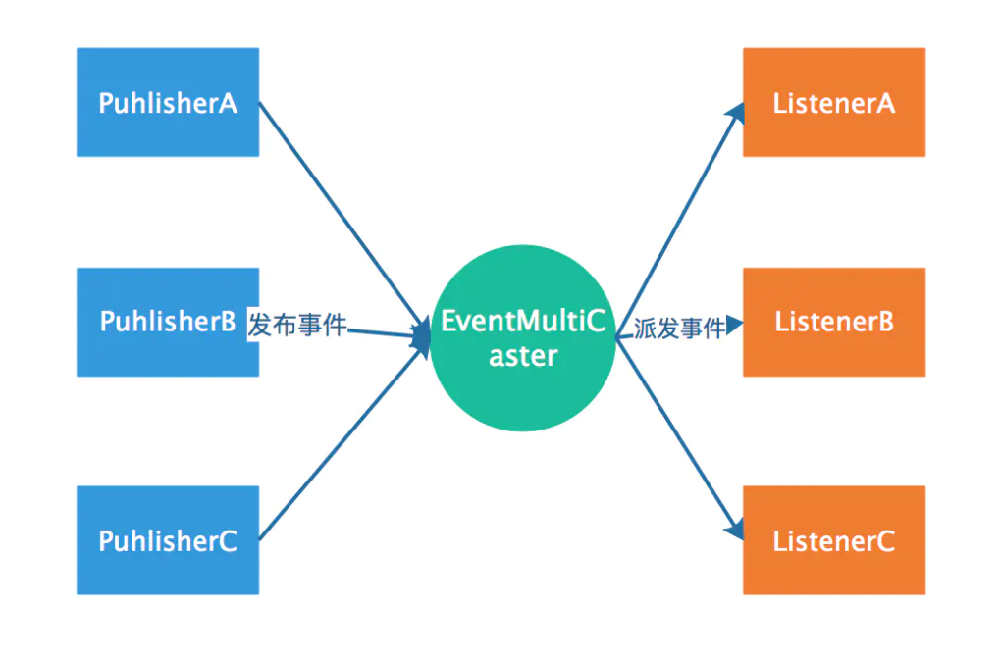

# Spring监听器 Listener`设计思想`

## **1. 使用 Spring 事件**

 Spring 事件体系包括三个组件：事件，事件监听器，事件广播器。

- **事件**

  - **Spring 内置事件**

     内置事件中由系统内部进行发布，只需注入监听器

    | **Event**             | **说明**                                                     |
    | --------------------- | ------------------------------------------------------------ |
    | ContextRefreshedEvent | 当容器被实例化或 refreshed 时发布。如调用 refresh () 方法，此处的实例化是指所有的 bean 都已被加载，后置处理器都被激活，所有单例 bean 都已被实例化，所有的容器对象都已准备好可使用。如果容器支持热重载，则 refresh 可以被触发多次 (XmlWebApplicatonContext 支持热刷新，而 GenericApplicationContext 则不支持) |
    | ContextStartedEvent   | 当容器启动时发布，即调用 start () 方法，已启用意味着所有的 Lifecycle bean 都已显式接收到了 start 信号 |
    | ContextStoppedEvent   | 当容器停止时发布，即调用 stop () 方法，即所有的 Lifecycle bean 都已显式接收到了 stop 信号，关闭的容器可以通过 start () 方法重启 |
    | ContextClosedEvent    | 当容器关闭时发布，即调用 close 方法，关闭意味着所有的单例 bean 都已被销毁。关闭的容器不能被重启或 refresh |
    | RequestHandledEvent   | 这只在使用 spring 的 DispatcherServlet 时有效，当一个请求被处理完成时发布 |

    

  - **自定义事件**

    **事件类需要继承 ApplicationEvent**，代码如下：

    ```java
    public class BigEvent  extends ApplicationEvent {
     
        private String name;
     
        public BigEvent(Object source, String name) {
            super(source);
            this.name = name;
        }
     
        public String getName() {
            return name;
        }
    }
    ```

    这里为了简单测试，所以写的很简单。

    事件类是一种很简单的 pojo，除了需要继承 ApplicationEvent 也没什么了，这个类有一个构造方法需要 super。

    

- 事件监听器

  - **基于接口**

    ```java
    @Component
    public class HelloEventListener implements ApplicationListener<OrderEvent> {
      
        @Override
        public void onApplicationEvent(OrderEvent event) {
            if(event.getName().equals("减库存")){
                System.out.println("减库存.......");
            }
        }
    }
    ```

    事件监听器需要实现 ApplicationListener 接口，这是个泛型接口，泛型类类型就是事件类型，其次需要是 spring 容器托管的 bean，所以这里加了 @component，只有一个方法，就是 onApplicationEvent。

    

  - **基于注解**

    ```java
    @Component
    public class OrderEventListener {
        
        @EventListener(OrderEvent.class)
        public void onApplicationEvent(OrderEvent event) {
            if(event.getName().equals("减库存")){
                System.out.println("减库存.......");
            }
        }
     
    ```

    ​	

    **事件发布操作**

    ```java
    applicationContext.publishEvent(new HelloEvent(this,"lgb"));
    ```


## **2. Spring 事件原理：观察者模式**

spring 的事件监听有三个部分组成：

- **事件**（ApplicationEvent)  负责对应相应监听器 事件源发生某事件是特定事件监听器被触发的原因。 

- **监听器 (**ApplicationListener) 对应于观察者模式中的**观察者**。监听器监听特定事件，并在内部定义了事件发生后的响应逻辑。 

- **事件发布器**（ApplicationEventMulticaster ）对应于观察者模式中的**被观察者 / 主题，  负责通知观察者** 对外提供发布事件和增删事件监听器的接口，维护事件和事件监听器之间的映射关系，并在事件发生时负责通知相关监听器。 

**Spring 事件机制是观察者模式的一种实现，但是除了发布者和监听者者两个角色之外，还有一个 EventMultiCaster 的角色负责把事件转发给监听者，工作流程如下：**



**也就是说上面代码中发布者调用**` applicationEventPublisher.publishEvent(msg); `**是会将事件发送给了 EventMultiCaster，**

**而后由 EventMultiCaster 注册着所有的 Listener，然后根据事件类型决定转发给那个 Listener。**


## **3. 源码流程：**

**在ApplicationContext接口的抽象实现类 AbstractApplicationContext 中完成了事件体系的搭建**

AbstractApplicationContext 拥有一个 applicationEventMulticaster 成员变量，applicationEventMulticaster 提供了容器监听器的注册表。

AbstractApplicationContext 在 refresh () 这个容器启动方法中搭建了事件的基础设施

### **1 事件广播器的初始化**

```java
protected void initApplicationEventMulticaster() {
    ConfigurableListableBeanFactory beanFactory = getBeanFactory();
    if (beanFactory.containsLocalBean(APPLICATION_EVENT_MULTICASTER_BEAN_NAME)) {
        this.applicationEventMulticaster = beanFactory.getBean(APPLICATION_EVENT_MULTICASTER_BEAN_NAME, ApplicationEventMulticaster.class);
        if (logger.isDebugEnabled()) {
            logger.debug("Using ApplicationEventMulticaster [" + this.applicationEventMulticaster + "]");
        }
    }
    else {
        this.applicationEventMulticaster = new SimpleApplicationEventMulticaster(beanFactory);
        beanFactory.registerSingleton(APPLICATION_EVENT_MULTICASTER_BEAN_NAME, this.applicationEventMulticaster);
        if (logger.isDebugEnabled()) {
            logger.debug("Unable to locate ApplicationEventMulticaster with name '" +
                    APPLICATION_EVENT_MULTICASTER_BEAN_NAME +
                    "': using default [" + this.applicationEventMulticaster + "]");
        }
    }
}
```

用户可以在配置文件中为容器定义一个自定义的事件广播器，只要**实现 ApplicationEventMulticaster** 就可以了，Spring 会通过 反射的机制将其注册成容器的事件广播器

如果没有找到配置的外部事件广播器，Spring 自动使用 SimpleApplicationEventMulticaster 作为事件广播器。


### **2 注册事件监听器**

```java
protected void registerListeners() {
    for (ApplicationListener<?> listener : getApplicationListeners()) {
        getApplicationEventMulticaster().addApplicationListener(listener);
    }
 
    String[] listenerBeanNames = getBeanNamesForType(ApplicationListener.class, true, false);
    for (String listenerBeanName : listenerBeanNames) {
        getApplicationEventMulticaster().addApplicationListenerBean(listenerBeanName);
    }
 
    Set<ApplicationEvent> earlyEventsToProcess = this.earlyApplicationEvents;
    this.earlyApplicationEvents = null;
    if (earlyEventsToProcess != null) {
        for (ApplicationEvent earlyEvent : earlyEventsToProcess) {
            getApplicationEventMulticaster().multicastEvent(earlyEvent);
        }
    }
}
```

Spring 根据反射机制，使用 ListableBeanFactory 的 getBeansOfType 方法，从 BeanDefinitionRegistry 中找出所有实现 org.springframework.context.ApplicationListener 的 Bean，将它们注册为容器的事件监听器，实际的操作就是将其添加到事件广播器所提供的监听器注册表中。


### **3 发布事件**

跟着 finishRefresh ();

 方法进入 publishEvent (new ContextRefreshedEvent (this)); 方法如下:

```java
protected void publishEvent(Object event, ResolvableType eventType) {
    Assert.notNull(event, "Event must not be null");
    if (logger.isTraceEnabled()) {
        logger.trace("Publishing event in " + getDisplayName() + ": " + event);
    }
 
    ApplicationEvent applicationEvent;
    if (event instanceof ApplicationEvent) {
        applicationEvent = (ApplicationEvent) event;
    }
    else {
        applicationEvent = new PayloadApplicationEvent<Object>(this, event);
        if (eventType == null) {
            eventType = ((PayloadApplicationEvent)applicationEvent).getResolvableType();
        }
    }

    if (this.earlyApplicationEvents != null) {
        this.earlyApplicationEvents.add(applicationEvent);
    }
    else {
        getApplicationEventMulticaster().multicastEvent(applicationEvent, eventType);
    }
 
    if (this.parent != null) {
        if (this.parent instanceof AbstractApplicationContext) {
            ((AbstractApplicationContext) this.parent).publishEvent(event, eventType);
        }
        else {
            this.parent.publishEvent(event);
        }
    }
}
```

在 AbstractApplicationContext 的 publishEvent 方法中， Spring 委托 ApplicationEventMulticaster 将事件通知给所有的事件监听器.

### **4 Spring 默认的事件广播器 SimpleApplicationEventMulticaster**

```java
@Override
public void multicastEvent(final ApplicationEvent event, ResolvableType eventType) {
    ResolvableType type = (eventType != null ? eventType : resolveDefaultEventType(event));
    for (final ApplicationListener<?> listener : getApplicationListeners(event, type)) {
        Executor executor = getTaskExecutor();
        if (executor != null) {
            executor.execute(new Runnable() {
                @Override
                public void run() {
                    //遍历注册的每个监听器，并启动来调用每个监听器的 onApplicationEvent 方法。
                    invokeListener(listener, event);
                }
            });
        }
        else {
            invokeListener(listener, event);
        }
    }
}
 

@SuppressWarnings({"unchecked", "rawtypes"})
protected void invokeListener(ApplicationListener listener, ApplicationEvent event) {
    ErrorHandler errorHandler = getErrorHandler();
    if (errorHandler != null) {
        try {
            listener.onApplicationEvent(event);
        }
        catch (Throwable err) {
            errorHandler.handleError(err);
        }
    }
    else {
        try {
            listener.onApplicationEvent(event);
        }
        catch (ClassCastException ex) {
            // Possibly a lambda-defined listener which we could not resolve the generic event type for
            LogFactory.getLog(getClass()).debug("Non-matching event type for listener: " + listener, ex);
        }
    }
}
```

**遍历注册**的每个监听器，并**启动**来调用每个监听器的 onApplicationEvent 方法。

事件监听器对事件的处理，是同步进行的。

从代码可以看出，applicationContext.publishEvent () 方法，需要同步等待各个监听器处理完之后，才返回。

也就是说，**Spring 提供的事件机制，默认是同步的**。如果想用异步的，可以自己实现 ApplicationEventMulticaster 接口，并在 Spring 容器中注册 id 为 applicationEventMulticaster 的 Bean。例如下面所示:


Spring 发布事件之后，所有注册的事件监听器，都会收到该事件，因此，事件监听器在处理事件时，需要先判断该事件是否是自己关心的。

Sping 事件体系所使用的设计模式是：**观察者模式**。

ApplicationListener 是观察者接口，接口中定义了 onApplicationEvent 方法，该方法的作用是对 ApplicationEvent 事件进行处理。


> **怎么样可以在所有 Bean 创建完后做扩展代码？**监听ContextRefreshedEvent事件
>
> **请介绍下 Spring 事件监听器的原理**：
>
> 1. 当需要发布事件时，它会**调用事件发布器的** `publishEvent()` 方法，并传入要发布的事件对象
>
> 2. 事件发布器接收到事件后，会将事件**广播给所有注册的事件监听器**。
>
>    事件监听器可以根据事件的类型和内容来决定是否对事件做出响应
>
> 3. 事件监听器收到事件后，会**调用自己的** `onApplicationEvent()` 方法来**处理事件**。
>
>    在该方法中，可以编写特定的业务逻辑来处理事件
>
> 4. 事件处理完成后，可以根据需要向事件发布者**返回反馈信息**，通常使用 `返回值或回调函数` 来实现
>
> 