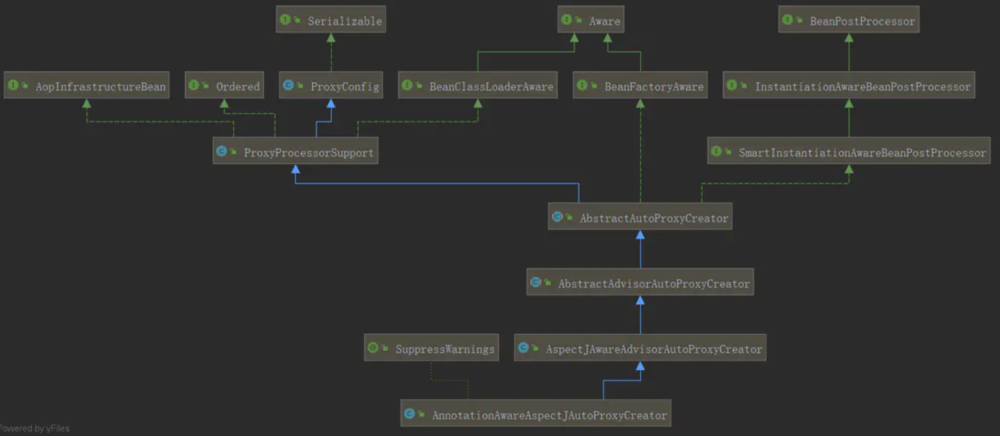
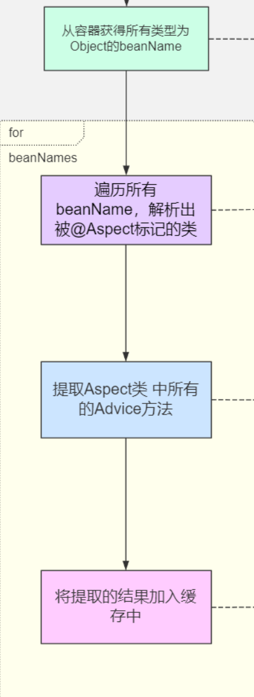

# Spring AOP

- AOP 要实现的是在我们原来写的代码的基础上，**进行一定的包装**，如在方法执行前、方法返回后、方法抛出异常后等地方进行一定的拦截处理或者叫增强处理。

- AOP 的实现并不是因为 Java 提供了什么神奇的钩子，可以把方法的几个生命周期告诉我们，而是我们要实现一个代理，**实际运行的实例其实是生成的代理类的实例**。


## **AOP 术语解释**

- 切面(Aspect)：在Aop中，切面指的就是`切面类`。切面类中 管理着增强的公共行为代码(通知)和切入方式(切点)
- 连接点 (Join point)：在Spring AOP中，一个连接点总是代表一个方法的执行，其实就代表增强的方法。
- 通知(Advice)：在切面的某个特定的连接点上执行的动作。通知有多种类型，包括“around”，“before”and“after”等等。 许多AOP框架，包括Spring在内，都是以拦截器做通知模型的，并维护着一个以连接点为中心的拦截器链。
- 目标对象(Target)：目标对象指将要被增强的对象。即包含主业务逻辑的类的对象。
- 切点(Pointcut)：匹配连接点的断言。通知和切点表达式相关联，并在满足这个切点的连接点上运行(例如，当执行某个特定名称的方法时)。切点表达式如何与连接点匹配是AOP的核心：Spring默认使用Aspect切点语义。
- 顾问(`Advisor`):顾问是Advice的一种包装体现，`Advisor`是Pointcut以及Advice的一个结合,用来管理Advice和Pointcut。应用无需关心
- 织入(Weaving):将通知切入连接点的过程叫织入
- 引入(Introductions):可以将其他接口和实现动态引入到targetClass中


## Spring Aop VS AspectJ

**Spring Aop：**

- **它基于动态代理来实现**。默认地，如果使用接口的，用 JDK 提供的动态代理实现，如果没有接口，使用 CGLIB 实现。

- **Spring 3.2 以后，spring-core 直接就把 CGLIB 和 ASM 的源码包括进来了**，这也是为什么我们不需要显式引入这两个依赖

- Spring 的 IOC 容器和 AOP 都很重要，Spring AOP 需要依赖于 IOC 容器来管理。

- Spring AOP 只能作用于 Spring 容器中的 Bean，它是使用纯粹的 Java 代码实现的，只能作用于 bean 的方法。

- **Spring 提供了 AspectJ 的支持，但只用到的 AspectJ 的切点解析和匹配。**

- 很多人会对比 Spring AOP 和 AspectJ 的性能，Spring AOP 是基于代理实现的，在容器启动的时候需要生成代理实例，在方法调用上也会增加栈的深度，使得 Spring AOP 的性能不如 AspectJ 那么好。

**AspectJ：**

- 属于静态织入，它是通过修改代码来实现的，它的织入时机可以是：

  - Compile-time weaving：**编译期织入**，如类 A 使用 AspectJ 添加了一个属性，类 B 引用了它，这个场景就需要编译期的时候就进行织入，否则没法编译类 B。

  - Post-compile weaving：**编译后织入**，也就是已经生成了 .class 文件，或已经打成 jar 包了，这种情况我们需要增强处理的话，就要用到编译后织入。

  - **Load-time weaving**：指的是在加载类的时候进行织入，要实现这个时期的织入，有几种常见的方法。
    1. 自定义类加载器来干这个，这个应该是最容易想到的办法，在被织入类加载到 JVM 前去对它进行加载，这样就可以在加载的时候定义行为了。
    2. 在 JVM 启动的时候指定 AspectJ 提供的 agent：-javaagent:xxx/xxx/aspectjweaver.jar。

- AspectJ 能干很多 Spring AOP 干不了的事情，它是 **AOP 编程的完全解决方案**。Spring AOP 致力于解决的是企业级开发中最普遍的 AOP 需求（方法织入），而不是力求成为一个像 AspectJ 一样的 AOP 编程完全解决方案。

- 因为 AspectJ 在实际代码运行前完成了织入，所以大家会说它生成的类是没有额外运行时开销的。


## **Spring AOP**

Spring 延用了 AspectJ 中的概念，包括使用了 AspectJ 提供的 jar 包中的注解，但是不依赖于其实现功能

> *如* [*@Aspect*](https://github.com/Aspect)*、*[*@Pointcut*](https://github.com/Pointcut)*、*[*@Before*](https://github.com/Before)*、*[*@After*](https://github.com/After) *等注解都是来自于 AspectJ，但是功能的实现是纯 Spring AOP 自己实现的。*

目前 Spring AOP 一共有三种配置方式，Spring 做到了很好地向下兼容，所以可以放心使用。

- Spring 1.2 **基于接口的配置**：最早的 Spring AOP 是完全基于几个接口的

- Spring 2.0 **schema-based 配置**：Spring 2.0 以后使用 XML 的方式来配置，使用 命名空间 <aop ></aop>

- Spring 2.0 [**@AspectJ**](https://github.com/AspectJ) **配置**：使用注解的方式来配置，这种方式感觉是最方便的，还有，这里虽然叫做 [@AspectJ](https://github.com/AspectJ)，但是这个和 AspectJ 其实没啥关系。


### **Spring 1.2 中的配置**

这是最古老的配置，但是由于 Spring 提供了很好的向后兼容，以及很多人根本不知道什么配置是什么版本的，以及是否有更新更好的配置方法替代，所以还是会有很多代码是采用这种古老的配置方式的（比如声明式事务）

下面用一个简单的例子来演示怎么使用 Spring 1.2 的配置方式。

1. **首先定义需要被增强的类：**

**接口**：Calculate.java   **实现类**：MyCalculate.java

```java
public interface Calculate {
 
    /**
     * 加法
     * @param numA
     * @param numB
     * @return
     */
     int add(int numA, int numB);
 
    /**
     * 减法
     * @param numA
     * @param numB
     * @return
     */
     int sub(int numA, int numB);
 
    /**
     * 除法
     * @param numA
     * @param numB
     * @return
     */
     int div(int numA, int numB);
 
    /**
     * 乘法
     * @param numA
     * @param numB
     * @return
     */
     int multi(int numA, int numB);
 
   	 int mod(int numA, int numB);
}
```

```java
@Component
public class MyCalculate implements Calculate {
 
    public int add(int numA, int numB) {
        System.out.println("执行目标方法:add");
        System.out.println(1/0);
        return numA+numB;
    }
 
    public int sub(int numA, int numB) {
        System.out.println("执行目标方法:reduce");
        return numA-numB;
    }
 
    public int div(int numA, int numB) {
        System.out.println("执行目标方法:div");
        return numA/numB;
    }
 
    public int multi(int numA, int numB) {
        System.out.println("执行目标方法:multi");
        return numA*numB;
    }
 
    public int mod(int numA,int numB){
        System.out.println("执行目标方法:mod");
        int retVal = ((Calculate)AopContext.currentProxy()).add(numA,numB);
        //int retVal = this.add(numA,numB);
        return retVal%numA;
        //return numA%numB;
    }
```

2. **接下来，定义 advice 或 Interceptor**

   MyLogAdvice 实现 MethodBeforeAdvice`方法前置通知`

   ```java
    public class MyLogAdvice implements MethodBeforeAdvice {
       @Override
       public void before(Method method, Object[] args, Object target) throws Throwable {
           String methodName = method.getName();
           System.out.println("执行目标方法【"+methodName+"】的<前置通知>,入参"+ Arrays.asList(args));
       }
   }
   ```

   MyLogInterceptor 实现MethodInterceptor `环绕通知`

   ```java
   public class MyLogInterceptor implements MethodInterceptor {
       @Override
       public Object invoke(MethodInvocation invocation) throws Throwable {
           System.out.println(getClass()+"调用方法前");
           Object ret=invocation.proceed();
           System.out.println(getClass()+"调用方法后");
           return ret;
       }
   }
   ```

   上面的两个 Advice 分别用于方法调用前输出参数和方法调用后输出结果。

   3. **现在可以开始配置了，通过配置类：**

      **FactoryBean 方式**创建单个代理：

      ```java
       // 被代理对象
        @Bean
        public Calculate MyCalculate() {
            return new MyCalculate();
        }
       
        // Advice 方式
        @Bean
        public TulingLogAdvice MyLogAdvice(){
            return new MyLogAdvice();
        }
       
      // Interceptor方式 ， 类似环绕通知
        @Bean
        public TulingLogInterceptor MyLogInterceptor() {
            return new MyLogInterceptor();
        }
        
      /**
       * FactoryBean方式单个： ProxyFactoryBean
       * @return
       */
      @Bean
      public ProxyFactoryBean calculateProxy(){
          ProxyFactoryBean userService=new ProxyFactoryBean();
          userService.setInterceptorNames("MyLogAdvice","MyLogInterceptor");  // 根据指定的顺序执行
          userService.setTarget(MyCalculate());
          return userService;
      }
      ```

      ```java
      public static void main(String[] args) { 
          AnnotationConfigApplicationContext ctx = new AnnotationConfigApplicationContext(EalyAopMainConfig.class);
          Calculate calculateProxy = ctx.getBean("calculateProxy",Calculate.class);
          calculateProxy.div(1,1);
      }
      ```

      从结果可以看到，使用了责任链方式对 advice 和 Interceptor 都进行调用。这个例子就是通过调用 FactoryBean 的 getObject 方法创建一个代理实现。

      > *代理模式需要**一个接口**（可选）、**一个具体实现类**，然后就是定义**一个代理类**，用来包装实现类，添加自定义逻辑，在使用的时候，需要用代理类来生成实例。*

      此中方法有个致命的问题，如果我们只能指定单一的 Bean 的 AOP， 如果多个 Bean 需要创建多个 ProxyFactoryBean 。而且，我们看到，我们的拦截器的粒度只控制到了类级别，类中所有的方法都进行了拦截。接下来，我们看看怎么样**只拦截特定的方法**。

      

      在上面的配置中，配置拦截器的时候，interceptorNames 除了指定为 Advice，是还可以指定为 Interceptor 和 `Advisor` 的。

      这里我们来理解 **`Advisor`** 的概念，它也比较简单：

      **它内部需要指定一个 Advice**，`Advisor` 决定该拦截哪些方法，拦截后需要完成的工作还是内部的 Advice 来做。

      它有好几个实现类，这里我们使用实现类 **NameMatchMethodPointcut`Advisor`** 来演示，从名字上就可以看出来，它需要我们给它提供方法名字，这样符合该配置的方法才会做拦截。

      ```java
       @Bean
      public NameMatchMethodPointcut`Advisor` MyAspect() {
          NameMatchMethodPointcut`Advisor` `Advisor`=new NameMatchMethodPointcut`Advisor`();
          // 通知(Advice)  ：是我们的通知类
          // 通知者(`Advisor`)：是经过包装后的细粒度控制方式。
          `Advisor`.setAdvice(MyLogAdvice());
          `Advisor`.setMappedNames("div");
          return  `Advisor`;
      }
       
      /**
       * FactoryBean方式单个： ProxyFactoryBean
       *  控制粒度到方法
       * @return
       */
      @Bean
      public ProxyFactoryBean calculateProxy(){
          ProxyFactoryBean userService=new ProxyFactoryBean();
          userService.setInterceptorNames("MyLogAspect");   
          userService.setTarget(MyCalculate());
          return userService;
      }
      ```

      我们可以看到，calculateProxy 这个 bean 配置了一个 `Advisor`，`Advisor` 内部有一个 advice。`Advisor` 负责匹配方法，内部的 advice 负责实现方法包装。

      > 注意，这里的 mappedNames 配置是可以指定多个的，用逗号分隔，可以是不同类中的方法。相比直接指定 advice，`Advisor` 实现了更细粒度的控制，因为在这里配置 advice 的话，所有方法都会被拦截。

      输出结果中只有 div 方法被拦截

      

       **Advice、`Advisor`、Interceptor** 它们有个共同的问题，那就是我们得为每个 bean 都配置一个代理，之后获取 bean 的时候需要获取这个代理类的 bean 实例（如 ctx.getBean("calculateProxy",Calculate.class)），这显然非常不方便，不利于我们之后要使用的自动根据类型注入。下面介绍 autoproxy 的解决方案。

      

### Spring 1.2 AutoProxy 

从名字我们也可以看出来，它是实现自动代理，也就是说当 Spring 发现一个 bean 需要被切面织入的时候，Spring 会自动生成这个 bean 的一个代理来拦截方法的执行，确保定义的切面能被执行。

这里强调**自动**，也就是说 Spring 会自动做这件事，而不用像前面介绍的，我们需要显式地指定代理类的 bean。

我们去掉原来的 **ProxyFactoryBean** 的配置，改为使用 **BeanNameAutoProxyCreator** 来配置：

```java
 /**
 *autoProxy: BeanPostProcessor手动指定Advice方式  BeanNameAutoProxyCreator
 * @return
 */
 @Bean
 public BeanNameAutoProxyCreator autoProxyCreator() {
 	BeanNameAutoProxyCreator beanNameAutoProxyCreator = new BeanNameAutoProxyCreator();
 	//设置要创建代理的那些Bean的名字
 	beanNameAutoProxyCreator.setBeanNames("my*");
 	//设置拦截链名字(这些拦截器是有先后顺序的)
 	beanNameAutoProxyCreator.setInterceptorNames("MyLogInterceptor");
 	return beanNameAutoProxyCreator;
 }
```

> 指定需要创建代理的类的范围，然后设置拦截链，不需要再为每个bean配置一个代理

然后我们修改下使用的地方：

```java
 public static void main(String[] args) {
    AnnotationConfigApplicationContext ctx = new AnnotationConfigApplicationContext(EalyAopMainConfig.class);
    Calculate tulingCalculate = ctx.getBean("MyCalculate",Calculate.class);
    tulingCalculate.div(1,1); 
}
```

**我们在使用的时候，完全不需要关心代理了**，直接使用原来的类型就可以了，这是非常方便的

输出结果就是 OrderService 和 UserService 中的每个方法都得到了拦截


`Advisor` 内部包装了 advice，`Advisor` 负责决定拦截哪些方法，内部 advice 定义拦截后的逻辑。所以其实就是只要让我们的 `Advisor` 全局生效就能实现我们需要的自定义拦截功能、拦截后的逻辑处理。


### **Spring 2.0 @AspectJ 配置** 

- 定义了切面表达式的语法和解析机制

- 提供了强大的织入工具

它是通过织入的方式：直接将切面在【编译前、后】或【JVM 加载的时候】进行织入到.class 代码中。在实际生产中，我们用得最多的还是纯 Spring AOP，因为 AspectJ 学习成本高， Spring AOP 已经能满足日常开发种的需求。 通过本 AspectJ 大家了解下 Spring Aop 只用到了 aspectj 的设计理念（注解) 和切点表达式配对。


## **spring aop 源码解析**

spring 中的 aop 是通过动态代理实现的，那么他具体是如何实现的呢？spring 通过一个切面类，在他的类上加入 @Aspect 注解，定义一个 Pointcut 方法，最后定义一系列的增强方法。这样就完成一个对象的切面操作。

要实现我们的 aop，大致有以下思路：

1. 找到所有的切面类

2. 解析出所有的 advice 并保存

3. 创建一个动态代理类

4. 调用被代理类的方法时，找到他的所有增强器，并增强当前的方法

###  **一、切面类的解析**

**spring 通过 @EnableAspectJAutoProxy 开启 aop 切面**

点进去，在注解类上面发现 **@Import (AspectJAutoProxyRegistrar.class)**

AspectJAutoProxyRegistrar 实现了 ImportBeanDefinitionRegistrar，所以他会通过 registerBeanDefinitions 方法为我们容器导入 beanDefinition。

追踪一下源码可以看到最终导入 **AnnotationAwareAspectJAutoProxyCreator**，我们看一下他的类继承关系图，发现它实现了两个重要的接口，BeanPostProcessor 和 InstantiationAwareBeanPostProcessor



首先看 **InstantiationAwareBeanPostProcessor** 的 **postProcessBeforeInstantiation** 方法

```java
public List<`Advisor`> buildAspectJ`Advisor`s() {
         //获取缓存中的aspectBeanNames
        List<String> aspectNames = this.aspectBeanNames;
 
        if (aspectNames == null) {
            synchronized (this) {
                aspectNames = this.aspectBeanNames;
                if (aspectNames == null) {
                    List<`Advisor`> `Advisor`s = new ArrayList<>();
                    aspectNames = new ArrayList<>();
                     //获取beanFactory中所有的beanNames
                    String[] beanNames = BeanFactoryUtils.beanNamesForTypeIncludingAncestors(
                            this.beanFactory, Object.class, true, false);
                    for (String beanName : beanNames) {
                        if (!isEligibleBean(beanName)) {
                            continue;
                        }
                        Class<?> beanType = this.beanFactory.getType(beanName);
                        if (beanType == null) {
                            continue;
                        }
                        //找出所有类上面含@Aspect注解的beanName
                        if (this.`Advisor`Factory.isAspect(beanType)) {
                        //将找到的beanName放入aspectNames集合
                            aspectNames.add(beanName);
                            AspectMetadata amd = new AspectMetadata(beanType, beanName);
                            if (amd.getAjType().getPerClause().getKind() == PerClauseKind.SINGLETON) {
                                MetadataAwareAspectInstanceFactory factory =
                                        new BeanFactoryAspectInstanceFactory(this.beanFactory, beanName);
                          //1.找到切面类的所有但是不包括@Pointcut注解的方法
                           //2.筛选出来包含@Around, @Before, @After,@ AfterReturning， @AfterThrowing注解的方法
                          //3.封装为List<`Advisor`>返回
                                List<`Advisor`> class`Advisor`s = this.`Advisor`Factory.get`Advisor`s(factory);
                                if (this.beanFactory.isSingleton(beanName)) {
                            //将上面找出来的`Advisor`按照key为beanName，value为List<`Advisor`>的形式存入`Advisor`sCache
                                    this.`Advisor`sCache.put(beanName, class`Advisor`s);
                                }
                                else {
                                    this.aspectFactoryCache.put(beanName, factory);
                                }
                                `Advisor`s.addAll(class`Advisor`s);
                            }
                            else {
                                if (this.beanFactory.isSingleton(beanName)) {
                                    throw new IllegalArgumentException("Bean with name '" + beanName +
                                            "' is a singleton, but aspect instantiation model is not singleton");
                                }
                                MetadataAwareAspectInstanceFactory factory =
                                        new PrototypeAspectInstanceFactory(this.beanFactory, beanName);
                                this.aspectFactoryCache.put(beanName, factory);
                                `Advisor`s.addAll(this.`Advisor`Factory.get`Advisor`s(factory));
                            }
                        }
                    }
                    this.aspectBeanNames = aspectNames;
                    return `Advisor`s;
                }
            }
        }
 
        if (aspectNames.isEmpty()) {
            return Collections.emptyList();
        }
        List<`Advisor`> `Advisor`s = new ArrayList<>();
        for (String aspectName : aspectNames) {
            //当再次进入该方法，会直接从`Advisor`sCache缓存中获取
            List<`Advisor`> cached`Advisor`s = this.`Advisor`sCache.get(aspectName);
            if (cached`Advisor`s != null) {
                `Advisor`s.addAll(cached`Advisor`s);
            }
            else {
                MetadataAwareAspectInstanceFactory factory = this.aspectFactoryCache.get(aspectName);
                `Advisor`s.addAll(this.`Advisor`Factory.get`Advisor`s(factory));
            }
        }
        return `Advisor`s;
    }
```



最终将解析出来的 `Advisor` 放入缓存


### **二、创建代理**

 postProcessAfterInitialization 是在 bean 创建完成之后执行的

**1.  获取 `Advisor`s:** 创建代理之前首先要判断当前 bean 是否满足被代理， 所以需要**将 `Advisor` 从之前的缓存中拿出来**和当前 bean 根据**表达式**进行匹配：

代码的链路最终到了 findCandidate`Advisor`s，我们发现在 postProcessBeforeInstantiation 方法中对查找到的 `Advisor`s 做了缓存，所以这里只需要从缓存中取就好了

最后创建代理类，并将 `Advisor`s 赋予代理类，缓存当前的代理类


**2.  匹配:** 根据 `Advisor`s 和当前的 bean 根据切点表达式进行匹配，看是否符合。

**3. 创建代理:** 找到了 和当前 Bean 匹配的 `Advisor` 说明满足创建动态代理的条件：


### **三、代理类的调用**

前面的分析可知，spring 将找到的增强器 `Advisor`s 赋予了代理类，那么在执行只要将这些增强器应用到被代理的类上面就可以了，那么 spring 具体是怎么实现的呢，下面我们以 jdk 代理为例分析一下源码：

```java
public Object invoke(Object proxy, Method method, Object[] args) throws Throwable {
        MethodInvocation invocation;
        Object oldProxy = null;
        boolean setProxyContext = false;
        //获取当前被代理类
        TargetSource targetSource = this.advised.targetSource;
        Object target = null;
        // equals，hashcode等方法不做代理，直接调用
        try {
            if (!this.equalsDefined && AopUtils.isEqualsMethod(method)) {
                return equals(args[0]);
            }
            else if (!this.hashCodeDefined && AopUtils.isHashCodeMethod(method)) {
                return hashCode();
            }
            else if (method.getDeclaringClass() == DecoratingProxy.class) {
                return AopProxyUtils.ultimateTargetClass(this.advised);
            }
            else if (!this.advised.opaque && method.getDeclaringClass().isInterface() &&
                    method.getDeclaringClass().isAssignableFrom(Advised.class)) {
                return AopUtils.invokeJoinpointUsingReflection(this.advised, method, args);
            }
 
            Object retVal;
                        // 将代理对象放到线程本地变量中
            if (this.advised.exposeProxy) {
                // Make invocation available if necessary.
                oldProxy = AopContext.setCurrentProxy(proxy);
                setProxyContext = true;
            }
 
            target = targetSource.getTarget();
            Class<?> targetClass = (target != null ? target.getClass() : null);
 
                        //将增加器装换为方法执行拦截器链
            List<Object> chain = this.advised.getInterceptorsAndDynamicInterceptionAdvice(method, targetClass);
 
            if (chain.isEmpty()) {
                Object[] argsToUse = AopProxyUtils.adaptArgumentsIfNecessary(method, args);
                retVal = AopUtils.invokeJoinpointUsingReflection(target, method, argsToUse);
            }
            else {
                //将拦截器链包装为ReflectiveMethodInvocation并执行
                invocation = new ReflectiveMethodInvocation(proxy, target, method, args, targetClass, chain);
                retVal = invocation.proceed();
            }
 
            // Massage return value if necessary.
            Class<?> returnType = method.getReturnType();
            if (retVal != null && retVal == target &&
                    returnType != Object.class && returnType.isInstance(proxy) &&
                    !RawTargetAccess.class.isAssignableFrom(method.getDeclaringClass())) {
                // Special case: it returned "this" and the return type of the method
                // is type-compatible. Note that we can't help if the target sets
                // a reference to itself in another returned object.
                retVal = proxy;
            }
            else if (retVal == null && returnType != Void.TYPE && returnType.isPrimitive()) {
                throw new AopInvocationException(
                        "Null return value from advice does not match primitive return type for: " + method);
            }
            return retVal;
        }
        finally {
            if (target != null && !targetSource.isStatic()) {
                // Must have come from TargetSource.
                targetSource.releaseTarget(target);
            }
            if (setProxyContext) {
                // Restore old proxy.
                AopContext.setCurrentProxy(oldProxy);
            }
        }
    }
```

通过上面代码可知，将增强器装换为方法拦截器链，最终包装为 ReflectiveMethodInvocation 执行它的 proceed 方法，那么我们就来看下具体如果执行

```java
public Object proceed() throws Throwable {
        //  当执行到最后一个拦截器的时候才会进入
        if (this.currentInterceptorIndex == this.interceptorsAndDynamicMethodMatchers.size() - 1) {
            return invokeJoinpoint();
        }
//获取集合当前需要运行的拦截器
        Object interceptorOrInterceptionAdvice =
                this.interceptorsAndDynamicMethodMatchers.get(++this.currentInterceptorIndex);
        if (interceptorOrInterceptionAdvice instanceof InterceptorAndDynamicMethodMatcher) {
            // Evaluate dynamic method matcher here: static part will already have
            // been evaluated and found to match.
            InterceptorAndDynamicMethodMatcher dm =
                    (InterceptorAndDynamicMethodMatcher) interceptorOrInterceptionAdvice;
            Class<?> targetClass = (this.targetClass != null ? this.targetClass : this.method.getDeclaringClass());
            if (dm.methodMatcher.matches(this.method, targetClass, this.arguments)) {
                return dm.interceptor.invoke(this);
            }
            else {
                // Dynamic matching failed.
                // Skip this interceptor and invoke the next in the chain.
                return proceed();
            }
        }
        else {
            // 执行拦截器方法
            return ((MethodInterceptor) interceptorOrInterceptionAdvice).invoke(this);
        }
    }
```

这样一看会感觉很蒙，其实追踪一下源码就很好理解了

org.springframework.aop.interceptor.ExposeInvocationInterceptor#invoke

```java
public Object invoke(MethodInvocation mi) throws Throwable {
        MethodInvocation oldInvocation = invocation.get();
        invocation.set(mi);
        try {
            return mi.proceed();
        }
        finally {
            invocation.set(oldInvocation);
        }
    }
```

org.springframework.aop.aspectj.AspectJAfterThrowingAdvice#invoke

异常拦截器，当方法调用异常会被执行

```java
public Object invoke(MethodInvocation mi) throws Throwable {
        try {
            return mi.proceed();
        }
        catch (Throwable ex) {
            if (shouldInvokeOnThrowing(ex)) {
                invokeAdviceMethod(getJoinPointMatch(), null, ex);
            }
            throw ex;
        }
    }
```

org.springframework.aop.framework.adapter.AfterReturningAdviceInterceptor#invoke

返回拦截器，方法执行失败，不会调用

```java
public Object invoke(MethodInvocation mi) throws Throwable {
        Object retVal = mi.proceed();
        this.advice.afterReturning(retVal, mi.getMethod(), mi.getArguments(), mi.getThis());
        return retVal;
    }
```

org.springframework.aop.aspectj.AspectJAfterAdvice#invoke

后置拦截器，总是执行

```java
public Object invoke(MethodInvocation mi) throws Throwable {
        try {
            return mi.proceed();
        }
        finally {
            invokeAdviceMethod(getJoinPointMatch(), null, null);
        }
    }
```

org.springframework.aop.framework.adapter.MethodBeforeAdviceInterceptor#invoke

前置拦截器

```java
public Object invoke(MethodInvocation mi) throws Throwable {
        this.advice.before(mi.getMethod(), mi.getArguments(), mi.getThis());
        return mi.proceed();
    }
```

这里用了责任链的设计模式，递归调用排序好的拦截器链


## 总结：

### 介绍下 AspectJ 和 AOP 和关系

1. **AOP 是一种编程范式，而 AspectJ 是 AOP 的具体实现之一。** 

   AOP 是一种**编程思想**，用于将横切关注点从核心业务逻辑中分离出来，以便更好地模块化和管理代码；而 **AspectJ 是实现 AOP 的框架之一**，它提供了丰富的语法和功能，用于**在 Java 应用程序中实现 AOP**。

2. **AspectJ 提供了更强大和灵活的 AOP 功能。** 

   相比之下，Spring AOP 是 Spring 框架的一部分，提供了一种简化的 AOP 实现，主要基于**动态代理技术**。

   虽然 Spring AOP 对于简单的拦截场景来说足够用了，但 AspectJ 提供了**更广泛的切点表达式和更多的通知类型**，包括方法执行前、执行后、抛出异常时等不同的时机，更适用于复杂的 AOP 操作。

3. **AspectJ 支持多种织入方式。** 

   AspectJ 可以在编译时、类加载时或者运行时进行织入，以**实现不同粒度的切面编程**。

   相比之下，**Spring AOP 主要基于运行时代理技术实现**，只支持方法级别的拦截，因此在**性能上可能略逊于 AspectJ**。

4. **AspectJ 可以独立于 Spring 使用。**

   尽管 Spring 框架提供了与 AspectJ 的集成支持，但 AspectJ 本身也可以独立于 Spring 使用，用于任何 Java 应用程序中的 AOP 编程。AspectJ 提供了更多的灵活性和功能，但相应地也需要更多的学习成本和配置


### Spring AOP 中 aspect、advise、pointcut、`Advisor` 分别有什么意义

1. **Aspect（切面）：** 

   切面是指横切关注点的模块化单元，它**包含了一组通知（advice）和切点（pointcut）**。通常，一个切面会跨越多个类和对象，并提供一种将横切关注点应用于应用程序的方式。

2. **Advice（通知）：** 

   通知是切面的一部分，**它定义了在何时、何地以及如何应用切面的行为**。在 Spring AOP 中，通知可以是方法执行前、方法执行后、方法抛出异常时等不同的时机。常见的通知类型包括 `@Before`、`@After`、`@AfterReturning`、`@AfterThrowing` 和 `@Around`。

3. **Pointcut（切点）：**

   切点是指在应用程序中**定义横切关注点的位置**。它是一个表达式，用于描述哪些连接点（方法调用、方法执行等）将会被通知所影响。在 Spring AOP 中，切点通常使用 AspectJ 切点表达式来定义。

4. **`Advisor`（顾问）：**

   顾问是将切点和通知组合在一起的对象，它将通知应用于特定的切点。在 Spring AOP 中，`Advisor` 是一个接口，它包含了一个切点和一个通知。Spring 提供了多种类型的 `Advisor`，例如 `DefaultPointcut`Advisor``、`NameMatchMethodPointcut`Advisor`` 等。


###  AOP 有几种实现方式

1. **运行时代理：** 

   运行时代理是通过在**运行时动态创建代理对象来实现 AOP**。Spring AOP 就是基于运行时代理实现的，它使用 JDK 动态代理或 CGLIB（Code Generation Library）创建代理对象。在**运行时代理中，切面逻辑被编织到目标对象的方法调用中**，因此它适用于基于接口的代理。

2. **编译时增强：** 

   编译时增强是在**编译阶段对源代码进行增强**，以便将切面逻辑织入到目标对象的方法中。AspectJ 是一个流行的 AOP 框架，它支持编译时增强。AspectJ 使用特定的语法来定义切面和切点，并通过编译器将切面织入到目标类的字节码中。

3. **类加载时增强：** 

   类加载时增强是在**类加载过程中修改类的字节码**，以便将切面逻辑织入到目标对象的方法中。与编译时增强类似，类加载时增强也使用 AspectJ 或其他字节码操作库来实现。这种方式比编译时增强更灵活，因为它可以在不修改源代码的情况下织入切面。

这些是 AOP 的主要实现方式，每种方式都有其优缺点。运行时代理适用于基于接口的代理，并且比较轻量级，但不能代理没有接口的类。编译时增强和类加载时增强能够更深度地织入切面逻辑，但需要对源代码或字节码进行修改，因此相对复杂一些。选择合适的实现方式取决于项目的需求和特点。


### 简单介绍 Spring-AOP 的底层原理

1. 从容易获得所有beanName

​		循环所有beanName,找到了标记@Aspect标记的类

​		找到切面类的所有方法，包括@Pointcut注解的方法筛选出		来包含@Around, @Before, @After等注解的方法，封装为		List<`Advisor`>返回

​		将上面的结果放入缓存

2. 创建代理之前首先要判断当前 bean 是否满足被代理

   将 `Advisor` 从之前的缓存中拿出来**和当前 bean 根据**表达式进行匹配，如果匹配说明满足创建动态代理的条件

3. 将增强器装换为方法拦截器链，使用了责任链的设计模式，递归调用排序好的拦截器链