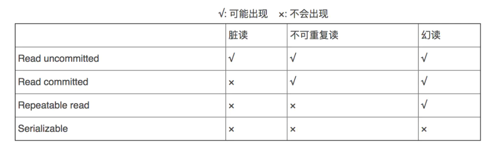

# **Spring 声明式事务**

**什么是事务？**

把一组业务当成一个业务来做；要么都成功，要么都失败，保证业务操作完整性的一种数据库机制。


## **Spring JdbcTemplate**

​	在 spring 中为了**更加方便的操作 JDBC**，在 JDBC 的基础之上**定义了一个抽象层**

​	此设计的目的是为不同类型的 **JDBC 操作**提供**模板方法**，每个模板方法都能控制整个过程，并允许覆盖过程中的特定任务，通过这种方式，可以尽可能保留灵活性，将数据库存取的工作量降到最低。

## **声明式事务** 

### 1.ACID  四大特性

- **A 原子性**：原子性指的是 在一组业务操作下 **要么都成功 要么都失败**；在一组增删改查的业务下  要么都提交 要么都回滚

- **C 一致性**：事务前后的数据要**保证数据的一致性**：在一组的查询业务下    必须要保证前后关联数据的一致性

- **I 隔离性**：在并发情况下 **事物之间要相互隔离**。

- **D 持久性**：数据**一旦保存就是持久性的**。


### 2.两种分类

在事务控制方面，主要有两个分类：

- 编程式事务：在代码中直接加入处理事务的逻辑，可能需要在代码中显式调用 beginTransaction ()、commit ()、rollback () 等事务管理相关的方法

  ```java
  connetion.autoCommit(false);
  ///业务代码
  connction.commint();
  catch(){
  	connction.rollback();
  }
  ```

- 声明式事务：在方法的外部**添加注解或者直接在配置文件中定义**，将事务管理代码从业务方法中分离出来，以声明的方式来实现事务管理。

  spring 的 AOP 恰好可以完成此功能：事务管理代码的固定模式作为一种横切关注点，通过 **AOP 方法模块化**，进而实现声明式事务。


### 3.**声明式事务的简单配置**

​	Spring 从不同的事务管理 API 中抽象出了一整套事务管理机制，让事务管理代码从特定的事务技术中独立出来。开发人员通过配置的方式进行事务管理，而不必了解其底层是如何实现的。

​		Spring 的核心事务管理抽象是 **PlatformTransactionManager**。它为事务管理封装了一组独立于技术的方法。无论使用 Spring 的哪种事务管理策略 (编程式或声明式)，事务管理器都是必须的。

​		事务管理器可以以普通的 bean 的形式声明在 Spring IOC 容器中。下图是 spring 提供的事务管理器

1、在配置文件中添加事务管理器

jdbcTemplate.xml

```xml
    <bean id="transactionManager" class="org.springframework.jdbc.datasource.DataSourceTransactionManager">
        <property name="dataSource" ref="dataSource"></property>
    </bean>
    <!--开启基于注解的事务控制模式，依赖tx名称空间-->
    <tx:annotation-driven transaction-manager="transactionManager"></tx:annotation-driven>
```

> **@Transactional 注解应该写在哪：**
>
> @Transactional   可以标记在类上面（当前类所有的方法都运用上了事务）
>
> @Transactional   标记在方法则只是当前方法运用事务
>
> 也可以类和方法上面同时都存在， 如果类和方法都存在 @Transactional 会以方法的为准。如果方法上面没有 @Transactional 会以类上面的为准
>
> 建议：@Transactional 写在方法上面，控制粒度更细，   建议 @Transactional 写在业务逻辑层上，因为只有业务逻辑层才会有嵌套调用的情况。


### ---

### 4.**事务配置的属性**

​		isolation：设置事务的隔离级别

​		propagation：事务的传播行为

​		noRollbackFor：那些异常事务可以不回滚

​		noRollbackForClassName：填写的参数是全类名

​		rollbackFor：哪些异常事务需要回滚

​		rollbackForClassName：填写的参数是全类名

​		readOnly：设置事务是否为只读事务		

​		timeout：事务超出指定执行时长后自动终止并回滚，单位是秒


### **4.1设置隔离级别（isolation）**

用来解决并发事务所产生一些问题：

并发： 同一个时间，多个线程同时进行请求。

什么时候会生成并发问题：在并发情况下，对同一个数据（变量、对象）进行读写操作才会产生并发问题

并发会产生什么问题？

1. 脏读

   | **事务 1**  begin                                     | **事务 2**  begin                                     |
   | ----------------------------------------------------- | ----------------------------------------------------- |
   |                                                       | update t_user set balance=800where id=1; #balance=800 |
   | select * from  t_user where id=1 commit; #balance=800 |                                                       |
   |                                                       | rollback;  #回滚#balance=1000                         |

   一个事务，读取了另一个事务中没有提交的数据，会在本事务中产生的数据不一致的问题

   **解决方式：@Transactional (isolation = Isolation.READ_COMMITTED)**

   > **读已提交**：READ COMMITTED： 要求 Transaction01 只能读取 Transaction02 已提交的修改。


2. 不可重复读

   | **事务 1**  begin                             | **事务 2**  begin                                            |
   | --------------------------------------------- | ------------------------------------------------------------ |
   | select * from  t_user where id=1#balance=1000 |                                                              |
   |                                               | update t_user set balance=800where id=1; commit; #balance=800 |
   | select * from t_user where id=1#balance=800   |                                                              |
   | commit;                                       |                                                              |

   一个事务中，多次读取**相同的数据**， 但是读取的结果不一样，  会在本事务中产生数据不一致的问题。

   **解决方式：@Transactional (isolation = Isolation.REPEATABLE_READ)**

   >  **可重复读**：REPEATABLE READ：确保 Transaction01 可以多次从一个字段中读取到相同的值，即 Transaction01 执行期间禁止其它事务对这个字段进行更新。(**行锁**）


3. 幻影读

   | **事务 1**  begin                                        | **事务 2**  begin                                            |
   | -------------------------------------------------------- | ------------------------------------------------------------ |
   | select sum(balance) from  t_user where id=1#balance=3000 |                                                              |
   |                                                          | INSERT INTO  t_userVALUES	('4',' 赵六 ','123456784','1000'	);commit; |
   | select sum(balance) from  t_user where id=1#balance=4000 |                                                              |
   | commit;                                                  |                                                              |

   一个事务中，多次对数据进行**整表数据读取**（统计），但是结果不一样， 会在本事务中产生数据不一致的问题。

   **解决方式：@Transactional (isolation = Isolation.SERIALIZABLE)**

   > **串行化**：SERIALIZABLE :   确保 Transaction01 可以多次从一个表中读取到相同的行，在 Transaction01 执行期间，禁止其它事务对这个表进行添加、更新、删除操作。可以避免任何并发问题，但性能十分低下。（**表锁**）


> 很多人容易搞混不可重复读和幻读，确实这两者有些相似：
>
>  对于前者，  只需要锁行
>
>  对于后者，  需要锁表 



```
并发安全：SERIALIZABLE>REPEATABLE_READ>READ_COMMITTED
运行效率：READ_COMMITTED>REPEATABLE_READ>SERIALIZABLE
```

 当不设置事务隔离级别将使用数据库的默认事务隔离级别：可重复读


### **4.2事务的传播特性**

事务的传播特性指的是**当一个事务方法被另一个事务方法调用时，这个事务方法应该如何进行**？

希望如果外部存在事务就用外部的， 外部不存在就自己开启事务

| **事务传播行为类型** | **外部不存在事务** | **外部存在事务**                                             | **使用方式**                                                 |
| -------------------- | ------------------ | ------------------------------------------------------------ | ------------------------------------------------------------ |
| REQUIRED（默认）     | 开启新的事务       | 融合到外部事务中                                             | @Transactional(propagation = Propagation.REQUIRED)适用增删改查 |
| SUPPORTS             | 不开启新的事务     | 融合到外部事务中                                             | @Transactional(propagation = Propagation.SUPPORTS)适用查询   |
| REQUIRES_NEW         | 开启新的事务       | 不用外部事务，创建新的事务                                   | @Transactional(propagation = Propagation.REQUIRES_NEW)适用内部事务和外部事务不存在业务关联情况，如日志 |
| NOT_SUPPORTED        | 不开启新的事务     | 不用外部事务                                                 | @Transactional(propagation = Propagation.NOT_SUPPORTED)不常用 |
| NEVER                | 不开启新的事务     | 抛出异常                                                     | @Transactional(propagation = Propagation.NEVER )不常用       |
| MANDATORY            | 抛出异常           | 融合到外部事务中                                             | @Transactional(propagation = Propagation.MANDATORY)不常用    |
| NESTED               | 开启新的事务       | 融合到外部事务中，SavePoint 机制，外层影响内层， 内层不会影响外层 | @Transactional(propagation = Propagation.NESTED)不常用       |


### 4.3.超时属性 (timeout)

**指定事务等待的最长时间（秒）**

当前事务访问数据时，有可能访问的数据被别的数据进行加锁的处理，那么此时事务就必须等待，如果等待时间过长给用户造成的体验感差。

 

### 4.4设置事务只读 (readOnly)

**readonly: 只会设置在查询的业务方法中**

connection.setReadOnly (true)   

通知数据库，当前数据库操作是只读，数据库就会对当前只读做相应优化。当将事务设置只读 就必须要你的业务方法里面没有增删改。

 

​		如果你一次执行单条查询语句，则没有必要启用事务支持，数据库默认支持 SQL 执行期间的读一致性；

​		如果你一次执行多条查询语句，例如统计查询，报表查询，在这种场景下，多条查询 SQL 必须保证整体的读一致性，否则，在前条 SQL 查询之后，后条 SQL 查询之前，数据被其他用户改变，则该次整体的统计查询将会出现读数据不一致的状态，此时，应该启用事务支持（如：设置不可重复度、幻影读级别）。

​		对于只读事务，可以指定事务类型为 readonly，即只读事务。由于只读事务不存在数据的修改，因此数据库将会为只读事务提供一些优化手段 

 

### 4.5.异常属性

设置当前事务出现的哪些异常就进行回滚或者提交。

默认对于 RuntimeException 及其子类 采用的是回滚的策略。

默认对于 Exception 及其子类 采用的是提交的策略。 

  **1、设置哪些异常不回滚 (noRollbackFor)** 

  **2、设置哪些异常回滚（rollbackFor ）**

> @Transactional(timeout = 3,rollbackFor = {FileNotFoundException.class})：对于FileNotFoundException异常会回滚

 

 

### 4.6 在实战中事务的使用方式

- 如果当前业务方法是一组 增、改、删  可以这样设置事务

  **@Transactional**

- 如果当前业务方法是一组 查询  可以这样设置事务

  **@Transactionl(readOnly=true)**

- 如果当前业务方法是单个 查询  可以这样设置事务

  **@Transactionl(propagation=propagation.SUPPORTS ,readOnly=true)**

 


## 源码

通过启动类的上的`@EnableTransactionManagement`开启事务

> 如果两个事务方法在同一个代理中，需要额外使用注解暴露代理

点击进入注解，发现导入了`TransactionManagementConfigurationSelector`:根据环境自动选择适合的事务管理配置

简要介绍一下原理：当 spring 容器启动的时候，发现有 @EnableTransactionManagement 注解，此时会开始拦截所有 bean 的创建，扫描看一下 bean 上是否有 @Transaction 注解。**如果有这个注解，spring 会通过 aop 的方式给 bean 生成代理对象，代理对象中会增加一个拦截器，拦截器会拦截 bean 中 public 方法执行，会在方法执行之前启动事务，方法执行完毕之后提交或者回滚事务**。

### 进入EnableTransactionManagement

```java
@Target(ElementType.TYPE)
@Retention(RetentionPolicy.RUNTIME)
@Documented
@Import(TransactionManagementConfigurationSelector.class)
public @interface EnableTransactionManagement {
 
 /**
  * spring是通过aop的方式对bean创建代理对象来实现事务管理的
  * 创建代理对象有2种方式，jdk动态代理和cglib代理
  * proxyTargetClass：为true的时候，就是强制使用cglib来创建代理
  */
 boolean proxyTargetClass() default false;
 
 /**
  * 用来指定事务拦截器的顺序
  * 我们知道一个方法上可以添加很多拦截器，拦截器是可以指定顺序的
  * 比如你可以自定义一些拦截器，放在事务拦截器之前或者之后执行，就可以通过order来控制
  */
 int order() default Ordered.LOWEST_PRECEDENCE;
}
```

```java
@Import({TransactionManagementConfigurationSelector.class})
```

进入TransactionManagementConfigurationSelector

为容器导入了两个组件：一个AutoProxyRegistrar，一个是AspectJTransactionManagementConfiguration，它们分别提供了基于代理和基于 AspectJ 的事务管理实现。

一般都是选择`PROXY`

```java
protected String[] selectImports(AdviceMode adviceMode) {
    switch (adviceMode) {
        case PROXY:
            return new String[]{AutoProxyRegistrar.class.getName(), ProxyTransactionManagementConfiguration.class.getName()};
        case ASPECTJ:
            return new String[]{"org.springframework.transaction.aspectj.AspectJTransactionManagementConfiguration"};
        default:
            return null;
    }
}
```

### 进入AutoProxyRegistrar

AutoProxyRegistrar 的具体实现如下，通过 AopConfigUtils.registerAutoProxyCreatorIfNecessary (registry) 的方式注册了 beandefinition：InfrastructureAdvisorAutoProxyCreator，和 spring xml 声明式事务导入了同样的自动代理创建类，完成代理的创建过程；

```java
//AutoProxyRegistrar用于在 Spring 应用程序上下文中自动注册代理
public class AutoProxyRegistrar implements ImportBeanDefinitionRegistrar {
    
    //ImportBeanDefinitionRegistrar 接口中的实现方法，用于注册 Bean 定义
    public void registerBeanDefinitions(AnnotationMetadata importingClassMetadata, BeanDefinitionRegistry registry) {
        boolean candidateFound = false;
        //获取导入类的所有注解类型
        Set<String> annTypes = importingClassMetadata.getAnnotationTypes();
        Iterator var5 = annTypes.iterator();

        while(var5.hasNext()) {
            String annType = (String)var5.next();
            //获取当前注解类型的注解属性
            AnnotationAttributes candidate = AnnotationConfigUtils.attributesFor(importingClassMetadata, annType);
            //如果存在注解属性，则进行下一步处理
            if (candidate != null) {
                //从注解属性中获取 mode 和 proxyTargetClass 属性的值
                Object mode = candidate.get("mode");
                Object proxyTargetClass = candidate.get("proxyTargetClass");
                //确保 mode 是 AdviceMode 类型，proxyTargetClass 是 Boolean 类型，并且两者都不为 null
                if (mode != null && proxyTargetClass != null && AdviceMode.class == mode.getClass() && Boolean.class == proxyTargetClass.getClass()) {
                    //标记为找到候选项
                    candidateFound = true;
                    if (mode == AdviceMode.PROXY) {
                        //注册自动代理创建器 InfrastructureAdvisorAutoProxyCreator
                        AopConfigUtils.registerAutoProxyCreatorIfNecessary(registry);
                        if ((Boolean)proxyTargetClass) {
                            //强制自动代理创建器使用类代理
                            AopConfigUtils.forceAutoProxyCreatorToUseClassProxying(registry);
                            return;
                        }
                    }
                }
            }
        }
    }
}
```


### 进入ProxyTransactionManagementConfiguration

源码如下，可见该类是一个 Configuration 类，完成了如下 3 个 bean 的定义：

- AnnotationTransactionAttributeSource
- TransactionInterceptor
- BeanFactoryTransactionAttributeSourceAdvisor

```java
@Configuration
//用于配置基于代理的事务管理的关键配置类
//继承自 AbstractTransactionManagementConfiguration，表明它是事务管理配置的一部分，提供了一些通用的事务管理配置
public class ProxyTransactionManagementConfiguration extends AbstractTransactionManagementConfiguration {
    public ProxyTransactionManagementConfiguration() {
    }

    @Bean(
        name = {"org.springframework.transaction.config.internalTransactionAdvisor"}
    )
    @Role(2)
    //用于创建一个 BeanFactoryTransactionAttributeSourceAdvisor 实例，该实例用于从 Bean 工厂中获取事务属性源，并为符合条件的 Bean 添加事务通知
    public BeanFactoryTransactionAttributeSourceAdvisor transactionAdvisor() {
        BeanFactoryTransactionAttributeSourceAdvisor advisor = new BeanFactoryTransactionAttributeSourceAdvisor();
        //设置了事务属性源为下面 transactionAttributeSource() 方法返回的 AnnotationTransactionAttributeSource 实例
        advisor.setTransactionAttributeSource(this.transactionAttributeSource());
        // //事务通知为下面 transactionInterceptor() 方法返回的 TransactionInterceptor 实例，并设置了顺序（Order）
        advisor.setAdvice(this.transactionInterceptor());
        advisor.setOrder((Integer)this.enableTx.getNumber("order"));
        return advisor;
    }

    @Bean
    @Role(2)
    //创建一个 AnnotationTransactionAttributeSource 实例，该实例用于从注解中解析事务属性
    public TransactionAttributeSource transactionAttributeSource() {
        return new AnnotationTransactionAttributeSource();
    }

    @Bean
    @Role(2)
    //于创建一个 TransactionInterceptor 实例，该实例用于为方法添加事务拦截器
    public TransactionInterceptor transactionInterceptor() {
        TransactionInterceptor interceptor = new TransactionInterceptor();
        //设置了事务属性源为上面 transactionAttributeSource() 方法返回的 AnnotationTransactionAttributeSource 实例
        interceptor.setTransactionAttributeSource(this.transactionAttributeSource());
        //根据是否设置了事务管理器（txManager）来设置事务管理器
        if (this.txManager != null) {
            interceptor.setTransactionManager(this.txManager);
        }

        return interceptor;
    }
}
```

### 进入AbstractTransactionManagementConfiguration

AbstractTransactionManagementConfiguration 主要完成了 @EnableTransactionManagement 注解属性的解析，同时通过注入 TransactionManagementConfigurer 类型的 bean，完成事务管理器 PlatformTransactionManager 的设置，如下：

```java
@Configuration
//实现了 ImportAware 接口。这意味着它可以感知到被 @EnableTransactionManagement 注解导入的配置类的元数据
public abstract class AbstractTransactionManagementConfiguration implements ImportAware {
    protected AnnotationAttributes enableTx;
    protected PlatformTransactionManager txManager;

    public AbstractTransactionManagementConfiguration() {
    }
	
    //用于设置导入的元数据，其中包括 @EnableTransactionManagement 注解的属性。如果导入的类上没有 @EnableTransactionManagement 注解，将会抛出异常
    public void setImportMetadata(AnnotationMetadata importMetadata) {
        this.enableTx = AnnotationAttributes.fromMap(importMetadata.getAnnotationAttributes(EnableTransactionManagement.class.getName(), false));
        if (this.enableTx == null) {
            throw new IllegalArgumentException("@EnableTransactionManagement is not present on importing class " + importMetadata.getClassName());
        }
    }

    @Autowired(required = false)
    //用于设置事务管理配置器
    void setConfigurers(Collection<TransactionManagementConfigurer> configurers) {
        if (!CollectionUtils.isEmpty(configurers)) {
            if (configurers.size() > 1) {
                //如果存在多个 TransactionManagementConfigurer 类型的 Bean，将会抛出异常
                throw new IllegalStateException("Only one TransactionManagementConfigurer may exist");
            } else {
                //通过自动装配 TransactionManagementConfigurer 类型的 Bean 来获取事务管理器
                TransactionManagementConfigurer configurer = (TransactionManagementConfigurer)configurers.iterator().next();
                //从配置器中获取注解驱动的事务管理器，并将其设置为当前类的 txManager 属性
                this.txManager = configurer.annotationDrivenTransactionManager();
            }
        }
    }

    @Bean(
        name = {"org.springframework.transaction.config.internalTransactionalEventListenerFactory"}
    )
    @Role(2)
    //这个工厂用于处理带有 @TransactionalEventListener 注解的方法，以便在事务提交后执行。这里将其注册为基础设施角色 Bean
    public TransactionalEventListenerFactory transactionalEventListenerFactory() {
        return new TransactionalEventListenerFactory();
    }
}
```

