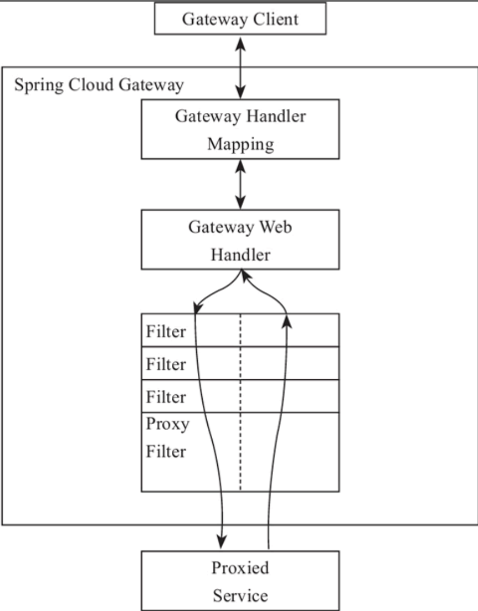
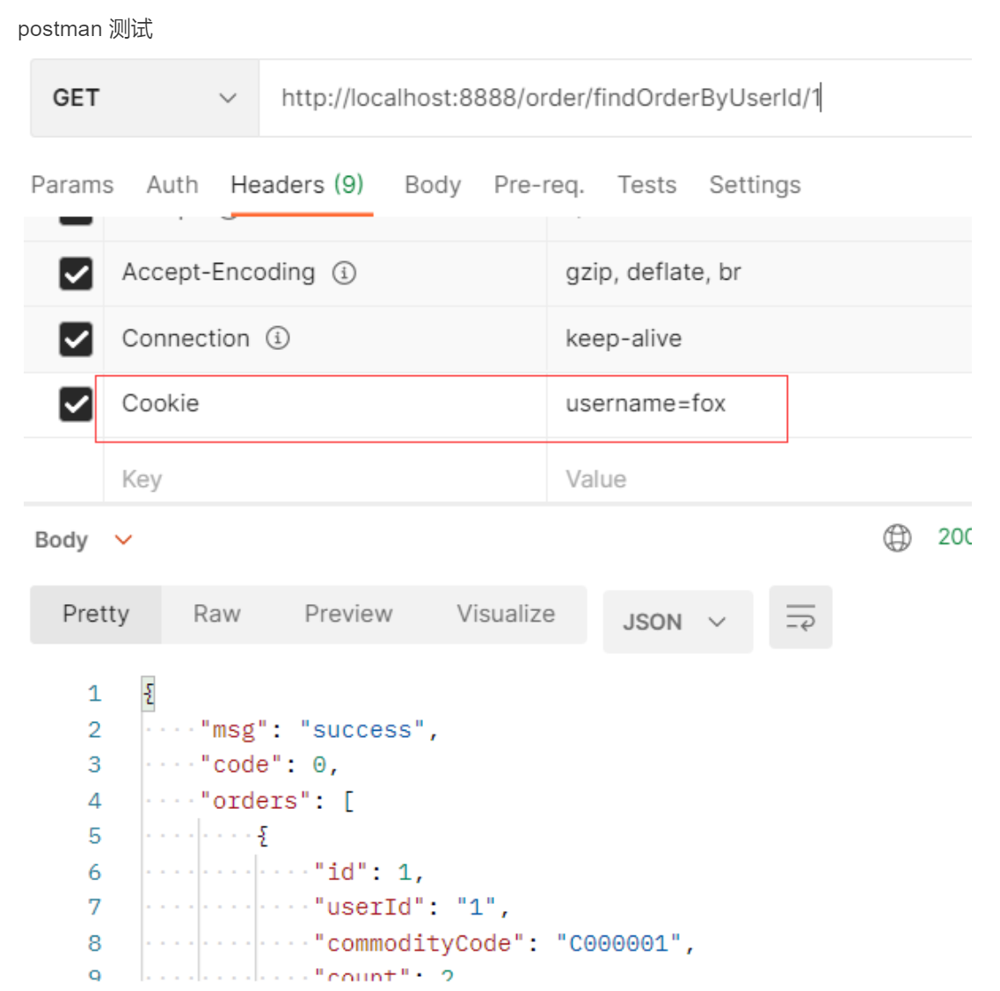
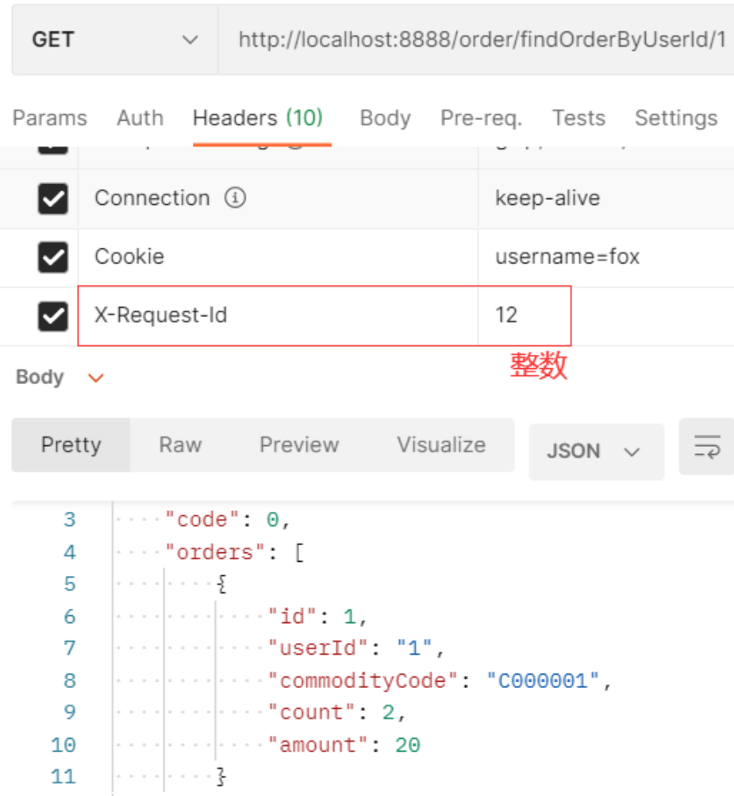
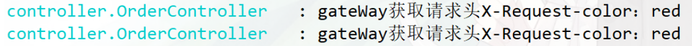
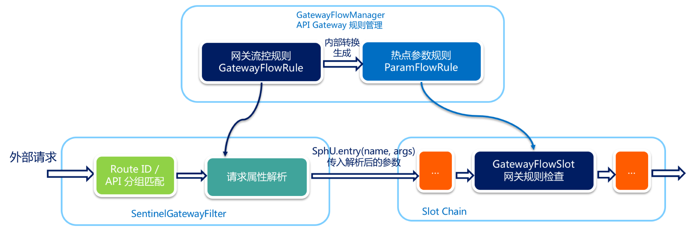
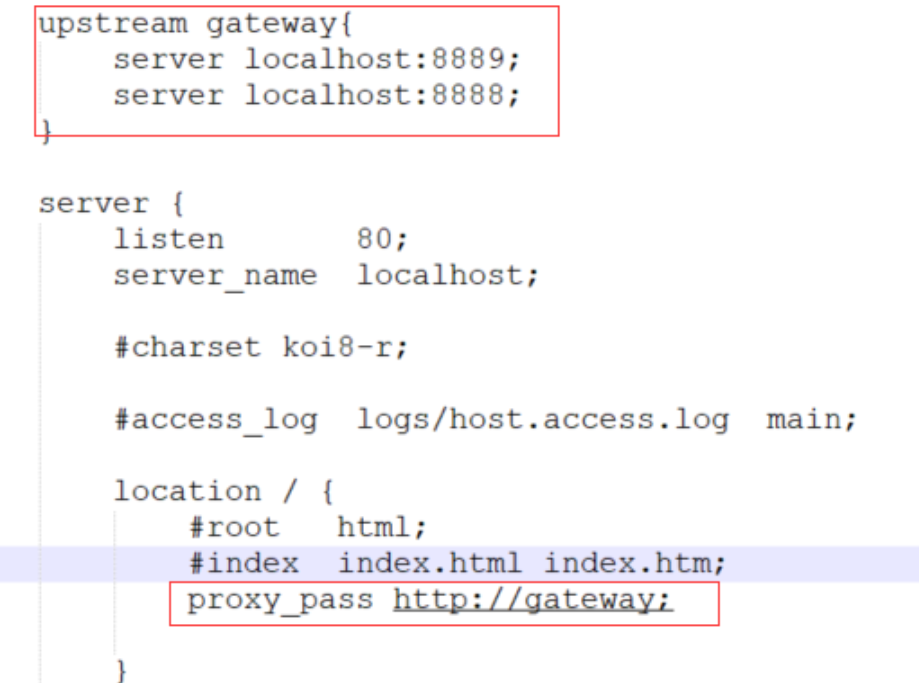

# GateWay

## **什么是 Spring Cloud Gateway**

网关作为流量的入口，常用的功能包括路由转发，权限校验，限流等。

Spring Cloud Gateway 是由 WebFlux + Netty + Reactor 实现的响应式的 API 网关。**它不能在传统的 servlet 容器中工作，也不能构建成 war 包**。

**Spring Cloud Gateway 旨在为微服务架构提供一种简单且有效的 API 路由的管理方式，并基于 Filter 的方式提供网关的基本功能，例如说安全认证、监控、限流等等。**

### 1.**核心概念**

- 路由（route) 

路由是网关中最基础的部分，路由信息包括一个 ID、一个目的 URI、一组断言工厂、一组 Filter 组成。如果断言为真，则说明请求的 URL 和配置的路由匹配。

- 断言 (predicates) 

Java8 中的断言函数，SpringCloud Gateway 中的断言函数类型是 Spring5.0 框架中的 ServerWebExchange。

**断言函数允许开发者去自定义匹配 Http request 中的任何信息，比如请求头和参数等。**

- 过滤器（Filter) 

SpringCloud Gateway 中的 filter 分为 Gateway FilIer 和 Global Filter。**Filter 可以对请求和响应进行处理。**

### **1.2 工作原理**

Spring Cloud Gateway 的工作原理跟 Zuul 的差不多，最大的区别就是 Gateway 的 Filter 只有 pre 和 post 两种。



- 客户端向 Spring Cloud Gateway 发出请求，如果请求与网关程序定义的路由匹配，则该请求就会被发送到网关 Web 处理程序，**此时处理程序运行特定的请求过滤器链**。

- 过滤器之间用虚线分开的原因是过滤器可能会在发送代理请求的前后执行逻辑。所有 pre 过滤器逻辑先执行，然后执行代理请求；代理请求完成后，执行 post 过滤器逻辑。

  > gateWayHandlerMapping 做路由匹配和断言，路由匹配之后，通过handlerAdaper交给对应的webHandler进行处理


## **Spring Cloud Gateway 快速开始**

### **2.1  环境搭建**

**引入依赖**

```xml
<!-- gateway网关 -->
<dependency>
    <groupId>org.springframework.cloud</groupId>
    <artifactId>spring-cloud-starter-gateway</artifactId>
</dependency>
 
<!-- nacos服务注册与发现 -->
<dependency>
    <groupId>com.alibaba.cloud</groupId>
    <artifactId>spring-cloud-starter-alibaba-nacos-discovery</artifactId>
</dependency>
```

> 注意：会和 spring-webmvc 的依赖冲突，需要排除 spring-webmvc

**编写 yml 配置文件**

```yaml
server:
  port: 8888
spring:
  application:
    name: mall-gateway
  #配置nacos注册中心地址
  cloud:
    nacos:
      discovery:
        server-addr: 127.0.0.1:8848
 
    gateway:
      discovery:
        locator:
          # 默认为false，设为true开启通过微服务创建路由的功能，即可以通过微服务名mall-order访问服务,但不推荐这种方式
          # http://localhost:8888/mall-order/order/findOrderByUserId/1
          # 会将http://localhost:8888/mall-order替换为mall-order真正的ip端口比如8021:
          # http://localhost:8021/order/findOrderByUserId/1
          enabled: true
      # 是否开启网关    
      enabled: true 
```


### --


### 2.2 路由断言工厂（Route Predicate Factories）配置

### **2.2.1 时间匹配**

可以用在限时抢购的一些场景中。

获取 ZonedDateTime 类型的指定日期时间

```java
ZonedDateTime zonedDateTime = ZonedDateTime.now();//默认时区
// 用指定时区获取当前时间
ZonedDateTime zonedDateTime2 = ZonedDateTime.now(ZoneId.of("Asia/Shanghai"));
```

```yaml
spring:
  cloud:
    gateway:
      #设置路由：路由id、路由到微服务的uri、断言
      routes:
      - id: order_route  #路由ID，全局唯一
        uri: lb://mall-order    #目标微服务的请求地址和端口
        predicates:
         # 测试：http://localhost:8888/order/findOrderByUserId/1
        # 匹配在指定的日期时间之后发生的请求  入参是ZonedDateTime类型
        - After=2021-01-31T22:22:07.783+08:00[Asia/Shanghai]
```

在超时时间前发送请求会404，之后则能正常请求


### **2.2.2 Cookie 匹配**

```yaml
spring:
  cloud:
    gateway:
      #设置路由：路由id、路由到微服务的uri、断言
      routes:
      - id: order_route  #路由ID，全局唯一
        uri: http://localhost:8020  #目标微服务的请求地址和端口
        predicates:
         # Cookie匹配
        - Cookie=username, fox
```




### **2.2.3 Header 匹配**

```yaml
spring:
  cloud:
    gateway:
      #设置路由：路由id、路由到微服务的uri、断言
      routes:
      - id: order_route  #路由ID，全局唯一
        uri: http://localhost:8020  #目标微服务的请求地址和端口
        predicates:
         # Header匹配  请求中带有请求头名为 x-request-id，其值与 /d+ 正则表达式匹配
         - Header=X-Request-Id, /d+
```



### **2.2.4**  **路径匹配**`常用`

```yaml
spring:
  cloud:
    gateway:
      #设置路由：路由id、路由到微服务的uri、断言
      routes:
      - id: order_route  #路由ID，全局唯一
        uri: http://localhost:8020  #目标微服务的请求地址和端口
        predicates:
         # 测试：http://localhost:8888/order/findOrderByUserId/1
        - Path=/order/**   #Path路径匹配
```


### **2.2.5 自定义路由断言工厂**

自定义路由断言工厂**需要继承 AbstractRoutePredicateFactory 类，重写 apply 方法的逻辑**。在 apply 方法中可以通过 **exchange.getRequest () 拿到 ServerHttpRequest 对象**，从而可以获取到请求的参数、请求方式、请求头等信息。

```java
@Component
@Slf4j
public class CheckAuthRoutePredicateFactory extends AbstractRoutePredicateFactory<CheckAuthRoutePredicateFactory.Config> {
 
    public CheckAuthRoutePredicateFactory() {
        super(Config.class);
    }
 
    @Override
    public Predicate<ServerWebExchange> apply(Config config) {
        
        return new GatewayPredicate() {
			@Override
            public boolean test(ServerWebExchange serverWebExchange) {
                log.info("调用CheckAuthRoutePredicateFactory" + config.getName());
                //当传进来的参数不是fox会404
                if(config.getName().equals("fox")){
                    return true;
                }
                return false;
            }
        };
    }
 
    /*
     * 快捷配置
     */
    @Override
    public List<String> shortcutFieldOrder() {
        return Collections.singletonList("name");
    }
    
    public static class Config {
        private String name;
        public String getName() {
            return name;
        }
        public void setName(String name) {
            this.name = name;
        }
    }
}
```

yml 中配置

```yaml
spring:
  cloud:
    gateway:
      #设置路由：路由id、路由到微服务的uri、断言
      routes:
      - id: order_route  #路由ID，全局唯一
        uri: http://localhost:8020  #目标微服务的请求地址和端口
        predicates:
        - Path=/order/**   #Path路径匹配
        #自定义CheckAuth断言工厂
#        - name: CheckAuth
#          args:
#            name: fox
#       名字要规范，与前面的CheckAuthRoutePredicateFactory中的CheckAuth对应，作为外层的key
        - CheckAuth=fox   
```


### --

### **2.3 过滤器工厂（ GatewayFilter Factories）配置**

SpringCloudGateway 内置了很多的过滤器工厂，我们通过一些过滤器工厂可以进行一些业务逻辑处理器，比如添加剔除响应头，添加去除参数等

### **2.3.1 添加请求头** 

```yaml
spring:
  cloud:
    gateway:
      #设置路由：路由id、路由到微服务的uri、断言
      routes:
      - id: order_route  #路由ID，全局唯一
        uri: http://localhost:8020  #目标微服务的请求地址和端口
        #配置过滤器工厂
        filters:
        - AddRequestHeader=X-Request-color, red  #添加请求头
```

```java
@GetMapping("/testgateway")
public String testGateway(HttpServletRequest request) throws Exception {
    log.info("gateWay获取请求头X-Request-color："
            +request.getHeader("X-Request-color"));
    return "success";
}
@GetMapping("/testgateway2")
public String testGateway(@RequestHeader("X-Request-color") String color) throws Exception {
    log.info("gateWay获取请求头X-Request-color："+color);
    return "success";
}
```

对 http://localhost:8888/order/testgateway，http://localhost:8888/order/testgateway2进行测试



### **2.3.2 添加请求参数**

```yaml
spring:
  cloud:
    gateway:
      #设置路由：路由id、路由到微服务的uri、断言
      routes:
      - id: order_route  #路由ID，全局唯一
        uri: http://localhost:8020  #目标微服务的请求地址和端口
        #配置过滤器工厂
        filters:
        - AddRequestParameter=color, blue  # 添加请求参数
```

```java
@GetMapping("/testgateway3")
public String testGateway3(@RequestParam("color") String color) throws Exception {
    log.info("gateWay获取请求参数color:"+color);
    return "success";
}
```

测试


### **2.3.3 为匹配的路由统一添加前缀**

```yaml
spring:
  cloud:
    gateway:
      #设置路由：路由id、路由到微服务的uri、断言
      routes:
      - id: order_route  #路由ID，全局唯一
        uri: http://localhost:8020  #目标微服务的请求地址和端口
        #配置过滤器工厂
        filters:
        - PrefixPath=/mall-order  # 添加前缀 对应微服务需要配置context-path
```

mall-order 中需要配置

```yaml
server:
  servlet:
    context-path: /mall-order
```

测试：http://localhost:8888/order/findOrderByUserId/1  ====> http://localhost:8020/mall-order/order/findOrderByUserId/1


### **2.3.4**  **重定向操作**

```yaml
spring:
  cloud:
    gateway:
      #设置路由：路由id、路由到微服务的uri、断言
      routes:
      - id: order_route  #路由ID，全局唯一
        uri: http://localhost:8020  #目标微服务的请求地址和端口
        #配置过滤器工厂
        # 这里的 "302" 是 HTTP 状态码的一种，表示重定向（Redirect）。在这个例子中，当请求经过这个过滤器时，它将会返回一个 302 状态
        filters:
        - RedirectTo=302, https://www.baidu.com/  #重定向到百度
```


###  **2.3.5 自定义过滤器工厂**

继承 AbstractNameValueGatewayFilterFactory 且我们的自定义名称必须要以 GatewayFilterFactory 结尾并交给 spring 管理。

```java
@Component
@Slf4j
public class CheckAuthGatewayFilterFactory extends AbstractNameValueGatewayFilterFactory {
 
    @Override
    public GatewayFilter apply(NameValueConfig config) {
        return (exchange, chain) -> {
            log.info("调用CheckAuthGatewayFilterFactory==="
                    + config.getName() + ":" + config.getValue());
            return chain.filter(exchange);
        };
    }
}
```

配置自定义的过滤器工厂

```yaml
spring:
  cloud:
    gateway:
      #设置路由：路由id、路由到微服务的uri、断言
      routes:
      - id: order_route  #路由ID，全局唯一
        uri: http://localhost:8020  #目标微服务的请求地址和端口
        #配置过滤器工厂
        filters:
        - CheckAuth=fox,男
```

### --

### 2.4 全局过滤器（Global Filters）配置 `常用`

GlobalFilter 接口和 GatewayFilter 有一样的接口定义，只不过， GlobalFilter 会作用于所有路由。

### **2.4.1** **LoadBalancerClientFilter** `lb://`

LoadBalancerClientFilter 会查看 exchange 的属性 ServerWebExchangeUtils.GATEWAY_REQUEST_URL_ATTR 的值（一个 URI），如果该值的 scheme 是 lb，比如：lb://myservice ，它将会使用 Spring Cloud 的 LoadBalancerClient 来将 myservice 解析成实际的 host 和 port，并替换掉 ServerWebExchangeUtils.GATEWAY_REQUEST_URL_ATTR 的内容。

**其实就是用来整合负载均衡器 Ribbon 的**

```yaml
spring:
  cloud:
    gateway:
      routes:
      - id: order_route
        uri: lb://mall-order
        predicates:
        - Path=/order/**
```

### **2.4.2 自定义全局过滤器**`实现黑白名单`

```java
@Component
@Order(-1)
@Slf4j
public class CheckAuthFilter implements GlobalFilter {
    @Override
    public Mono<Void> filter(ServerWebExchange exchange, GatewayFilterChain chain) {
        //校验请求头中的token
        List<String> token = exchange.getRequest().getHeaders().get("token");
        log.info("token:"+ token);
        if (token.isEmpty()){
            return null;
        }
        return chain.filter(exchange);
    }
}
 
@Component
public class CheckIPFilter implements GlobalFilter, Ordered {
 
    @Override
    public int getOrder() {
        return 0;
    }
 
    @Override
    public Mono<Void> filter(ServerWebExchange exchange, GatewayFilterChain chain) {
        HttpHeaders headers = exchange.getRequest().getHeaders();
        //模拟对 IP 的访问限制，即不在 IP 白名单中就不能调用的需求
        if (getIp(headers).equals("127.0.0.1")) {
            return null;
        }
        return chain.filter(exchange);
    }
 
    private String getIp(HttpHeaders headers) {
        return headers.getHost().getHostName();
    }
}
```

### --

### 2.5 Gateway 跨域配置（CORS Configuration）

```yaml
spring:
  cloud:
    gateway:
        globalcors:
          cors-configurations:
            '[/**]':
              allowedOrigins: "*"
              allowedMethods:
              - GET
              - POST
              - DELETE
              - PUT
              - OPTION
```

通过 java 配置的方式

```java
//在这个配置中，CorsWebFilter 用于注册 CORS 配置，并应用于所有的 URL 匹配模式 "/**"。CorsConfiguration 对象配置了允许的方法、来源和标头。通过设置 addAllowedMethod("*")、addAllowedOrigin("*") 和 addAllowedHeader("*")，实际上允许了所有的 HTTP 方法、所有的来源和所有的标头，这就消除了跨域的限制。

//这样配置的作用是告诉浏览器，不管请求来自哪个来源，都允许访问服务器资源，从而避免了跨域的问题。
@Configuration
public class CorsConfig {
    @Bean
    public CorsWebFilter corsFilter() {
        CorsConfiguration config = new CorsConfiguration();
        config.addAllowedMethod("*");
        config.addAllowedOrigin("*");
        config.addAllowedHeader("*");
        UrlBasedCorsConfigurationSource source = new UrlBasedCorsConfigurationSource(new PathPatternParser());
        source.registerCorsConfiguration("/**", config);
        return new CorsWebFilter(source);
    }
}
```

### --

### **2.6 gateway 整合 sentinel 限流**

从 1.6.0 版本开始，Sentinel 提供了 Spring Cloud Gateway 的适配模块，可以提供两种资源维度的限流：

- route 维度：即在 Spring 配置文件中配置的路由条目，资源名为对应的 **routeId**`yml配置中的`

- 自定义 API 维度：用户可以利用 Sentinel 提供的 API 来自定义一些 API 分组

**2.6.1** **快速开始**

使用时需引入依赖：

```xml
<dependency>
    <groupId>com.alibaba.csp</groupId>
    <artifactId>sentinel-spring-cloud-gateway-adapter</artifactId>
    <version>x.y.z</version>
</dependency>
```

接入 sentinel dashboard，添加 yml 配置

```yaml
spring:
  application:
    name: mall-gateway-sentinel-demo
  #配置nacos注册中心地址
  cloud:
    nacos:
      discovery:
        server-addr: 127.0.0.1:8848
  #接入sentinel
    sentinel:
      transport:
        # 添加sentinel的控制台地址
        dashboard: 127.0.0.1:8080
```

使用时只需注入对应的 **SentinelGatewayFilter 实例**以及 **SentinelGatewayBlockExceptionHandler** 实例即可

```java
@Configuration
public class GatewayConfiguration {
 
    private final List<ViewResolver> viewResolvers;
    private final ServerCodecConfigurer serverCodecConfigurer;
    
 	//通过构造函数注入了 viewResolvers 和 serverCodecConfigurer 对象，用于初始化限流异常处理器和限流过滤器
    public GatewayConfiguration(ObjectProvider<List<ViewResolver>> viewResolversProvider,
                                ServerCodecConfigurer serverCodecConfigurer) {
        this.viewResolvers = viewResolversProvider.getIfAvailable(Collections::emptyList);
        this.serverCodecConfigurer = serverCodecConfigurer;
    }
 
    /**
     * 限流异常处理器
     * @return
     */
    @Bean
    //通过 @Order(Ordered.HIGHEST_PRECEDENCE) 指定了执行顺序为最高优先级
    @Order(Ordered.HIGHEST_PRECEDENCE)
    public SentinelGatewayBlockExceptionHandler sentinelGatewayBlockExceptionHandler() {
        //返回一个 SentinelGatewayBlockExceptionHandler 对象，用于处理 Sentinel 限流引起的异常。这个异常处理器可以自定义返回异常信息的格式，同时利用了构造函数中注入的 viewResolvers 和 serverCodecConfigurer 对象，用于渲染异常信息
        return new SentinelGatewayBlockExceptionHandler(viewResolvers, serverCodecConfigurer);
    }
    
    /**
     * 限流过滤器
     * @return
     */
    @Bean
    @Order(Ordered.HIGHEST_PRECEDENCE)
    public GlobalFilter sentinelGatewayFilter() {
        //用于实现 Sentinel 的限流功能。这个过滤器可以拦截所有经过网关的请求，并根据 Sentinel 的限流规则进行限流处理
        return new SentinelGatewayFilter();
    }
}
```

**用户可以通过** **GatewayRuleManager.loadRules(rules)** **手动加载网关规则**

GatewayConfiguration 中添加

```java
//在 Spring Bean 初始化完成后执行的 @PostConstruct 方法，用于初始化自定义的 API 定义、网关限流规则和自定义限流异常处理器    
@PostConstruct
    public void doInit() {
        //初始化自定义的API
        initCustomizedApis();
        //初始化网关限流规则
        initGatewayRules();
        //自定义限流异常处理器
        initBlockRequestHandler();
    }

//initCustomizedApis() 方法用于初始化自定义的 API 定义。在这个方法中，创建了一个名为 "user_service_api" 的 API 定义，并定义了一个路径匹配规则，该规则表示所有以 "/user/" 开头的路径都属于该 API
    private void initCustomizedApis() {
        Set<ApiDefinition> definitions = new HashSet<>();
        ApiDefinition api = new ApiDefinition("user_service_api")
                .setPredicateItems(new HashSet<ApiPredicateItem>() {{
                    add(new ApiPathPredicateItem().setPattern("/user/**")
                            .setMatchStrategy(SentinelGatewayConstants.URL_MATCH_STRATEGY_PREFIX));
                }});
        //将这个定义加入api组中
        definitions.add(api);
        //加载api定义
        GatewayApiDefinitionManager.loadApiDefinitions(definitions);
    }
 
//用于初始化网关限流规则。在这个方法中，创建了两个限流规则，分别针对路由 "order_route" 和 API 分组 "user_service_api"。每个规则定义了限流阈值为 2，统计时间窗口为 1 秒。
    private void initGatewayRules() {
        Set<GatewayFlowRule> rules = new HashSet<>();
        //resource：资源名称，可以是网关中的 route 名称或者用户自定义的 API 分组名称。
        //count：限流阈值
        //intervalSec：统计时间窗口，单位是秒，默认是 1 秒。
        rules.add(new GatewayFlowRule("order_route")
                .setCount(2)
                .setIntervalSec(1)
        );
        rules.add(new GatewayFlowRule("user_service_api")
                .setCount(2)
                .setIntervalSec(1)
        );
 
        // 加载网关规则
        GatewayRuleManager.loadRules(rules);
    }
 
//用于初始化自定义的限流异常处理器。在这个方法中，创建了一个 BlockRequestHandler 的匿名内部类，重写了 handleRequest 方法，用于处理被限流的请求。当请求被限流时，返回一个包含限流状态码和提示信息的 JSON 响应。然后，将这个自定义的异常处理器设置为全局的限流异常处理器
    private void initBlockRequestHandler() {
        BlockRequestHandler blockRequestHandler = new BlockRequestHandler() {
            @Override
            public Mono<ServerResponse> handleRequest(ServerWebExchange exchange, Throwable t) {
                //对于请求限流后的返回结果
                HashMap<String, String> result = new HashMap<>();
                result.put("code",String.valueOf(HttpStatus.TOO_MANY_REQUESTS.value()));
                result.put("msg", HttpStatus.TOO_MANY_REQUESTS.getReasonPhrase());
 
                return ServerResponse.status(HttpStatus.TOO_MANY_REQUESTS)
                        .contentType(MediaType.APPLICATION_JSON)
                        .body(BodyInserters.fromValue(result));
            }
        };
        //设置自定义异常处理器
        GatewayCallbackManager.setBlockHandler(blockRequestHandler);
    }
```

**2.6.2 网关流控控制台**

Sentinel 1.6.3 引入了网关流控控制台的支持，用户可以直接在 Sentinel 控制台上查看 API Gateway 实时的 route 和自定义 API 分组监控，管理网关规则和 API 分组配置。

在 API Gateway 端，用户只需要在原有启动参数的基础上添加如下启动参数即可标记应用为 API Gateway 类型：

```
# 注：通过 Spring Cloud Alibaba Sentinel 自动接入的 API Gateway 整合则无需此参数
-Dcsp.sentinel.app.type=1
```



### --

### **2.7 网关高可用**

为了保证 Gateway 的高可用性，可以同时启动多个 Gateway 实例进行负载，在 Gateway 的上游使用 Nginx 或者 F5 进行负载转发以达到高可用。

