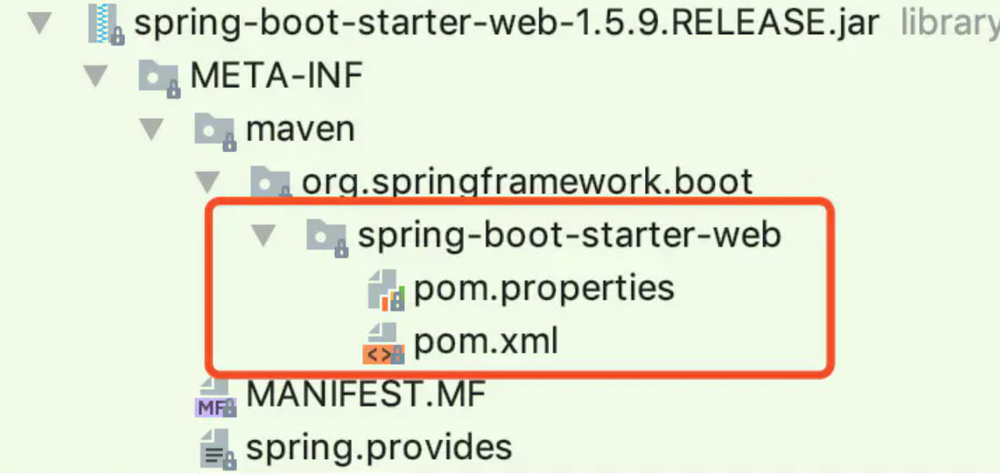
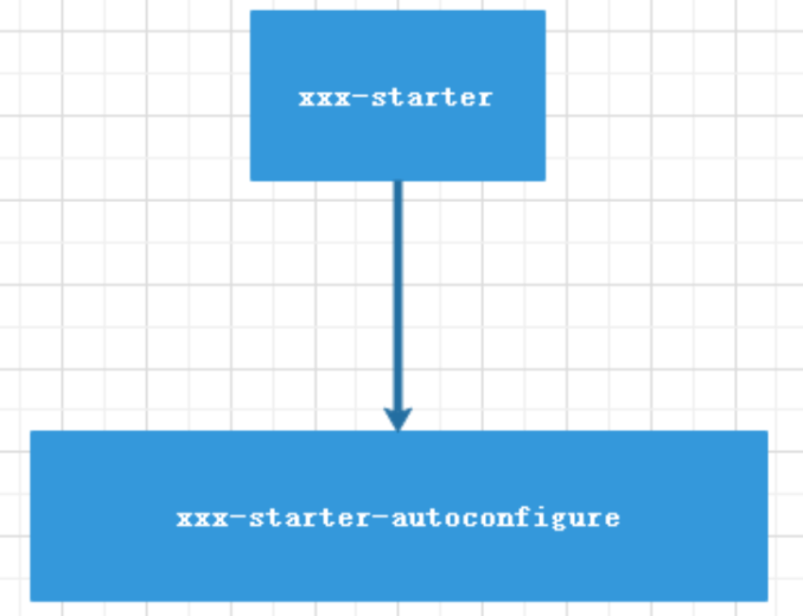

# SpringBoot 的自动配置原理

https://www.processon.com/view/link/5fc0abf67d9c082f447ce49b

## 原理

`@SpringBootApplication` :  Spring Boot 应用标注在某个类上说明这个类是 SpringBoot 的主配置类，SpringBoot

需要运行这个类的 main 方法来启动 SpringBoot 应用

点击进入**@SpringBootApplication** 

```java
@Target(ElementType.TYPE)
@Retention(RetentionPolicy.RUNTIME)
@Documented
@Inherited
@SpringBootConfiguration
@EnableAutoConfiguration
@ComponentScan(excludeFilters = {
      @Filter(type = FilterType.CUSTOM, classes = TypeExcludeFilter.class),
      @Filter(type = FilterType.CUSTOM, classes = AutoConfigurationExcludeFilter.class) })
public @interface SpringBootApplication {
```

注解说明：

- @Target(ElementType.*TYPE*) 

  - **用途**：指定注解可以用于类、接口（包括注解类型）或枚举的声明。

  - **示例**：`@Target({ElementType.TYPE})` 表示该注解只能应用于类型（类、接口、枚举）

- @Retention(RetentionPolicy.*RUNTIME*)：当注解标注的类编译以什么方式保留

  - **用途**：指定注解的保留策略。

  - **示例**：`@Retention(RetentionPolicy.RUNTIME)` 表示该注解将在运行时可用，能够通过反射读取。

- @Documented：

  - **用途**：指示该注解应该包含在 Javadoc 中。

  - **示例**：`@Documented` 表示使用这个注解的元素将包含在 Javadoc 文档中。

- @Inherited  ：是否会被继承 

  - **用途**：指示该注解可以被子类继承。

  - **示例**：`@Inherited` 表示如果一个类使用了这个注解，它的子类也将继承这个注解

- @SpringBootConfiguration

  - **用途**：**标识一个配置类**，继承自 `@Configuration`，用于定义 Spring Boot 应用的配置。

  - **示例**：`@SpringBootConfiguration` **通常用于主启动类上**，标识该类为 Spring Boot 的配置类。

- @EnableAutoConfiguration

  - **用途**：**启用 Spring Boot 的自动配置机制，根据类路径下的依赖、定义的 Bean 等信息自动配置 Spring 应用上下文**。

  - **示例**：`@EnableAutoConfiguration` **通常用于主启动类上**，自动配置 Spring Boot 应用的大部分常用配置。

  > @EnableAutoConfiguration 告诉 SpringBoot 开启自动配置，会帮我们自动去加载 自动配置类

- @ComponentScan

  - **用途**：指定要扫描的包，以查找和注册带有 `@Component`、`@Service`、`@Repository` 等注解的 Spring 组件。

    **启用组件扫描，默认扫描当前包及其子包**

  - 属性
    - `excludeFilters`：定义要排除的组件扫描过滤器

- @Filter
  - **用途**：在 `@ComponentScan` 中用于指定哪些类或包应该被排除在组件扫描之外。
  - 属性
    - `type`：定义过滤器类型（如 `ANNOTATION`、`ASSIGNABLE_TYPE`、`CUSTOM` 等）。
    - `classes`：指定过滤器类。


## @EnableAutoConfiguration 

```java
@Target(ElementType.TYPE)
@Retention(RetentionPolicy.RUNTIME)
@Documented
@Inherited
@AutoConfigurationPackage
@Import(AutoConfigurationImportSelector.class)
public @interface EnableAutoConfiguration {
    // 略
}
```

### **@AutoConfigurationPackage**：

```java
@Import(AutoConfigurationPackages.Registrar.class)  // 保存扫描路径， 提供给spring-data-jpa 需要扫描 @Entity
public @interface AutoConfigurationPackage {
```

将当前配置类所在包保存在 BasePackages 的 Bean 中，供 Spring 内部使用

> 就是注册了一个保存当前配置类所在包的一个 Bean


### @Import(AutoConfigurationImportSelector.class)`重要`

在 @EnableAutoConfiguration 注解内使用到了 @import 注解来完成导入配置的功能

而 AutoConfigurationImportSelector 实现了 DeferredImportSelectorSpring 内部在解析 @Import 注解时会调用 getAutoConfigurationEntry 方法，这块属于 Spring 的源码，有点复杂，我们先不管它是怎么调用的。 下面是 2.3.5.RELEASE 实现源码：

> DeferredImportSelector
>
> 看是否实现了getImportGroup()，没有的话就根据selectImports()方法，将返回的数组注册为Bean
>
> 有的话就需要返回一个实现了DeferredImportSelector.Group的类
>
> ```java
> public Class<? extends DeferredImportSelector.Group> getImportGroup() {
>     //AutoConfigurationGroup实现了DeferredImportSelector.Group
>     return AutoConfigurationGroup.class;
> }
> ```
>
> 有两个方法
>
> selectImports()：将自动配置类根据注解进行排序
>
> process()：里面调用了getAutoConfigurationEntry()

getAutoConfigurationEntry 方法进行扫描具有 META-INF/spring.factories 文件的 jar 包。

```java
protected AutoConfigurationEntry getAutoConfigurationEntry(AnnotationMetadata annotationMetadata) {
   if (!isEnabled(annotationMetadata)) {
      return EMPTY_ENTRY;
   }
   AnnotationAttributes attributes = getAttributes(annotationMetadata);
    
   // 从所有jar包下的META-INF/spring.factories中获得候选的自动配置类
   List<String> configurations = getCandidateConfigurations(annotationMetadata, attributes);
    
   // 排重
   configurations = removeDuplicates(configurations);
   //根据EnableAutoConfiguration注解中属性，获取不需要自动装配的类名单
   Set<String> exclusions = getExclusions(annotationMetadata, attributes); 
   // 根据:@EnableAutoConfiguration.exclude
   // @EnableAutoConfiguration.excludeName
   // spring.autoconfigure.exclude  进行排除
   checkExcludedClasses(configurations, exclusions);
   // exclusions 也排除
   configurations.removeAll(exclusions);
   // 通过读取spring.factories 中的OnBeanCondition\OnClassCondition\OnWebApplicationCondition进行过滤
   configurations = getConfigurationClassFilter().filter(configurations);
   // 这个方法是调用实现了AutoConfigurationImportListener  的bean..  分别把候选的配置名单，和排除的配置名单传进去做扩展
   fireAutoConfigurationImportEvents(configurations, exclusions);
   return new AutoConfigurationEntry(configurations, exclusions);
}
```

任何一个 springboot 应用，都会引入 spring-boot-autoconfigure，而 spring.factories 文件就在该包下面。

spring.factories 文件是 Key=Value 形式，多个 Value 时使用，隔开，该文件中定义了关于初始化，监听器等信息，**而真正使自动配置生效的 key 是 org.springframework.boot.autoconfigure.EnableAutoConfiguration**，如下所示：

```java
@Import({
# Auto Configure
org.springframework.boot.autoconfigure.EnableAutoConfiguration=\
org.springframework.boot.autoconfigure.admin.SpringApplicationAdminJmxAutoConfiguration,\
...省略
org.springframework.boot.autoconfigure.websocket.WebSocketMessagingAutoConfiguration,\
org.springframework.boot.autoconfigure.webservices.WebServicesAutoConfiguration
})    
```

每一个这样的 xxxAutoConfiguration 类都是容器中的一个组件，都加入到容器中；用他们来做自动配置

> @EnableAutoConfiguration 注解通过 @SpringBootApplication 被间接的标记在了 Spring Boot 的启动类上。在 SpringApplication.run (...) 的内部就会执行 selectImports () 方法，找到所有 JavaConfig 自动配置类的全限定名对应的 class，然后将所有自动配置类加载到 Spring 容器中


## 具体案例

以 HttpEncodingAutoConfiguration（Http 编码自动配置）为例解释自动配置原理；

```java
@Configuration(proxyBeanMethods = false)
@EnableConfigurationProperties(ServerProperties.class)
@ConditionalOnWebApplication(type = ConditionalOnWebApplication.Type.SERVLET)
@ConditionalOnClass(CharacterEncodingFilter.class)
@ConditionalOnProperty(prefix = "server.servlet.encoding", value = "enabled", matchIfMissing = true)
public class HttpEncodingAutoConfiguration {
 
   private final Encoding properties;
 
   public HttpEncodingAutoConfiguration(ServerProperties properties) {
      this.properties = properties.getServlet().getEncoding();
   }
 
   @Bean
   @ConditionalOnMissingBean
   public CharacterEncodingFilter characterEncodingFilter() {
      CharacterEncodingFilter filter = new OrderedCharacterEncodingFilter();
      filter.setEncoding(this.properties.getCharset().name());
      filter.setForceRequestEncoding(this.properties.shouldForce(Encoding.Type.REQUEST));
      filter.setForceResponseEncoding(this.properties.shouldForce(Encoding.Type.RESPONSE));
      return filter;
   }
}
```

@Configuration(proxyBeanMethods = false)

- 标记了 @Configuration Spring 底层会给配置创建 cglib 动态代理。 

  作用：就是防止每次调用本类的 Bean 方法而重新创建对象，Bean 是默认单例的

略


## 自定义 starter

SpringBoot 最强大的功能就是把我们常用的场景抽取成了一个个 starter（场景启动器），我们通过引入 springboot 为我提供的这些场景启动器，我们再进行少量的配置就能使用相应的功能。

即使是这样，springboot 也不能囊括我们所有的使用场景，往往我们需要自定义 starter，来简化我们对 springboot 的使用

### 如何自定义 starter

如何编写自动配置 ？

参照 @WebMvcAutoConfiguration 为例，我们看看们需要准备哪些东西，下面是 WebMvcAutoConfiguration 的部分代码

```java
@Configuration
@ConditionalOnWebApplication
@ConditionalOnClass({Servlet.class, DispatcherServlet.class, WebMvcConfigurerAdapter.class})
@ConditionalOnMissingBean({WebMvcConfigurationSupport.class})
@AutoConfigureOrder(-2147483638)
@AutoConfigureAfter({DispatcherServletAutoConfiguration.class, ValidationAutoConfiguration.class})
public class WebMvcAutoConfiguration {
 
    @Import({WebMvcAutoConfiguration.EnableWebMvcConfiguration.class})
    @EnableConfigurationProperties({WebMvcProperties.class, ResourceProperties.class})
    public static class WebMvcAutoConfigurationAdapter extends WebMvcConfigurerAdapter {
 
        @Bean
        @ConditionalOnBean({View.class})
        @ConditionalOnMissingBean
        public BeanNameViewResolver beanNameViewResolver() {
            BeanNameViewResolver resolver = new BeanNameViewResolver();
            resolver.setOrder(2147483637);
            return resolver;
        }
    }
}
```

我们可以抽取到我们自定义 starter 时同样需要的一些配置。

```java
@Configuration  //指定这个类是一个配置类
@ConditionalOnXXX  //指定条件成立的情况下自动配置类生效
@AutoConfigureOrder  //指定自动配置类的顺序
@Bean  //向容器中添加组件
@ConfigurationProperties  //结合相关xxxProperties来绑定相关的配置
@EnableConfigurationProperties  //让xxxProperties生效加入到容器中
 
自动配置类要能加载需要将自动配置类，配置在META-INF/spring.factories中
org.springframework.boot.autoconfigure.EnableAutoConfiguration=\
org.springframework.boot.autoconfigure.admin.SpringApplicationAdminJmxAutoConfiguration,\
org.springframework.boot.autoconfigure.aop.AopAutoConfiguration,\
```

我们参照 spring-boot-starter 我们发现其中没有代码：



我们在看它的 pom 中的依赖中有个 springboot-starter

```xml
<dependency>
    <groupId>org.springframework.boot</groupId>
    <artifactId>spring-boot-starter</artifactId>
</dependency>
```

我们再看看 spring-boot-starter 有个 spring-boot-autoconfigure

```xml
<dependency>
    <groupId>org.springframework.boot</groupId>
    <artifactId>spring-boot-autoconfigure</artifactId>
</dependency>
```

关于 web 的一些自动配置都写在了这里 ，所以我们有总结：`重要`



- 启动器（starter）是一个**空的 jar 文件**，**仅仅提供辅助性依赖管理**，这些依赖可能用于自动装配或其他类库。

- 需要专门写一个类似 spring-boot-autoconfigure 的配置模块

- **用的时候只需要引入启动器 starter，就可以使用自动配置了**

### 命名规范

官方命名空间

- 前缀：spring-boot-starter-

- 模式：spring-boot-starter - 模块名

- 举例：spring-boot-starter-web、spring-boot-starter-jdbc

自定义命名空间

- 后缀：-spring-boot-starter

- 模式：模块 - spring-boot-starter

- 举例：mybatis-spring-boot-starter


## 自定义 starter 实例

我们需要先创建一个父 maven 项目:

- **springboot_custome_starter**

两个 Module: 

- xxx-spring-boot-starter 
- xxx-spring-boot-starter-autoconfigurer

### **springboot_custome_starter的pom**

部分：

```xml
<modules>
    <module>xxx-spring-boot-starter</module>
    <module>xxx-spring-boot-autoconfigure</module>
</modules>

<parent>
    <groupId>org.springframework.boot</groupId>
    <artifactId>spring-boot-starter-parent</artifactId>
    <version>2.3.6.RELEASE</version>
    <relativePath/>
</parent>

<packaging>pom</packaging>

<groupId>com.xxx.springboot</groupId>
<artifactId>springboot_custome_starter</artifactId>
<version>0.0.1-SNAPSHOT</version>
<name>springboot_custome_starter</name>

<description>SpringBoot自定义starter</description>

<properties>
    <java.version>1.8</java.version>
</properties>

<dependencies>
    <dependency>
        <groupId>org.springframework.boot</groupId>
        <artifactId>spring-boot-starter</artifactId>
    </dependency>
</dependencies>
```

### xxx-spring-boot-starter的pom

部分

```xml
<parent>
    <artifactId>springboot_custome_starter</artifactId>
    <groupId>com.xxx.springboot</groupId>
    <version>0.0.1-SNAPSHOT</version>
</parent>

<modelVersion>4.0.0</modelVersion>

<description>
    启动器（starter）是一个空的jar文件，
    仅仅提供辅助性依赖管理，
    这些依赖需要自动装配或其他类库。
</description>

<artifactId>tulingxueyuan-spring-boot-starter</artifactId>

<dependencies>
    <!--引入autoconfigure-->
    <dependency>
        <groupId>com.tulingxueyuan.springboot</groupId>
        <artifactId>tulingxueyuan-spring-boot-autoconfigure</artifactId>
        <version>0.0.1-SNAPSHOT</version>
    </dependency>

    <!--如果当前starter 还需要其他的类库就在这里引用-->
</dependencies>
```

### xxx-spring-boot-starter-autoconfigurer的pom

部分

```xml
<parent>
    <artifactId>springboot_custome_starter</artifactId>
    <groupId>com.xxx.springboot</groupId>
    <version>0.0.1-SNAPSHOT</version>
</parent>

<modelVersion>4.0.0</modelVersion>

<artifactId>xxx-spring-boot-autoconfigure</artifactId>
<dependencies>
    <dependency>
        <groupId>org.springframework.boot</groupId>
        <artifactId>spring-boot-starter-web</artifactId>
    </dependency>
    <!--‐导入配置文件处理器，配置文件进行绑定就会有提示-->
    <dependency>
        <groupId>org.springframework.boot</groupId>
        <artifactId>spring-boot-configuration-processor</artifactId>
        <optional>true</optional>
    </dependency>
</dependencies>
```

### HelloProperties

```java
@ConfigurationProperties("xxx.hello")
public class HelloProperties {
    private String name;
 
    public String getName() {
        return name;
    }
 
    public void setName(String name) {
        this.name = name;
    }
}
```

### IndexController 

```java
@RestController
public class IndexController {
 
    HelloProperties helloProperties;
 
    public IndexController(HelloProperties helloProperties) {
        this.helloProperties=helloProperties;
    }
 
    @RequestMapping("/")
    public String index(){
        return helloProperties.getName()+"欢迎您";
    }
 
}
```

### HelloAutoConfitguration

```java
@Configuration
@ConditionalOnProperty(value = "xxx.hello.name")
@EnableConfigurationProperties(HelloProperties.class)
public class HelloAutoConfitguration {
 
    @Autowired
    HelloProperties helloProperties;
 
    @Bean
    public IndexController indexController(){
        return new IndexController(helloProperties);
    }
}
```

### spring.factories

在 resources 下创建文件夹 META-INF 并在 META-INF 下创建文件 spring.factories ，内容如下


```
org.springframework.boot.autoconfigure.EnableAutoConfiguration=\
  com.starter.xxx.HelloAutoConfitguration
```

到这儿，我们的配置自定义的 starter 就写完了 ，我们 hello-spring-boot-starter-autoconfigurer、hello-spring-boot-starter 安装成本地 jar 包即可