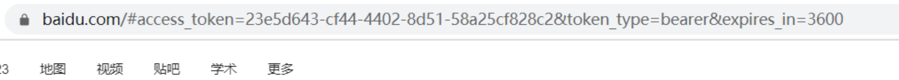

# Oauth2

## **OAuth2.0 介绍**

OAuth（Open Authorization）是一个关于`授权（authorization）`的开放网络标准，允许**用户授权第三方应用(京东)访问他们存储在另外的服务提供者(微信用户)上的信息**，而不需要将用户名和密码提供给第三方移动应用或分享他们数据的所有内容。

协议特点：

- 简单：不管是 OAuth 服务提供者还是应用开发者，都很易于理解与使用

- 安全：没有涉及到用户密钥等信息，更安全更灵活

- 开放：任何服务提供商都可以实现 OAuth，任何软件开发商都可以使用 OAuth

###  **应用场景**`请求验证授权`

- **原生 app 授权：**app 登录请求后台接口，为了安全认证，所有请求都带 token 信息，如果登录验证、请求后台数据

- **前后端分离单页面应用：**前后端分离框架，前端请求后台数据，需要进行 oauth2 安全认证，比如使用 vue、react 后者 h5 开发的 app

- **第三方应用授权登录，**比如 QQ，微博，微信的授权登录。

  

**举例：**

有一个 "云冲印" 的网站，可以将用户储存在 Google 的照片，冲印出来。用户为了使用该服务，必须让 "云冲印" 读取自己储存在 Google 上的照片。只有得到用户的授权，Google 才会同意 "云冲印" 读取这些照片。

那么，"云冲印" 怎样获得用户的授权呢？

传统方法是，用户将自己的 Google 用户名和密码，告诉 "云冲印"，后者就可以读取用户的照片了。这样的做法有以下几个严重的缺点：

- "云冲印" 为了后续的服务，会**保存用户的密码，这样很不安全**

- Google 不得不部署密码登录，而我们知道，**单纯的密码登录并不安全**

- "云冲印" 拥有了获取用户储存在 Google 所有资料的权力，用户**没法限制 "云冲印" 获得授权的范围和有效期**

- **用户只有修改密码，才能收回赋予 "云冲印" 的权力**。但是这样做，会使得**其他所有获得用户授权的第三方应用程序全部失效**

- 只要有一个**第三方应用程序被破解，就会导致用户密码泄漏**，以及所有被密码保护的数据泄漏


生活中常见的 oauth2 场景，京东商城（https://www.jd.com/）接入微信开放平台，可以通过微信登录。


**京东后台处理，通过code申请微信的token**


### **基本概念**

1. **Third-party application**：第三方应用程序，又称 "客户端"（client），即例子中的 "云冲印"。

2. **HTTP service**：HTTP 服务提供商，简称 "服务提供商"，即例子中的 Google。

3. **Resource Owner**：资源所有者，又称 "用户"（user）。

4. **User Agent**：用户代理，比如浏览器。

5. **Authorization server**：授权服务器，即服务提供商专门用来处理认证授权的服务器。

6. **Resource server**：资源服务器，即服务提供商存放用户生成的资源的服务器。它与授权服务器，可以是同一台服务器，也可以是不同的服务器。

OAuth 的作用就是让 "客户端" 安全可控地获取 "用户" 的授权，与 "服务提供商" 进行交互。


### **优缺点**

优点：

- 更安全，客户端不接触用户密码，服务器端更易集中保护

- 广泛传播并被持续采用

- 短寿命和封装的 token

- 资源服务器和授权服务器解耦

- 集中式授权，简化客户端

- HTTP/JSON 友好，易于请求和传递 token

- 考虑多种客户端架构场景

- 客户可以具有不同的信任级别  

缺点：

- **协议框架太宽泛**，造成各种实现的兼容性和互操作性差

- 不是一个认证协议，本身并不能告诉你任何用户信息。  


## **OAuth2 的设计思路**

OAuth 在 "客户端" 与 "服务提供商" 之间，设置了一个`授权层（authorization layer）`。"客户端" 不能直接登录 "服务提供商"，只能登录授权层，以此将用户与客户端区分开来。"客户端" 登录授权层所用的令牌（token），与用户的密码不同。用户可以在登录的时候，指定授权层令牌的权限范围和有效期，"客户端" 登录授权层以后，"服务提供商" 根据令牌的权限范围和有效期，向 "客户端" 开放用户储存的资料。

OAuth 2.0 的运行流程如下图，摘自 RFC 6749：


**（A）**用户打开客户端以后，客户端要求用户给予授权。

**（B）**用户同意给予客户端授权。

**（C）**客户端使用上一步获得的授权，向授权服务器申请令牌。

**（D）**授权服务器对客户端进行认证以后，确认无误，同意发放令牌。

**（E）**客户端使用令牌，向资源服务器申请获取资源。

**（F）**资源服务器确认令牌无误，同意向客户端开放资源。

令牌（token）与密码（password）的作用是一样的，都可以进入系统，但是有三点差异。

1. **令牌是短期的，到期会自动失效**，用户自己无法修改。密码一般长期有效，用户不修改，就不会发生变化。

2. **令牌可以被数据所有者撤销，会立即失效**。密码一般不允许被他人撤销。

3. **令牌有权限范围**（scope）。对于网络服务来说，只读令牌就比读写令牌更安全。密码一般是完整权限。

上面这些设计，保证了令牌既可以让第三方应用获得权限，同时又随时可控，不会危及系统安全。这就是 OAuth 2.0 的优点。


### **客户端授权模式**

客户端必须**1.得到用户的授权（authorization grant），2.才能获得令牌（access token）**

具体来说，一共分成四种授权类型（authorization grant），即四种颁发令牌的方式，适用于不同的互联网场景。

- **授权码模式**

- **密码模式**

- **简化 (隐式) 模式**

- **客户端模式**

不管哪一种授权方式，第三方应用申请令牌之前，都必须先到系统备案，说明自己的身份，然后会拿到两个身份识别码：**客户端 ID（client ID）和客户端密钥（client secret）**。

这是为了防止令牌被滥用，没有备案过的第三方应用，是不会拿到令牌的


### **授权码模式**

**授权码（authorization code）方式，指的是第三方应用先申请一个授权码，然后再用该码获取令牌。**

这种方式是最常用的流程，安全性也最高，它适用于那些有后端的 Web 应用

**授权码通过前端传送，令牌则是储存在后端，而且所有与资源服务器的通信都在后端完成。**这样的前后端分离，可以避免令牌泄漏。

>  适用场景：目前市面上主流的第三方验证都是采用这种模式


它的步骤如下：

**（A）**用户访问客户端，后者将前者导向授权服务器。

**（B）**用户选择是否给予客户端授权。

**（C）**假设用户给予授权，授权服务器将用户导向客户端事先指定的 "重定向 URI"（redirection URI），同时附上一个授权码。

**（D）**客户端收到授权码，附上早先的 "重定向 URI"，向授权服务器申请令牌。这一步是在客户端的后台的服务器上完成的，对用户不可见。

**（E）**授权服务器核对了授权码和重定向 URI，确认无误后，向客户端发送访问令牌（access token）和更新令牌（refresh token）。

**步骤举例**

1. A 网站提供一个链接，用户点击后就会跳转到 B 网站，授权用户数据给 A 网站使用。下面就是 A 网站跳转 B 网站的一个示意链接

   ```
   > https://b.com/oauth/authorize?
   >   response_type=code&            #要求返回授权码（code）
   >   client_id=CLIENT_ID&           #让 B 知道是谁在请求   
   >   redirect_uri=CALLBACK_URL&     #B 接受或拒绝请求后的跳转网址 
   >   scope=read					   # 要求的授权范围（这里是只读）		
   ```

   客户端申请授权的 URI，包含以下参数：

   - **response_type：**表示授权类型，必选项，此处的值固定为 "code"

   - **client_id：**表示客户端的 ID，必选项

   - **redirect_uri：**表示重定向 URI，可选项

   - **scope：**表示申请的权限范围，可选项

   - **state：**表示客户端的当前状态，可以指定任意值，授权服务器会原封不动地返回这个值。

2. 用户跳转后，B 网站会要求用户登录，然后询问是否同意给予 A 网站授权。用户表示同意，这时 B 网站就会跳回 redirect_uri 参数指定的网址。跳转时，会传回一个授权码，就像下面这样。

   ```
   > https://a.com/callback?code=AUTHORIZATION_CODE    #code参数就是授权码
   ```

3. A 网站拿到授权码以后，就可以在后端，向 B 网站请求令牌。 用户不可见，服务端行为

   ```
   > https://b.com/oauth/token?
   >  client_id=CLIENT_ID&
   >  client_secret=CLIENT_SECRET&    # client_id和client_secret用来让 B 确认 A 的身份,client_secret参数是保密的，因此只能在后端发请求
   >  grant_type=authorization_code&   # 采用的授权方式是授权码
   >  code=AUTHORIZATION_CODE&          # 上一步拿到的授权码
   >  redirect_uri=CALLBACK_URL		# 令牌颁发后的回调网址	
   >
   ```

4. B 网站收到请求以后，就会颁发令牌。具体做法是向 redirect_uri 指定的网址，发送一段 JSON 数据。

   ```
   > {    
   >   "access_token":"ACCESS_TOKEN",     # 令牌
   >   "token_type":"bearer",
   >   "expires_in":2592000,
   >   "refresh_token":"REFRESH_TOKEN",
   >   "scope":"read",
   >   "uid":100101,
   >   "info":{...}
   > }
   ```

**简化 (隐式) 模式**

有些 Web 应用是纯前端应用，没有后端。这时就不能用上面的方式了，必须将令牌储存在前端。**RFC 6749 就规定了第二种方式，允许直接向前端颁发令牌，这种方式没有授权码这个中间步骤，所以称为（授权码）"隐藏式"（implicit）**

简化模式不通过第三方应用程序的服务器，直接在浏览器中向授权服务器申请令牌，跳过了 "授权码" 这个步骤，所有步骤在浏览器中完成，令牌对访问者是可见的，且客户端不需要认证。

**这种方式把令牌直接传给前端，是很不安全的。因此，只能用于一些安全要求不高的场景，并且令牌的有效期必须非常短，通常就是会话期间（session）有效，浏览器关掉，令牌就失效了。**


### **密码模式**

**如果你高度信任某个应用，RFC 6749 也允许用户把用户名和密码，直接告诉该应用。该应用就使用你的密码，申请令牌，这种方式称为 "密码式"（password）。**

在这种模式中，用户必须把自己的密码给客户端，但是客户端不得储存密码。这通常用在用户对客户端高度信任的情况下，比如客户端是操作系统的一部分，或者由一个著名公司出品。而授权服务器只有在其他授权模式无法执行的情况下，才能考虑使用这种模式。

> 适用场景：自家公司搭建的授权服务器


它的步骤如下：

（A）用户向客户端提供用户名和密码。

（B）客户端将用户名和密码发给授权服务器，向后者请求令牌。

（C）授权服务器确认无误后，向客户端提供访问令牌。

 **步骤举例**

1. A 网站要求用户提供 B 网站的用户名和密码，拿到以后，A 就直接向 B 请求令牌。整个过程中，客户端不得保存用户的密码。

   ```
   > https://oauth.b.com/token?
   >   grant_type=password&       # 授权方式是"密码式"
   >   username=USERNAME&
   >   password=PASSWORD&
   >   client_id=CLIENT_ID
   ```

2. B 网站验证身份通过后，直接给出令牌。注意，这时不需要跳转，而是把令牌放在 JSON 数据里面，作为 HTTP 回应，A 因此拿到令牌。

   

### **客户端模式**

客户端模式（Client Credentials Grant）指客户端以自己的名义，而不是以用户的名义，向 "服务提供商" 进行授权。

**适用于没有前端的命令行应用，即在命令行下请求令牌。**一般用来提供给我们完全信任的服务器端服务。


 

1. A 应用在命令行向 B 发出请求。

```
> https://oauth.b.com/token?
>   grant_type=client_credentials&
>   client_id=CLIENT_ID&
>   client_secret=CLIENT_SECRET
```

2. B 网站验证通过以后，直接返回令牌。


### **令牌的使用**

A 网站拿到令牌以后，就可以向 B 网站的 API 请求数据了。

此时，每个发到 API 的请求，都必须带有令牌。

**具体做法是在请求的头信息，加上一个 Authorization 字段，令牌就放在这个字段里面**

```
> curl -H "Authorization: Bearer ACCESS_TOKEN" /
> "https://api.b.com"
```

**也可以通过添加请求参数 access_token 请求数据。**


### **更新令牌**

令牌的有效期到了，如果让用户重新走一遍上面的流程，再申请一个新的令牌，很可能体验不好，而且也没有必要。OAuth 2.0 允许用户自动更新令牌

**具体方法是，B 网站颁发令牌的时候，一次性颁发两个令牌，一个用于获取数据，另一个用于获取新的令牌（refresh token 字段）**。令牌到期前，用户使用 refresh token 发一个请求，去更新令牌。

```
> https://b.com/oauth/token?
>   grant_type=refresh_token&    # grant_type参数为refresh_token表示要求更新令牌
>   client_id=CLIENT_ID&
>   client_secret=CLIENT_SECRET&
>   refresh_token=REFRESH_TOKEN    # 用于更新令牌的令牌
```


## **Spring Security OAuth2 快速开始**

Spring Security 是一个能够为基于 Spring 的企业应用系统提供声明式的安全访问控制解决方案的安全框架。Spring Security 主要实现了 Authentication（认证，解决 who are you? ） 和 Access Control（访问控制，也就是 what are you allowed to do？，也称为 Authorization）

Spring Security 在架构上将认证与授权分离，并提供了扩展点。

- **认证（Authentication）** ：用户认证就是判断一个用户的身份是否合法的过程，用户去访问系统资源时系统要求验证用户的身份信息，身份合法方可继续访问，不合法则拒绝访问。常见的用户身份认证方式有：用户名密码登录，二维码登录，手机短信登录，指纹认证等方式。  

- **授权（Authorization）**： 授权是用户认证通过根据用户的权限来控制用户访问资源的过程，拥有资源的访问权限则正常访问，没有权限则拒绝访问。

将 OAuth2 和 Spring Security 集成，就可以得到一套完整的安全解决方案。**我们可以通过 Spring Security OAuth2 构建一个`授权服务器`来验证用户身份以提供 access_token，并使用这个 access_token 来从资源服务器请求数据**

### **授权服务器**


- Authorize Endpoint ：授权端点，进行**授权**

- Token Endpoint ：**令牌**端点，经过授权**拿到对应的 Token**

- Introspection Endpoint ：**校验**端点，**校验 Token 的合法性**

- Revocation Endpoint ：撤销端点，**撤销授权** 

**流程：**

1. 用户访问，此时没有 Token。`Oauth2RestTemplate` 会报错，这个报错信息会被` Oauth2ClientContextFilter` 捕获并**重定向到授权服务器**。
2. 授权服务器通过 Authorization Endpoint 进行授权，并通过 AuthorizationServerTokenServices **生成授权码并返回给客户端**。
3. 客户端拿到授权码去授权服务器通过 Token Endpoint 调用 AuthorizationServerTokenServices **生成 Token 并返回给客户端**
4. 客户端**拿到 Token 去资源服务器访问资源**，一般会通过 Oauth2AuthenticationManager 调用 ResourceServerTokenServices 进行校验。校验通过可以获取资源


### **授权码模式**

引入依赖

```xml
<dependency>
	<groupId>org.springframework.boot</groupId>
	<artifactId>spring-boot-starter-security</artifactId>
</dependency>
 
<dependency>
    <groupId>org.springframework.security.oauth</groupId>
    <artifactId>spring-security-oauth2</artifactId>
    <version>2.3.4.RELEASE</version>
</dependency>
```

配置 spring security

**WebSecurityConfig：配置应用程序的安全策略**

```java
@Configuration
public class WebSecurityConfig extends WebSecurityConfigurerAdapter {
 	//配置密码编码器。在这里，使用了 BCryptPasswordEncoder 作为密码编码器，它是 Spring Security 推荐的密码加密算法
    @Bean
    public PasswordEncoder passwordEncoder(){
        return new BCryptPasswordEncoder();
    }
 	
    //配置 HTTP 安全策略
    @Override
    protected void configure(HttpSecurity http) throws Exception {
        //启用表单登录，并允许所有用户访问登录页面
        http.formLogin().permitAll()
            //授权请求配置
            .and().authorizeRequests()
            //配置 /oauth/** 路径下的请求允许所有用户访问，不需要身份验证。
            .antMatchers("/oauth/**").permitAll()
            //除了上述配置的路径，其他所有请求都需要身份验证
            .anyRequest().authenticated()
            //启用注销功能，并允许所有用户访问注销接口
            .and().logout().permitAll()
            //禁用跨站请求伪造（CSRF）保护
            .and().csrf().disable();
    }
}
```

**UserService**

```java
@Service
public class UserService implements UserDetailsService {
 
    @Autowired
    private PasswordEncoder passwordEncoder;
 
    @Override
    public UserDetails loadUserByUsername(String username) throws UsernameNotFoundException {
        String password = passwordEncoder.encode("123456");
        //创建了一个 UserDetails 对象，其中包含了用户名、加密后的密码以及用户的权限信息。User 是 Spring Security 提供的一个默认实现类，用于表示用户信息
        //AuthorityUtils.commaSeparatedStringToAuthorityList("admin") 方法用于将逗号分隔的权限字符串转换为权限列表
        return new User("fox",password, AuthorityUtils.commaSeparatedStringToAuthorityList("admin"));
    }
}
```

**UserController**

```java
@RestController
@RequestMapping("/user")
public class UserController {
 
    @RequestMapping("/getCurrentUser")
    //Authentication authentication：这个参数会由 Spring Security 框架自动注入，包含了当前用户的认证信息，例如用户名、密码、权限等
    public Object getCurrentUser(Authentication authentication) {
        //通过 authentication 对象的 getPrincipal() 方法可以获取到当前用户的主体对象。在 Spring Security 中，主体对象通常是 UserDetails 对象，表示当前认证用户的详细信息
        return authentication.getPrincipal();
    }
}
```

**配置授权服务器**

```java
@Configuration
//这个注解启用了 Spring Security OAuth2 的授权服务器功能。授权服务器负责颁发访问令牌和刷新令牌，用于客户端访问受保护的资源
@EnableAuthorizationServer
public class AuthorizationServerConfig extends AuthorizationServerConfigurerAdapter {
 
    @Autowired
    private PasswordEncoder passwordEncoder;
 
    @Override
    public void configure(ClientDetailsServiceConfigurer clients) throws Exception {
        //表示客户端信息存储在内存中
        clients.inMemory()
            //配置client_id
            .withClient("client")
            //配置client-secret
            .secret(passwordEncoder.encode("123123"))
            //配置访问token的有效期
            .accessTokenValiditySeconds(3600)
            //配置刷新token的有效期
            .refreshTokenValiditySeconds(864000)
            //配置redirect_uri，用于授权成功后跳转
            .redirectUris("http://www.baidu.com")
            //配置申请的权限范围
            .scopes("all")
            //配置grant_type，表示授权类型
            .authorizedGrantTypes("authorization_code");
    }
}
```

**配置资源服务器**

```java
@Configuration
//@EnableResourceServer：这个注解启用了 Spring Security 的资源服务器功能。资源服务器负责验证请求中的访问令牌，并保护受保护的资源。
@EnableResourceServer
public class ResourceServiceConfig extends ResourceServerConfigurerAdapter {
 
    @Override
    public void configure(HttpSecurity http) throws Exception {
        //用于配置请求的授权规则
        http.authorizeRequests()
        //表示所有请求都需要经过认证，即必须携带有效的访问令牌才能访问。
        .anyRequest().authenticated()
        //定义了一个路径匹配规则，指定了哪些请求需要受到保护。在这里，配置了以 /user/** 开头的请求需要受到保护，需要进行认证才能访问
        .and().requestMatchers().antMatchers("/user/**");
    }
}
```

测试

**获取授权码**

http://localhost:8080/oauth/authorize?response_type=code&client_id=client 

或者

 http://localhost:8080/oauth/authorize?response_type=code&client_id=client&redirect_uri=http://www.baidu.com&scope=all

登录之后进入


选择 Approve，点击授权获取授权码


**获取令牌**  

根据授权码通过 post 请求获取


或者


**简化模式**

authorizedGrantType 添加 implicit


测试

http://localhost:8080/oauth/authorize?client_id=client&response_type=token&scope=all&redirect_uri=http://www.baidu.com

登录之后进入授权页面，确定授权后浏览器会重定向到指定路径，并以 Hash 的形式存放在重定向 uri 的 fargment 中：  

