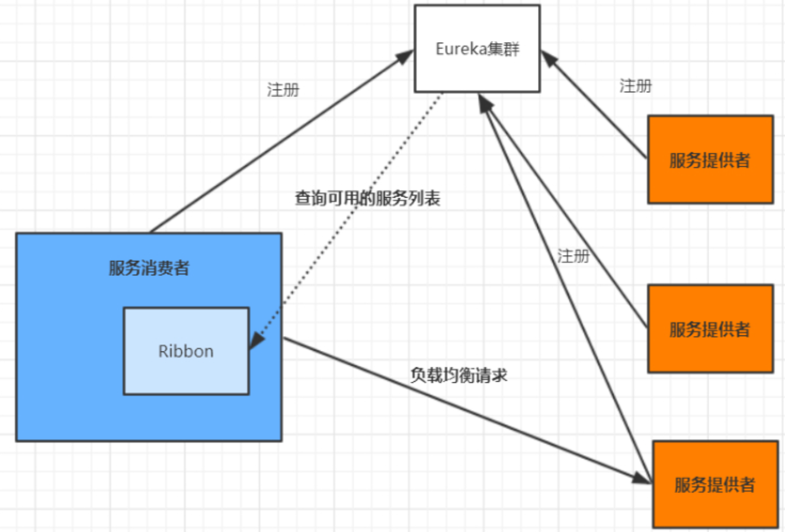
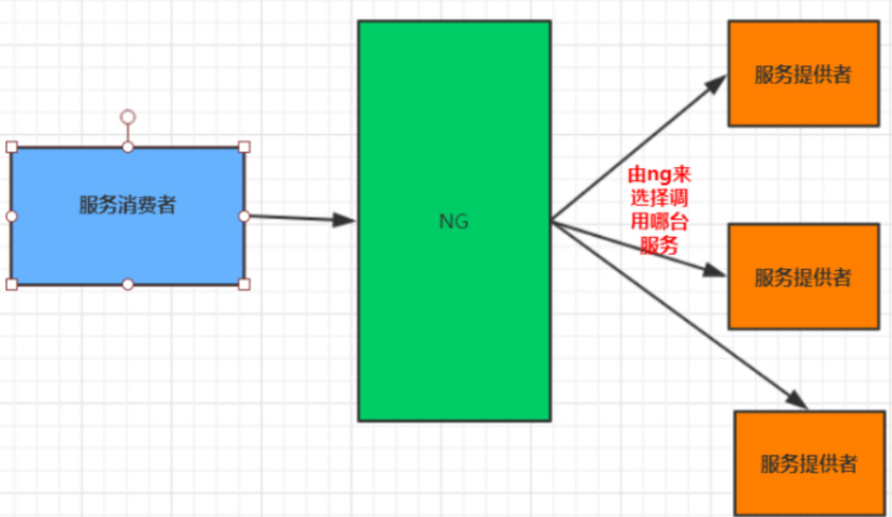
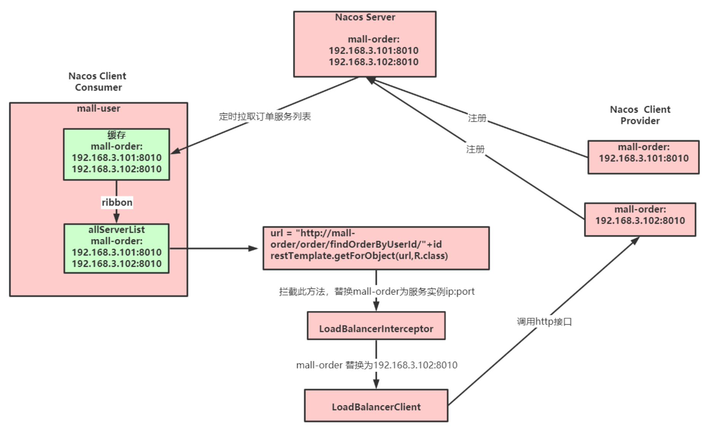
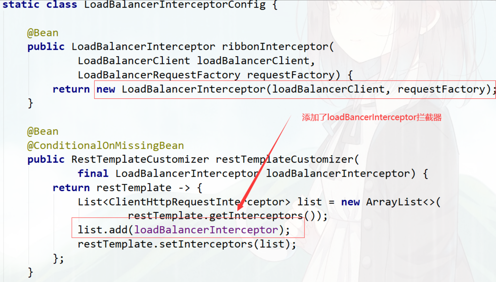
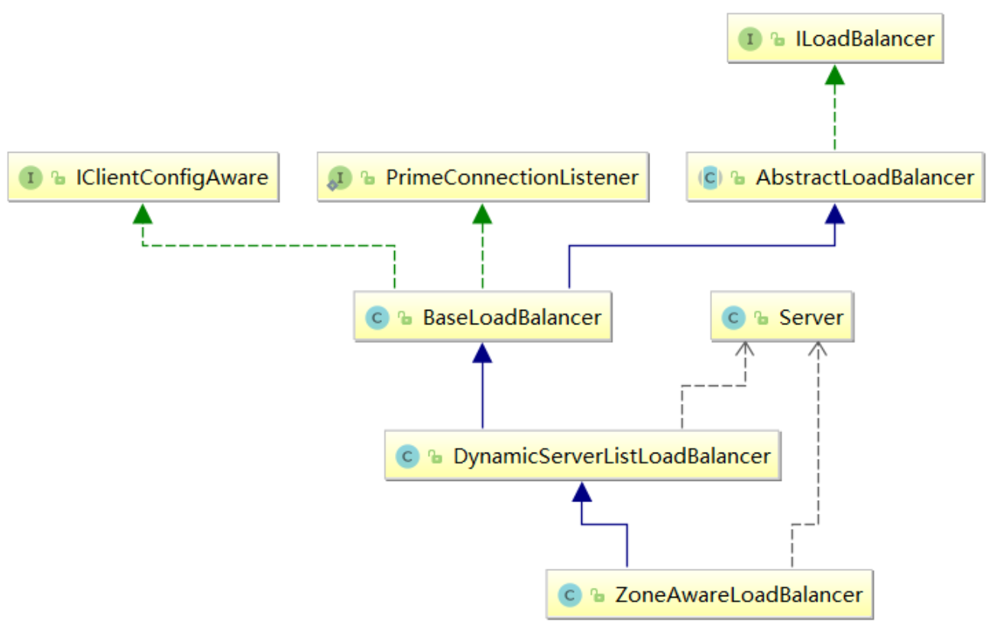
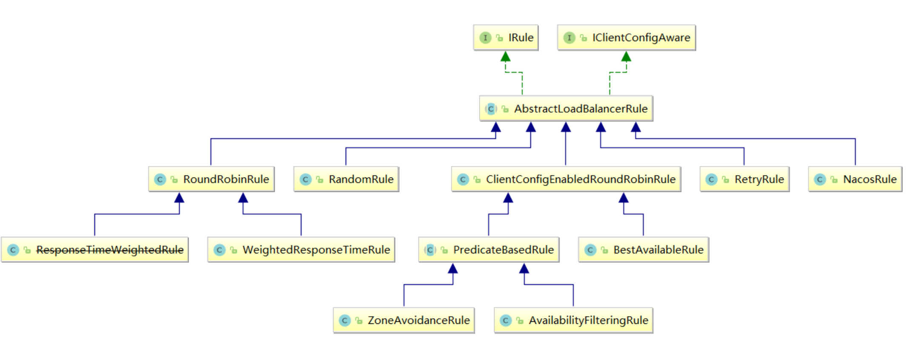

# Ribbon

## **什么是 Ribbon**

目前主流的负载方案分为以下两种：

- 中间件代理：集中式负载均衡，在消费者和服务提供方中间**使用独立的代理方式进行负载**，有硬件的（比如 F5），也有软件的（比如 Nginx）。

- 客户端：**客户端根据自己的请求情况做负载均衡**，Ribbon 就属于客户端自己做负载均衡。

其中 Spring Cloud Ribbon 是基于 Netflix Ribbon 实现的一套**客户端的负载均衡工具**

Ribbon 客户端组件提供一系列的完善的配置，如超时，重试等。通过 Load Balancer 获取到服务提供的所有机器实例，Ribbon 会自动基于某种规则 (轮询，随机) 去调用这些服务。

**Ribbon 也可以实现我们自己的负载均衡算法**


###  客户端的负载均衡

例如 spring cloud 中的 ribbon，客户端会有一个服务器地址列表，**在发送请求前通过负载均衡算法选择一个服务器，然后进行访问**，这是客户端负载均衡

即在客户端就进行负载均衡算法分配。



### 服务端的负载均衡

例如 Nginx，通过 Nginx 进行负载均衡，先发送请求，然后通过负载均衡算法，在多个服务器之间选择一个进行访问；即在服务器端再进行负载均衡算法分配。



### **常见负载均衡算法**

- **随机**，通过随机选择服务进行执行，一般这种方式**使用较少**

- **轮询，负载均衡默认实现方式**，请求来之后排队处理；

- **加权轮询**，通过对服务器性能的分型，**给高配置，低负载的服务器分配更高的权重**，均衡各个服务器的压力；

- **地址 Hash**，通过客户端请求的地址的 HASH 值取模映射进行服务器调度。  ip hash

- **最小连接数**，即使请求均衡了，压力不一定会均衡，最小连接数法就是根据服务器的情况，比如请求积压数等参数，将请求分配到当前压力最小的服务器上。  最小活跃数

 

### Ribbon 模块

| 名 称               | 说  明                                                       |
| ------------------- | ------------------------------------------------------------ |
| ribbon-loadbalancer | **负载均衡模块**，可独立使用，也可以和别的模块一起使用。     |
| Ribbon              | 内置的负载均衡算法都实现在其中。                             |
| ribbon-eureka       | 基于 Eureka 封装的模块，能够快速、方便地集成 Eureka。        |
| ribbon-transport    | **基于 Netty 实现多协议的支持**，比如 HTTP、Tcp、Udp 等。    |
| ribbon-httpclient   | **基于 Apache HttpClient 封装的 REST 客户端**，集成了负载均衡模块，可以直接在项目中使用来调用接口。 |
| ribbon-example      | Ribbon 使用代码示例，通过这些示例能够让你的学习事半功倍。    |
| ribbon-core         | 一些比较核心且具有通用性的代码，客户端 API 的一些配置和其他 API 的定义。 |


### Ribbon 使用

编写一个客户端来调用接口

```java
public class RibbonDemo {
    public static void main(String[] args) {
 
        // 服务列表
        List<Server> serverList = Lists.newArrayList(
                new Server("localhost", 8020),
                new Server("localhost", 8021));
        
        // 构建负载实例 LoadBalancerBuilder
        ILoadBalancer loadBalancer = LoadBalancerBuilder.newBuilder()
                .buildFixedServerListLoadBalancer(serverList);
        
        // 调用 5 次来测试效果
        for (int i = 0; i < 5; i++) {
            String result = LoadBalancerCommand.<String>builder()
                    .withLoadBalancer(loadBalancer).build()
                    .submit(new ServerOperation<String>() {
                        @Override
                        public Observable<String> call(Server server) {
                            String addr = "http://" + server.getHost() + ":" +
                                    server.getPort() + "/order/findOrderByUserId/1";
                                System.out.println(" 调用地址：" + addr);
                            URL url = null;
                            try {
                                url = new URL(addr);
                                HttpURLConnection conn = (HttpURLConnection) url.openConnection();
                                conn.setRequestMethod("GET");
                                conn.connect();
                                InputStream in = conn.getInputStream();
                                byte[] data = new byte[in.available()];
                                in.read(data);
                                return Observable.just(new String(data));
                            } catch (Exception e) {
                                e.printStackTrace();
                            }
                            return null;
                        }
                    }).toBlocking().first();
 
            System.out.println(" 调用结果：" + result);
        }
    }
}
```

主要演示了 Ribbon 如何去做负载操作，调用接口用的最底层的 HttpURLConnection。


## Spring Cloud 快速整合 Ribbon

1.  **引入依赖**

   ```xml
   <dependency>
   	<groupId>org.springframework.cloud</groupId>
   	<artifactId>spring-cloud-starter-netflix-ribbon</artifactId>
   </dependency>
   ```

   > nacos-discovery 依赖了 ribbon，可以不用再引入 ribbon 依赖


2. 添加 @LoadBalanced 注解

   ```java
   @Configuration
   public class RestConfig {
       @Bean
       @LoadBalanced
       public RestTemplate restTemplate() {
           return new RestTemplate();
       } 
   ```


3. 修改 controller  `R result = restTemplate.getForObject(url,R.class);`

   ```java
   @Autowired
   private RestTemplate restTemplate;
    
   @RequestMapping(value = "/findOrderByUserId/{id}")
   public R  findOrderByUserId(@PathVariable("id") Integer id) {
       // 原本RestTemplate调用
       //String url = "http://localhost:8020/order/findOrderByUserId/"+id;
       // 添加@LoadBalanced
       String url = "http://mall-order/order/findOrderByUserId/"+id;
       R result = restTemplate.getForObject(url,R.class);
    
       return result;
   }
   ```


## Ribbon 内核原理



### 模拟 ribbon 实现

示例代码

```java
@Autowired
private RestTemplate restTemplate;
 
@RequestMapping(value = "/findOrderByUserId/{id}")
public R  findOrderByUserId(@PathVariable("id") Integer id) {
    //模拟ribbon实现
    String url = getUri("mall-order")+"/order/findOrderByUserId/"+id;
    R result = restTemplate.getForObject(url,R.class);
    return result;
}
```

getUri方法

```java
@Autowired
private DiscoveryClient discoveryClient;

public String getUri(String serviceName) {
    List<ServiceInstance> serviceInstances = discoveryClient.getInstances(serviceName);
    if (serviceInstances == null || serviceInstances.isEmpty()) {
        return null;
    }
    int serviceSize = serviceInstances.size();
    //轮询
    int indexServer = incrementAndGetModulo(serviceSize);
    return serviceInstances.get(indexServer).getUri().toString();
}

private AtomicInteger nextIndex = new AtomicInteger(0);

//通过nextIndex加1取余后返回
private int incrementAndGetModulo(int modulo) {
    for (;;) {
        int current = nextIndex.get();
        int next = (current + 1) % modulo;
        if (nextIndex.compareAndSet(current, next) && current < modulo){
            return current;
        }
    }
}
```


###  @LoadBalanced 注解原理

参考源码： LoadBalancerAutoConfiguration

**@LoadBalanced 利用 @Qualifier 作为 restTemplates 注入的筛选条件，筛选出具有负载均衡标识的 RestTemplate**

被 @LoadBalanced 注解的 restTemplate 会被定制，添加 LoadBalancerInterceptor 拦截器。




## Ribbon 相关接口



**IClientConfig**：Ribbon 的客户端配置，默认采用 **DefaultClientConfigImpl** 实现。

**IRule**：Ribbon 的负载均衡策略，默认采用 **ZoneAvoidanceRule** 实现，该策略能够在多区域环境下选出最佳区域的实例进行访问。

**IPing**：Ribbon 的实例检查策略，默认采用 **DummyPing** 实现，该检查策略是一个特殊的实现，实际上它并不会检查实例是否可用，而是始终返回 true，默认认为所有服务实例都是可用的。

**ServerList**：服务实例清单的维护机制，默认采用 **ConfigurationBasedServerList** 实现。

**ServerListFilter**：服务实例清单过滤机制，默认采 **ZonePreferenceServerListFilter**，该策略能够优先过滤出与请求方处于同区域的服务实例。   

**ILoadBalancer**：负载均衡器，默认采用 **ZoneAwareLoadBalancer** 实现，它具备了区域感知的能力。


### Ribbon 负载均衡策略



1. **RandomRule**： 随机选择一个 Server。
2. **RetryRule**： 对选定的负载均衡策略机上重试机制，在一个配置时间段内当选择 Server 不成功，则一直尝试使用 subRule 的方式选择一个可用的 server。
3. **RoundRobinRule**： 轮询选择， 轮询 index，选择 index 对应位置的 Server。
4. **AvailabilityFilteringRule**： 过滤掉一直连接失败的被标记为 circuit tripped 的后端 Server，并过滤掉那些高并发的后端 Server 或者使用一个 AvailabilityPredicate 来包含过滤 server 的逻辑，其实就是检查 status 里记录的各个 Server 的运行状态。
5. **BestAvailableRule**： 选择一个最小的并发请求的 Server，逐个考察 Server，如果 Server 被 tripped 了，则跳过。
6. **WeightedResponseTimeRule**： 根据响应时间加权，响应时间越长，权重越小，被选中的可能性越低。
7. **ZoneAvoidanceRule**： 默认的负载均衡策略，即复合判断 Server 所在区域的性能和 Server 的可用性选择 Server，在没有区域的环境下，类似于轮询 (RandomRule)
8. **NacosRule:**  同集群优先调用


## **修改默认负载均衡策略**

### 全局配置：

调用其他微服务，一律使用指定的负载均衡算法

```java
@Configuration
public class RibbonConfig {
 
    /**
     * 全局配置
     * 指定负载均衡策略
     * @return
     */
    @Bean
    public IRule() {
        // 指定使用Nacos提供的负载均衡策略（优先调用同一集群的实例，基于随机权重）
        return new NacosRule();
    }
```

### **局部配置：**

调用指定微服务提供的服务时，使用对应的负载均衡算法

修改 application.yml

```yaml
# 被调用的微服务名
mall-order:
  ribbon:
    # 指定使用Nacos提供的负载均衡策略（优先调用同一集群的实例，基于随机&权重）
    NFLoadBalancerRuleClassName: com.alibaba.cloud.nacos.ribbon.NacosRule
```


### **自定义负载均衡策略**

通过实现 IRule 接口可以自定义负载策略，主要的选择服务逻辑在 choose 方法中。

1. 实现基于 Nacos 权重的负载均衡策略

   ```java
   @Slf4j
   public class NacosRandomWithWeightRule extends AbstractLoadBalancerRule {
    
       @Autowired
       private NacosDiscoveryProperties nacosDiscoveryProperties;
    
       @Override
       public Server choose(Object key) {
           DynamicServerListLoadBalancer loadBalancer = (DynamicServerListLoadBalancer) getLoadBalancer();
           String serviceName = loadBalancer.getName();
           NamingService namingService = nacosDiscoveryProperties.namingServiceInstance();
           try {
               //nacos基于权重的算法
               Instance instance = namingService.selectOneHealthyInstance(serviceName);
               return new NacosServer(instance);
           } catch (NacosException e) {
               log.error("获取服务实例异常：{}", e.getMessage());
               e.printStackTrace();
           }
           return null;
       }
       @Override
       public void initWithNiwsConfig(IClientConfig clientConfig) {
    
       }
   ```

2. 配置自定义的策略

   **局部配置：** 

   修改 application.yml

   ```yaml
   # 被调用的微服务名
   mall-order:
     ribbon:
       # 自定义的负载均衡策略（基于随机&权重）
       NFLoadBalancerRuleClassName: com.tuling.mall.ribbondemo.rule.NacosRandomWithWeightRule
   ```

   **局部配置第二种方式**

   可以利用 @RibbonClient 指定微服务及其负载均衡策略。

   ```java
   @SpringBootApplication(exclude = {DataSourceAutoConfiguration.class,
           DruidDataSourceAutoConfigure.class})
   //@RibbonClient(name = "mall-order",configuration = RibbonConfig.class)
   //配置多个   RibbonConfig不能被@SpringbootApplication的@CompentScan扫描到，否则就是全局配置的效果
   @RibbonClients(value = {
       // 在SpringBoot主程序扫描的包外定义配置类
       @RibbonClient(name = "mall-order",configuration = RibbonConfig.class),
       @RibbonClient(name = "mall-account",configuration = RibbonConfig.class)    
   })
   public class MallUserRibbonDemoApplication {
    
       public static void main(String[] args) {
           SpringApplication.run(MallUserRibbonDemoApplication.class, args);
       }
   }
   ```

   > 不能写在 @SpringbootApplication 注解的 @CompentScan 扫描得到的地方，否则自定义的配置类就会被所有的 RibbonClients 共享。 不建议这么使用，推荐 yml 方式

   **全局配置**

   ```java
   @Bean
   public IRule ribbonRule() {
       return new NacosRandomWithWeightRule();
   }
   ```


