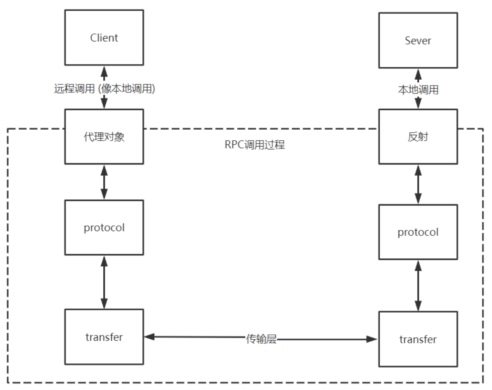
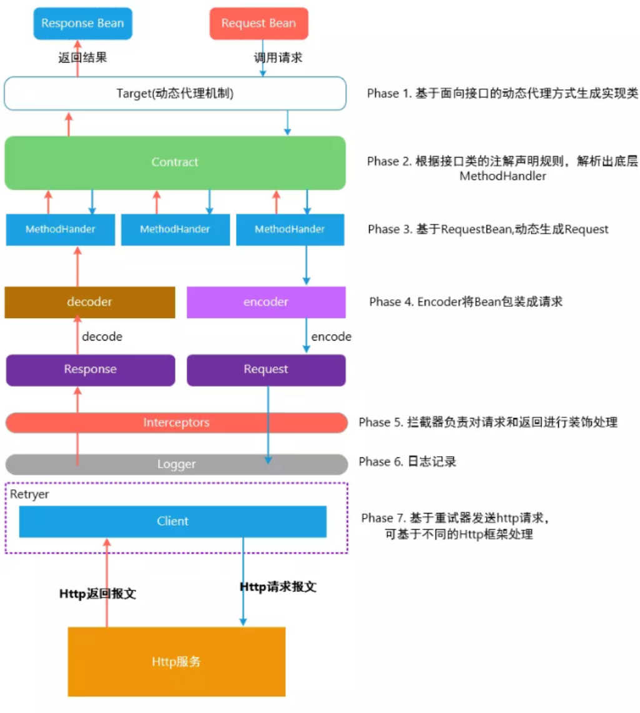
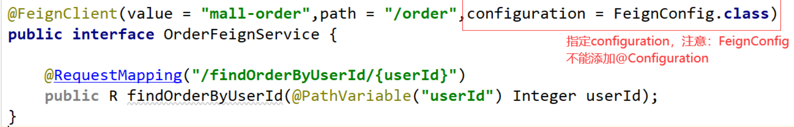

# Feign

## RPC 概述

RPC 全称是 Remote Procedure Call ，即**远程过程调用**，其对应的是我们的本地调用。

**RPC 的目的是：让我们调用远程方法像调用本地方法一样**

```java
//本地调用
R result = orderService.findOrderByUserId(id);
//RPC远程调用  orderService为代理对象
R result = orderService.findOrderByUserId(id);
```


**RPC 框架设计架构**




##  什么是 Feign

Feign 是 Netflix 开发的声明式、模板化的 HTTP 客户端，Feign 可帮助我们更加便捷、优雅地调用 HTTP API

**Feign 可以做到使用 HTTP 请求远程服务时就像调用本地方法一样的体验**，开发者完全感知不到这是远程方法，更感知不到这是个 HTTP 请求。它像 Dubbo 一样，consumer 直接调用接口方法调用 provider，而不需要通过常规的 Http Client 构造请求再解析返回数据。它解决了让开发者调用远程接口就跟调用本地方法一样，无需关注与远程的交互细节，更无需关注分布式环境开发。

`Spring Cloud openfeign` 对 Feign 进行了增强，使其支持 Spring MVC 注解，另外还整合了` Ribbon` 和` Eureka`，从而使得 Feign 的使用更加方便


### Ribbon&Feign 对比

 **Ribbon+RestTemplate 进行微服务调用**

```java
@Bean
@LoadBalanced
public RestTemplate restTemplate() {
    return new RestTemplate();
}
 
//调用方式
String url = "http://mall-order/order/findOrderByUserId/"+id;
R result = restTemplate.getForObject(url,R.class);
```

**Feign 进行微服务调用**

```java
@FeignClient(value = "mall-order",path = "/order")
public interface OrderFeignService {
    @RequestMapping("/findOrderByUserId/{userId}")
    public R findOrderByUserId(@PathVariable("userId") Integer userId);
}
 
@Autowired
OrderFeignService orderFeignService;
//feign调用
R result = orderFeignService.findOrderByUserId(id);
```


### Feign 的设计架构



## **Spring Cloud Alibaba 快速整合 Feign**

1. 引入依赖

   ```xml
   <!-- openfeign 远程调用 -->
   <dependency>
       <groupId>org.springframework.cloud</groupId>
       <artifactId>spring-cloud-starter-openfeign</artifactId>
   </dependency>
   ```

2. 编写调用接口 +@FeignClient 注解

   ```java
   @FeignClient(value = "mall-order",path = "/order")
   public interface OrderFeignService {
    
       @RequestMapping("/findOrderByUserId/{userId}")
       public R findOrderByUserId(@PathVariable("userId") Integer userId);
   }
   ```

3. 调用端在启动类上添加 @EnableFeignClients 注解

   ```java
   @SpringBootApplication
   @EnableFeignClients  //扫描和注册feign客户端的beanDefinition
   public class MallUserFeignDemoApplication {
       public static void main(String[] args) {
           SpringApplication.run(MallUserFeignDemoApplication.class, args);
       }
   }
   ```

4. 发起调用，像调用本地方式一样调用远程服务

   ```java
   @RestController
   @RequestMapping("/user")
   public class UserController {
    
       @Autowired
       OrderFeignService orderFeignService;
    
       @RequestMapping(value = "/findOrderByUserId/{id}")
       public R  findOrderByUserId(@PathVariable("id") Integer id) {
           //feign调用
           R result = orderFeignService.findOrderByUserId(id);
           return result;
       }
   }
   ```

> Feign 的继承特性可以让服务的接口定义单独抽出来，作为公共的依赖，以方便使用


## Spring Cloud Feign 扩展

 Feign 提供了很多的扩展机制，让用户可以更加灵活的使用。

### 日志配置

有时候我们遇到 Bug，比如接口调用失败、参数没收到等问题，或者想看看调用性能，就需要配置 Feign 的日志了，以此让 Feign 把请求信息输出来。

1. **定义一个配置类，指定日志级别**

   ```java
   // 注意： 此处配置@Configuration注解就会全局生效，如果想指定对应微服务生效，就不能配置@Configuration
   @Configuration
   public class FeignConfig {
       /**
        * 日志级别
        * @return
        */
       @Bean
       public Logger.Level feignLoggerLevel() {
           return Logger.Level.FULL;
       }
   }
   ```

   通过源码可以看到日志等级有 4 种，分别是：

   - **NONE**【性能最佳，适用于生产】：不记录任何日志（默认值）。

   - **BASIC**【适用于生产环境追踪问题】：仅记录请求方法、URL、响应状态代码以及执行时间。

   - **HEADERS**：记录 BASIC 级别的基础上，记录请求和响应的 header。

   - **FULL**【比较适用于开发及测试环境定位问题】：记录请求和响应的 header、body 和元数据。

2. **局部配置，让调用的微服务生效，在** **@FeignClient 注解中指定使用的配置类**

   

3. **在 yml 配置文件中配置 Client 的日志级别才能正常输出日志，格式是 "logging.level.feign 接口包路径 = debug"**

   ```yaml
   logging:
     level:
       com.xxx.mall.feigndemo.feign: debug
   ```

4. **局部配置可以在 yml 中配置**

   对应属性配置类： org.springframework.cloud.openfeign.FeignClientProperties.FeignClientConfiguration

   ```yaml
   feign:
     client:
       config:
         mall-order:  #对应微服务
           loggerLevel: FULL
   ```


剩下略

https://note.youdao.com/ynoteshare/index.html?id=c90bd2616b59aa073f9a1e330989ef04&type=note&_time=1716345287269