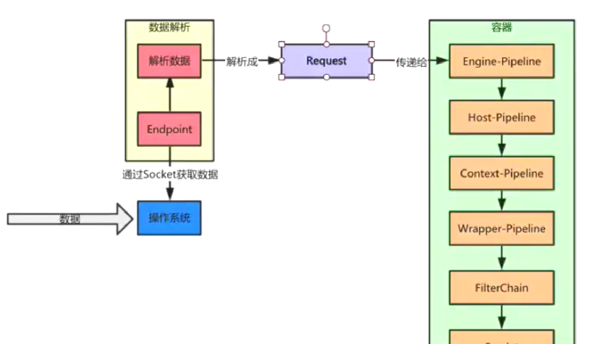
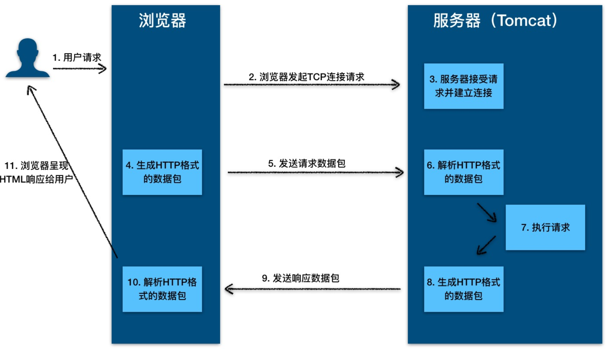
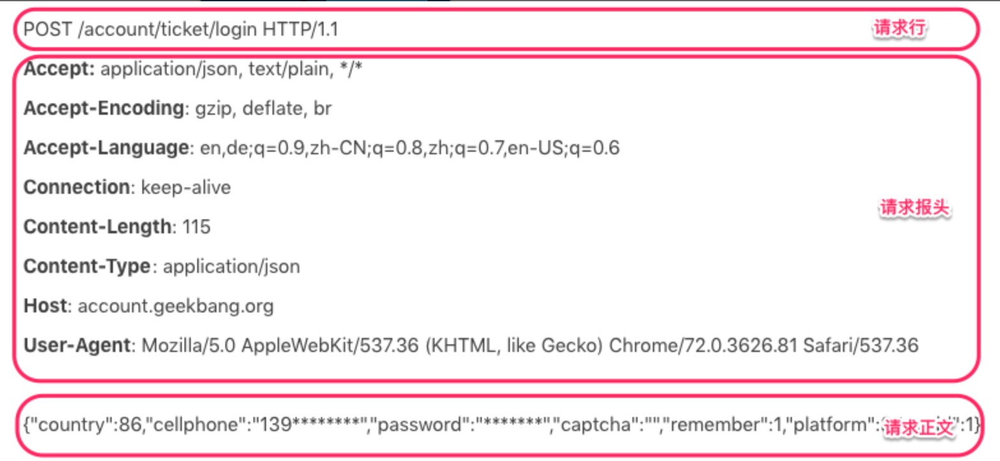
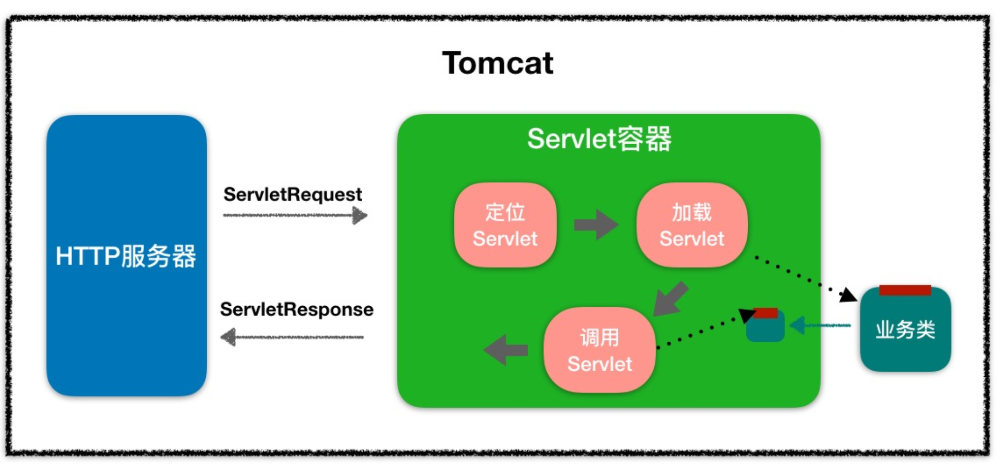
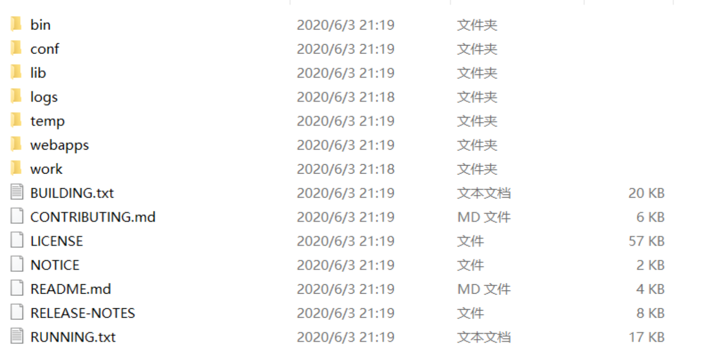

# Tomcat应用架构



​                                                                                                                                                             `最底下是Servlet`

## **Web 容器是什么？**

早期的 Web 应用主要用于浏览新闻等静态页面，HTTP 服务器（比如 Apache、Nginx）向浏览器返回静态 HTML，浏览器负责解析 HTML，将结果呈现给用户。

随着互联网的发展，我们已经不满足于仅仅浏览静态页面，还希望通过一些交互操作，来获取动态结果，因此也就需要一些扩展机制能够让 HTTP 服务器调用服务端程序。

于是 Sun 公司推出了 Servlet 技术。你可以把 Servlet 简单理解为**运行在服务端的 Java 小程序**，但是 Servlet 没有 main 方法，不能独立运行，因此必须把它**部署到 Servlet 容器中，由容器来实例化并调用 Servlet**。

而 Tomcat 就是一个 Servlet 容器。为了方便使用，它们也具有 HTTP 服务器的功能，因此 Tomcat  就是一个 **“HTTP 服务器 + Servlet 容器”，我们也叫它们 Web 容器**。

 

## **HTTP 的本质**

HTTP 协议是**浏览器与服务器之间的数据传送协议**。作为应用层协议，HTTP 是基于 TCP/IP 协议来传递数据的（HTML 文件、图片、查询结果等），HTTP 协议**不涉及数据包（Packet）传输**，主要规定了客户端和服务器之间的**通信格式**。`格式`

假如浏览器需要从远程 HTTP 服务器获取一个 HTML 文本，在这个过程中，浏览器实际上要做两件事情。

- 与服务器建立 Socket 连接。

- 生成请求数据并通过 Socket 发送出去。



### **HTTP 请求响应实例**

用户在登陆页面输入用户名和密码，点击登陆后，浏览器发出了这样的 HTTP 请求：



HTTP 请求数据由三部分组成，分别是**请求行、请求报头、请求正文**。

当这个 HTTP 请求数据到达 Tomcat 后，Tomcat 会把 HTTP 请求数据字节流**解析成一个 Request 对象**，这个 Request 对象封装了 HTTP 所有的请求信息。接着 Tomcat 把这个 **Request 对象交给 Web 应用**去处理，处理完后得到一个 Response 对象，Tomcat 会把这个 **Response 对象转成 HTTP 格式的响应数据并发送给浏览器**。

HTTP 的响应也是由三部分组成，分别是**状态行、响应报头、报文主体**。同样，我还以极客时间登陆请求的响应为例。


## **Cookie 和 Session**

HTTP 协议有个特点是**无状态**，请求与请求之间是没有关系的。这样会出现一个很尴尬的问题：Web 应用不知道你是谁。因此 HTTP 协议需要一种技术让请求与请求之间建立起联系，并且服**务器需要知道这个请求来自哪个用户**，于是 Cookie 技术出现了。

**Cookie 是 HTTP 报文的一个请求头**，Web 应用可以将用户的标识信息或者其他一些信息（用户名等）存储在 Cookie 中。用户经过验证之后，每次 HTTP 请求报文中都包含 Cookie，这样服务器读取这个 Cookie 请求头就知道用户是谁了。**Cookie 本质上就是一份存储在用户本地的文件，里面包含了每次请求中都需要传递的信息**。

由于 Cookie 以明文的方式存储在本地，而 Cookie 中往往带有用户信息，这样就造成了非常大的安全隐患。而 Session 的出现解决了这个问题，Session 可以理解为**服务器端开辟的存储空间**，**里面保存了用户的状态**，用户信息以 Session 的形式存储在服务端。当用户请求到来时，服务端可以把用户的请求和用户的 Session 对应起来。


- **那么 Session 是怎么和请求对应起来的呢？**

答案是通过 Cookie，浏览器在 Cookie 中填充了一个 Session ID 之类的字段用来标识请求。

- **具体工作过程是这样的：**

1. 服务器在创建 Session 的同时，会为该 Session 生成唯一的 Session ID
2. 当浏览器再次发送请求的时候，会将这个 Session ID 带上
3. 服务器接受到请求之后就会依据 Session ID 找到相应的 Session，找到 Session 后，就可以在 Session 中获取或者添加内容了

> 这些内容只会保存在服务器中，发到客户端的只有 Session ID，这样相对安全，也节省了网络流量，因为不需要在 Cookie 中存储大量用户信息。


- **那么 Session 在何时何地创建呢？**

当然还是在服务器端程序**运行的过程中创建的**，不同语言实现的应用程序有不同的创建 Session 的方法。在 Java 中，是 Web 应用程序在调用 HttpServletRequest 的 getSession 方法时，由 Web 容器（比如 Tomcat）创建的。

Tomcat 的 Session 管理器提供了多种持久化方案来存储 Session，通常会采用高性能的存储方式，比如 Redis，并且通过**集群部署**的方式，防止单点故障，从而提升高可用。

同时，Session 有**过期时间**，因此 Tomcat 会开启后台线程定期的轮询，如果 Session 过期了就将 Session 失效。

 

## **Servlet 规范**

### Servlet的定义：

- **HTTP 服务器怎么知道要调用哪个 Java 类的哪个方法呢?**

最直接的做法是在 HTTP 服务器代码里写一大堆 if else 逻辑判断：如果是 A 请求就调 X 类的 M1 方法，如果是 B 请求就调 Y 类的 M2 方法。但这样做明显有问题，因为 HTTP 服务器的代码跟业务逻辑耦合在一起了，如果新加一个业务方法还要改 HTTP 服务器的代码。

- **那该怎么解决这个问题呢？**

我们知道，面向接口编程是解决耦合问题的法宝，于是有一伙人就定义了一个接口，各种业务类都必须实现这个接口，这个接口就叫 Servlet 接口，有时我们也把实现了 Servlet 接口的业务类叫作 Servlet。

但是这里还有一个问题，对于特定的请求，HTTP 服务器如何知道由哪个 Servlet 来处理呢？Servlet 又是由谁来实例化呢？显然 HTTP 服务器不适合做这个工作，否则又和业务类耦合了。

于是，还是那伙人又发明了 **Servlet 容器**，Servlet 容器用来**加载和管理业务类**。**HTTP 服务器不直接跟业务类打交道，而是把请求交给 Servlet 容器去处理**，Servlet 容器会将请求**转发到具体的 Servlet**，如果这个 Servlet 还没创建，就加载并实例化这个 Servlet，然后调用这个 Servlet 的接口方法。**因此 Servlet 接口其实是 Servlet 容器跟具体业务类之间的接口**。


Servlet 接口和 Servlet 容器这一整套规范叫作 **Servlet 规范**。Tomcat 和 Jetty 都按照 Servlet 规范的要求实现了 Servlet 容器，同时它们也具有 HTTP 服务器的功能。

作为 Java 程序员，如果我们要实现新的业务功能，只需要实现一个 Servlet，并把它注册到 Tomcat（Servlet 容器）中，剩下的事情就由 Tomcat 帮我们处理了。


- Servlet 接口定义了下面五个方法：

```java
 public interface Servlet {
    void init(ServletConfig config) throws ServletException;
    ServletConfig getServletConfig();    
    void service(ServletRequest req, ServletResponse res）throws ServletException, IOException;   
    String getServletInfo();    
    void destroy();
}
```

其中最重要是的 **service** 方法，具体业务类在这个方法里实现处理逻辑。这个方法有两个参数：ServletRequest 和 ServletResponse。ServletRequest 用来**封装请求信息**，ServletResponse 用来**封装响应信息**，因此**本质上这两个类是对通信协议的封装**。

**HTTP 协议中的请求和响应就是对应了 HttpServletRequest 和 HttpServletResponse 这两个类**。你可以通过 HttpServletRequest 来获取所有请求相关的信息，包括请求路径、Cookie、HTTP 头、请求参数等。此外，我们还可以通过 HttpServletRequest 来创建和获取 Session，而 HttpServletResponse 是用来封装 HTTP 响应的。

接口中还有两个跟生命周期有关的方法 init 和 destroy，这是一个比较贴心的设计，Servlet 容器在加载 Servlet 类的时候会调用 init 方法，在卸载的时候会调用 destroy 方法。我们可能会在 **init 方法里初始化一些资源**，并在 **destroy 方法里释放这些资源**

>  比如 Spring MVC 中的 DispatcherServlet，就是在 init 方法里创建了自己的 Spring 容器。


ServletConfig 的作用就是**封装 Servlet 的初始化参数**。你可以在 web.xml 给 Servlet 配置参数，并在程序里通过 getServletConfig 方法拿到这些参数。

有接口一般就有抽象类，抽象类用来实现接口和封装通用的逻辑，因此 Servlet 规范提供了 GenericServlet 抽象类，我们可以通过扩展它来实现 Servlet。虽然 Servlet 规范并不在乎通信协议是什么，但是大多数的 Servlet 都是在 HTTP 环境中处理的，因此 Servet 规范还提供了 HttpServlet 来继承 GenericServlet，并且加入了 HTTP 特性。**这样我们通过继承 HttpServlet 类来实现自己的 Servlet，只需要重写两个方法：doGet 和 doPost。**

 

## **Servlet 容器**

1. 当客户请求某个资源时，HTTP 服务器会用一个 ServletRequest 对象把客户的请求信息封装起来 `先封装`

2. 然后调用 Servlet 容器的 service 方法，Servlet 容器拿到请求后，根据请求的 URL 和 Servlet 的映射关系，找到相应的 Servlet `先根据请求找Servlet，譬如说httpServlet`

3. 如果 Servlet 还没有被加载，就用反射机制创建这个 Servlet，并调用 Servlet 的 init 方法来完成初始化

4. 接着调用 Servlet 的 service 方法来处理请求，把 ServletResponse 对象返回给 HTTP 服务器，HTTP 服务器会把响应发送给客户端

   `service处理请求`，返回结果



## **Web 应用**

- **Servlet 容器会实例化和调用 Servlet，那 Servlet 是怎么注册到 Servlet 容器中的呢？**

一般来说，我们是以 Web 应用程序的方式来部署 Servlet 的，而根据 Servlet 规范，Web 应用程序有一定的目录结构，在这个目录下分别放置了 Servlet 的类文件、配置文件以及静态资源，Servlet 容器通过读取配置文件，就能找到并加载 Servlet。Web 应用的目录结构大概是下面这样的：

```java
 | -  MyWebApp
      | -  WEB-INF/web.xml        -- 配置文件，用来配置Servlet等
      | -  WEB-INF/lib/           -- 存放Web应用所需各种JAR包
      | -  WEB-INF/classes/       -- 存放你的应用类，比如Servlet类
      | -  META-INF/              -- 目录存放工程的一些信息
```

Servlet 规范里定义了 **ServletContext** 这个接口来对应一个 Web 应用。

Web 应用部署好后，Servlet 容器在启动时会加载 Web 应用，并为每个 Web 应用创建唯一的 ServletContext 对象。

你可以把 ServletContext 看成是一个全局对象，一个 Web 应用可能有多个 Servlet，这些 Servlet 可以通过全局的 ServletContext 来共享数据，这些数据包括 Web 应用的初始化参数、Web 应用目录下的文件资源等。

由于 ServletContext 持有所有 Servlet 实例，你还可以通过它来实现 Servlet 请求的转发。


## **扩展机制**

引入了 Servlet 规范后，你不需要关心 Socket 网络通信、不需要关心 HTTP 协议，也不需要关心你的业务类是如何被实例化和调用的，因为这些都被 Servlet 规范标准化了，你只要关心怎么实现的你的业务逻辑。

这对于程序员来说是件好事，但也有不方便的一面。所谓规范就是说大家都要遵守，就会千篇一律，但是如果这个规范不能满足你的业务的个性化需求，就有问题了，因此设计一个规范或者一个中间件，要充分考虑到可扩展性。Servlet 规范提供了两种扩展机制：**Filter 和 Listener**。

### **Filter**

**Filter** 是**过滤器**，这个接口允许你对请求和响应做一些统一的定制化处理：比如你可以根据请求的频率来限制访问，或者根据国家地区的不同来修改响应内容。

**过滤器的工作原理是这样的**：Web 应用部署完成后，Servlet 容器需要实例化 Filter 并把 **Filter 链接成一个 FilterChain**。当请求进来时，获取第一个 Filter 并调用 doFilter 方法，doFilter 方法负责调用这个 FilterChain 中的下一个 Filter。

### Listener

**Listener** 是**监听器**，这是另一种扩展机制。

当 Web 应用在 Servlet 容器中运行时，Servlet 容器内部会不断的发生各种事件：如 Web 应用的启动和停止、用户请求到达等。 Servlet 容器提供了一些默认的监听器来监听这些事件，当事件发生时，Servlet 容器会负责调用监听器的方法。当然，你可以定义自己的监听器去监听你感兴趣的事件将监听器配置在 web.xml 中。

>  比如 Spring 就实现了自己的监听器，来监听 ServletContext 的启动事件，目的是当 Servlet 容器启动时，创建并初始化全局的 Spring 容器。


## 目录结构



```java
/bin：存放 Windows 或 Linux 平台上启动和关闭 Tomcat 的脚本文件。
/conf：存放 Tomcat 的各种全局配置文件，其中最重要的是server.xml。
/lib：存放 Tomcat 以及所有 Web 应用都可以访问的 JAR 文件。
/logs：存放 Tomcat 执行时产生的日志文件。
/work：存放 JSP 编译后产生的 Class 文件。
/webapps：Tomcat 的 Web 应用目录，默认情况下把 Web 应用放在这个目录下。
```


打开 Tomcat 的日志目录，也就是 Tomcat 安装目录下的 logs 目录

Tomcat 的日志信息分为两类 ：一是运行日志，它主要记录运行过程中的一些信息，尤其是一些异常错误日志信息 ；二是访问日志，它记录访问的时间、IP 地址、访问的路径等相关信息。

```
catalina.***.log   主要是记录 Tomcat 启动过程的信息，在这个文件可以看到启动的 JVM 参数以及操作系统等日志信息。

catalina.out 是 Tomcat 的标准输出（stdout）和标准错误（stderr），这是在 Tomcat 的启动脚本里指定的，如果没有修改的话 

stdout 和 stderr 会重定向到这里。所以在这个文件里可以看到我们在 MyServlet.java 程序里打印出来的信息

localhost.**.log 主要记录 Web 应用在初始化过程中遇到的未处理的异常，会被 Tomcat 捕获而输出这个日志文件。

localhost_access_log.**.txt 存放访问 Tomcat 的请求日志，包括 IP 地址以及请求的路径、时间、请求协议以及状态码等信息。

manager.***.log/host-manager.***.log 存放 Tomcat 自带的 Manager 项目的日志信息。
```

