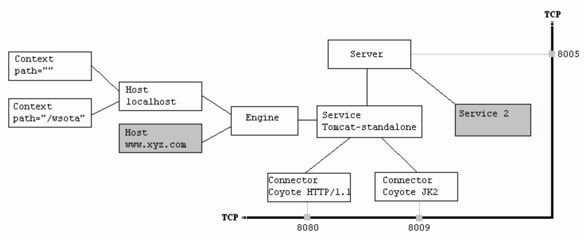
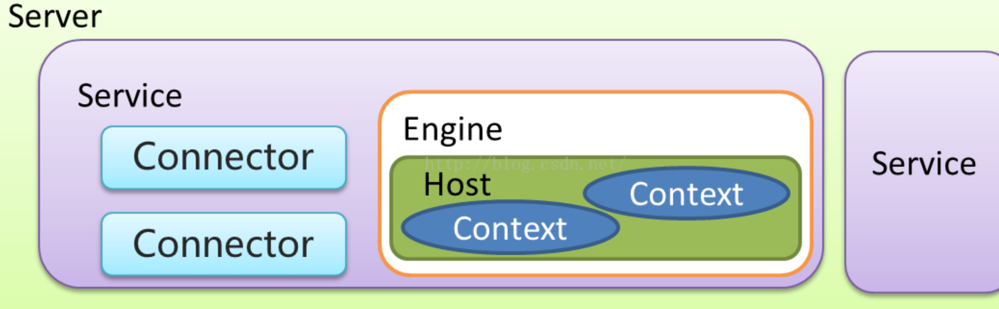
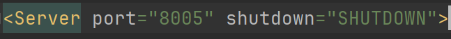
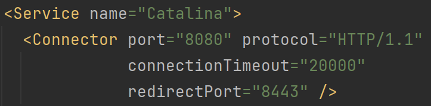
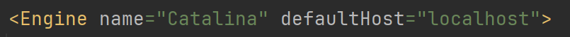

# **Tomcat 组件**

## 1.Tomcat 架构说明

Tomcat 是一个基于 JAVA 的 WEB 容器，其实现了 JAVA EE 中的 Servlet 与 jsp 规范，与 Nginx apache 服务器不同在于一般用于动态请求处理。在架构设计上采用面向组件的方式设计。即整体功能是通过组件的方式拼装完成。另外每个组件都可以被替换以保证灵活性。



## 2.**Tomcat 各组件及关系**

- Server 和 Service

- Connector 连接器

  -  HTTP 1.1

  -  SSL https

  - AJP（ Apache JServ Protocol） apache 私有协议，用于 apache 反向代理 Tomcat

- Container 

  - Engine 引擎 catalina

  - Host 虚拟机 基于域名 分发请求

  - Context 隔离各个 WEB 应用 每个 Context 的 ClassLoader 都是独立

- Component 

  - Manager （管理器）

  - logger （日志管理）

  - loader （载入器）

  - pipeline (管道)

  - valve （管道中的阀）

    


## 3.**Tomcat server.xml 配置详解**(由高到低)

### **server**

root 元素：server 的顶级配置 主要属性: port：执行关闭命令的端口号 shutdown：关闭命令



### **service**

服务：将多个 connector 与一个 Engine 组合成一个服务，可以配置多个服务。

### **Connector**

连接器：用于接收 指定协议下的连接 并指定给唯一的 Engine 进行处理。 主要属性：



- **protocol** ：监听的协议，默认是 http/1.1

- **port** 指定服务器端要创建的端口号

- minSpareThreads 服务器启动时创建的处理请求的线程数

- maxThreads 最大可以创建的处理请求的线程数

- enableLookups 如果为 true，则可以通过调用 request.getRemoteHost () 进行 DNS 查询来得到远程客户端的实际主机名，若为 false 则不进行 DNS 查询，而是返回其 ip 地址

- **redirectPort**  指定服务器正在处理 http 请求时收到了一个 SSL 传输请求后重定向的端口号

- acceptCount 指定当所有可以使用的处理请求的线程数都被使用时，可以放到处理队列中的请求数，超过这个数的请求将不予处理

- **connectionTimeout** ：指定超时的时间数 (以毫秒为单位)

- SSLEnabled 是否开启 sll 验证，在 **Https 访问时需要开启**。

```xml
<Connector port="8860" protocol="org.apache.coyote.http11.Http11NioProtocol"
                connectionTimeout="20000"
                redirectPort="8862"
                URIEncoding="UTF-8"
                useBodyEncodingForURI="true"
                compression="on" compressionMinSize="2048"
compressableMimeType="text/html,text/xml,text/plain,text/javascript,text/css,application/x-json,application/json,application/x-javascript"
                maxThreads="1024" minSpareThreads="200"
                acceptCount="800"
                maxConnections="10000"
                enableLookups="false"
        />
```

### **Engine**

引擎：用于处理连接的执行器，默认的引擎是 catalina。一个 service 中只能配置一个 Engine。 

主要属性：name 引擎名称 defaultHost 默认 host



### **Host**

虚拟机：基于域名匹配至指定虚拟机。类似于 nginx 当中的 server, 默认的虚拟机是 localhost. 主要属性：

-  *演示配置多个 Host* 

```xml
<Host name="www.wukong.com"  appBase="/usr/www/wukong"  unpackWARs="true" autoDeploy="true"> 
	<Valve className="org.apache.catalina.valves.AccessLogValve" directory="logs" prefix="www.wukong.com.access_log" 
			suffix=".txt" pattern="%h %l %u %t &quot;%r&quot; %s %b" /> 
</Host>
```

1. `<Host>`:  这是用于配置虚拟主机的元素。在这个示例中，主机名为"www.wukong.com"。

2. `appBase="/usr/www/wukong"`:  这指定了Web应用程序的基础目录，即Web应用程序的根目录。

3. `unpackWARs="true"`: 指定是否要自动解压WAR文件。在这个示例中，设置为"true"，表示WAR文件将被自动解压缩。

4. `autoDeploy="true"`: 指定是否要自动部署Web应用程序。设置为"true"表示Tomcat将自动检测`appBase`目录中的新应用程序，并部署它们。

5. `<Valve>`: 这是一个用于记录访问日志的阀门配置。在这个示例中，使用了`AccessLogValve`类来记录访问日志。

6. `className="org.apache.catalina.valves.AccessLogValve"`: 这指定了要使用的阀门的类名，即`AccessLogValve`，它用于记录访问日志。

7. `directory="logs"`: 这指定了日志文件的存储目录。

8. `prefix="www.wukong.com.access_log"`: 这是日志文件名的前缀。

9. `suffix=".txt"`: 这是日志文件名的后缀。

10. `pattern="%h %l %u %t "%r" %s %b"`: 这是用于定义访问日志格式的模式。在这个示例中，`%h`表示远程主机名，`%l`表示远程逻辑用户名，`%u`表示远程用户，`%t`表示访问时间，`%r`表示请求行，`%s`表示响应状态码，`%b`表示响应正文长度。

    

### **Context**

应用上下文：一个 host 下可以配置多个 Context ，每个 Context 都有其独立的 classPath。相互隔离，以免造成 ClassPath 冲突。 主要属性：

```xml
 <Context path="/testweb" docBase="testweb.war"  reloadbale="true"/>
```

- `path="/testweb"`: 这指定了Web应用程序的上下文路径，即在URL中访问应用程序时使用的路径。在这个示例中，应用程序可以通过"/testweb"路径访问。

- `docBase="testweb.war"`: 这指定了Web应用程序的WAR文件或目录的位置。在这个示例中，应用程序的WAR文件位于当前目录下的"testweb.war"文件中。

- `reloadable="true"`: 这是一个布尔属性，指示Tomcat在修改Web应用程序的类文件或资源文件时是否重新加载应用程序。如果设置为"true"，则Tomcat会在检测到更改时重新加载应用程序，否则不会重新加载。

  

### Wrapper

在Tomcat中，`<Wrapper>`是一个容器，用于配置Servlet，允许对Servlet进行更详细和特定的配置。

```xml
<Wrapper className="org.apache.catalina.servlets.DefaultServlet" 
         name="myDefault" 
         prefix="/myDefaultPrefix" 
         suffix=".txt" 
         readonly="true" />
```

在这个示例中，`<Wrapper>`配置了一个名为"myDefault"的Servlet，它的类名是`org.apache.catalina.servlets.DefaultServlet`。它还定义了一些其他属性：

- `prefix="/myDefaultPrefix"`: 这指定了Servlet的URL前缀，即在URL中访问Servlet时必须包含的部分。
- `suffix=".txt"`: 这指定了Servlet的URL后缀，即在URL中访问Servlet时必须以指定的后缀结尾。
- `readonly="true"`: 这是一个布尔属性，指示Servlet是否只读。如果设置为"true"，则Servlet只能处理GET请求


### **Valve** 

阀门：可以理解成过滤器，具体配置要基于具体的 Valve 接口的子类。以下即为一个访问日志的 Valve

```xml
 <Valve className="org.apache.catalina.valves.AccessLogValve" directory="logs"
               prefix="www.wukong.com.access_log" suffix=".txt"
               pattern="%h %l %u %t &quot;%r&quot; %s %b" />
```

- `className="org.apache.catalina.valves.AccessLogValve"`: 指定了使用的Valve类，即访问日志记录的实现类。
- `directory="logs"`: 指定了访问日志文件存放的目录，这里设置为"logs"表示存放在Tomcat的logs目录下。
- `prefix="www.wukong.com.access_log"`: 指定了访问日志文件的前缀，即文件名的一部分。
- `suffix=".txt"`: 指定了访问日志文件的后缀，即文件名的扩展名。
- `pattern="%h %l %u %t "%r" %s %b"`: 指定了访问日志的格式模式，即每行日志记录的内容格式。


## 4. **Tomcat 部署脚本编写**

### **Tomcat 启动参数说明**

​	**我们平时启动 Tomcat 过程是怎么样的？**

1. 复制 WAR 包至 Tomcat webapp 目录。

2. 执行 starut.bat 脚本启动。

3. 启动过程中 war 包会被自动解压装载。

但是我们在 Eclipse 或 idea 中启动 WEB 项目的时候 也是把 War 包复杂至 webapps 目录解压吗？

显然不是，其真正做法是在 Tomcat 程序文件之外创建了一个部署目录，在一般生产环境中也是这么做的 即：Tomcat 程序目录和部署目录分开 。 **我们只需要在启动时指定 CATALINA_HOME 与 CATALINA_BASE 参数即可实现。**

| **启动参数** | **描述说明** | |:----|:----| | JAVA_OPTS | jvm 启动参数，设置内存 编码等 -Xms100m -Xmx200m -Dfile.encoding=UTF-8 | | JAVA_HOME | 指定 jdk 目录，如果未设置从 java 环境变量当中去找。 | | CATALINA_HOME | Tomcat 程序根目录 | | CATALINA_BASE | 应用部署目录，默认为 $CATALINA_HOME | | CATALINA_OUT | 应用日志输出目录：默认 $CATALINA_BASE/log | | CATALINA_TMPDIR | 应用临时目录：默认：$CATALINA_BASE/temp |

**可以编写一个脚本 来实现自定义配置：**

```l
ln -s /home/wukong/apache-tomcat-8.5.56 apache-tomcat
```

> 这条命令执行后会在当前目录下创建一个名为"apache-tomcat"的符号链接，该链接指向"/home/wukong/apache-tomcat-8.5.56"目录。这样，在当前目录下使用"apache-tomcat"就相当于使用"/home/wukong/apache-tomcat-8.5.56"目录。

**更新 启动 脚本**

```js
#!/bin/bash 
export JAVA_OPTS="-Xms100m -Xmx200m"
export CATALINA_HOME=/home/wukong/apache-tomcat
export CATALINA_BASE="`pwd`"
 
case $1 in
        start)
        $CATALINA_HOME/bin/catalina.sh start
                echo start success!!
        ;;
        stop)
                $CATALINA_HOME/bin/catalina.sh stop
                echo stop success!!
        ;;
        restart)
        $CATALINA_HOME/bin/catalina.sh stop
                echo stop success!!
                sleep 3
        $CATALINA_HOME/bin/catalina.sh start
        echo start success!!
        ;;
        version)
        $CATALINA_HOME/bin/catalina.sh version
        ;;
        configtest)
        $CATALINA_HOME/bin/catalina.sh configtest
        ;;
        esac
exit 0
```

**docker 启动 tomcat**

```
docker run -id --name=test_tomcat -e JAVA_OPTS='-Xmx128m' -p 8888:8080 -v /usr/local/tuling-project/tomcat-test/webapps:/usr/local/tomcat/webapps -v /usr/local/tuling-project/tomcat-test/logs:/usr/local/tomcat/logs -v /usr/local/tuling-project/tomcat-test/conf:/usr/local/tomcat/conf --privileged=true tomcat:8
```

