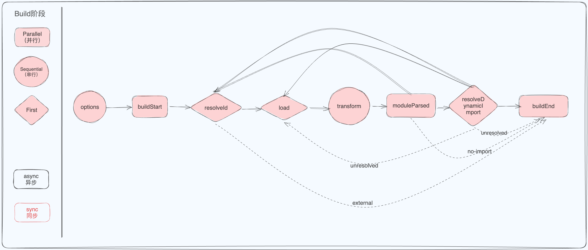
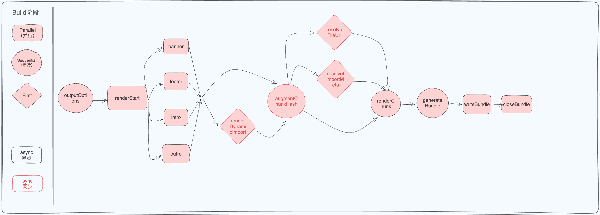

# Rollup 的插件机制

> 为什么 Rollup 设计了一套完整的插件机制？
>
> 在 Rollup 的一次构建中，会经历哪几个阶段？每个阶段的流程是什么？
>
> Rollup hooks 根据执行方式可以分为哪几类？各自有什么特点？

在学习如何开发 Vite 插件前，我们需要了解 Rollup 的插件机制。在 Vite 中，无论是**插件的设计**、**底层的打包机制**都是基于 Rollup 实现的。

Rollup 内置的打包能力不足以满足越来越多的自定义需求，对于一个大型项目来说，Rollup 需要做到的不仅仅是模块打包，还需要考虑到路径别名、代码压缩等构建需求。

所以 Rollup 设计了一套完整的插件机制，将打包核心代码和场景处理代码分离，以插件的形式，丰富了 Rollup 的可扩展性。

Rollup 的打包过程中，会定义一套完整的构建生命周期，从开始打包到产物输出，中途会经历一些**标志性的阶段**，并且在不同阶段会自动执行对应的插件钩子函数(Hook)。对 Rollup 插件来讲，最重要的部分是钩子函数，一方面它定义了插件的执行逻辑，也就是"做什么"；另一方面也声明了插件的作用阶段，即"什么时候做"，这与 Rollup 本身的构建生命周期息息相关。

因此，要真正理解插件的作用范围和阶段，首先需要了解 Rollup 整体的构建过程中到底做了些什么。

## Rollup 的整体构建阶段

在执行 `rollup` 命令之后，在 cli 内部的主要逻辑简化如下：

```js
// build
const bundle = await rollup.rollup(inputOptions);

// output
await Promise.all(outputOptions.map(bundle.write));

// 构建结束
await bundle.close();
```

- build 阶段：分析模块之间的依赖关系、初始化模块的 AST，形成模块依赖图。
- output 阶段：完成打包和输出。

根据构建阶段，hook 类型可以分为：build hook、output hook

- build hook:一般用于模块代码的解析、AST 解析、模块依赖的解析。一般操作单文件。
- output hook：一般用于代码的打包。一般操作 chunk 文件（多个模块文件打包的产物）

根据 hook 的执行方式，可分为：**async/sync**、**first**、**Parallel**、**Sequential**

- async/sync：异步/同步钩子。
- Parallel：如果有多个插件实现此钩子，则所有这些钩子将按指定的插件顺序运行。如果钩子是 `async`，则此类后续钩子将**并行**运行，而不是等待当前钩子。
- Sequential：如果有多个插件实现此钩子，则所有这些钩子将按指定的插件顺序运行。如果钩子是 `async`，则此类后续钩子将等待当前钩子解决后再运行(**串行**运行)。
- first：如果有多个插件实现此钩子，则钩子按顺序运行，直到钩子返回一个不是 `null` 或 `undefined` 的值。

### build 阶段工作流程：



- **options**：**替换/操作**传递给 `rollup.rollup` 的选项对象，生成新的"输入"配置对象。
- **buildStart**：每次构建的时候都会调用，用来获取打包的输入配置。
- **resolveId**：以配置对象中 Input 选项的路径为入口，以 external 选项来**限制**解析范围来**解析文件路径**。
- **load**：加载模块内容。
- **transform**：模块内容的自定义转义。
- **moduleParsed**：可以用于获取有关缓存和其他模块的信息。如果是普通的 import，则执行 `resolveId` 钩子；如果是动态 import，则执行 `resolveDynamicImport` 钩子解析路径，如果解析成功，则回到 load，否则回到 `resolveId` 解析路径。
- **buildEnd**：结束 build 阶段。

根据`rollup.rollup` 的选项对象，生成新的配置对象 - > 使用 buildStart hook 获取到生成的"输入"配置对象 -> 以配置对象中的入口路径来解析文件路径(此处可以自定义解析行为) ->将代码生成 AST(tree-shaking 在此处实现) -> 接着调用 transfrom 钩子实现模块内容的自定义转义 ->文件完全解析完毕后，触发 moduleParsed 钩子，会生成一个 module 对象，里面有模块信息。 ->如果 module 中还有 import，静态的 import 就返回到 resolveId 阶段，继续上述流程，动态 import 交于 resolveDynamicImport 解析路径，成功就去到 load 阶段。如果没有 import 了，build 阶段结束。

### output 阶段工作流程：



- **Outputoptions**:**替换或操作**传递给 `bundle.generate()` 或 `bundle.write()` 的输出选项对象,生成新的打包配置对象。
- **renderStart**：每次 bundle.generate 和 bundle.write 调用时都会被触发。
- **banner、footer、intro、outro**：当输出的配置中，配置了这四项时，会触发的钩子。banner 和 footer 是分别向代码的开头和结尾插入代码；intro 和 outro 是分别向包装器的内部和外部插入代码。
- **renderDynamicImport**：有使用 import 函数导入的模块，则会触发这个 hook，来自定义动态 import 的内容。
- **augmentChunkHash**：对每个即将生成的 `chunk`，执行 `augmentChunkHash`钩子，来决定是否更改 chunk 的哈希值。
- **resolveFileUrl/resolveImportMeta**：解析 import.meta 语句。
- **renderChunk**：针对每个 chunk 会依次调用插件的`renderChunk`方法进行自定义操作，也就是说，在这里时候你可以直接操作打包产物了
- **generateBundle**：钩子的入参里面会包含所有的打包产物信息，包括 `chunk` (打包后的代码)、`asset`(最终的静态资源文件)。

根据输出配置生成新的输出配置对象，renderStart 阶段拿到新的输出配置对象 -> 如果有 banner/footer/intro/outro 的配置，并发触发相应的钩子，将代码插入，会生成 chunk ->从入口模块开始扫描，针对动态 import 语句执行 `renderDynamicImport`钩子，来自定义动态 import 的内容。 ->执行 `augmentChunkHash`钩子，来决定是否更改 chunk 的哈希值， -> 如果遇到 import.meta 语句，触发 resolveFileUrl/resolveImportMeta 钩子解析 -> 如果需要操作打包产物，可以使用 renderChunk 钩子，对每个 chunk 都会执行 -> 随后会调用 `generateBundle` 钩子，这个钩子的入参里面会包含所有的打包产物信息，包括 `chunk` (打包后的代码)、`asset`(最终的静态资源文件)。可以在这里删除一些 chunk 或者 asset。
