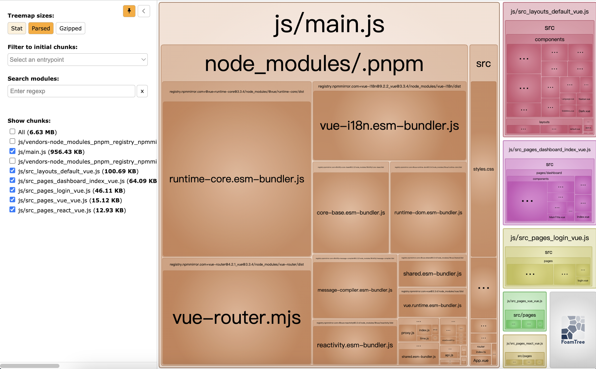

# 构建效率分析工具

## 背景

Webpack 在大型项目中的性能表现不佳，一方面是因为**JS 的单线程语言架构**，另外一方面是因为 Webpack 的构建过程中，**通常要借助大量的 loader、plugin 来完成文件读写、代码转译操作**。
作为开发者，如何借助可视化工具分析 Webpack 构建过程中的性能瓶颈，是提升构建效率的关键。

## 核心流程

- **初始化阶段：**
  - 读取配置参数，合并默认参数
  - 实例化 Compiler 对象，加载所有配置的插件
  - 执行 Compiler 对象的 run 方法开始执行编译
  - 确定入口文件
- **构建阶段：**
  - 从入口文件出发，调用所有配置的 Loader 对模块进行编译，再找出该模块依赖的模块，递归直到所有入口依赖的文件都经过了编译处理
  - 得到依赖关系图
- **输出阶段：**
  - 根据依赖关系图，组装成一个个包含多个模块的 Chunk
  - 再对上述 Chunk 进行优化（tree-shaking、terser、scope-hoisting、压缩、Code Split），确定 Chunk 的内容
  - 在确定好输出内容后，根据配置确定输出的路径和文件名，把文件内容写入到文件系统

在构建阶段中可能造成性能问题的步骤：

- 首先需要将文件的相对引用路径转变成绝对路径，这个过程可能涉及多次的 IO 操作，执行效率取决于**文件层次深度**。
- 调用 loader 对文件进行编译，这个过程可能涉及多次的 CPU 操作，执行效率取决于**Loader 的数量和复杂度**。
- 需要将模块内容转成 AST 结构，遍历 AST 找出模块的依赖资源，这个过程可能涉及多次的 CPU 操作，执行效率取决于**代码复杂度**。
- 递归处理，执行效率取决于**模块数量**。

在封装阶段可能造成性能问题的步骤：

- 根据 splitChunks 配置、entry 配置、动态模块引用语句等，确定模块与 Chunk 的映射关系，其中 splitChunks 相关的分包算法非常复杂，涉及大量 CPU 计算；
- 根据 optimization 配置执行一系列产物优化操作，特别是 Terser 插件需要执行大量 AST 相关的运算，执行效率取决于 产物代码量；

可以看出，Webpack 需要执行非常密集的 IO 与 CPU 操作，计算成本高，再加上 Webpack 以及大多数组件都使用 JavaScript 编写，无法充分利用多核 CPU 能力，所以在中大型项性能通常表现较差。

## 如何收集性能分析数据

- Webpack 内置了 stats 接口
- Webpack Analysis
- Statoscope
- Webpack Bundle Analyzer（推荐）
- .....

安装与添加插件：

```js
// bash
yarn add -D webpack-bundle-analyzer

// webpack.config.js
const BundleAnalyzerPlugin = require("webpack-bundle-analyzer")
  .BundleAnalyzerPlugin;

module.exports = {
  ...
  plugins: [new BundleAnalyzerPlugin()],
};
```

打包编译后，默认自动打开本地视图页面，可以看到各个模块的大小、依赖关系等信息。


基于 Webpack Bundle Analyzer 提供的视图，我们可以分析出：

- Bundle 包所包含的模块内容 —— 从而推断出产物中是否包含预期之外的模块；
- 确定模块体积大小与占比 —— 从而确定是否存在优化空间；
- 了解 Bundle 产物体积，以及经过压缩后的体积。
