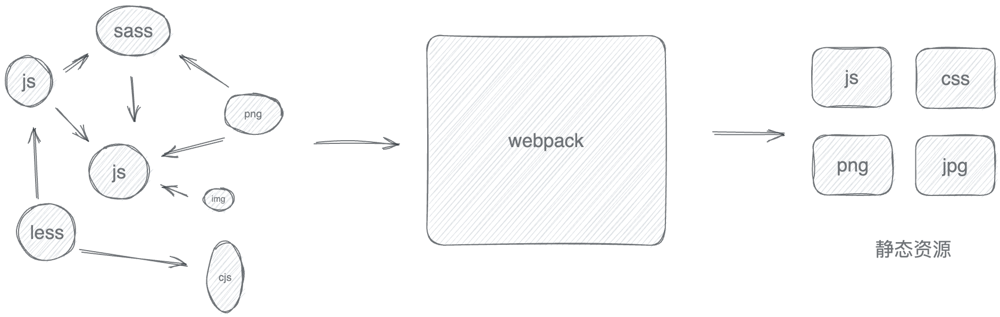
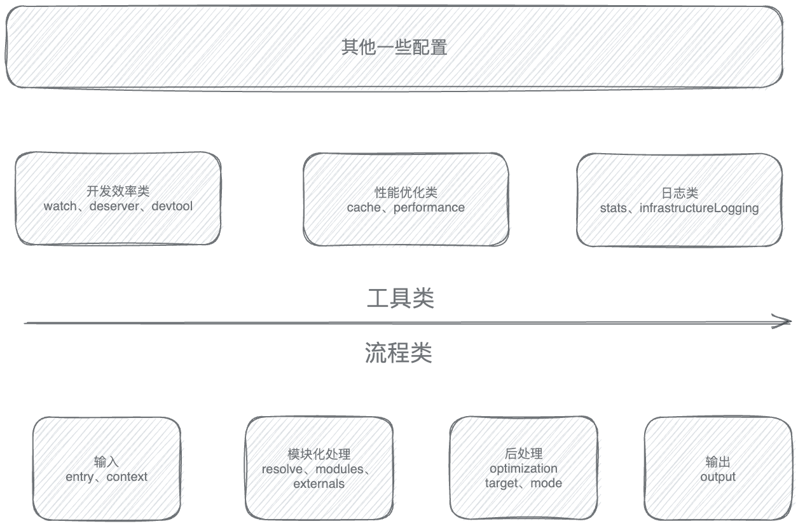

# Webpack

>Webpack 是一种用于构建 JavaScript 应用程序的静态模块打包器，它能够以一种相对一致且开放的处理方式，加载应用中的所有资源文件（图片、CSS、视频、字体文件等），并将其合并打包成浏览器兼容的 Web 资源文件。

## Webpack的必要性

在代码放在浏览器运行前，我们通常要对代码进行一些预处理。在早些阶段，`Babe`l、`Typescript`、`less`、`sass`等工具在不同程度上去弥补了`浏览器`、`语言`、`规范`本身的设计缺陷，将更多的精力放在了业务代码上。

但是我们要如何管理这些工具？**我们需要一套足够开放，融合诸多工程化的工具，彻底抹平开发与生产环境差异的一体化工程方案**——这就是`webpack`的作用。

## webpack做了什么

在webpack之前有许多模块打包器，但是都缺乏一个**能够兼容处理所有资源、普适的抽象思维框架**。——对于不同类型的资源，要用不同的特化处理逻辑，且不同类型文件之间无法信息互通。

而 Webpack 则**忽略具体资源类型之间的差异**，将所有代码/非代码文件都统一看作 Module —— 模块对象，以相同的加载、解析、依赖管理、优化、合并流程实现打包，**并借助 Loader、Plugin 两种开放接口将资源差异处理逻辑转交由社区实现**，实现**统一资源构建模型**。

再者，Webpack 极强的开放性，也让它得以成为前端工程化环境的 **基座**，我们可以围绕 Webpack 轻易接入一系列工程化工具，例如 TypeScript、CoffeScript、Babel 一类的 JavaScript 编译工具；或者 Less、Sass、Stylus、PostCSS 等 CSS 预处理器；或者 Jest、Karma 等测试框架，等等。

## 结构化理解Webpack配置项

Webpack的打包流程简化为：

- `输入`:根据配置入口读入代码文件
- `模块递归处理`：调用Loader处理Modlue内容，转换成AST，并分析模块之间的依赖关系，再递归调用模块处理过程。
- `后处理`：模块处理过程后，将模块合并、注入运行时、产物优化等处理，最终输出chunk。
- `输出`：将chunk输出到外部文件系统

基于上述流程，我们可以将webpack的配置类分成2种：**流程类和工具类**。

### 流程类

>作用于打包流程，会影响编译打包结果。

- 输出/输出阶段
  - `entry`：用于定义项目入口文件，Webpack 会从这些入口文件开始按图索骥找出所有项目文件。
  - `context`:项目执行上下文路径。
  - `output`：配置产物输出路径和文件名称。
- 模块化处理阶段：
  - `resolve`：配置解析路径规则，能够更快更好的找到解析路径。
  - `module`：用于配置模块加载规则，例如针对什么类型的资源需要使用哪些 Loader 进行处理。
  - `externals`：用于声明外部资源，Webpack 会直接忽略这部分资源，跳过这些资源的解析、打包操作

- 后处理：
  - `optimization`：用于控制如何优化产物包体积，内置 Dead Code Elimination、Scope Hoisting、代码混淆、代码压缩等功能
  - `target`：用于配置编译产物的目标运行环境，支持 web、node、electron 等值，不同值最终产物会有所差异
  - `mode`：编译模式短语，支持 `development`、`production` 等值，可以理解为一种声明环境的短语

通过这些配置项的作用，我们也能梳理出webpack的打包流程：根据entry配置的入口文件开始继续模块化处理，**接着**根据模块化处理配置进行处理文件，处理过程包括转译(生成AST语法树)、依赖分析等；最后**再根据**后处理相关配置项合并模块资源、注入运行时依赖、优化产物结构等。

### 工具类

常用的3类：

- 开发效率类

  - `watch`：用于配置持续监听文件变化，持续构建

  - `devtool`：用于配置产物 Sourcemap 生成规则

  - `devServer`：用于配置与 HMR 强相关的开发服务器功能

- 性能优化类：
  - `cache`：Webpack 5 之后，该项用于控制如何缓存编译过程信息与编译结果
  - `performance`：用于配置当产物大小超过阈值时，如何通知开发者
- 日志类：
  - `stats`：用于精确地控制编译过程的日志内容，在做比较细致的性能调试时非常有用
  - `infrastructureLogging`：用于控制日志输出方式，例如可以通过该配置将日志输出到磁盘文件
- ....

工具类配置内聚性较强，通常一个配置项专注于解决一类工程问题，学习时建议先对配置项按其功能做个简单分类，例如上述开发效率类、性能优化类等，之后再展开研究其可选值与效果。

