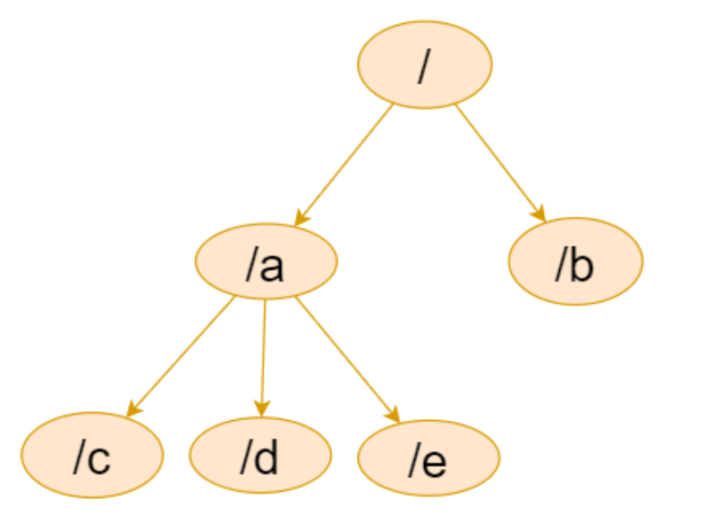
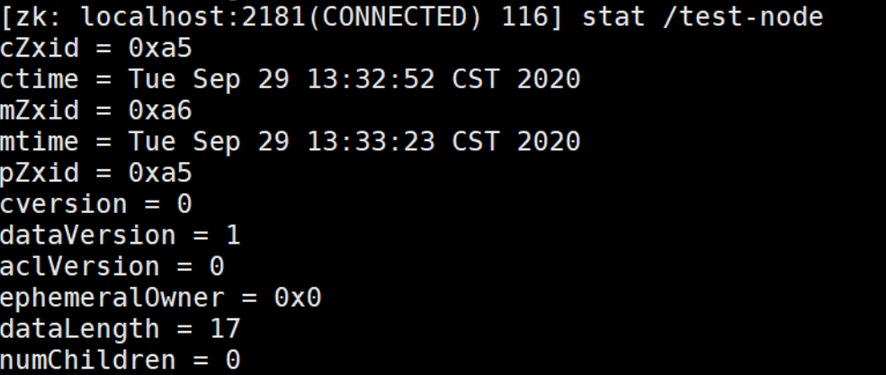
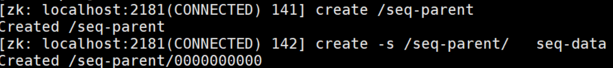
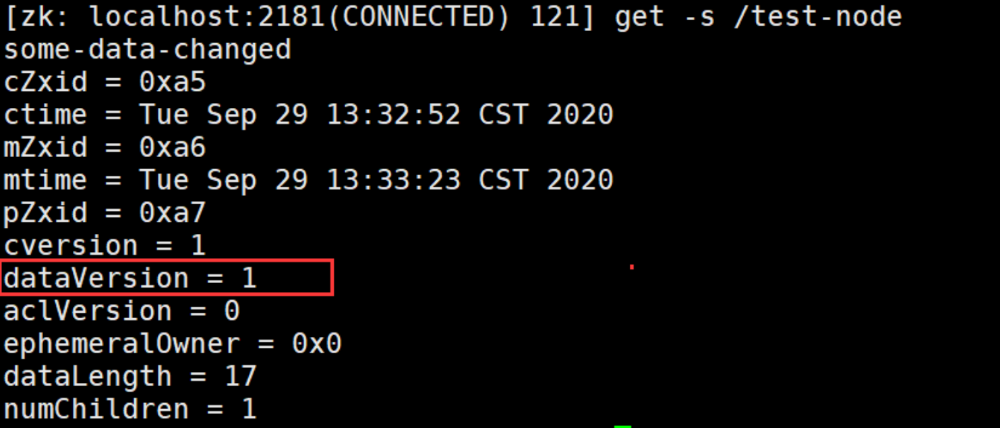
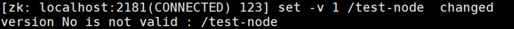
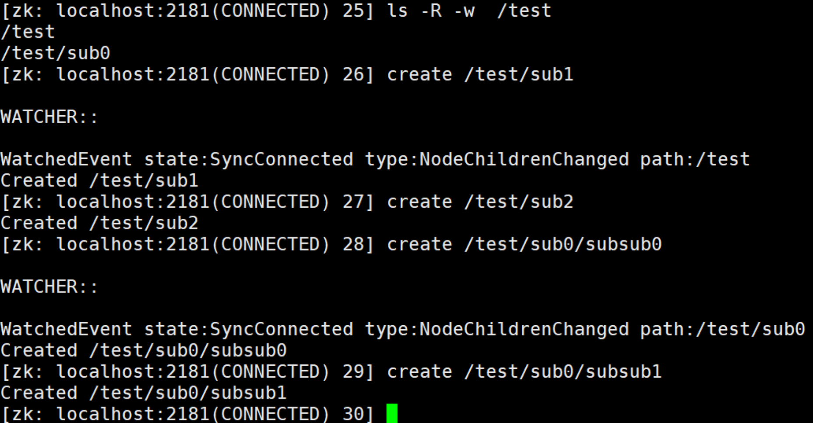
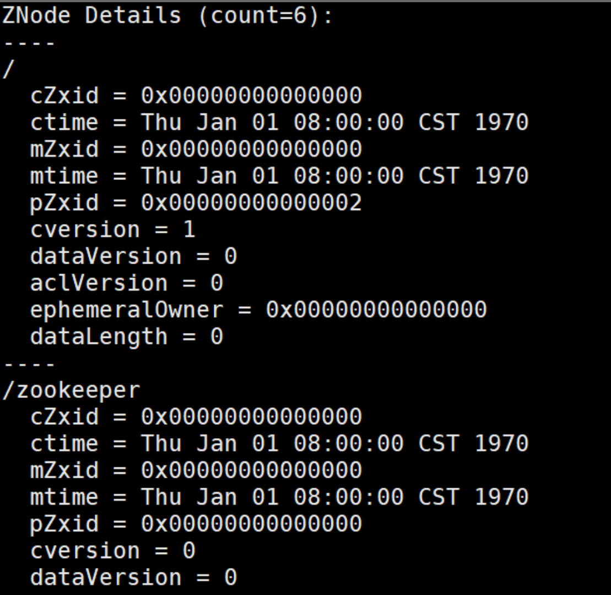

# Zookeeper特性与节点数据类型与命令行操作

## **1. 什么是 Zookeeper**

- 在了解 Zookeeper 之前，需要对分布式相关知识有一定了解，**什么是分布式系统呢**？

  通常情况下，单个物理节点很容易达到性能，计算或者容量的瓶颈，所以这个时候就需要多个物理节点来共同完成某项任务

  一个分布式系统的本质是**分布在不同网络或计算机上的程序组件，彼此通过信息传递来协同工作的系统**，而 Zookeeper 正是一个**分布式应用协调框架**，在分布式系统架构中有广泛的应用场景。

**Zookeeper**主要是用来**解决分布式应用中经常遇到的一些数据管理问题**，如：**统一命名服务、状态同步服务、集群管理、分布式应用配置项的管理**等


## **2. Zookeeper 核心概念**

可以理解为 Zookeeper 是一个用于存储少量数据的**基于内存的数据库**，主要有如下两个核心的概念：

**文件系统数据结构 + 监听通知机制。**

- **文件系统数据结构**

  Zookeeper 维护一个类似文件系统的数据结构

  

  每个子目录项都被称作为 **znode (目录节点)**。

  和文件系统类似，我们能够自由的增加、删除 znode，在一个 znode 下增加、删除子 znode。

  **有六种类型的 znode**：

  > persistent  :持久的
  >
  > sequential :顺序的
  >
  > ephemeral：短暂的

  - **PERSISTENT** - **持久化目录节点**：

    客户端与 zookeeper 断开连接后，该节点**依旧存在**，只要不手动删除该节点，他将**永远存在**

  - **PERSISTENT_SEQUENTIAL - 持久化顺序编号目录节点**

    客户端与 zookeeper 断开连接后，该节点依旧存在，只是 Zookeeper 给该节点名称额外进行**顺序编号**操作

  - **EPHEMERAL - 临时目录节点**

    客户端与 zookeeper **断开连接后，该节点被删除**

  - **EPHEMERAL_SEQUENTIAL - 临时顺序编号目录节点**

    客户端与 zookeeper 断开连接后，该节点被删除，只是 Zookeeper 给该节点名称额外进行**顺序编号**操作

  - **Container 节点**`3.5.3 版本新增`

    如果 Container 节点下面没有子节点，则 **Container 节点在未来会被 Zookeeper 自动清除**，定时任务默认 60s 检查一次

  -  TTL 节点 `3.5.3 版本新增`

    **默认禁用**，只能通过系统配置 *zookeeper.extendedTypesEnabled=true* 开启，不稳定，类似于redis的expire设置一个过期的时间段，过了ttl指定的时间会被删除。`这个时间并不精准`

   

- **监听通知机制**

  客户端**注册监听**它关心的任意节点，包括目录节点及递归子目录节点 

  - 如果注册的是对**某个节点**的监听，则**当这个节点被删除，或者被修改时**，对应的客户端将被通知

  -  如果注册的是对**某个目录**的监听，则当**这个目录有子节点被创建，或者有子节点被删除**，对应的客户端将被通知

  - 如果注册的是对**某个目录的递归子节点**进行监听，则当这个目录下面的**任意子节点有目录结构的变化**（有子节点被创建，或被删除）或者**根节点有数据变化**时，对应的客户端将被通知。

  >  注意：所有的通知都是一次性的，及无论是对节点还是对目录进行的监听，**一旦触发，对应的监听即被移除**。
  >
  > 递归子节点，监听是对所有子节点的，所以，每个子节点下面的事件同样只会被触发一次。

  

  **Zookeeper 经典的应用场景** 

  分布式**配置中心**

  分布式**注册中心**

  分布式**锁**

  分布式**队列**

  **集群选举**

  分布式**屏障**

  **发布 / 订阅**

  > 部分功能和redis类似


## **3. 使用命令行操作 zookeeper**

**输入命令 help 查看 zookeeper 所支持的所有命令：**

### 1.创建 zookeeper 节点命令

```shell
create [-s] [-e] [-c] [-t ttl] path [data] [acl]
```

中括号为可选项，没有则默认创建持久化节点

-s: 顺序节点

-e: 临时节点

-c: 容器节点

-t:  可以给节点添加过期时间，默认禁用，需要通过系统参数启用


创建节点：

```shell
create  /test-node some-data
```

**没有加任何可选参数，创建的就是持久化节点**

查看节点：

```shell
get  /test-node
```

修改节点数据：

```shell
set /test-node some-data-changed
```

查看节点状态信息：

```shell
stat /test-node 
```




创建子节点， 这里要注意，zookeeper 是以节点组织数据的，没有相对路径这么一说，所以，**所有的节点一定是以 / 开头**。

```shell
create /test-node/test-sub-node
```

 查看子节点信息，比如根节点下面的所有子节点， 加一个大写 R  可以查看递归子节点列表

```shell
ls /
ls -R /
```

 

创建临时节点

create 后跟一个 -e 创建临时节点 ， 临时节点不能创建子节点

```shell
create -e /ephemeral data 
```

创建序号节点，加参数 -s

```shell
create    /seq-parent  data // 创建父目录，单纯为了分类，非必须
create -s /seq-parent/  data // 创建顺序节点。顺序节点将再seq-parent 目录下面，顺序递增,也可以在/后加内容代表序号的前缀
```




创建临时顺序节点，其它增删查改和其他节点无异

```shell
create -s -e  /ephemeral-node/前缀-
```

创建容器节点

```shell
create -c /container
```

容器节点主要用来**容纳子节点**，如果没有给其创建子节点，**容器节点表现和持久化节点一样**，如果给容器节点创建了子节点，**后续又把子节点清空，容器节点也会被 zookeeper 删除**


### **2. Stat命令**

- cZxid：创建 znode 的事务 ID（Zxid 的值）。

- mZxid：最后修改 znode 的事务 ID。

- pZxid：最后添加或删除子节点的事务 ID（子节点列表发生变化才会发生改变）。

- ctime：znode 创建时间。

- mtime：znode 最近修改时间。

- dataVersion：znode 的**当前数据版本**。

- cversion：znode 的**子节点结果集版本**（一个节点的子节点增加、删除都会影响这个版本）。

- aclVersion：表示对此 znode 的 acl 版本。

- ephemeralOwner：znode 是临时 znode 时，表示 znode 所有者的 session ID。 如果 znode 不是临时 znode，则该字段设置为零。

- dataLength：znode 数据字段的**长度**。

- numChildren：znode 的子 znode 的**数量**。


`get -s`可以查看节点状态信息同时查看数据


- 根据状态数据中的版本号有并发修改数据实现乐观锁的功能

  比如： 客户端首先获取版本信息， get -s /node-test 

  

  /test-node 当前的数据版本是 1 ， 这时客户端 用 set 命令修改数据的时候可以把版本号带上 

  

  如果在执行上面 set 命令前， 有人修改了数据，zookeeper 会递增版本号， 这个时候，如果再用以前的版本号去修改，将会导致修改失败，报如下错误

  

  > 以此可以实现乐观锁功能


### 3. 事件监听机制实现：

针对节点的监听：一定事件触发，对应的注册立刻被移除，所以事件监听是一次性的

```shell
get  -w  /path   // 注册监听的同时获取数据
stat -w /path   // 对节点进行监听，且获取元数据信息
```

针对目录的监听，如下图，目录的变化，会触发事件，且一旦触发，对应的监听也会被移除，后续对节点的创建没有触发监听事件

```shell
ls -w /path
```

针对递归子目录的监听

```shell
ls -R -w /path ： -R 区分大小写，一定用大写 
```

如下对 /test 节点进行递归监听，但是每个目录下的目录监听也是一次性的，如第一次在 /test 目录下创建节点时，触发监听事件，第二次则没有

同样，因为时递归的目录监听，所以在 /test/sub0 下进行节点创建时，触发事件，但是再次创建 /test/sub0/subsub1 节点时，没有触发事件。

>  对目录的监听只针对节点加入删除，对数据不会监听



> Zookeeper 事件类型：
>
> ​            None: 连接建立事件
>
> ​            NodeCreated： 节点创建
>
> ​            NodeDeleted： 节点删除
>
> ​            NodeDataChanged：节点数据变化
>
> ​            NodeChildrenChanged：子节点列表变化
>
> ​            DataWatchRemoved：节点监听被移除
>
> ​            ChildWatchRemoved：子节点监听被移除

 

## **4. Zookeeper 的 ACL 权限控制**

Zookeeper 的 ACL 权限控制

Zookeeper 的 ACL 权限控制，可以控制节点的读写操作，保证数据的安全性

Zookeeper ACL 权限设置分为 3 部分组成，分别是：**权限模式**（Scheme）、**授权对象**（ID）、**权限信息**（Permission）。最终组成一条例如 “scheme:id:permission” 格式的 ACL 请求信息。下面我们具体看一下这 3 部分代表什么意思：

### **Scheme（权限模式）**：

用来设置 ZooKeeper 服务器进行权限验证的方式

ZooKeeper 的权限验证方式大体分为两种类型：

- **不验证**：任意用户进来拥有对此权限节点进行任意操作

- **范围验证**。

  所谓的范围验证就是说 ZooKeeper 可以**针对一个 IP 或者一段 IP 地址授予某种权限**。比如我们可以让一个 IP 地址为 `ip：192.168.0.110`的机器对服务器上的某个数据节点具有写入的权限。或者也可以通过 `ip:192.168.0.1/24`给一段 IP 地址的机器赋权。

- **口令验证**

  也可以理解为**用户名密码**的方式。在 ZooKeeper 中这种验证方式是 **Digest 认证**，而 Digest 这种认证方式首先在客户端传送 “username:password” 这种形式的权限表示符后，ZooKeeper 服务端会**对密码部分使用 SHA-1 和 BASE64 算法**进行加密，以保证安全性。

-  **Super 权限模式**

  Super 可以认为是一种**特殊的 Digest 认证**。**具有 Super 权限的客户端可以对 ZooKeeper 上的任意数据节点进行任意操作**


### **授权对象（ID）**

授权对象就是说我们要把权限赋予谁，而对应于 4 种不同的权限模式来说：

- 如果我们选择采用 IP 方式，使用的授权对象**可以是一个 IP 地址或 IP 地址段**

- 而如果使用 Digest 或 Super 方式，则对应于**一个用户名**。如果是 **World 模式，是授权系统中所有的用户**。


###  **权限信息（Permission）**

权限就是指我们可以在数据节点上执行的操作种类，如下所示：在 ZooKeeper 中已经定义好的权限**有 5 种：**

数据节点（c: create）**创建**权限，授予权限的对象可以在数据节点下创建子节点；

数据节点（w: wirte）**更新**权限，授予权限的对象可以更新该数据节点；

数据节点（r: read）**读取**权限，授予权限的对象可以读取该节点的内容以及子节点的列表信息；

数据节点（d: delete）**删除**权限，授予权限的对象可以删除该数据节点的子节点；

数据节点（a: admin）**管理者**权限，授予权限的对象可以对该数据节点体进行 ACL 权限设置。


### **命令**：

- getAcl：获取某个节点的 acl 权限信息

- setAcl：设置某个节点的 acl 权限信息

- addauth: 输入认证授权信息，相当于注册用户信息，注册时输入明文密码，zk 将以密文的形式存储 

> 可以通过系统参数 zookeeper.skipACL=yes 进行配置，默认是 no, 可以配置为 true, 则配置过的 ACL 将不再进行权限检测
>
> 如果你忘记密码了，使用这个跳过 acl
>
> 然后：直接对相应 ACL 控制路径：setAcl //*  world:anyone:cdrwa


### 在 xshell 中生成授权 ID

```shell
echo -n <user>:<password> | openssl dgst -binary -sha1 | openssl base64
```

这个命令将用户名和密码组合经过 SHA-1 散列计算并进行 Base64 编码

`假设这里返回  X/NSthOB0fD/OT6iilJ55WJVado=`

> - `echo -n <user>:<password>`：这个命令会输出用户名和密码的组合，中间用冒号分隔，但是不会在结尾添加换行符。这个命令会将用户名和密码连接成一个字符串，并在不换行的情况下输出。
> - `openssl dgst -binary -sha1`：这个命令会将输入的字符串进行 SHA-1 散列计算，产生一个二进制的哈希值。
> - `openssl base64`：这个命令会将 SHA-1 哈希值进行 Base64 编码，将二进制数据转换为可打印的 ASCII 字符串。


### 设置 ACL 

- **节点创建的同时设置 ACL**

  create [-s] [-e] [-c]   path [data] [**acl**]

  ```shell
  create /zk-node datatest digest:chenjunlin:X/NSthOB0fD/OT6iilJ55WJVado=:cdrwa
  ```

  或者用 setAcl 设置

  ```shell
  setAcl /zk-node  digest:chenjunlin:X/NSthOB0fD/OT6iilJ55WJVado=:cdrwa
  ```

  添加授权信息后，不能直接访问，直接访问将报如下异常

  ```shell
  get /zk-node
  异常信息:
  org.apache.zookeeper.KeeperException$NoAuthException: KeeperErrorCode = NoAuth for /zk-node    
  ```

  访问前需要添加授权信息

  ```shell
  addauth digest chenjunlin:test
  
  get /zk-node
  datatest
  ```

- **auth 明文授权**

  > 使用之前需要先 addauth  digest username:password  注册用户信息，后续可以直接用明文授权

  如：

  ```shell
  addauth digest u100:p100
  create /node-1 node1data auth:u100:p100:cdwra
  //这是u100用户授权信息会被zk保存，可以认为当前的授权用户为u100
  
  get /node-1
  node1data
  ```

- **IP 授权模式：**

  ```shell
  setAcl /node-ip ip:192.168.109.128:cdwra
  create /node-ip  data  ip:192.168.109.128:cdwra
  ```

  多个指定 IP 可以通过逗号分隔， 如 setAcl /node-ip  ip:IP1:rw,ip:IP2:a

- **Super 超级管理员模式**

  这是一种特殊的 Digest 模式， 在 Super 模式下超级管理员用户可以对 Zookeeper 上的节点进行任何的操作。

  需要在启动了上通过 JVM 系统参数开启：

  ```shell
  编辑zkServer.sh  "ZOOMAIN=...""
  DigestAuthenticationProvider中定义
  -Dzookeeper.DigestAuthenticationProvider.superDigest=super:<base64encoded(SHA1(password))
  ```


##  **5.ZooKeeper 内存数据和持久化**

Zookeeper 数据的组织形式为一个**类似文件系统的数据结构，而这些数据都是存储在内存中的**

所以我们可以认为，Zookeeper 是一个**基于内存的小型数据库** 

**内存中的数据**：

```java
public class DataTree {
    private final ConcurrentHashMap<String, DataNode> nodes = new ConcurrentHashMap<String, DataNode>();
        
    private final WatchManager dataWatches = new WatchManager();
    private final WatchManager childWatches = new WatchManager();
```

DataNode 是 Zookeeper 存储节点数据的最小单位

```java
public class DataNode implements Record {
    byte data[];
    Long acl;
    public StatPersisted stat;
    private Set<String> children = null;
```


## **6.事务日志**

 针对每一次客户端的事务操作，Zookeeper 都会将他们**记录到事务日志**中

当然，Zookeeper 也会将数据变更应用到内存数据库中

我们可以在 zookeeper 的主配置文件 zoo.cfg 中配置内存中的数据持久化目录，也就是事务日志的存储路径 **dataLogDir**. 如果没有配置 dataLogDir（非必填）, **事务日志将存储到 dataDir （必填项）目录**

> zookeeper 提供了格式化工具可以进行数据查看事务日志数据  **org.apache.zookeeper.server.LogFormatter**

Zookeeper 进行事务日志文件操作的时候会频繁进行磁盘 IO 操作，事务日志的不断追加写操作会触发底层磁盘 IO 为文件开辟新的磁盘块，即磁盘 Seek

因此，为了提升磁盘 IO 的效率，Zookeeper 在创建事务日志文件的时候就进行文件空间的预分配： 即在创建文件的时候，就向操作系统申请一块大一点的磁盘块。

**这个预分配的磁盘大小可以通过系统参数 zookeeper.preAllocSize 进行配置**

>  事务日志文件名为： log.<当时最大事务 ID>，应为日志文件时顺序写入的，所以这个**最大事务 ID** 也将是**整个事务日志文件**中，**最小的事务 ID**。日志满了即进行下一次事务日志文件的创建


## 7.**数据快照**

数据快照用于记录 Zookeeper 服务器上某一时刻的全量数据，并将其写入到指定的磁盘文件中。

可以通过配置 **snapCount 配置**每间隔事务请求个数，生成快照，**数据存储在 dataDir 指定的目录中**，

可以通过如下方式进行查看快照数据

>  为了避免集群中所有机器在同一时间进行快照，实际的快照生成时机为事务数达到 [snapCount/2   + 随机数 (随机数范围为 1 ~ snapCount/2)] 个数时开始快照

```shell
java -classpath .:slf4j-api-1.7.25.jar:zookeeper-3.5.8.jar:zookeeper-jute-3.5.8.jar org.apache.zookeeper.server.SnapshotFormatter /usr/local/zookeeper/apache-zookeeper-3.5.8-bin/data-dir/version-2/snapshot.0
```



快照事务日志文件名为： **snapshot.<当时最大事务 ID>**，日志满了即进行下一次事务日志文件的创建

- 有了事务日志，为啥还要快照数据？

  快照数据主要是为了**快速恢复**。

  事务日志文件是每次事务请求都会进行**追加的操作**，而快照是达到某种设定条件下的**内存全量数据**。

  所以通常**快照数据是反应当时内存数据的状态**。事务日志是更全面的数据

  所以恢复数据的时候，可以先通过快照恢复数据，再通过恢复事务日志中的增量数据即可。

  `先根据快照恢复，再根据日志增量恢复一部分`

