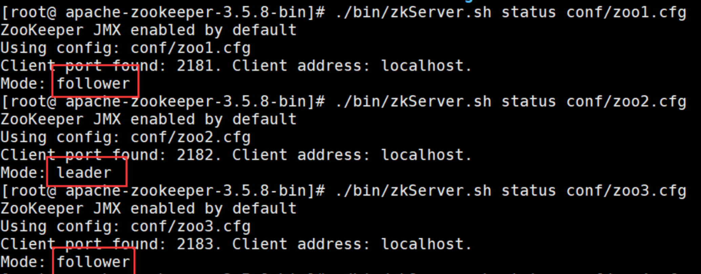
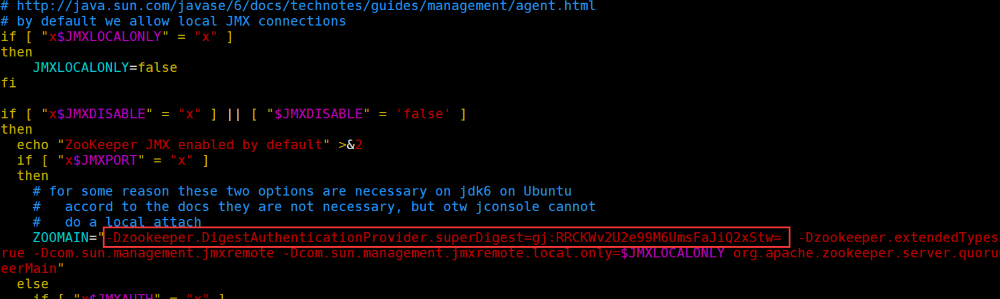
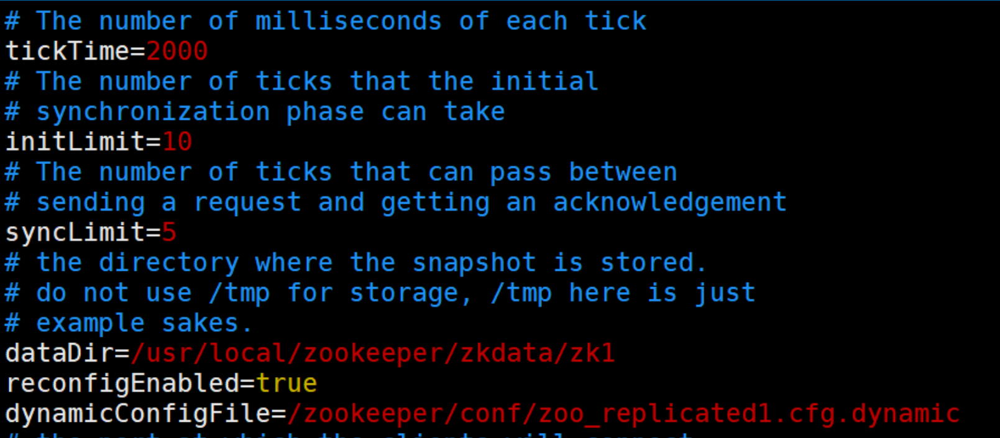

# **Zookeeper 集群模式**

Zookeeper 集群模式一共有三种类型的角色

- **Leader**:   处理所有的事务请求（写请求），可以处理读请求，集群中只能有一个 Leader

- **Follower**：只能处理读请求，同时作为 Leader 的候选节点，即如果 Leader 宕机，Follower 节点要参与到新的 Leader 选举中，有可能成为新的 Leader 节点。

- **Observer**：只能处理读请求。不能参与选举 

和redis主从优点类似，但是多了个observeer作为只读节点。写请求都会被转发到master上，然后根据过半机制，当超过半数节点写成功，这个数据才真正被写到内存


## **Zookeeper 集群模式安装**

本例搭建的是伪集群模式，即一台机器上启动四个 zookeeper 实例组成集群，真正的集群模式无非就是实例 IP 地址不同，搭建方法没有区别

**Step1：**配置 JAVA 环境，检验环境：保证是 jdk7 及以上即可

```shell
java -version
```

**Step2：**下载并解压 zookeeper 

```shell
wget https://mirror.bit.edu.cn/apache/zookeeper/zookeeper-3.5.8/apache-zookeeper-3.5.8-bin.tar.gz
tar -zxvf apache-zookeeper-3.5.8-bin.tar.gz
cd  apache-zookeeper-3.5.8-bin
```

**Step3：**重命名 zoo_sample.cfg 文件 为zoo-1.cfg

```shell
 cp conf/zoo_sample.cfg conf/zoo-1.cfg
```

**Step4：**修改配置文件 zoo-1.cfg，原配置文件里有的，修改成下面的值，没有的则加上

```ini
# vim conf/zoo-1.cfg
dataDir=/usr/local/data/zookeeper-1
clientPort=2181
server.1=127.0.0.1:2001:3001:participant// participant 可以不用写，默认就是participant
server.2=127.0.0.1:2002:3002:participant
server.3=127.0.0.1:2003:3003:participant
server.4=127.0.0.1:2004:3004:observer
```

**配置说明** 

- **tickTime：**用于配置 Zookeeper 中最小时间单位的长度，很多运行时的时间间隔都是使用 tickTime 的倍数来表示的。

- initLimit：该参数用于配置 Leader 服务器等待 Follower 启动，并完成数据同步的时间。Follower 服务器再启动过程中，会与 Leader 建立连接并完成数据的同步，从而确定自己对外提供服务的起始状态。Leader 服务器允许 Follower 再 initLimit 时间内完成这个工作。

- **syncLimit：**Leader 与 Follower 心跳检测的最大延时时间

- **dataDir：**顾名思义就是 Zookeeper 保存数据的目录，默认情况下，Zookeeper 将写数据的日志文件也保存在这个目录里。

- **clientPort：**这个端口就是客户端连接 Zookeeper 服务器的端口，Zookeeper 会监听这个端口，接受客户端的访问请求。

- **server.A=B：C：D：E** ：其中 A 是一个数字，表示这个是第几号服务器；B 是这个服务器的 ip 地址；C 表示的是这个服务器与集群中的 Leader 服务器交换信息的端口；D 表示的是万一集群中的 Leader 服务器挂了，需要一个端口来重新进行选举，选出一个新的 Leader，而这个端口就是用来执行选举时服务器相互通信的端口。如果是伪集群的配置方式，由于 B 都是一样，所以不同的 Zookeeper 实例通信端口号不能一样，所以要给它们分配不同的端口号。如果需要通过添加不参与集群选举以及事务请求的过半机制的 Observer 节点，可以在 E 的位置，添加 observer 标识。

**Step4：**再从 zoo-1.cfg 复制三个配置文件 zoo-2.cfg，zoo-3.cfg 和 zoo-4.cfg，只需修改 dataDir 和 clientPort 不同即可

```ini
cp conf/zoo1.cfg conf/zoo2.cfg
cp conf/zoo1.cfg conf/zoo3.cfg
cp conf/zoo1.cfg conf/zoo4.cfg
 
vim conf/zoo2.cfg
dataDir=/usr/local/data/zookeeper2
clientPort=2182
vim conf/zoo3.cfg
dataDir=/usr/local/data/zookeeper3
clientPort=2183
vim conf/zoo4.cfg
dataDir=/usr/local/data/zookeeper4
clientPort=2184
```

**Step5：**标识 Server ID

创建四个文件夹 /usr/local/data/zookeeper-1，/usr/local/data/zookeeper-2，/usr/local/data/zookeeper-3，/usr/local/data/zookeeper-4，在每个目录中创建文件 myid 文件，写入当前实例的 server id，即 1，2，3，4 

```sh
 cd /usr/local/data/zookeeper-1
 vim myid
 1 
 cd /usr/local/data/zookeeper-2
 vim myid
 2 
 cd /usr/local/data/zookeeper-3
 vim myid
 3 
cd /usr/local/data/zookeeper-4
vim myid
4
```

**Step6：**启动三个 zookeeper 实例

```shell
bin/zkServer.sh start conf/zoo1.cfg
bin/zkServer.sh start conf/zoo2.cfg
bin/zkServer.sh start conf/zoo3.cfg
```

**Step7：**检测集群状态，也可以直接用命令 zkServer.sh   status conf/zoo1.cfg  进行每台服务的状态查询，可以通过 查看 /zookeeper/config  节点数据来查看集群配置



```sh
bin/zkCli.sh -server ip1:port1,ip2:port2,ip3:port3 
```


##  **集群动态配置**

Zookeeper 3.5.0 以前，Zookeeper 集群角色要发生改变的话，只能通过停掉所有的 Zookeeper 服务，修改集群配置，重启服务来完成，这样集群服务将有一段不可用的状态，为了应对高可用需求，Zookeeper 3.5.0 提供了支持动态扩容 / 缩容的 新特性。

但是通过客户端 API 可以变更服务端集群状态是件很危险的事情，所以在 zookeeper **3.5.3** 版本要用动态配置，需要开启超级管理员身份验证模式 **ACLs**。如果是在一个安全的环境也可以通过配置 系统参数 **-Dzookeeper.skipACL=yes** 来避免配置维护 acl 权限配置。

**1. 按照第一章内容，先配置一个超级管理员**（如果不配管理员，也可以设置系统参数 -Dzookeeper.skipACL=yes）：如：

在 zookeeper 启动脚本中添加 超级管理员授权模式：

```sh
echo -n gj:123 | openssl dgst -binary -sha1 | openssl base64 
// RRCKWv2U2e99M6UmsFaJiQ2xStw=
 
-Dzookeeper.DigestAuthenticationProvider.superDigest=gj:RRCKWv2U2e99M6UmsFaJiQ2xStw=
```




**2.配置动态文件**

修改配置 zoo1.cfg 

注意这里去除了端口号，添加了

**reconfigEnabled  :  设置为 true 开启动态配置**

**dynamicConfigFile   : 指定动态配置文件的路径**




**3.创建文件 zoo_replicated1.cfg.dynamic**

动态配置文件，加入集群信息

**server.A=B.C.D.E:F**

**A: 服务的唯一标识**

**B: 服务对应的 IP 地址，**

**C: 集群通信端口**

**D: 集群选举端口**

**E: 角色， 默认是 participant, 即参与过半机制的角色，选举，事务请求过半提交，还有一个是 observer, 观察者，不参与选举以及过半机制。**

**F: 服务 IP: 端口**

```ini
server.1=192.168.109.200:2001:3001:participant;192.168.109.200:2181
server.2=192.168.109.200:2002:3002:participant;192.168.109.200:2182
server.3=192.168.109.200:2003:3003:participant;192.168.109.200:2183
```

依次配置其他服务 zoo2.cfg ,zoo3.cfg 注意数据文件的路径

```shell
#依次启动所有服务
如： ./bin/zkServer.sh  start   conf/zoo1.cfg  
查看集群状态:./bin/zkServer.sh  status  conf/zoo1.cfg    
```


**4.连上任意一台服务器：**

```
 查看集群配置
 config  // 将会把动态配置打印出来
 也可以直接查看目录
 /zookeeper/config 
 该节点存储了集群信息
 
 如果要修改集群状态，需要授权登录
 addauth digest gj:123  
 
 reconfig -remove 3  // 移除serverId为 3 的机器
 // 把对应的机器加进来
 reconfig -add server.3=192.168.109.200:2003:3003:participant;192.168.109.200:2183
```

如果要变更 / 或者添加新的服务需要将服务加到配置文件 zoo_replicated1.cfg.dynamic 中，启动服务

然后通过 r**econfig 命令进行添加或者变更服务角色，但是需要保证服务列表中 participant 角色能够形成集群（过半机制）**。


客户端可以通过监听 /zookeeper/confg 节点，来感知集群的变化。从而实现集群的动态变更

Zookeeper 类提供了对应的 API 用来更新服务列表 ： updateServerList

```java
 Watcher watcher = new Watcher() {
    @Override
    public void process(WatchedEvent event) {
                 if (event.getType() == Event.EventType.None
                         && event.getState() == Event.KeeperState.SyncConnected){
                           countDownLatch.countDown();
                           log.info(" 连接建立");
                           // start to watch config
                     try {
                         log.info(" 开始监听：{}",ZooDefs.CONFIG_NODE);
                         zookeeper.getConfig(true,null);
                     } catch (KeeperException e) {
                         e.printStackTrace();
                     } catch (InterruptedException e) {
                         e.printStackTrace();
                     }
                 }else if( event.getPath()!=null  &&  event.getPath().equals(ZooDefs.CONFIG_NODE)){
                     try {
                         byte[] config = zookeeper.getConfig(this, null);
                         String clientConfigStr = ConfigUtils.getClientConfigStr(new String(config));
                         log.info(" 配置发生变更: {}",clientConfigStr);
                         zookeeper.updateServerList(clientConfigStr.split(" ")[1]);
                     } catch (KeeperException e) {
                         e.printStackTrace();
                     } catch (InterruptedException e) {
                         e.printStackTrace();
                     } catch (IOException e) {
                         e.printStackTrace();
                     }
 
                 }
    }
};
```

 Curator 也自带了动态配置的监听，不需要额外的配置和代码实现监听更新；

