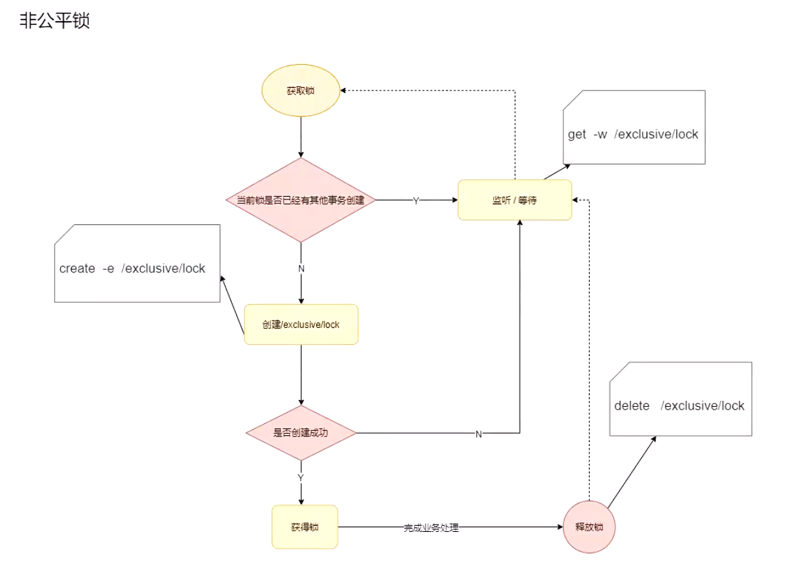
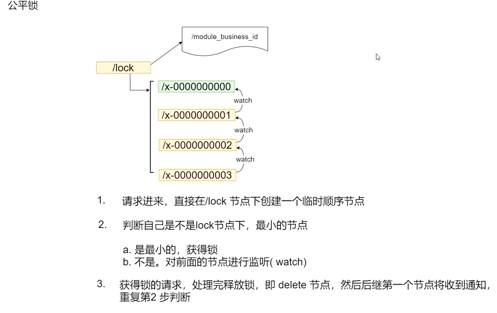
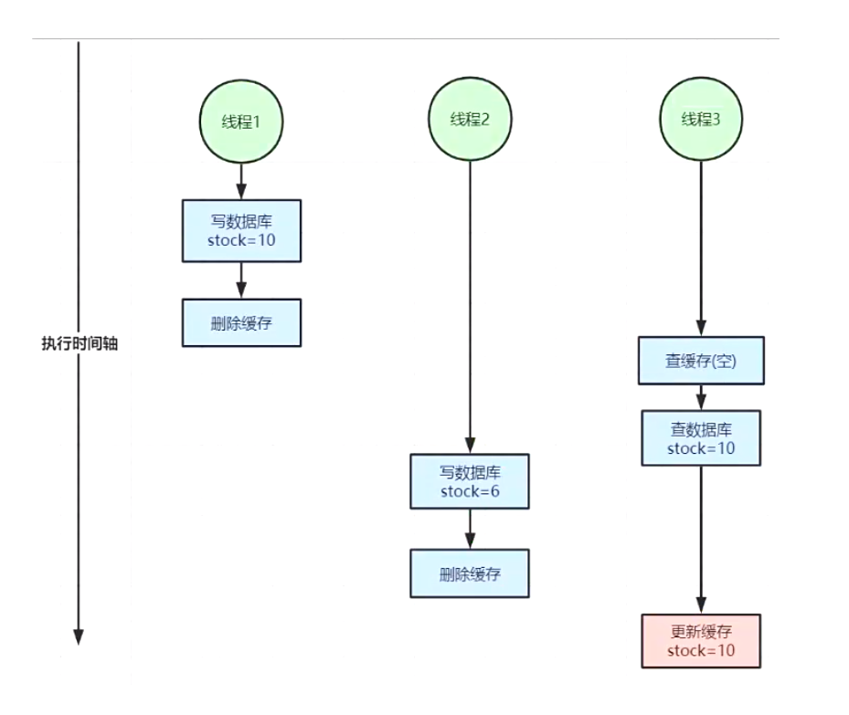
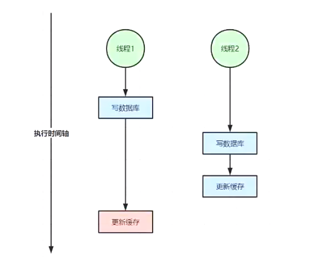
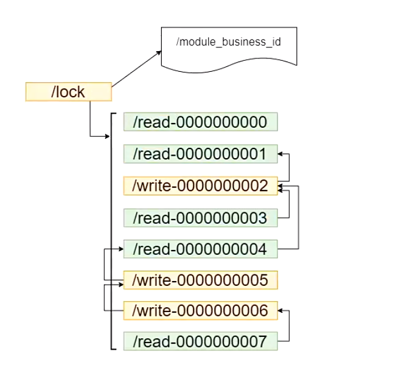
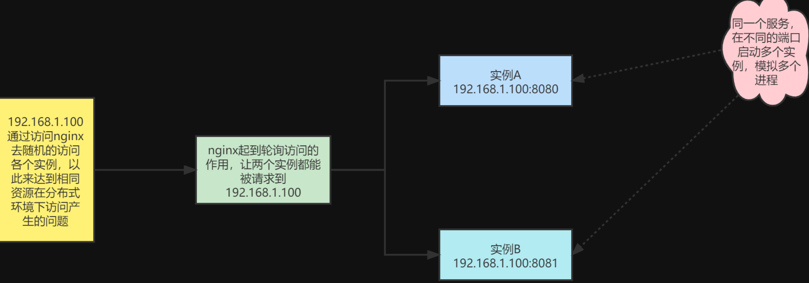

# **Zookeeper 分布式锁实战**

## 互斥锁

### 非公平锁



如上实现方式**在并发问题比较严重的情况下，性能会下降的比较厉害**，主要原因是，**所有的连接 都在对同一个节点进行监听，当服务器检测到删除事件时，要通知所有的连接，所有的连接同时 收到事件，再次并发竞争，这就是羊群效应**。

这种加锁方式是非公平锁的具体实现：如何避免呢，我们看下面这种方式。

### 公平锁



如上**借助于临时顺序节点，可以避免同时多个节点的并发竞争锁，缓解了服务端压力**。这种实 现方式所有加锁请求都进行排队加锁，是公平锁的具体实现


## 读写锁

前面这两种加锁方式有一个共同的特质，就是都是**互斥锁**，**同一时间只能有一个请求占用**。

如果 是大量的并发上来，性能是会急剧下降的，所有的请求都得加锁，那是不是真的所有的请求都需要加锁呢？

答案是否定的，比如如果数据没有进行任何修改的话，是不需要加锁的，但是如果读数据的请求还没读完，这个时候来了一个写请求，怎么办呢？有人已经在读数据了，这个时候是不能写数据的，不然数据就不正确了。**直到前面读锁全部释放掉以后，写请求才能执行，所以需要给这个读请求加一个标识（读锁），让写请求知道，这个时候是不能修改数据的**，不然数据就 不一致了。

如果已经有人在写数据了，再来一个请求写数据，也是不允许的，这样也会导致数据的不一致，**所以所有的写请求，都需要加一个写锁，是为了避免同时对共享数据进行写操作**。

### 读写锁引起的问题

- 读写并发不一致

  

- 双写不一致情况

  

### 读写锁的原理



- read 请求，如果前面的节点都是读锁，直接获取锁，如果read请求前面有写请求则该读请求不能获得锁，即需要对前面的写节点进行监听，如果是多个写请求，则对最后的写请求进行监听
- write 请求，只需要对前面的节点进行监听和互斥锁处理机制一样


## 分布式锁使用案例



### **不加锁场景**

**创建了和 ZooKeeper 服务器连接的 Curator 客户端**

```java
@Configuration
public class CuratorCfg {
    @Bean(initMethod = "start")
    public CuratorFramework curatorFramework(){
        RetryPolicy retryPolicy = new ExponentialBackoffRetry(1000, 3);
        CuratorFramework client = CuratorFrameworkFactory.newClient("192.168.1.104:2181", retryPolicy);
        return client;
    }
}
```

**Controller 类**

```java
@RestController
public class TestController {


    @Autowired
    private OrderService orderService;

    @Value("${server.port}")
    private String port;
    @Autowired
    CuratorFramework curatorFramework;

    @PostMapping("/stock/deduct")
    public Object reduceStock(Integer id) throws Exception {
        try {
            //减少库存方法
            orderService.reduceStock(id);
        } catch (Exception e) {
            if (e instanceof RuntimeException) {
                throw e;
            }
        } 
        return "ok:" + port;
    }
}
```

**Service 类**

```java
@Service
public class OrderService {

    @Autowired
    private ProductMapper productMapper;

    @Autowired
    private OrderMapper orderMapper;

    @Transactional
     public void reduceStock(Integer id){
        // 1.获取库存
        Product product = productMapper.getProduct(id);
        // 模拟其他耗时业务处理
        sleep(500); 
        if (product.getStock() <=0 ) {
            throw new RuntimeException("out of stock");
        }
        // 2. 减库存
        int i = productMapper.deductStock(id);
        if (i==1){
            Order order = new Order();
            order.setUserId(UUID.randomUUID().toString());
            order.setPid(id);
            //订单相关操作
            orderMapper.insert(order);
        }else{
            throw new RuntimeException("deduct stock fail, retry.");
        }

    }

    /**
     * 模拟耗时业务处理
     * @param wait
     */
   public void sleep(long  wait){
       try {
           TimeUnit.MILLISECONDS.sleep( wait );
       } catch (InterruptedException e) {
           e.printStackTrace();
       }
   }
}
```

**productMapper获取商品和更新库存方法**

```java
public interface ProductMapper {

    @Select(" select * from product where id=#{id}  ")
    Product getProduct(@Param("id") Integer id);

    @Update(" update product set stock=stock-1    where id=#{id}  ")
    int deductStock(@Param("id") Integer id);
}
```

**此时在并发量大的情况下，可能所有请求都会被通过，导致库存变成负数！**


### 加锁场景

- `InterProcessMutex interProcessMutex = new InterProcessMutex(curatorFramework, "/product_" + id);`

  创建了一个 `InterProcessMutex` 对象（互斥锁），用于实现分布式互斥锁。构造函数接收两个参数：

  - `curatorFramework`：指定使用的 CuratorFramework 实例，用于连接 ZooKeeper 服务器。
  - `"/product_" + id`：指定锁定的节点路径。在这里，锁定的节点路径是根据商品ID动态生成的，每个商品对应一个独立的锁。这样可以确保不同商品之间的并发操作不会相互影响。

```java
@RestController
public class TestController {

    @Autowired
    private OrderService orderService;

    @Value("${server.port}")
    private String port;

    @Autowired
    CuratorFramework curatorFramework;

    @PostMapping("/stock/deduct")
    public Object reduceStock(Integer id) throws Exception {
        InterProcessMutex interProcessMutex = new InterProcessMutex(curatorFramework, "/product_" + id);
        try {
            // ...
            interProcessMutex.acquire();
            orderService.reduceStock(id);
        } catch (Exception e) {
            if (e instanceof RuntimeException) {
                throw e;
            }
        } finally {
            interProcessMutex.release();
        }
        return "ok:" + port;
    }
}
```

使用interProcessMutex互斥锁后，不会出现并发问题


