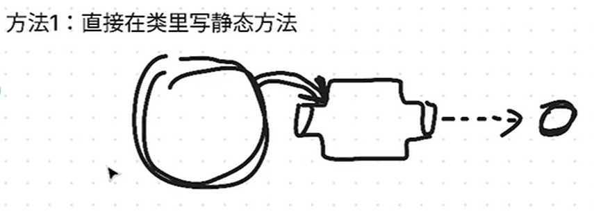
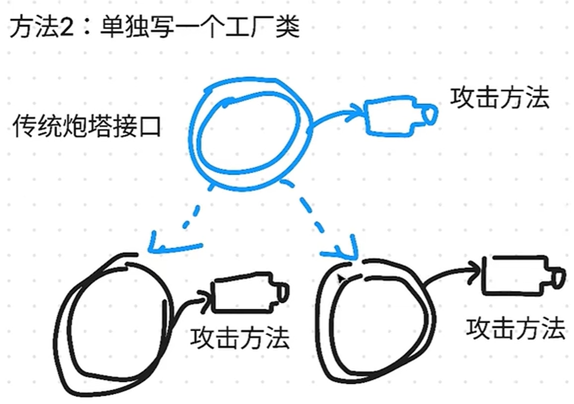
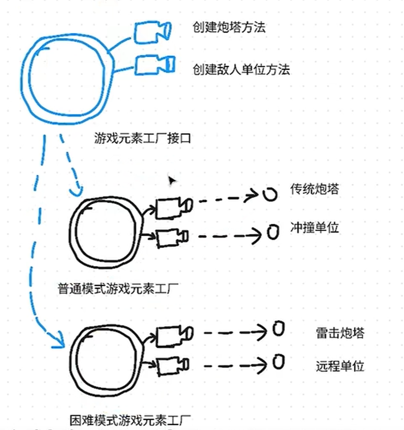

# 23种设计模式`手写代码`

**分三大类：**

**创建型：如何获取对象 1——5**

**结构型：对象与对象的结构关系**  6——12

**行为型模式： 对象的行为用途** 13 ——23


## 1.工厂模式

什么是工厂模式？在类里写一个静态方法，或者是专门写一个工厂类，都算工厂模式

**这种方法通常用于简单的对象创建，而不需要复杂的对象初始化逻辑**



每次调用时不用使用构造函数写一堆的方法，直接使用getInstance()就可以调用



以下是一个使用静态方法实现的简单工厂模式示例。

我们将实现一个工厂类 `ShapeFactory`，用于创建不同类型的形状对象 (`Circle` 和 `Square`)。

首先，我们定义一个 `Shape` 接口，以及实现该接口的具体类 `Circle` 和 `Square`：

```java
// Shape.java
public interface Shape {
    void draw();
}


// Circle.java
public class Circle implements Shape {
    @Override
    public void draw() {
        System.out.println("Drawing a Circle");
    }
}


// Square.java
public class Square implements Shape {
    @Override
    public void draw() {
        System.out.println("Drawing a Square");
    }
}
```

接下来，我们创建一个工厂类 `ShapeFactory`，该类包含一个静态方法 `getShape`，根据传入的参数返回不同的形状对象：

```java
// ShapeFactory.java
public class ShapeFactory {

    // 静态方法，直接返回指定类型的Shape对象
    public static Shape getShape(String shapeType) {
        if (shapeType == null) {
            return null;
        }
        if (shapeType.equalsIgnoreCase("CIRCLE")) {
            return new Circle();
        } else if (shapeType.equalsIgnoreCase("SQUARE")) {
            return new Square();
        }
        return null;
    }
}
```


## 2.抽象工厂模式

能分出分不同的工厂，产生不同的产品组合，不同的工厂可以写不同的逻辑



下面是一个使用抽象工厂模式的示例，我们将实现一个工厂来创建不同种类的形状和颜色对象。

首先，我们定义两个接口：`Shape` 和 `Color`，以及它们的具体实现类。

### 定义 Shape 接口及其实现类

```java
// Shape.java
public interface Shape {
    void draw();
}

// Circle.java
public class Circle implements Shape {
    @Override
    public void draw() {
        System.out.println("Drawing a Circle");
    }
}

// Square.java
public class Square implements Shape {
    @Override
    public void draw() {
        System.out.println("Drawing a Square");
    }
}

// Rectangle.java
public class Rectangle implements Shape {
    @Override
    public void draw() {
        System.out.println("Drawing a Rectangle");
    }
```

### 定义 Color 接口及其实现类

```java
// Color.java
public interface Color {
    void fill();
}

// Red.java
public class Red implements Color {
    @Override
    public void fill() {
        System.out.println("Filling with Red color");
    }
}

// Green.java
public class Green implements Color {
    @Override
    public void fill() {
        System.out.println("Filling with Green color");
    }
}

// Blue.java
public class Blue implements Color {
    @Override
    public void fill() {
        System.out.println("Filling with Blue color");
    }
```

### 定义抽象工厂和具体工厂类

我们定义一个抽象工厂 `AbstractFactory`，包含用于创建 `Shape` 和 `Color` 对象的方法，并实现两个具体工厂类 `ShapeFactory` 和 `ColorFactory`。

```java
// AbstractFactory.java
public abstract class AbstractFactory {
    abstract Shape getShape(String shapeType);
    abstract Color getColor(String colorType);
}

// ShapeFactory.java
public class ShapeFactory extends AbstractFactory {
    @Override
    public Shape getShape(String shapeType) {
        if (shapeType == null) {
            return null;
        }
        if (shapeType.equalsIgnoreCase("CIRCLE")) {
            return new Circle();
        } else if (shapeType.equalsIgnoreCase("SQUARE")) {
            return new Square();
        } else if (shapeType.equalsIgnoreCase("RECTANGLE")) {
            return new Rectangle();
        }
        return null;
    }

    @Override
    public Color getColor(String colorType) {
        return null; // ShapeFactory doesn't handle Color
    }
}

// ColorFactory.java
public class ColorFactory extends AbstractFactory {

    @Override
    public Shape getShape(String shapeType) {
        return null; // ColorFactory doesn't handle Shape
    }

    @Override
    public Color getColor(String colorType) {
        if (colorType == null) {
            return null;
        }
        if (colorType.equalsIgnoreCase("RED")) {
            return new Red();
        } else if (colorType.equalsIgnoreCase("GREEN")) {
            return new Green();
        } else if (colorType.equalsIgnoreCase("BLUE")) {
            return new Blue();
        }
        return null;
    }
}
```

### 创建工厂生成器/提供类

我们还需要一个工厂生成器类，用于返回具体的工厂类实例。

```java
// FactoryProducer.java
public class FactoryProducer {
    public static AbstractFactory getFactory(String choice) {
        if (choice.equalsIgnoreCase("SHAPE")) {
            return new ShapeFactory();
        } else if (choice.equalsIgnoreCase("COLOR")) {
            return new ColorFactory();
        }
        return null;
    }
}
```

### 客户端代码

最后，编写客户端代码，使用抽象工厂模式创建对象。

```java
// AbstractFactoryPatternDemo.java
public class AbstractFactoryPatternDemo {
    public static void main(String[] args) {
        // 获取 Shape 工厂
        AbstractFactory shapeFactory = FactoryProducer.getFactory("SHAPE");

        // 获取 Shape 对象并调用其 draw 方法
        Shape shape1 = shapeFactory.getShape("CIRCLE");
        shape1.draw();

        Shape shape2 = shapeFactory.getShape("RECTANGLE");
        shape2.draw();

        Shape shape3 = shapeFactory.getShape("SQUARE");
        shape3.draw();

        // 获取 Color 工厂
        AbstractFactory colorFactory = FactoryProducer.getFactory("COLOR");

        // 获取 Color 对象并调用其 fill 方法
        Color color1 = colorFactory.getColor("RED");
        color1.fill();

        Color color2 = colorFactory.getColor("GREEN");
        color2.fill();

        Color color3 = colorFactory.getColor("BLUE");
        color3.fill();
    }
}
```

### 代码解释

1. **Shape 和 Color 接口**：定义了 `draw` 和 `fill` 方法，所有具体的形状和颜色类都必须实现这些方法。
2. **具体的形状和颜色类**：实现了 `Shape` 和 `Color` 接口的具体类。
3. **抽象工厂 AbstractFactory**：包含用于创建 `Shape` 和 `Color` 对象的方法。具体工厂 `ShapeFactory` 和 `ColorFactory` 实现了这些方法，但每个工厂类只处理一种类型的对象。
4. **工厂生成器 FactoryProducer**：提供一个静态方法，用于获取具体的工厂类实例。
5. **客户端代码 AbstractFactoryPatternDemo**：使用抽象工厂模式创建形状和颜色对象，并调用它们的方法。

通过使用抽象工厂模式，客户端代码与具体的类实现解耦，可以轻松地扩展和维护代码。


## 3.单例模式

单例模式是一种创建型设计模式，确保一个类只有一个实例，并提供一个全局访问点。单例模式主要用于控制实例的创建，确保只有一个共享实例被创建。

下面是一个单例模式的示例，包括线程安全的实现和双重检查锁定（Double-Checked Locking）优化。

### 饿汉式单例模式

饿汉式单例模式在类加载时就创建实例，线程安全，但可能造成资源浪费。

```java
public class EagerSingleton {
    // 在类加载时就创建实例
    private static final EagerSingleton instance = new EagerSingleton();

    // 私有化构造函数，防止外部创建实例
    private EagerSingleton() {}

    // 提供全局访问点
    public static EagerSingleton getInstance() {
        return instance;
    }

    // 示例方法
    public void showMessage() {
        System.out.println("Hello from EagerSingleton!");
    }
}
```

### 懒汉式单例模式（线程不安全）

懒汉式单例模式在需要时才创建实例，但线程不安全。

```java
public class LazySingleton {
    // 延迟加载实例
    private static LazySingleton instance;

    // 私有化构造函数，防止外部创建实例
    private LazySingleton() {}

    // 提供全局访问点，线程不安全
    public static LazySingleton getInstance() {
        if (instance == null) {
            instance = new LazySingleton();
        }
        return instance;
    }

    // 示例方法
    public void showMessage() {
        System.out.println("Hello from LazySingleton!");
    }
}
```

### 线程安全的懒汉式单例模式

使用 `synchronized` 关键字确保线程安全，但性能较低。

```java
public class SynchronizedLazySingleton {
    // 延迟加载实例
    private static SynchronizedLazySingleton instance;

    // 私有化构造函数，防止外部创建实例
    private SynchronizedLazySingleton() {}

    // 提供全局访问点，线程安全
    public static synchronized SynchronizedLazySingleton getInstance() {
        if (instance == null) {
            instance = new SynchronizedLazySingleton();
        }
        return instance;
    }

    // 示例方法
    public void showMessage() {
        System.out.println("Hello from SynchronizedLazySingleton!");
    }
}
```

### 双重检查锁定单例模式

双重检查锁定在保持线程安全的同时提高了性能。

```java
public class DoubleCheckedLockingSingleton {
    // 使用 volatile 确保变量的可见性和有序性
    private static volatile DoubleCheckedLockingSingleton instance;

    // 私有化构造函数，防止外部创建实例
    private DoubleCheckedLockingSingleton() {}

    // 提供全局访问点，线程安全且高效
	// 已经创建的话就直接获取了不需要给方法上锁
    public static DoubleCheckedLockingSingleton getInstance() {
        if (instance == null) {
            synchronized (DoubleCheckedLockingSingleton.class) {
                if (instance == null) {
                    instance = new DoubleCheckedLockingSingleton();
                }
            }
        }
        return instance;
    }

    // 示例方法
    public void showMessage() {
        System.out.println("Hello from DoubleCheckedLockingSingleton!");
    }
}
```

### 静态内部类单例模式

利用类加载机制实现懒加载，线程安全且高效。

```java
public class StaticInnerClassSingleton {
    // 私有化构造函数，防止外部创建实例
    private StaticInnerClassSingleton() {}

    // 静态内部类，持有单例实例
    private static class SingletonHelper {
        private static final StaticInnerClassSingleton INSTANCE = new StaticInnerClassSingleton();
    }

    // 提供全局访问点
    public static StaticInnerClassSingleton getInstance() {
        return SingletonHelper.INSTANCE;
    }

    // 示例方法
    public void showMessage() {
        System.out.println("Hello from StaticInnerClassSingleton!");
    }
}
```

### 枚举单例模式

利用枚举实现单例模式，线程安全且防止反序列化创建新实例。

```java
public enum EnumSingleton {
    INSTANCE;

    // 示例方法
    public void showMessage() {
        System.out.println("Hello from EnumSingleton!");
    }
}
```

### 使用示例

```java
java复制代码public class SingletonDemo {
    public static void main(String[] args) {
        // 使用饿汉式单例
        EagerSingleton eagerInstance = EagerSingleton.getInstance();
        eagerInstance.showMessage();

        // 使用懒汉式单例
        LazySingleton lazyInstance = LazySingleton.getInstance();
        lazyInstance.showMessage();

        // 使用线程安全的懒汉式单例
        SynchronizedLazySingleton synchronizedLazyInstance = SynchronizedLazySingleton.getInstance();
        synchronizedLazyInstance.showMessage();

        // 使用双重检查锁定单例
        DoubleCheckedLockingSingleton doubleCheckedInstance = DoubleCheckedLockingSingleton.getInstance();
        doubleCheckedInstance.showMessage();

        // 使用静态内部类单例
        StaticInnerClassSingleton staticInnerClassInstance = StaticInnerClassSingleton.getInstance();
        staticInnerClassInstance.showMessage();

        // 使用枚举单例
        EnumSingleton enumInstance = EnumSingleton.INSTANCE;
        enumInstance.showMessage();
    }
}
```


## 4.原型模式

原型模式是一种创建型设计模式，它允许复制现有对象而无需使代码依赖它们所属的类。原型模式的核心是提供一个克隆方法，通常实现 `Cloneable` 接口或定义一个自定义的克隆方法。

下面是一个简单的原型模式的示例，通过克隆现有对象来创建新对象。


### 定义原型接口

首先，定义一个包含克隆方法的接口或抽象类：

```java
public interface Prototype extends Cloneable {
    Prototype clone();
}
```

### 实现具体原型类

实现具体的原型类并提供克隆方法：

```java
public class ConcretePrototype implements Prototype {
    private String name;
    private int age;

    public ConcretePrototype(String name, int age) {
        this.name = name;
        this.age = age;
    }

    // 实现 clone 方法
    @Override
    public ConcretePrototype clone() {
        try {
            // 浅拷贝
            return (ConcretePrototype) super.clone();
        } catch (CloneNotSupportedException e) {
            // 如果不支持克隆，则抛出运行时异常
            throw new RuntimeException(e);
        }
    }
}
```

### 使用原型模式

使用原型模式创建对象：

```java
public class PrototypeDemo {
    public static void main(String[] args) {
        // 创建一个原型实例
        ConcretePrototype original = new ConcretePrototype("John Doe", 30);
        System.out.println("Original: " + original);

        // 通过克隆方法创建一个新实例
        ConcretePrototype clone = original.clone();
        System.out.println("Clone: " + clone);

        // 修改克隆对象的属性，不影响原型对象
        clone.setName("Jane Doe");
        clone.setAge(25);
        System.out.println("Modified Clone: " + clone);
        System.out.println("Original after clone modification: " + original);
    }
}
```


## 5.构造器模式

构造器模式（Builder Pattern）是一种创建型设计模式，它允许通过逐步构建复杂对象的方式来创建对象，而不需要直接调用构造器。构造器模式可以将一个复杂对象的构建过程与其表示分离，使得同样的构建过程可以创建不同的表示

下面是一个使用构造器模式创建复杂对象的示例。我们将创建一个 `House` 类，并通过 `HouseBuilder` 来逐步构建这个对象。

### `House` 类

```java
public class House {
    private String foundation;
    private String structure;
    private String roof;
    private String interior;

    private House() {}

    public static class HouseBuilder {
        private String foundation;
        private String structure;
        private String roof;
        private String interior;

        //通过不断的return this 来达到链式调用
        public HouseBuilder setFoundation(String foundation) {
            this.foundation = foundation;
            return this;
        }

        public HouseBuilder setStructure(String structure) {
            this.structure = structure;
            return this;
        }

        public HouseBuilder setRoof(String roof) {
            this.roof = roof;
            return this;
        }

        public HouseBuilder setInterior(String interior) {
            this.interior = interior;
            return this;
        }

        public House build() {
            House house = new House();
            house.foundation = this.foundation;
            house.structure = this.structure;
            house.roof = this.roof;
            house.interior = this.interior;
            return house;
        }
    }
}
```

### 使用构造器模式创建 `House` 对象

```java
public class BuilderPatternDemo {
    public static void main(String[] args) {
        House house = new House.HouseBuilder()
                .setFoundation("Concrete, brick, and stone")
                .setStructure("Wood and brick")
                .setRoof("Shingles")
                .setInterior("Drywall and paint")
                .build();

        System.out.println(house);
    }
}
```


## 6.适配器模式

适配器模式（Adapter Pattern）是一种结构型设计模式，它允许将一个类的接口转换成客户端期望的另一个接口，使得原本由于接口不兼容而不能一起工作的类可以协同工作。适配器模式有两种主要的实现方式：类适配器和对象适配器

### 对象适配器模式示例

下面是一个对象适配器模式的示例，演示如何使用适配器模式使得不同接口的类可以一起工作。假设我们有一个现有的音频播放器系统，它可以播放 MP3 文件，但我们希望它能够播放 MP4 和 VLC 格式的文件。

**定义播放器接口和具体播放器类**

首先，定义一个播放器接口 `MediaPlayer` 和一个高级媒体播放器接口 `AdvancedMediaPlayer`，并实现它们。

```java
// 播放器接口
public interface MediaPlayer {
    void play(String audioType, String fileName);
}

// 高级媒体播放器接口
public interface AdvancedMediaPlayer {
    void playVlc(String fileName);
    void playMp4(String fileName);
}
```

实现

```java
// 具体的 MP4 播放器
public class Mp4Player implements AdvancedMediaPlayer {
    @Override
    public void playVlc(String fileName) {
        // 什么也不做
    }

    @Override
    public void playMp4(String fileName) {
        System.out.println("Playing mp4 file. Name: " + fileName);
    }
}

// 具体的 VLC 播放器
public class VlcPlayer implements AdvancedMediaPlayer {
    @Override
    public void playVlc(String fileName) {
        System.out.println("Playing vlc file. Name: " + fileName);
    }

    @Override
    public void playMp4(String fileName) {
        // 什么也不做
    }
}
```

**创建适配器类**

接下来，创建一个适配器类 `MediaAdapter`，它实现 `MediaPlayer` 接口，并能够播放 MP4 和 VLC 格式的文件。

```java
public class MediaAdapter implements MediaPlayer {

    AdvancedMediaPlayer advancedMusicPlayer;

    public MediaAdapter(String audioType) {
        if (audioType.equalsIgnoreCase("vlc")) {
            advancedMusicPlayer = new VlcPlayer();
        } else if (audioType.equalsIgnoreCase("mp4")) {
            advancedMusicPlayer = new Mp4Player();
        }
    }

    @Override
    public void play(String audioType, String fileName) {
        if (audioType.equalsIgnoreCase("vlc")) {
            advancedMusicPlayer.playVlc(fileName);
        } else if (audioType.equalsIgnoreCase("mp4")) {
            advancedMusicPlayer.playMp4(fileName);
        }
    }
}
```

**创建使用适配器的音频播放器**

最后，创建一个实现 `MediaPlayer` 接口的 `AudioPlayer` 类，它可以使用适配器来播放不同格式的文件。

```java
public class AudioPlayer implements MediaPlayer {
    MediaAdapter mediaAdapter;

    @Override
    public void play(String audioType, String fileName) {
        // 内置支持 mp3 播放
        if (audioType.equalsIgnoreCase("mp3")) {
            System.out.println("Playing mp3 file. Name: " + fileName);
        }
        // mediaAdapter 提供对 vlc 和 mp4 文件的支持
        // 相当于这个AudioPlayer类里有一个对MediaAdapter的引用
        else if (audioType.equalsIgnoreCase("vlc") || audioType.equalsIgnoreCase("mp4")) {
            mediaAdapter = new MediaAdapter(audioType);
            mediaAdapter.play(audioType, fileName);
        } else {
            System.out.println("Invalid media. " + audioType + " format not supported");
        }
    }
}
```

**使用适配器模式**

下面是如何使用 `AudioPlayer` 类来播放不同格式的音频文件的示例。

```java
public class AdapterPatternDemo {
    public static void main(String[] args) {
        AudioPlayer audioPlayer = new AudioPlayer();

        audioPlayer.play("mp3", "song.mp3");
        audioPlayer.play("mp4", "video.mp4");
        audioPlayer.play("vlc", "movie.vlc");
        audioPlayer.play("avi", "my_movie.avi");
    }
}
```

### 详细解释

1. **MediaPlayer 接口**：这是一个播放器接口，定义了 `play` 方法。
2. **AdvancedMediaPlayer 接口**：这是一个高级媒体播放器接口，定义了播放 VLC 和 MP4 文件的方法。
3. **Mp4Player 和 VlcPlayer 类**：这些是具体的高级媒体播放器类，实现了 `AdvancedMediaPlayer` 接口，可以分别播放 MP4 和 VLC 文件。
4. **MediaAdapter 类**：这是适配器类，实现了 `MediaPlayer` 接口，并使用 `AdvancedMediaPlayer` 对象来播放不同格式的文件。
5. **AudioPlayer 类**：这是一个实现 `MediaPlayer` 接口的类，它内置支持 MP3 文件，并通过适配器支持 VLC 和 MP4 文件。
6. **AdapterPatternDemo 类**：这是一个演示如何使用 `AudioPlayer` 类来播放不同格式文件的示例程序。


## 7.桥接模式

桥接模式（Bridge Pattern）是一种结构型设计模式，它通过将抽象部分与实现部分分离，使它们可以独立地变化。桥接模式使用组合而不是继承，使得两个维度的变化能够独立进行。桥接模式的典型应用场景是处理具有多个维度变化的复杂系统。

下面是一个桥接模式的示例，演示如何使用该模式来设计一个形状和颜色组合的系统

### 定义颜色接口和具体实现类

首先，定义一个颜色接口 `Color` 以及几个具体的颜色实现类。

```java
// 颜色接口
public interface Color {
    void applyColor();
}

// 具体的红色实现类
public class Red implements Color {
    @Override
    public void applyColor() {
        System.out.println("Red color");
    }
}

// 具体的绿色实现类
public class Green implements Color {
    @Override
    public void applyColor() {
        System.out.println("Green color");
    }
}

// 具体的蓝色实现类
public class Blue implements Color {
    @Override
    public void applyColor() {
        System.out.println("Blue color");
    }
}
```

### 定义形状抽象类和具体实现类

接下来，定义一个形状抽象类 `Shape`，并在该类中组合颜色接口。然后，定义具体的形状类，如 `Circle` 和 `Square`。

```java
// 形状抽象类
public abstract class Shape {
    protected Color color;

    public Shape(Color color) {
        this.color = color;
    }

    public abstract void draw();
}

// 具体的圆形实现类
public class Circle extends Shape {
    public Circle(Color color) {
        super(color);
    }

    @Override
    public void draw() {
        System.out.print("Circle drawn with color ");
        color.applyColor();
    }
}

// 具体的正方形实现类
public class Square extends Shape {
    public Square(Color color) {
        super(color);
    }

    @Override
    public void draw() {
        System.out.print("Square drawn with color ");
        color.applyColor();
    }
}
```

### 使用桥接模式

下面是如何使用桥接模式的示例。

```java
public class BridgePatternDemo {
    public static void main(String[] args) {
        Shape redCircle = new Circle(new Red());
        Shape greenSquare = new Square(new Green());
        Shape blueCircle = new Circle(new Blue());

        redCircle.draw();
        greenSquare.draw();
        blueCircle.draw();
    }
}
```

通过使用桥接模式，我们可以轻松地扩展形状和颜色，而无需修改现有的代码。新添加的形状或颜色可以独立进行扩展，从而提高了系统的灵活性和可维护性。


## 8.组合模式

组合模式（Composite Pattern）是一种结构型设计模式，它使你能够**将对象组合成树形结构来表示“部分-整体”的层次结构**。组合模式使得用户对单个对象和组合对象的使用具有一致性。

下面是一个组合模式的示例，演示如何使用该模式来设计一个包含各种文件和文件夹的系统。

### 定义组件接口

首先，定义一个组件接口 `FileSystemComponent`，它包含文件和文件夹的通用操作。

```java
// 文件系统组件接口
public interface FileSystemComponent {
    void showDetails();
}
```

### 定义叶子节点类（文件）

接下来，定义叶子节点类 `File`，它表示文件系统中的文件。

```java
// 文件类
public class File implements FileSystemComponent {
    private String name;

    public File(String name) {
        this.name = name;
    }

    @Override
    public void showDetails() {
        System.out.println("File: " + name);
    }
}
```

### 定义复合节点类（文件夹）

然后，定义复合节点类 `Folder`，它可以包含文件或其他文件夹。

```java
// 文件夹类
public class Folder implements FileSystemComponent {
    private String name;
    private List<FileSystemComponent> components = new ArrayList<>();

    public Folder(String name) {
        this.name = name;
    }

    public void addComponent(FileSystemComponent component) {
        components.add(component);
    }

    public void removeComponent(FileSystemComponent component) {
        components.remove(component);
    }

    @Override
    public void showDetails() {
        System.out.println("Folder: " + name);
        for (FileSystemComponent component : components) {
            component.showDetails();
        }
    }
}
```

### 使用组合模式

下面是如何使用组合模式的示例。

```java
public class CompositePatternDemo {
    public static void main(String[] args) {
        // 创建文件
        File file1 = new File("file1.txt");
        File file2 = new File("file2.txt");
        File file3 = new File("file3.txt");

        // 创建文件夹
        Folder folder1 = new Folder("folder1");
        Folder folder2 = new Folder("folder2");
        Folder folder3 = new Folder("folder3");

        // 组合文件和文件夹
        folder1.addComponent(file1);
        folder1.addComponent(file2);

        folder2.addComponent(file3);

        folder3.addComponent(folder1);
        folder3.addComponent(folder2);

        // 显示文件系统结构
        folder3.showDetails();
    }
}
```


## 9.装饰器模式

装饰器模式（Decorator Pattern）是一种结构型设计模式

它允许向一个现有的对象添加新的功能，同时又不改变其结构。装饰器模式是通过创建一个装饰类来包装原类，并在保持类方法签名完整性的前提下，提供额外的功能。

以下是一个简单的装饰器模式示例，展示如何在不改变对象结构的情况下动态地给对象添加功能。

### 定义组件接口

首先，定义一个组件接口 `Coffee`，它将被装饰。

```java
// 咖啡接口
public interface Coffee {
    double cost(); // 计算费用
    String description(); // 获取描述
}
```

### 定义具体组件类

然后，定义一个具体组件类 `SimpleCoffee`，实现 `Coffee` 接口。

```java
// 简单咖啡类
public class SimpleCoffee implements Coffee {
    @Override
    public double cost() {
        return 5.0; // 基本咖啡的费用
    }

    @Override
    public String description() {
        return "Simple Coffee"; // 基本咖啡的描述
    }
}
```

### 定义装饰器抽象类

接下来，定义一个装饰器抽象类 `CoffeeDecorator`，实现 `Coffee` 接口，并包含一个 `Coffee` 对象的引用。

```java
// 咖啡装饰器抽象类
public abstract class CoffeeDecorator implements Coffee {
    protected Coffee decoratedCoffee;

    public CoffeeDecorator(Coffee coffee) {
        this.decoratedCoffee = coffee;
    }

    @Override
    public double cost() {
        return decoratedCoffee.cost();
    }

    @Override
    public String description() {
        return decoratedCoffee.description();
    }
}
```

### 定义具体装饰器类

然后，定义具体的装饰器类 `MilkDecorator` 和 `SugarDecorator`，扩展 `CoffeeDecorator` 类。

```java
// 牛奶装饰器类
public class MilkDecorator extends CoffeeDecorator {
    public MilkDecorator(Coffee coffee) {
        super(coffee);
    }

    @Override
    public double cost() {
        return super.cost() + 1.5; // 增加牛奶的费用
    }

    @Override
    public String description() {
        return super.description() + ", Milk"; // 增加牛奶的描述
    }
}

// 糖装饰器类
public class SugarDecorator extends CoffeeDecorator {
    public SugarDecorator(Coffee coffee) {
        super(coffee);
    }

    @Override
    public double cost() {
        return super.cost() + 0.5; // 增加糖的费用
    }

    @Override
    public String description() {
        return super.description() + ", Sugar"; // 增加糖的描述
    }
}
```

**通过使用装饰器模式，可以在不改变对象本身的情况下动态地添加或修改对象的行为，这种模式特别适用于需要扩展功能的系统。**


## 以上几种结构设计模式不同点总结：

**不同点**：

1. **装饰器模式**：主要用于**动态地给对象添加职责，不改变对象的接口**
2. **组合模式**：用于将对象组合成树形结构，以表示“部分-整体”的层次结构，使得客户端可以**一致地处理单个对象和组合对象**
3. **桥接模式**：**用于将抽象部分与实现部分分离，使它们可以独立地变化**。通常用于避免类层次的指数级增长。
4. **适配器模式**：用于**将一个类的接口转换成客户希望的另一个接口**，使得原本由于接口不兼容而不能一起工作的类可以一起工作。


## 10.外观模式

外观模式（Facade Pattern）是一种结构型设计模式，**提供了一个统一的接口，用来访问子系统中的一群接口**。外观模式定义了一个高层接口，使得这一子系统更加容易使用。

### 示例代码

假设我们有一个家庭影院系统，包括电视、音响、DVD播放器和灯光系统。我们可以使用外观模式来提供一个简化的接口，用于启动和关闭家庭影院。

**子系统类**

```java
class TV {
    public void on() {
        System.out.println("TV is on");
    }

    public void off() {
        System.out.println("TV is off");
    }
}

class SoundSystem {
    public void on() {
        System.out.println("Sound System is on");
    }

    public void off() {
        System.out.println("Sound System is off");
    }

    public void setVolume(int level) {
        System.out.println("Sound System volume set to " + level);
    }
}

class DVDPlayer {
    public void on() {
        System.out.println("DVD Player is on");
    }

    public void off() {
        System.out.println("DVD Player is off");
    }

    public void play(String movie) {
        System.out.println("Playing movie: " + movie);
    }
}

class Lights {
    public void dim(int level) {
        System.out.println("Lights dimmed to " + level + "%");
    }

    public void on() {
        System.out.println("Lights are on");
    }
}

```

**外观类**

```java
public class HomeTheaterFacade {
    private TV tv;
    private SoundSystem soundSystem;
    private DVDPlayer dvdPlayer;
    private Lights lights;

    public HomeTheaterFacade(TV tv, SoundSystem soundSystem, DVDPlayer dvdPlayer, Lights lights) {
        this.tv = tv;
        this.soundSystem = soundSystem;
        this.dvdPlayer = dvdPlayer;
        this.lights = lights;
    }

    public void watchMovie(String movie) {
        System.out.println("Get ready to watch a movie...");
        lights.dim(10);
        tv.on();
        soundSystem.on();
        soundSystem.setVolume(20);
        dvdPlayer.on();
        dvdPlayer.play(movie);
    }

    public void endMovie() {
        System.out.println("Shutting down the home theater...");
        lights.on();
        tv.off();
        soundSystem.off();
        dvdPlayer.off();
    }
}
```

### 客户端代码

```java
public class HomeTheaterTest {
    public static void main(String[] args) {
        TV tv = new TV();
        SoundSystem soundSystem = new SoundSystem();
        DVDPlayer dvdPlayer = new DVDPlayer();
        Lights lights = new Lights();

        HomeTheaterFacade homeTheater = new HomeTheaterFacade(tv, soundSystem, dvdPlayer, lights);
        homeTheater.watchMovie("Inception");
        homeTheater.endMovie();
    }
}
```

### 代码说明

1. **子系统类**：
   - `TV`、`SoundSystem`、`DVDPlayer`和`Lights`类是家庭影院系统的各个组件，分别有自己的开关和操作方法。
2. **外观类**：
   - `HomeTheaterFacade`类提供了一个简化的接口，**封装了所有子系统的操作**。通过`watchMovie`方法和`endMovie`方法，客户端可以方便地启动和关闭家庭影院系统，而不需要了解各个子系统的细节。
3. **客户端代码**：
   - 在`HomeTheaterTest`类中，客户端通过`HomeTheaterFacade`类来操作家庭影院系统。只需要调用`watchMovie`方法和`endMovie`方法即可实现复杂的启动和关闭操作。

### 总结

**外观模式通过提供一个统一的接口，简化了对复杂子系统的访问。它使得子系统的使用更加容易和直观，同时也隐藏了子系统的复杂性，降低了客户端代码的耦合度。**


## 11.享元模式

享元模式（Flyweight Pattern）是一种结构型设计模式，**通过共享技术来有效支持大量细粒度对象的复用**。它可以减少内存使用量，提高性能。享元模式的关键是分离对象的内在状态和外在状态，将内在状态存储在享元对象内部，而外在状态由客户端维护。

> 获取对象时查看缓存

### 示例代码

假设我们有一个绘图应用，需要绘制大量相同颜色和形状的图形。使用享元模式可以共享相同颜色和形状的图形对象，从而减少内存开销。

#### 享元接口

```java
public interface Shape {
    void draw(int x, int y);
}
```

#### 具体享元类

```java
public class Circle implements Shape {
    private String color;

    public Circle(String color) {
        this.color = color;
    }

    @Override
    public void draw(int x, int y) {
        System.out.println("Drawing a " + color + " circle at (" + x + ", " + y + ")");
    }
}
```

#### 享元工厂类

```java
public class ShapeFactory {
    private static final Map<String, Shape> circleMap = new HashMap<>();
    
    public static Shape getCircle(String color) {
        Circle circle = (Circle) circleMap.get(color);

        if (circle == null) {
            circle = new Circle(color);
            circleMap.put(color, circle);
            System.out.println("Creating a circle of color: " + color);
        }

        return circle;
    }
}
```

#### 客户端代码

```java
public class FlyweightPatternDemo {
    private static final String[] colors = {"Red", "Green", "Blue", "White", "Black"};

    public static void main(String[] args) {
        for (int i = 0; i < 20; i++) {
            // 根据随机一个颜色获取Circle
            Circle circle = (Circle) ShapeFactory.getCircle(getRandomColor());
            circle.draw(getRandomX(), getRandomY());
        }
    }

    private static String getRandomColor() {
        return colors[(int) (Math.random() * colors.length)];
    }

    private static int getRandomX() {
        return (int) (Math.random() * 100);
    }

    private static int getRandomY() {
        return (int) (Math.random() * 100);
    }
}
```

### 代码说明

1. **享元接口**：
   - `Shape`接口定义了绘图方法`draw`，它接受坐标参数`x`和`y`。
2. **具体享元类**：
   - `Circle`类实现了`Shape`接口，并包含颜色属性`color`。在构造方法中设置颜色，通过`draw`方法绘制圆形。
3. **享元工厂类**：
   - `ShapeFactory`类负责创建和管理享元对象。它包含一个哈希表`circleMap`，用于存储不同颜色的圆形对象。`getCircle`方法根据颜色获取圆形对象，如果对象不存在则创建一个新的圆形对象并存入哈希表。
4. **客户端代码**：
   - 在`FlyweightPatternDemo`类中，通过`ShapeFactory`获取圆形对象，并随机设置坐标来绘制圆形。每次绘制时，客户端只需要指定颜色和坐标，而不需要关心圆形对象的创建。

### 总结

**享元模式通过共享相同类型的细粒度对象，减少内存开销，提高性能**。它特别适用于需要大量创建相同类型对象的场景，如绘图应用中的图形对象、文本编辑器中的字符对象等。在实现享元模式时，关键在于分离内在状态和外在状态，内在状态存储在享元对象内部，而外在状态由客户端维护。


## 12.代理模式

代理模式（Proxy Pattern）是一种结构型设计模式，**提供了对象的替代品或占位符，以控制对这个对象的访问**。

代理模式可以在不改变客户端代码的前提下，控制对目标对象的访问。常见的代理模式有静态代理和动态代理。

> 静态代理：代理类在编译期间生成，**代码中手动编写代理类**。
>
> 动态代理：代理类在运行期间生成，通过**反射机制动态创建代理对象**。

### 示例代码

我们以一个银行账户操作为例，展示如何使用代理模式来控制对银行账户的访问。

#### 1. 接口定义

首先，定义一个`BankAccount`接口，包含存款和取款的方法。

```java
public interface BankAccount {
    void deposit(double amount);
    void withdraw(double amount);
    double getBalance();
}
```

#### 2. 真实对象

实现接口的真实对象`RealBankAccount`：

```java
public class RealBankAccount implements BankAccount {
    private double balance;

    //存款
    @Override
    public void deposit(double amount) {
        balance += amount;
        System.out.println("Deposited " + amount + ", new balance is " + balance);
    }

    //取款
    @Override
    public void withdraw(double amount) {
        if (amount <= balance) {
            balance -= amount;
            System.out.println("Withdrew " + amount + ", new balance is " + balance);
        } else {
            System.out.println("Insufficient balance.");
        }
    }

    @Override
    public double getBalance() {
        return balance;
    }
}
```

#### 3. 代理对象

实现同样接口的代理对象`BankAccountProxy`：

```java
public class BankAccountProxy implements BankAccount {
    private RealBankAccount realBankAccount;

    public BankAccountProxy(RealBankAccount realBankAccount) {
        this.realBankAccount = realBankAccount;
    }

    // 以下方法对原来的RealBankAccount功能进行了拓展
    @Override
    public void deposit(double amount) {
        System.out.println("Proxy: Checking access before depositing.");
        realBankAccount.deposit(amount);
    }

    @Override
    public void withdraw(double amount) {
        System.out.println("Proxy: Checking access before withdrawing.");
        realBankAccount.withdraw(amount);
    }

    @Override
    public double getBalance() {
        System.out.println("Proxy: Checking access before getting balance.");
        return realBankAccount.getBalance();
    }
}
```

#### 4. 客户端代码

使用代理对象来操作银行账户：

```java
public class ProxyPatternDemo {
    public static void main(String[] args) {
        RealBankAccount realAccount = new RealBankAccount();
        BankAccount proxyAccount = new BankAccountProxy(realAccount);

        proxyAccount.deposit(100);
        proxyAccount.withdraw(50);
        System.out.println("Current balance: " + proxyAccount.getBalance());
    }
}
```

### 代码说明

1. **接口定义**：
   - `BankAccount`接口定义了银行账户的基本操作：存款（deposit）、取款（withdraw）和获取余额（getBalance）。
2. **真实对象**：
   - `RealBankAccount`类实现了`BankAccount`接口，包含实际的存款、取款和余额操作。
3. **代理对象**：
   - `BankAccountProxy`类也实现了`BankAccount`接口，但它在调用真实对象的操作之前进行了额外的权限检查或日志记录。
4. **客户端代码**：
   - 在`ProxyPatternDemo`类中，创建了真实的银行账户对象和代理对象，并通过代理对象进行存款、取款和查询余额的操作。代理对象在执行操作前后添加了额外的日志信息。

### 总结

代理模式的主要优点是：

- **可以在不修改真实对象的情况下，增加额外的功能（如权限检查、日志记录、延迟加载等）**。
- **客户端代码无需改变，只需通过代理对象来操作**。

代理模式常用于以下场景：

- 远程代理：为一个对象在不同地址空间提供局部代表。
- 虚拟代理：根据需要创建开销很大的对象。
- 保护代理：控制对原始对象的访问。


## 13.职责链模式

职责链模式（Chain of Responsibility）是一种**行为设计模式**，使得多个对象都有机会处理请求，从而避免请求的发送者和接收者之间的耦合。这些对象连成一条链，并沿着这条链传递请求，直到有对象处理它为止。

以下是一个职责链模式的示例，模拟一个简单的客户服务系统，有不同的处理器处理不同级别的客户请求。

### 1. 抽象处理器类

```java
public abstract class RequestHandler {
    protected RequestHandler nextHandler;

    public void setNextHandler(RequestHandler nextHandler) {
        this.nextHandler = nextHandler;
    }

    public abstract void handleRequest(CustomerRequest request);
}
```

### 2. 具体处理器类

#### 2.1 初级处理器

```java
public class BasicSupportHandler extends RequestHandler {
    @Override
    public void handleRequest(CustomerRequest request) {
        if (request.getLevel() == RequestLevel.BASIC) {
            System.out.println("BasicSupportHandler: Handling request " + request.getDescription());
        } else if (nextHandler != null) {
            nextHandler.handleRequest(request);
        }
    }
}
```

#### 2.2 中级处理器

```java
public class IntermediateSupportHandler extends RequestHandler {
    @Override
    public void handleRequest(CustomerRequest request) {
        if (request.getLevel() == RequestLevel.INTERMEDIATE) {
            System.out.println("IntermediateSupportHandler: Handling request " + request.getDescription());
        } else if (nextHandler != null) {
            nextHandler.handleRequest(request);
        }
    }
}
```

#### 2.3 高级处理器

```java
public class AdvancedSupportHandler extends RequestHandler {
    @Override
    public void handleRequest(CustomerRequest request) {
        if (request.getLevel() == RequestLevel.ADVANCED) {
            System.out.println("AdvancedSupportHandler: Handling request " + request.getDescription());
        } else if (nextHandler != null) {
            nextHandler.handleRequest(request);
        }
    }
}
```

### 3. 客户请求类

```java
public class CustomerRequest {
    private String description;
    private RequestLevel level;
}
```

### 4. 请求级别枚举

```java
public enum RequestLevel {
    BASIC,
    INTERMEDIATE,
    ADVANCED
}
```

### 5. 客户端代码

```java
public class ChainOfResponsibilityDemo {
    public static void main(String[] args) {
        // 创建处理器
        RequestHandler basicHandler = new BasicSupportHandler();
        RequestHandler intermediateHandler = new IntermediateSupportHandler();
        RequestHandler advancedHandler = new AdvancedSupportHandler();

        // 设置链
        basicHandler.setNextHandler(intermediateHandler);
        intermediateHandler.setNextHandler(advancedHandler);

        // 创建请求
        CustomerRequest basicRequest = new CustomerRequest("Basic issue", RequestLevel.BASIC);
        CustomerRequest intermediateRequest = new CustomerRequest("Intermediate issue", RequestLevel.INTERMEDIATE);
        CustomerRequest advancedRequest = new CustomerRequest("Advanced issue", RequestLevel.ADVANCED);

        // 处理请求
        basicHandler.handleRequest(basicRequest);
        basicHandler.handleRequest(intermediateRequest);
        basicHandler.handleRequest(advancedRequest);
    }
}
```

### 解释

1. **RequestHandler**：抽象处理器类，定义了一个处理请求的方法 `handleRequest`，以及设置下一个处理器的方法 `setNextHandler`。
2. **BasicSupportHandler, IntermediateSupportHandler, AdvancedSupportHandler**：具体处理器类，分别处理不同级别的请求。如果当前处理器不能处理请求，则将请求传递给下一个处理器。
3. **CustomerRequest**：客户请求类，包含请求描述和请求级别。
4. **RequestLevel**：请求级别枚举，定义了请求的不同级别。
5. **ChainOfResponsibilityDemo**：客户端代码，创建处理器链并处理不同级别的请求。

在这个示例中，请求按照处理器链进行传递，直到有处理器能够处理请求。这种模式使得请求发送者和处理者解耦，增加了系统的灵活性。


## 14.命令模式

命令模式（Command Pattern）是一种行为设计模式，**将一个请求封装成一个对象，从而使您可以用不同的请求对客户端进行参数化**；对请求排队或记录请求日志，以及支持可撤销的操作。

以下是一个命令模式的示例，模拟一个简单的遥控器系统，该系统可以发出各种命令，比如打开和关闭灯、打开和关闭电视。

### 1. 命令接口

```java
public interface Command {
    void execute();
    void undo();
}
```

### 2. 具体命令类

#### 2.1 打开灯命令

```java
public class LightOnCommand implements Command {
    private Light light;

    public LightOnCommand(Light light) {
        this.light = light;
    }

    @Override
    public void execute() {
        light.on();
    }

    @Override
    public void undo() {
        light.off();
    }
}
```

#### 2.2 关闭灯命令

```java
public class LightOffCommand implements Command {
    private Light light;

    public LightOffCommand(Light light) {
        this.light = light;
    }

    @Override
    public void execute() {
        light.off();
    }

    @Override
    public void undo() {
        light.on();
    }
}
```

### 3. 接收者类

#### 3.1 灯

```java
public class Light {
    public void on() {
        System.out.println("The light is on.");
    }

    public void off() {
        System.out.println("The light is off.");
    }
}
```

#### 3.2 电视

```java
public class TV {
    public void on() {
        System.out.println("The TV is on.");
    }

    public void off() {
        System.out.println("The TV is off.");
    }
}
```

### 4. 具体命令类

#### 4.1 打开电视命令

```
public class TVOnCommand implements Command {
    private TV tv;

    public TVOnCommand(TV tv) {
        this.tv = tv;
    }

    @Override
    public void execute() {
        tv.on();
    }

    @Override
    public void undo() {
        tv.off();
    }
}
```

#### 4.2 关闭电视命令

```
public class TVOffCommand implements Command {
    private TV tv;

    public TVOffCommand(TV tv) {
        this.tv = tv;
    }

    @Override
    public void execute() {
        tv.off();
    }

    @Override
    public void undo() {
        tv.on();
    }
}
```

### 5. 调用者类

```java
public class RemoteControl {
    private Command[] onCommands;
    private Command[] offCommands;
    private Command undoCommand;

    public RemoteControl() {
        onCommands = new Command[5];
        offCommands = new Command[5];

        Command noCommand = new NoCommand();
        for (int i = 0; i < 5; i++) {
            onCommands[i] = noCommand;
            offCommands[i] = noCommand;
        }
        undoCommand = noCommand;
    }

    public void setCommand(int slot, Command onCommand, Command offCommand) {
        onCommands[slot] = onCommand;
        offCommands[slot] = offCommand;
    }

    public void onButtonWasPushed(int slot) {
        onCommands[slot].execute();
        undoCommand = onCommands[slot];
    }

    public void offButtonWasPushed(int slot) {
        offCommands[slot].execute();
        undoCommand = offCommands[slot];
    }

    public void undoButtonWasPushed() {
        undoCommand.undo();
    }
}
```

### 6. 空命令类

```
public class NoCommand implements Command {
    @Override
    public void execute() {
        // Do nothing
    }

    @Override
    public void undo() {
        // Do nothing
    }
}
```

### 7. 客户端代码

```java
public class RemoteLoader {
    public static void main(String[] args) {
        RemoteControl remoteControl = new RemoteControl();

        Light livingRoomLight = new Light();
        TV livingRoomTV = new TV();

        LightOnCommand livingRoomLightOn = new LightOnCommand(livingRoomLight);
        LightOffCommand livingRoomLightOff = new LightOffCommand(livingRoomLight);

        TVOnCommand livingRoomTVOn = new TVOnCommand(livingRoomTV);
        TVOffCommand livingRoomTVOff = new TVOffCommand(livingRoomTV);

        remoteControl.setCommand(0, livingRoomLightOn, livingRoomLightOff);
        remoteControl.setCommand(1, livingRoomTVOn, livingRoomTVOff);

        System.out.println("Testing Light Commands");
        remoteControl.onButtonWasPushed(0);
        remoteControl.offButtonWasPushed(0);
        remoteControl.undoButtonWasPushed();

        System.out.println("Testing TV Commands");
        remoteControl.onButtonWasPushed(1);
        remoteControl.offButtonWasPushed(1);
        remoteControl.undoButtonWasPushed();
    }
}
```

### 解释

1. **Command**：命令接口，定义了执行操作和撤销操作的方法。
2. **LightOnCommand, LightOffCommand, TVOnCommand, TVOffCommand**：具体命令类，实现了命令接口，并调用接收者的相关方法。
3. **Light, TV**：接收者类，具体执行命令的对象。
4. **RemoteControl**：调用者类，持有命令对象，并调用命令对象的 `execute` 和 `undo` 方法。
5. **NoCommand**：空命令类，实现命令接口，什么也不做，用于初始化命令数组。
6. **RemoteLoader**：客户端代码，设置命令并调用。

**在这个示例中，遥控器（RemoteControl）作为调用者，持有命令对象，并调用命令对象的执行和撤销方法，从而实现命令的发送和撤销。命令对象将请求封装为一个对象，并将请求传递给接收者执行。**


## 15.解释器模式

解释器模式（Interpreter Pattern）是一种行为设计模式，**用于定义语言的文法，并提供一个解释器来解释该语言中的句子**。它定义了一种方式来评估语言的句子或表达式，将其转换成另一种形式或执行某些操作。

以下是一个简单的解释器模式示例，假设我们有一个简单的表达式语言，可以对数字进行加法和减法运算。

### 1. 抽象表达式接口

```java
public interface Expression {
    int interpret();
}
```

### 2. 具体表达式类

#### 2.1 数字表达式

```java
public class NumberExpression implements Expression {
    private int number;

    public NumberExpression(int number) {
        this.number = number;
    }

    @Override
    public int interpret() {
        return number;
    }
}
```

#### 2.2 加法表达式

```java
public class AddExpression implements Expression {
    private Expression left;
    private Expression right;

    public AddExpression(Expression left, Expression right) {
        this.left = left;
        this.right = right;
    }

    @Override
    public int interpret() {
        return left.interpret() + right.interpret();
    }
}
```

#### 2.3 减法表达式

```java
public class SubtractExpression implements Expression {
    private Expression left;
    private Expression right;

    public SubtractExpression(Expression left, Expression right) {
        this.left = left;
        this.right = right;
    }

    @Override
    public int interpret() {
        return left.interpret() - right.interpret();
    }
}
```

### 3. 客户端代码

```java
public class Client {
    public static void main(String[] args) {
        // 构建表达式：(5 + 3) - 2
        Expression expression = new SubtractExpression(
            new AddExpression(new NumberExpression(5), new NumberExpression(3)),
            new NumberExpression(2)
        );

        // 解释并计算结果
        int result = expression.interpret();
        System.out.println("Result: " + result);
    }
}
```

### 解释

1. **Expression 接口**：定义了解释器的接口，包含一个 interpret 方法用于解释表达式。
2. **NumberExpression 类**：表示数字表达式，实现了 Expression 接口，并返回数字本身。
3. **AddExpression 类**：表示加法表达式，包含左右两个表达式，实现了 Expression 接口，并将左右表达式的结果相加。
4. **SubtractExpression 类**：表示减法表达式，包含左右两个表达式，实现了 Expression 接口，并将左右表达式的结果相减。
5. **Client 类**：客户端代码，构建表达式并解释，输出计算结果。

在这个示例中，我们通过使用表达式解释器来计算简单的数学表达式，如 `(5 + 3) - 2`。通过组合不同的表达式，我们可以构建复杂的语法树，并使用解释器来解释和执行这些表达式。


## 16.迭代器模式

迭代器模式（Iterator Pattern）是一种行为设计模式，**用于提供一种方法顺序访问集合中的元素，而无需暴露集合的内部表示**。它将迭代逻辑封装在一个独立的迭代器对象中，使得客户端可以在不了解集合内部结构的情况下遍历集合中的元素。

以下是迭代器模式的基本结构和示例：

### 结构

1. **迭代器（Iterator）接口**：定义了用于遍历集合的方法，包括获取下一个元素、判断是否还有下一个元素等。
2. **具体迭代器（ConcreteIterator）类**：实现了迭代器接口，负责实现具体的遍历逻辑。
3. **集合（Aggregate）接口**：定义了创建迭代器对象的方法。
4. **具体集合（ConcreteAggregate）类**：实现了集合接口，负责创建具体的迭代器对象。

### 示例

#### 1. 迭代器接口

```java
public interface Iterator<T> {
    boolean hasNext();
    T next();
}
```

#### 2. 具体迭代器类

```java
public class ConcreteIterator<T> implements Iterator<T> {
    private T[] array;
    private int currentIndex = 0;

    public ConcreteIterator(T[] array) {
        this.array = array;
    }

    @Override
    public boolean hasNext() {
        return currentIndex < array.length;
    }

    @Override
    public T next() {
        if (!hasNext()) {
            throw new NoSuchElementException();
        }
        return array[currentIndex++];
    }
}
```

#### 3. 集合接口

```java
public interface Aggregate<T> {
    Iterator<T> iterator();
}
```

#### 4. 具体集合类

```java
public class ConcreteAggregate<T> implements Aggregate<T> {
    private T[] array;

    public ConcreteAggregate(T[] array) {
        this.array = array;
    }

    @Override
    public Iterator<T> iterator() {
        return new ConcreteIterator<>(array);
    }
}
```

#### 5. 客户端代码

```java
public class Client {
    public static void main(String[] args) {
        String[] array = {"A", "B", "C", "D", "E"};
        Aggregate<String> aggregate = new ConcreteAggregate<>(array);
        Iterator<String> iterator = aggregate.iterator();

        while (iterator.hasNext()) {
            System.out.println(iterator.next());
        }
    }
}
```

### 解释

1. **Iterator 接口**：定义了用于遍历集合的方法，包括判断是否还有下一个元素和获取下一个元素。
2. **ConcreteIterator 类**：实现了迭代器接口，负责遍历具体的集合，并实现遍历逻辑。
3. **Aggregate 接口**：定义了用于创建迭代器对象的方法。
4. **ConcreteAggregate 类**：实现了集合接口，负责创建具体的迭代器对象。
5. **Client 类**：客户端代码，使用具体集合类创建集合对象，并通过迭代器遍历集合中的元素。

通过迭代器模式，客户端可以使用统一的接口遍历集合中的元素，而不需要了解集合的内部结构。这样可以提高代码的灵活性和可维护性。


## 17.观察者模式

观察者模式（Observer Pattern）是一种行为设计模式，**用于定义对象之间的一对多依赖关系，当一个对象的状态发生变化时，其所有依赖对象都会收到通知并自动更新**。这种模式通常被用于实现**分布式事件处理系统**。

以下是观察者模式的基本结构和示例：

### 结构

1. **Subject（主题）**：被观察的对象，它维护一组观察者对象，提供方法用于添加、删除和通知观察者。
2. **Observer（观察者）**：观察主题的对象，当主题状态发生变化时，会收到通知并执行相应的更新操作。

### 示例

#### 1. 主题接口

```java
public interface Subject {
    void registerObserver(Observer observer);
    void removeObserver(Observer observer);
    void notifyObservers();
}
```

#### 2. 具体主题类

```java
public class ConcreteSubject implements Subject {
    private List<Observer> observers = new ArrayList<>();
    private int state;

    public int getState() {
        return state;
    }

    public void setState(int state) {
        this.state = state;
        notifyObservers();
    }

    @Override
    public void registerObserver(Observer observer) {
        observers.add(observer);
    }

    @Override
    public void removeObserver(Observer observer) {
        observers.remove(observer);
    }
	
    // 发生变化时通知自己的观察者
    @Override
    public void notifyObservers() {
        for (Observer observer : observers) {
            observer.update(state);
        }
    }
}
```

#### 3. 观察者接口

```java
public interface Observer {
    void update(int state);
}
```

#### 4. 具体观察者类

```java
public class ConcreteObserver implements Observer {
    private int state;

    @Override
    public void update(int state) {
        this.state = state;
        System.out.println("Observer updated with state: " + state);
    }
}
```

#### 5. 客户端代码

```java
public class Client {
    public static void main(String[] args) {
        ConcreteSubject subject = new ConcreteSubject();
        ConcreteObserver observer1 = new ConcreteObserver();
        ConcreteObserver observer2 = new ConcreteObserver();

        subject.registerObserver(observer1);
        subject.registerObserver(observer2);

        subject.setState(10);
        subject.setState(20);

        subject.removeObserver(observer1);

        subject.setState(30);
    }
}
```

### 解释

1. **Subject 接口**：定义了主题的方法，包括注册、删除和通知观察者。
2. **ConcreteSubject 类**：具体的主题类，维护了一组观察者对象，并在状态发生变化时通知它们。
3. **Observer 接口**：定义了观察者的方法，包括更新操作。
4. **ConcreteObserver 类**：具体的观察者类，实现了 Observer 接口，负责接收主题的通知并执行相应的更新操作。
5. **Client 类**：客户端代码，创建具体的主题和观察者对象，并注册观察者到主题中，演示主题状态发生变化时观察者的更新操作。

通过观察者模式，主题和观察者之间解耦合，使得主题和观察者可以独立地进行变化，提高了代码的灵活性和可维护性。


## 18.中介者模式`类似MQ`

中介者模式（Mediator Pattern）是一种行为设计模式，**用于减少对象之间的直接通信，而是通过一个中介者对象来协调各个对象之间的交互**。这种模式有助于降低系统中对象之间的耦合度。

以下是中介者模式的基本结构和示例：

### 结构

1. **中介者（Mediator）接口**：定义了中介者对象的方法，用于各个同事对象之间的通信。
2. **具体中介者（Concrete Mediator）类**：实现了中介者接口，负责协调各个同事对象之间的交互关系。
3. **同事（Colleague）接口**：定义了同事对象的方法，用于与中介者对象进行通信。
4. **具体同事（Concrete Colleague）类**：实现了同事接口，通过中介者对象与其他同事对象进行通信。

### 示例

#### 1. 中介者接口

```java
public interface Mediator {
    void sendMessage(Colleague colleague, String message);
}
```

#### 2. 具体中介者类

```java
public class ConcreteMediator implements Mediator {
    private List<Colleague> colleagues = new ArrayList<>();

    public void addColleague(Colleague colleague) {
        colleagues.add(colleague);
    }

    @Override
    public void sendMessage(Colleague sender, String message) {
        for (Colleague colleague : colleagues) {
            if (colleague != sender) {
                colleague.receiveMessage(message);
            }
        }
    }
}
```

#### 3. 同事接口

```java
public interface Colleague {
    void sendMessage(String message);
    void receiveMessage(String message);
}
```

#### 4. 具体同事类

```java
public class ConcreteColleague implements Colleague {
    private Mediator mediator;

    public ConcreteColleague(Mediator mediator) {
        this.mediator = mediator;
    }

    @Override
    public void sendMessage(String message) {
        mediator.sendMessage(this, message);
    }

    @Override
    public void receiveMessage(String message) {
        System.out.println("Received message: " + message);
    }
}
```

#### 5. 客户端代码

```java
public class Client {
    public static void main(String[] args) {
        ConcreteMediator mediator = new ConcreteMediator();
        ConcreteColleague colleague1 = new ConcreteColleague(mediator);
        ConcreteColleague colleague2 = new ConcreteColleague(mediator);

        mediator.addColleague(colleague1);
        mediator.addColleague(colleague2);

        colleague1.sendMessage("Hello from colleague 1!");
        colleague2.sendMessage("Hi from colleague 2!");
    }
}
```

### 解释

1. **Mediator 接口**：定义了中介者对象的方法，用于同事对象之间的通信。
2. **ConcreteMediator 类**：具体的中介者类，实现了中介者接口，负责协调各个同事对象之间的通信关系。
3. **Colleague 接口**：定义了同事对象的方法，用于与中介者对象进行通信。
4. **ConcreteColleague 类**：具体的同事类，实现了同事接口，通过中介者对象与其他同事对象进行通信。
5. **Client 类**：客户端代码，创建具体的中介者和同事对象，将同事对象注册到中介者中，并进行通信演示。

通过中介者模式，可以将对象之间的通信集中管理，减少了对象之间的直接耦合，提高了代码的灵活性和可维护性。


## 19.策略模式

策略模式（Strategy Pattern）是一种行为设计模式，**它定义了一系列算法，将每个算法封装到具有共同接口的策略类中，使得它们可以相互替换**。这种模式可以让算法的变化独立于使用算法的客户端。

以下是策略模式的基本结构和示例：

### 结构

1. **Context（上下文）**：维持一个对策略对象的引用，提供一个接口，用于调用具体策略的算法。
2. **Strategy（策略）接口**：定义了所有支持的算法的通用接口。
3. **ConcreteStrategy（具体策略）类**：实现了策略接口，封装了具体的算法。

### 示例

#### 1. 策略接口

```java
public interface PaymentStrategy {
    void pay(int amount);
}
```

#### 2. 具体策略类

```java
// 使用信用卡支付
public class CreditCardPaymentStrategy implements PaymentStrategy {
    private String cardNumber;
    private String expiryDate;
    private String cvv;

    public CreditCardPaymentStrategy(String cardNumber, String expiryDate, String cvv) {
        this.cardNumber = cardNumber;
        this.expiryDate = expiryDate;
        this.cvv = cvv;
    }

    @Override
    public void pay(int amount) {
        System.out.println("Paying " + amount + " using credit card.");
    }
}

// 使用paypal支付
public class PayPalPaymentStrategy implements PaymentStrategy {
    private String email;
    private String password;

    public PayPalPaymentStrategy(String email, String password) {
        this.email = email;
        this.password = password;
    }

    @Override
    public void pay(int amount) {
        System.out.println("Paying " + amount + " using PayPal.");
    }
}
```

#### 3. 上下文类

```java
public class PaymentContext {
    private PaymentStrategy strategy;

    public PaymentContext(PaymentStrategy strategy) {
        this.strategy = strategy;
    }

    public void setStrategy(PaymentStrategy strategy) {
        this.strategy = strategy;
    }

    public void executePayment(int amount) {
        strategy.pay(amount);
    }
}
```

#### 4. 客户端代码

```java
public class Client {
    public static void main(String[] args) {
        PaymentContext paymentContext = new PaymentContext(new CreditCardPaymentStrategy("1234567890", "12/25", "123"));
        paymentContext.executePayment(100);

        paymentContext.setStrategy(new PayPalPaymentStrategy("example@example.com", "password"));
        paymentContext.executePayment(200);
    }
}
```

### 解释

1. **PaymentStrategy 接口**：定义了支付策略的通用接口。
2. **CreditCardPaymentStrategy 和 PayPalPaymentStrategy 类**：具体的支付策略类，实现了支付策略接口，封装了具体的支付逻辑。
3. **PaymentContext 类**：上下文类，维持一个对策略对象的引用，提供一个接口用于执行具体的支付操作。
4. **Client 类**：客户端代码，创建具体的支付策略对象并传递给上下文类，然后通过上下文类执行支付操作。

通过策略模式，**客户端可以根据需求选择不同的支付策略，而不需要修改客户端代码，实现了算法和客户端的解耦合**

> 可以用来应对海量ifelse的情况


## 20.状态模式

状态模式（State Pattern）是一种行为设计模式，**它允许对象在其内部状态改变时改变其行为**。这种模式的关键思想**是将对象的状态封装成独立的类，并将行为委托给当前状态对象**。

以下是状态模式的基本结构和示例：

### 结构

1. **Context（上下文）**：维持一个对当前状态对象的引用，可以通过该对象来触发状态的改变。
2. **State（状态）接口**：定义了所有具体状态类的通用接口。
3. **ConcreteState（具体状态）类**：实现了状态接口，封装了具体的状态行为。

### 示例

#### 1. 状态接口

```java
public interface State {
    void handleRequest();
}
```

#### 2. 具体状态类

```java
public class OpenState implements State {
    @Override
    public void handleRequest() {
        System.out.println("Door is open");
    }
}

public class ClosedState implements State {
    @Override
    public void handleRequest() {
        System.out.println("Door is closed");
    }
}

public class LockedState implements State {
    @Override
    public void handleRequest() {
        System.out.println("Door is locked");
    }
}
```

#### 3. 上下文类

```java
public class DoorContext {
    private State currentState;

    public DoorContext() {
        this.currentState = new ClosedState();
    }

    public void setState(State state) {
        this.currentState = state;
    }

    public void request() {
        currentState.handleRequest();
    }
}
```

#### 4. 客户端代码

```java
public class Client {
    public static void main(String[] args) {
        DoorContext door = new DoorContext();

        door.request(); // Output: Door is closed

        door.setState(new OpenState());
        door.request(); // Output: Door is open

        door.setState(new LockedState());
        door.request(); // Output: Door is locked
    }
}
```

### 解释

1. **State 接口**：定义了状态对象的通用接口，包含了状态对象可能会执行的行为。
2. **具体状态类**：实现了状态接口，封装了具体的状态行为。
3. **DoorContext 类**：上下文类，维持一个对当前状态对象的引用，并提供了一个用于触发状态改变的方法。
4. **Client 类**：客户端代码，创建上下文对象并根据需要设置不同的状态，然后触发状态的改变。

**通过状态模式，可以使得对象的行为在其内部状态改变时自动改变**，同时避免了使用大量的条件语句来判断状态。


## 21.备忘录模式

备忘录模式（Memento Pattern）是一种行为设计模式，**它允许在不破坏封装性的前提下捕获对象的内部状态，并在需要时将对象恢复到先前的状态**。

### 结构

1. **Originator（原发器）**：负责创建备忘录对象，用于记录当前时刻的内部状态，并可以使用备忘录对象恢复其内部状态。
2. **Memento（备忘录）**：存储了原发器对象的内部状态，可以防止原发器以外的对象访问备忘录内部的状态。
3. **Caretaker（管理者）**：负责保存备忘录对象，但不能修改备忘录的内容。主要用于保存和恢复备忘录对象。

### 示例

#### 1. 备忘录类

```java
public class Memento {
    private final String state;

    public Memento(String stateToSave) {
        state = stateToSave;
    }

    public String getSavedState() {
        return state;
    }
}
```

#### 2. 原发器类

```java
public class Originator {
    private String state;

    public void setState(String state) {
        this.state = state;
    }

    public String getState() {
        return state;
    }

    public Memento saveStateToMemento() {
        return new Memento(state);
    }

    public void getStateFromMemento(Memento memento) {
        state = memento.getSavedState();
    }
}
```

#### 3. 管理者类

```java
public class Caretaker {
    private final List<Memento> mementoList = new ArrayList<>();

    public void addMemento(Memento memento) {
        mementoList.add(memento);
    }

    public Memento getMemento(int index) {
        return mementoList.get(index);
    }
}
```

#### 4. 客户端代码

```java
public class Client {
    public static void main(String[] args) {
        Originator originator = new Originator();
        Caretaker caretaker = new Caretaker();

        originator.setState("State 1");
        originator.setState("State 2");
        caretaker.addMemento(originator.saveStateToMemento());

        originator.setState("State 3");
        caretaker.addMemento(originator.saveStateToMemento());

        originator.getStateFromMemento(caretaker.getMemento(0));
        System.out.println("First saved State: " + originator.getState());

        originator.getStateFromMemento(caretaker.getMemento(1));
        System.out.println("Second saved State: " + originator.getState());
    }
}
```

### 解释

1. **Memento 类**：备忘录对象，存储了原发器对象的内部状态。
2. **Originator 类**：原发器对象，负责创建备忘录对象，保存当前状态到备忘录，以及从备忘录恢复状态。
3. **Caretaker 类**：管理者对象，负责保存备忘录对象，并提供获取备忘录对象的方法。
4. **Client 类**：客户端代码，创建原发器和管理者对象，并演示了保存和恢复对象状态的过程。

通过备忘录模式，可以在不暴露对象内部实现的情况下保存和恢复对象的状态，从而更好地维护对象的封装性。


## 22.模板方法模式

模板方法模式（Template Method Pattern）是一种行为设计模式，**它定义了一个操作中的算法框架，将一些步骤延迟到子类中实现**。模板方法使得子类可以在不改变算法结构的情况下重新定义算法中的某些步骤。

### 结构

1. **AbstractClass（抽象类）**：定义了一个模板方法，其中包含了算法的框架和一系列抽象方法，这些抽象方法由子类来实现。
2. **ConcreteClass（具体类）**：实现了抽象类中的抽象方法，完成算法中的具体步骤。

### 示例

#### 1. 抽象类

```java
public abstract class AbstractClass {
    // 模板方法，定义了算法的框架
    public final void templateMethod() {
        step1();
        step2();
        step3();
    }

    // 抽象方法，由子类实现具体的步骤
    protected abstract void step1();
    protected abstract void step2();

    // 具体方法，已经实现好的步骤
    protected void step3() {
        System.out.println("AbstractClass: Performing step3");
    }
}
```

#### 2. 具体类

```java
public class ConcreteClass extends AbstractClass {
    @Override
    protected void step1() {
        System.out.println("ConcreteClass: Performing step1");
    }

    @Override
    protected void step2() {
        System.out.println("ConcreteClass: Performing step2");
    }
}
```

#### 3. 客户端代码

```java
public class Client {
    public static void main(String[] args) {
        AbstractClass abstractClass = new ConcreteClass();
        abstractClass.templateMethod();
    }
}
```

### 解释

1. **AbstractClass 类**：抽象类定义了一个模板方法，其中包含了算法的框架，以及一系列抽象方法和具体方法。抽象方法由子类实现，具体方法在抽象类中已经实现。
2. **ConcreteClass 类**：具体类实现了抽象类中的抽象方法，完成了算法中的具体步骤。
3. **Client 类**：客户端代码创建了具体类的对象，并调用了模板方法。

**通过模板方法模式，可以在抽象类中定义算法的框架和已经实现的步骤，而将一些具体的步骤延迟到子类中实现**，从而实现了代码的复用和灵活性的提高。


## 23.访问者模式

访问者模式（Visitor Pattern）是一种行为设计模式，**它允许你将算法从其对象结构中分离出来。这样，你可以在不改变这些对象的情况下，在该对象结构上添加新的操作。**

### 结构

1. **Visitor（访问者）**：定义了对每个元素对象（Element）的操作，可以访问并处理每个元素对象。
2. **ConcreteVisitor（具体访问者）**：实现了 Visitor 接口中定义的每个操作，完成对元素对象的具体操作。
3. **Element（元素）**：定义了一个 accept 方法，接收一个访问者对象作为参数，使得访问者可以访问并处理该元素对象。
4. **ConcreteElement（具体元素）**：实现了 Element 接口中的 accept 方法，用于将自身传递给访问者对象，并调用访问者对象的相应方法。
5. **ObjectStructure（对象结构）**：维护了一个元素的集合，并提供了一个接收访问者的方法。

### 示例

#### 1. 定义访问者接口

```java
public interface Visitor {
    void visit(ConcreteElementA element);
    void visit(ConcreteElementB element);
}
```

#### 2. 定义具体访问者

```java
public class ConcreteVisitor implements Visitor {
    @Override
    public void visit(ConcreteElementA element) {
        System.out.println("Visitor is processing ConcreteElementA");
    }

    @Override
    public void visit(ConcreteElementB element) {
        System.out.println("Visitor is processing ConcreteElementB");
    }
}
```

#### 3. 定义元素接口

```java
public interface Element {
    void accept(Visitor visitor);
}
```

#### 4. 定义具体元素

```java
public class ConcreteElementA implements Element {
    @Override
    public void accept(Visitor visitor) {
        visitor.visit(this);
    }
}

public class ConcreteElementB implements Element {
    @Override
    public void accept(Visitor visitor) {
        visitor.visit(this);
    }
}
```

#### 5. 定义对象结构

```java
public class ObjectStructure {
    private final List<Element> elements = new ArrayList<>();

    public void addElement(Element element) {
        elements.add(element);
    }

    public void accept(Visitor visitor) {
        for (Element element : elements) {
            element.accept(visitor);
        }
    }
}
```

#### 6. 客户端代码

```java
public class Client {
    public static void main(String[] args) {
        ObjectStructure objectStructure = new ObjectStructure();
        objectStructure.addElement(new ConcreteElementA());
        objectStructure.addElement(new ConcreteElementB());

        Visitor visitor = new ConcreteVisitor();
        objectStructure.accept(visitor);
    }
}
```

### 解释

1. **Visitor 接口**：定义了对每个具体元素的访问方法。
2. **ConcreteVisitor 类**：实现了 Visitor 接口，提供了对具体元素的实际操作。
3. **Element 接口**：定义了接受访问者对象的方法，使得访问者可以访问和处理元素对象。
4. **ConcreteElement 类**：实现了 Element 接口，实现了 accept 方法，用于将自身传递给访问者对象，并调用访问者对象的相应方法。
5. **ObjectStructure 类**：维护了一个元素对象的集合，并提供了一个接收访问者对象的方法，用于遍历元素对象集合，并调用访问者对象的方法。

通过访问者模式，可以将算法与元素对象的结构分离，使得增加新的操作变得容易，并且可以在不改变元素对象的情况下对其进行操作。


## 请列举出在 JDK 中几个常用的设计模式？ 

1、单例模式

作用：保证类只有一个实例。

JDK中体现：Runtime类。

2、静态工厂模式

作用：代替构造函数创建对象，方法名比构造函数清晰。

JDK中体现：Integer.valueOf、Class.forName

 3、抽象工厂

作用：创建某一种类的对象。

JDK中体现：Java.sql包。

4、原型模式

clone()；

原型模式的本质是拷贝原型来创建新的对象，拷贝是比new更快的创建对象的方法，当需要大批量

创建新对象而且都是同一个类的对象的时候考虑使用原型模式。

一般的克隆只是浅拷贝（对象的hash值不一样，但是对象里面的成员变量的hash值是一样的）。

有些场景需要深拷贝，这时我们就要重写clone方法，以ArrayList为例：

5、适配器模式

作用：使不兼容的接口相容。

JDK中体现：InputStream、OutputStream。

6、装饰器模式

作用：为类添加新的功能，防止类继承带来的类爆炸。

JDK中体现：io类、Collections、List。

7、外观模式

作用：封装一组交互类，一直对外提供接口。

JDK中体现：logging包。

8、享元模式

作用：共享对象、节省内存。

JDK中体现：Integer.valueOf、String常量池。

9、代理模式

作用：

（1）透明调用被代理对象，无须知道复杂实现细节；

（2）增加被代理类的功能；

JDK中体现：动态代理。

10、迭代器模式

作用：将集合的迭代和集合本身分离。

JDK中体现：Iterator

 11、命令模式

作用：封装操作，使接口一致。

JDK中体现：Runable、Callable、ThreadPoolExecutor。