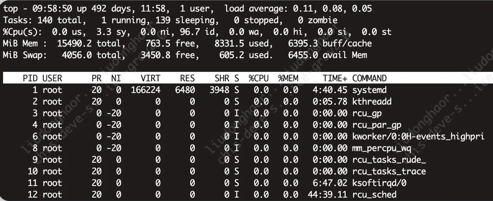
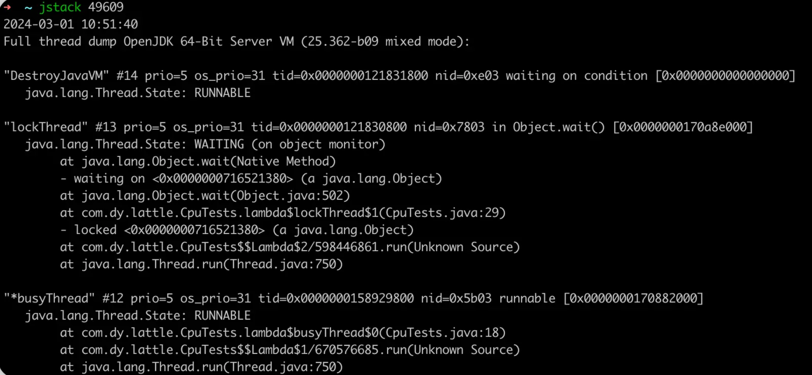
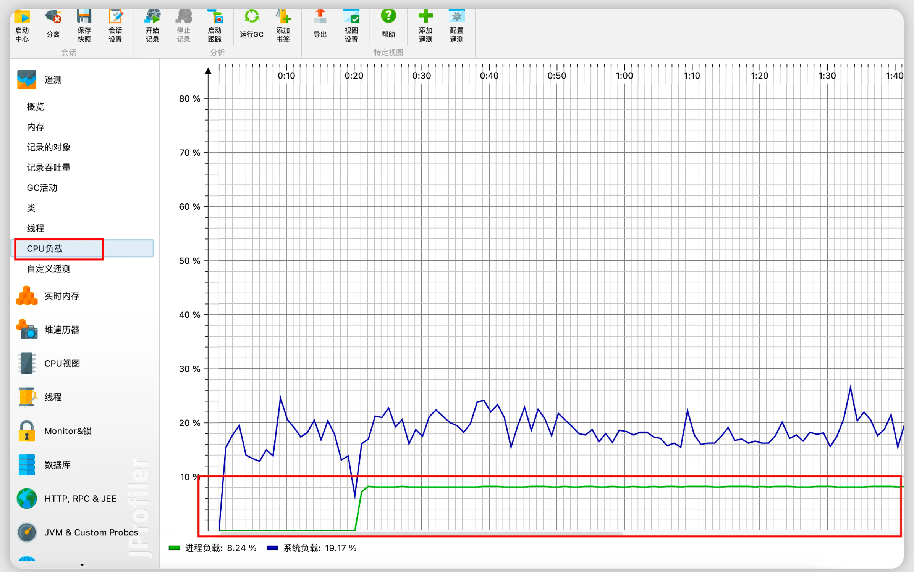
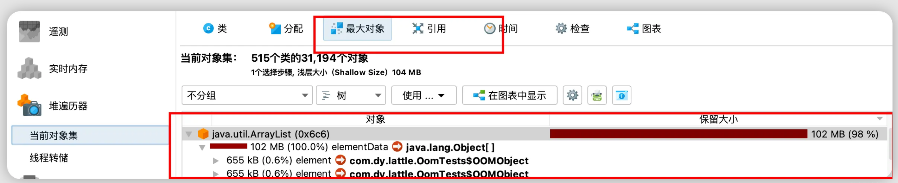
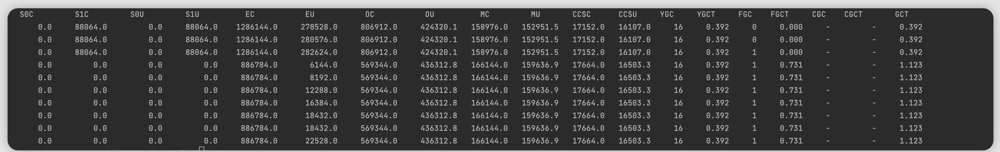
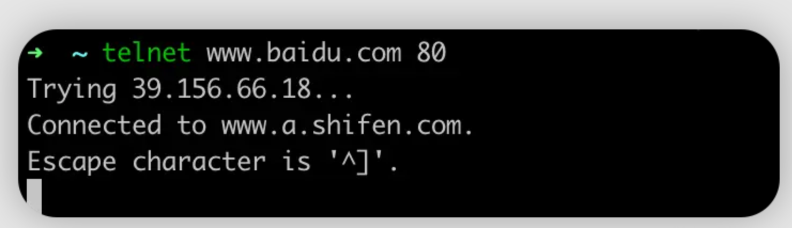

# **线上崩了，你是怎么排查线上问题的？**

摘取自**稀土掘金**

一些常见的线上问题，后续补充....

- **系统响应时间突增**，CPU使用率明显上升

- **系统偶尔卡顿**，大部分时间正常，但是过几个小时就会卡顿，影响正常请求

- **系统假死**，服务还在运行，但是无法响应请求

- **内存占满**，OOM异常

所有 Java 服务的线上问题从系统表象来看归结起来总共有四方面：

**CPU、内存、磁盘、网络。**

例如 CPU 使用率峰值突然飚高、内存溢出 (泄露)、磁盘满了、网络流量异常、FullGC等等问题。

以上问题实际可以转化为以下几个点：

1. CPU，CPU使用率飙升，如何定位
2. 内存，内存溢出、垃圾回收的问题排查思路与工具
3. IO，IO异常时，如何定位
4. 网络，网络卡顿，网络不通的排查思路

使用到的工具：Jprofiler

>JProfiler 是由 ej-technologies 公司开发的一款 Java 应用性能诊断工具。它聚焦于四个重要主题上。
>
>- 方法调用 - 对方法调用的分析可以帮助您了解应用程序正在做什么，并找到提高其性能的方法。
>- 内存分配 - 通过分析堆上对象、引用链和垃圾收集能帮您修复内存泄漏问题，优化内存使用。
>- 线程和锁 - JProfiler 提供多种针对线程和锁的分析视图助您发现多线程问题。
>- 高级子系统 - 许多性能问题都发生在更高的语义级别上。例如，对于JDBC调用，您可能希望找出执行最慢的 SQL 语句。JProfiler 支持对这些子系统进行集成分析。

## 问题定位

### **cpu**

CPU 是系统重要的**监控指标**，能够分析系统的整体运行状况。监控指标一般包括运行队列、CPU 使用率和上下文切换等。



top 命令显示了各个进程 CPU 使用情况 , 一般 CPU 使用率从高到低排序展示输出。其中 Load Average 显示最近 1 分钟、5 分钟和 15 分钟的系统平均负载，上图各值为0.11，0.08，0.05

我们一般会关注 CPU 使用率**最高的进程**，正常情况下就是我们的应用主进程。

关于线上的CPU问题，常见的问题有以下三种:

- CPU突然飙升
- CPU使用居高不下
- cpu占用高

往往都是业务逻辑问题导致的，比如**死循环、频繁gc或者上下文切换过多**。

线上问题排查，为了能够保持现场情况，一般我们直接登陆机器，使用命令行进行排查。

#### 命令行

我们使用`top -H -p pid`  (pid是top命令下cpu占用高的进程）

占用率最高的线程 ID 为 1586480，将其转换为 16 进制形式 (因为 java native 线程以 16 进制形式输出)

`Printf '%x\n' 1586480`      Pid得到nid    接着直接在jstack中找到相应的堆栈信息

`Jstack pid |grep 'nid' -C5`    



> 例子比较简单，我们直接使用jstack 也可以看到线程情况

#### 可视化工具

当然，也可以使用工具，直接可视化的查看线程情况

通过Jprofiler的cpu负载，我们可以看到cpu负载一直巨高不下，如果排除了流量上涨的可能性，那就需要排查代码存在的问题。



**当然，CPU问题，远远不是上文例子这么简单,仅仅介绍了最初级的问题排查思路。**

也有许多的工具，适合不同场景下的问题排查思路，比如：

1. vmstat，是一款指定采样周期和次数的功能性监测工具，我们可以看到，它不仅可以统计内存的使用情况，还可以观测到 CPU 的使用率、swap 的使用情况。但vmstat一般很少用来查看内存的使用情况，而是经常被用来观察进程的上下文切换。`针对上下文切换`

2. pidstat,之前的 top 和 vmstat 两个命令都是监测进程的内存、CPU 以及I/O使用情况，而pidstat命令则是深入到线程级别。 `针对线程`


### **内存调优**

线上内存，常见的有下面三类问题

1. 内存溢出
2. 内存泄漏
3. 垃圾回收导致的服务卡顿

#### 内存溢出

什么是内存溢出

当程序需要申请内存的时候，由于没有足够的内存，此时就会抛出OutOfMemoryError，这就是内存溢出

线上OOM问题排查，我们有两种方式

##### 使用jmap命令生成dump文件

`Jmap -dump:live,format=b,file=heap.hprof <pid>`

> 当内存太大时可能会导不出来，所以还是增加启动参数的方式略优

##### JVM启动参数增加参数

JVM启动参数增加参数,当应用抛出OutOfMemoryError 时自动生成dump文件

`-XX:+HeapDumpOnOutOfMemoryError`

通过Jprofiler，打开dump文件，选择最大对象，即可看到dump文件中最大的对象，也可以看到具体的引用情况。



#### 内存泄漏

内存泄漏指程序运行过程中分配内存给临时变量，用完之后却没有被GC回收，始终占着内存，即不能使用也不能分配给其他程序，就叫做内存泄漏

**也就是相当于占着内存却不能被管理到造成内存的浪费**

内存泄漏短期内或者说轻微的不会有太大的影响，但内存泄漏堆积起来后却会很严重，会一直占用掉可用的内存，从而出现内存溢出的现象。

**常见问题**

1. 可以复用的对象，每次都new，但也不会回收，比如客户端连接
2. 文件流操作，但是没有正常关闭

排查思路可以参照上面内存溢出的情况，排查大对象即可。

#### 垃圾回收

关于垃圾回收，常见问题主要有两点

1. 时间过长，垃圾回收存在STW，时间过长则会导致影响请求
2. Full GC次数过多

我们的调优目标，自然也是围绕这两个来

1. 更快响应速度
2. 更高的吞吐量

排查垃圾回收问题，启动服务时一定要加上如下四个参数

```
-XX:+PrintGCTimeStamps ：打印 GC 具体时间；
-XX:+PrintGCDetails ：打印出 GC 详细日志；
-Xloggc:/log/heapTest.log GC日志路径
-XX:+UseG1GC 使用G1垃圾回收器
```

根据gc日志，分析系统运行情况，主要关注以下三个问题

- 系统每秒请求数、每个请求创建多少对象，占用多少内存
- Young GC触发频率、对象进入老年代的速率
- 老年代占用内存、Full GC触发频率、Full GC触发的原因、长时间Full GC的原因

主要工具**jstat**，如下命令就是监控gc情况，每秒采样一次，采样10次  `Jstat -gc 44017 1000 10`



S0C/S1C、S0U/S1U、EC/EU、OC/OU、MC/MU分别代表两个Survivor区、Eden区、老年代、元数据区的容量和使用量。YGC/YGT、FGC/FGCT、GCT则代表YoungGc、FullGc的耗时和次数以及总耗时。如果看到gc比较频繁，再针对gc方面做进一步分析。

### **磁盘**

一般磁盘满了请求也有有报错，主要还是看存储空间满了没有

**Df -lh** 查看磁盘使用情况

**Iostat** 查看磁盘io

### **网络**

#### 查看TCP连接情况

常见问题：Tcp队列溢出

`Netstat -s |egrep "listen|LISTEN"`


overflowed标识全连接队列溢出的次数,最前面是0，标识没有队列溢出的情况，网络环境正常。

#### 网络是否连通

常见问题

- Rpc服务连接不上
- 数据库、Redis中间件连接不上

使用`telnet ip/域名 端口号` 来查看网络是否连接

如果出现下图内容，则证明网络已经连接

