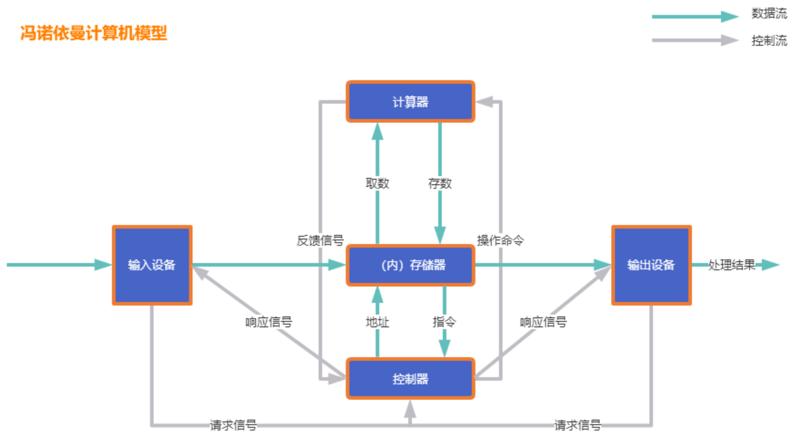
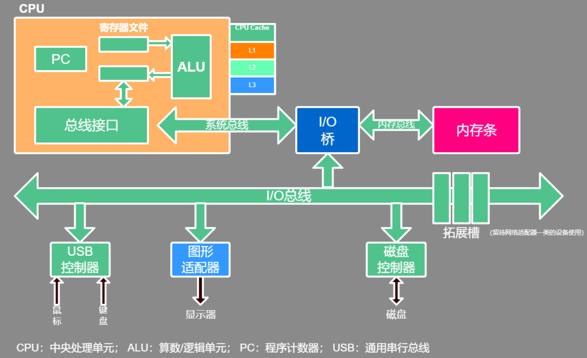
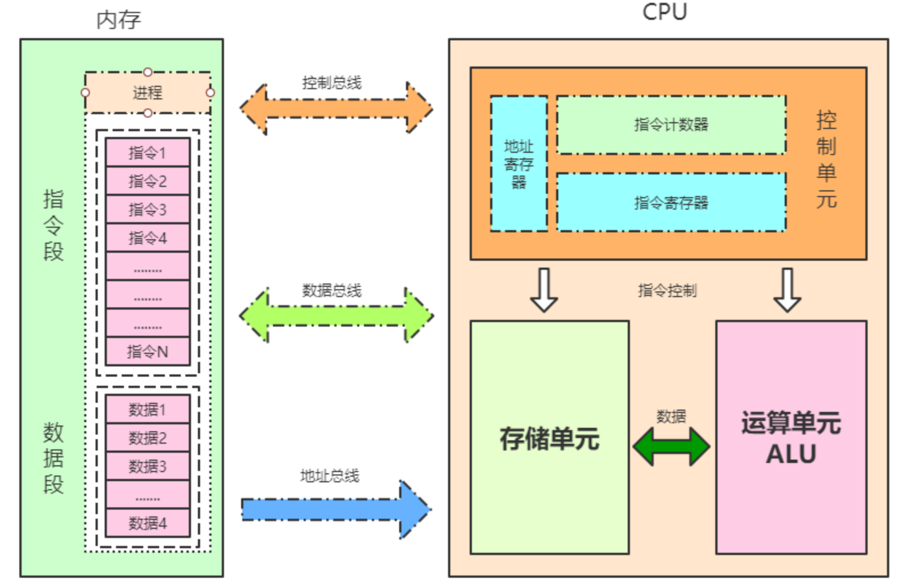
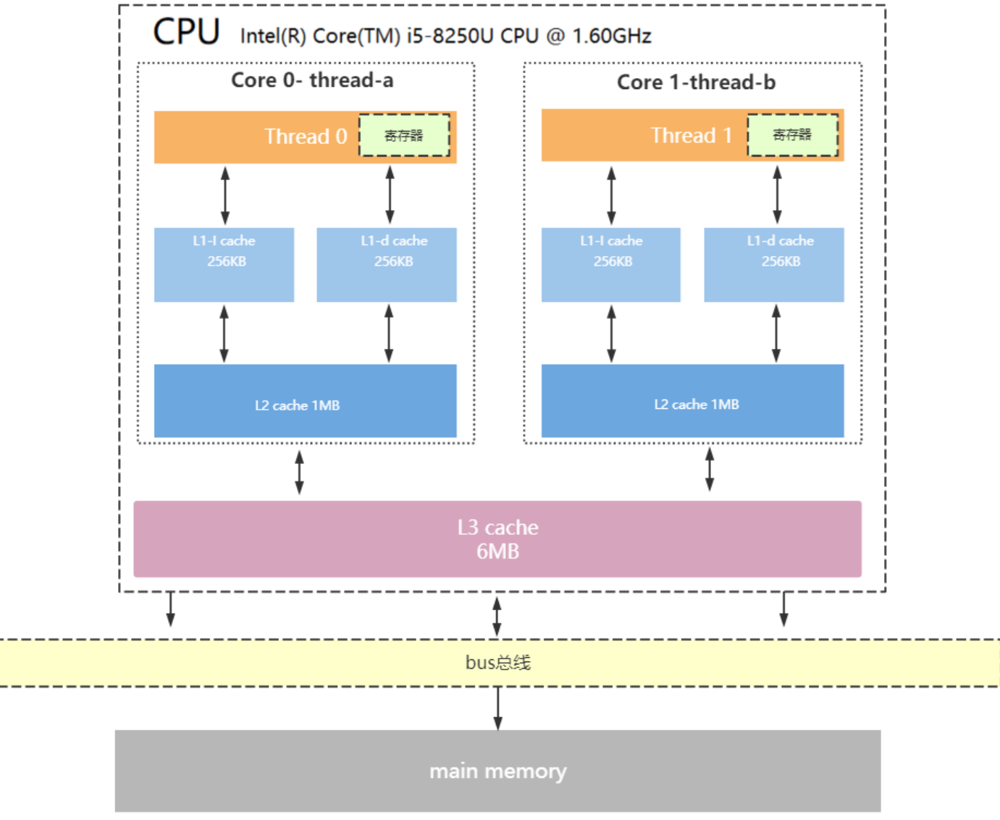
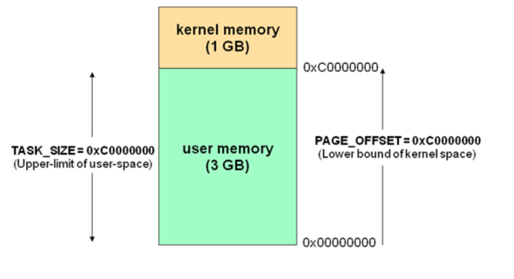
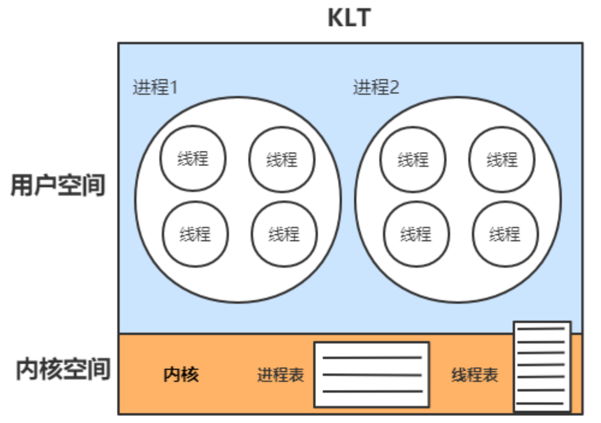
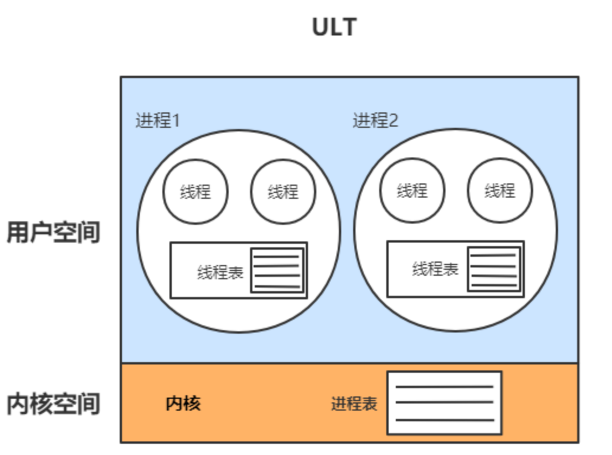
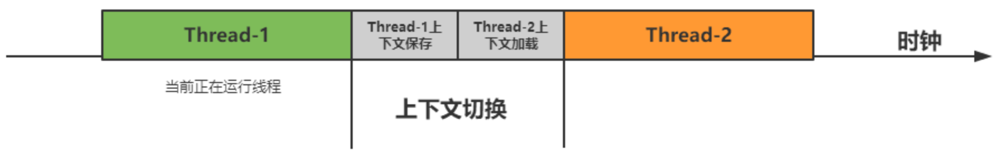

# ***操作系统底层工作的整体认识**

## **冯诺依曼计算机模型详解**

现代计算机模型是基于-**冯诺依曼计算机模型**！！！！

计算机在运行时，先从**内存中**取出第一条指令，通过**控制器**的译码，按指令的要求，从**存储器**中取出数据进行指定的运算和逻辑操作等加工，然后再按地址把结果送到**内存**中去。

接下来，再取出第二条指令，在控制器的指挥下完成规定操作。依此进行下去。直至遇到**停止指令**。

程序与数据一样存贮，按程序编排的顺序，一步一步地取出指令，自动地完成指令规定的操作是计算机最基本的工作模型。

这一原理最初是由**美籍匈牙利数学家冯.诺依曼**于1945年提出来的，故称为**冯.诺依曼计算机模型**。

1. **控制器(Control)：**是整个计算机的**中枢神经**，其功能是对程序规定的控制信息进行解释，根据其要求进行控制，调度程序、数据、地址，协调计算机各部分工作及内存与外设的访问等。

2. **运算器(Datapath)：**运算器的功能是对数据进行各种算术运算和逻辑运算，即对数据进行加工处理。

3. **存储器(Memory)：**存储器的功能是存储程序、数据和各种信号、命令等信息，并在需要时提供这些信息。

4. **输入(Input system)：**输入设备是计算机的重要组成部分，输入设备与输出设备合你为外部设备，简称外设，输入设备的作用是将程序、原始数据、文字、字符、控制命令或现场采集的数据等信息输入到计算机。常见的输入设备有键盘、鼠标器、光电输入机、磁带机、磁盘机、光盘机等。

5. **输出(Output system)：**输出设备与输入设备同样是计算机的重要组成部分，它把外算机的中间结果或最后结果、机内的各种数据符号及文字或各种控制信号等信息输出出来。微机常用的输出设备有显示终端CRT、打印机、激光印字机、绘图仪及磁带、光盘机等。

上面的模型是一个理论的抽象简化模型，它的具体应用就是现代计算机当中的硬件结构设计：

在上图硬件结构当中，配件很多，但最核心的只有两部分：CPU、内存。所以我们重点学习的也是这两部分。

## **CPU 指令结构**

CPU 内部结构

- 控制单元

- 运算单元

- 数据单元

### **控制单元**

​	控制单元是整个 CPU 的指挥控制中心，由**指令寄存器 IR**（Instruction Register）、**指令译码器** ID（Instruction Decoder）和 **操作控制器** OC（Operation Controller） 等组成，对协调整个电脑有序工作极为重要。它根据用户预先编好的程序，依次从存储器中取出各条指令，放在指令寄存器 IR 中，通过指令译码（分析）确定应该进行什么操作，然后通过操作控制器 OC，按确定的时序，向相应的部件发出微操作控制信号。操作控制器 OC 中主要包括：节拍脉冲发生器、控制矩阵、时钟脉冲发生器、复位电路和启停电路等控制逻辑。

### **运算单元**

​	运算单元是运算器的核心。可以执行算术运算（包括加减乘数等基本运算及其附加运算）和逻辑运算（包括移位、逻辑测试或两个值比较）。相对控制单元而言，运算器接受控制单元的命令而进行动作，即运算单元所进行的全部操作都是由控制单元发出的控制信号来指挥的，所以它是执行部件。

### **存储单元**

​	存储单元包括 CPU 片内缓存 Cache 和寄存器组，是 CPU 中暂时存放数据的地方，里面保存着那些等待处理的数据，或已经处理过的数据，CPU 访问寄存器所用的时间要比访问内存的时间短。 寄存器是 CPU 内部的元件，寄存器拥有非常高的读写速度，所以在寄存器之间的数据传送非常快。采用寄存器，可以减少 CPU 访问内存的次数，从而提高了 CPU 的工作速度。寄存器组可分为专用寄存器和通用寄存器。专用寄存器的作用是固定的，分别寄存相应的数据；而通用寄存器用途广泛并可由程序员规定其用途。

​	下表列出了 CPU 关键技术的发展历程以及代表系列，每一个关键技术的诞生都是环环相扣的，处理器这些技术发展历程都围绕着如何不让 “CPU 闲下来” 这一个核心目标展开。

| 关键技术        | 时间 | 描述                                            |
| --------------- | ---- | ----------------------------------------------- |
| 指令缓存 (L1)   | 1982 | 预读多条指令                                    |
| 数据缓存 (L1)   | 1985 | 预读一定长度的数据                              |
| 流水线          | 1989 | 一条指令被拆分由多个单元协同处理，i486          |
| 多流水线        | 1993 | 多运算单元多流水线并行处理，奔腾 1              |
| 乱序 + 分支预测 | 1995 | 充分利用不同组件协同处理，奔腾 Pro              |
| 超线程          | 2002 | 引入多组前端部件共享执行引擎，奔腾 4            |
| 多核处理器      | 2006 | 取消超线程，降低时钟频率，改用多核心，Core 酷睿 |
| 多核超线程      | 2008 | 重新引入超线程技术，iX 系列                     |

## **CPU 缓存结构**

现代 CPU 为了提升执行效率，减少 CPU 与内存的交互 (交互影响 CPU 效率)，一般在 CPU 上集成了多级缓存架构，常见的为三级缓存结构

- L1 Cache，分为数据缓存和指令缓存，逻辑核独占

- L2 Cache，物理核独占，逻辑核共享

- L3 Cache，所有物理核共享

**存储器存储空间大小**：内存 > L3>L2>L1 > 寄存器；

**存储器速度快慢排序**：寄存器 > L1>L2>L3 > 内存；

还有一点值得注意的是：

缓存是由最小的存储区块 - 缓存行 (cacheline) 组成，缓存行大小通常为 64byte。

**缓存行是什么意思呢？**

比如你的 L1 缓存大小是 512kb, 而 cacheline = 64byte, 那么就是 L1 里有 512 * 1024/64 个 cacheline

### **CPU 读取存储器数据过程**

1、CPU 要取寄存器 X 的值，只需要一步：直接读取。

2、CPU 要取 L1 cache 的某个值，需要 1-3 步（或者更多）：把 cache 行锁住，把某个数据拿来，解锁，如果没锁住就慢了。

3、CPU 要取 L2 cache 的某个值，先要到 L1 cache 里取，L1 当中不存在，在 L2 里，L2 开始加锁，加锁以后，把 L2 里的数据复制到 L1，再执行读 L1 的过程，上面的 3 步，再解锁。

4、CPU 取 L3 cache 的也是一样，只不过先由 L3 复制到 L2，从 L2 复制到 L1，从 L1 到 CPU。

5、CPU 取内存则最复杂：通知内存控制器占用总线带宽，通知内存加锁，发起内存读请求，等待回应，回应数据保存到 L3（如果没有就到 L2），再从 L3/2 到 L1，再从 L1 到 CPU，之后解除总线锁定。

### **CPU 为何要有高速缓存**

​	CPU 在摩尔定律的指导下以每 18 个月翻一番的速度在发展，然而内存和硬盘的发展速度远远不及 CPU。这就造成了高性能能的内存和硬盘价格及其昂贵。然而 CPU 的高度运算需要高速的数据。为了解决这个问题，CPU 厂商在 CPU 中内置了少量的高速缓存以**解决 I/O 速度和 CPU 运算速度之间的不匹配问题**。

​	在 CPU 访问存储设备时，无论是存取数据抑或存取指令，都趋于聚集在一片连续的区域中，这就被称为局部性原理。

>  **时间局部性（Temporal Locality）**：如果一个信息项正在被访问，那么在近期它很可能还会被再次访问。 比如循环、递归、方法的反复调用等。
>
> **空间局部性（Spatial Locality）**：如果一个存储器的位置被引用，那么将来他附近的位置也会被引用。比如顺序执行的代码、连续创建的两个对象、数组等。

### **带有高速缓存的 CPU 执行计算的流程**

1. 程序以及数据被加载到主内存

2. 指令和数据被加载到 CPU 的高速缓存

3. CPU 执行指令，把结果写到高速缓存

4. 高速缓存中的数据写回主内存

### **CPU 运行安全等级**

CPU 有 4 个运行级别，分别为：

- ring0

- ring1

- ring2

- ring3

​	Linux 与 Windows 只用到了 2 个级别:ring0、ring3，操作系统内部内部程序指令通常运行在 ring0 级别，操作系统以外的第三方程序运行在 ring3 级别，第三方程序如果要调用操作系统内部函数功能，由于运行安全级别不够，必须切换 CPU 运行状态，从 ring3 切换到 ring0, 然后执行系统函数，说到这里相信我们明白**为什么 JVM 创建线程，线程阻塞唤醒是重型操作**了，**因为 CPU 要切换运行状态**。

下面我大概梳理一下 JVM 创建线程 CPU 的工作过程

> step1：CPU 从 ring3 切换 ring0 创建线程
>
> step2：创建完毕，CPU 从 ring0 切换回 ring3
>
> step2：线程执行 JVM 程序
>
> step4：线程执行完毕，销毁还得切回 ring0

讲完了 CPU 部分，我们来看下内存部分。

## **操作系统内存管理**

### **执行空间保护**

操作系统有**用户空间**与**内核空间**两个概念，目的也是为了做到程序运行安全隔离与稳定，以 32 位操作系统 4G 大小的内存空间为例

​	Linux 为内核代码和数据结构预留了几个页框，这些页永远不会被转出到磁盘上。从 **0x00000000 到 0xC0000000**（PAGE_OFFSET） 的线性地址可由用户代码 和 内核代码进行引用（**即用户空间**）。从 **0xC0000000（PAGE_OFFSET）到 0xFFFFFFFFF** 的线性地址只能由内核代码进行访问（**即内核空间**）。内核代码及其数据结构都必须位于这 1 GB 的地址空间中，但是对于此地址空间而言，更大的消费者是物理地址的虚拟映射。

​	这意味着在 4 GB 的内存空间中，只有 3 GB 可以用于用户应用程序。进程与线程只能运行在用户方式（usermode）或内核方式（kernelmode）下。用户程序运行在用户方式下，而系统调用运行在内核方式下。在这两种方式下所用的堆栈不一样：用户方式下用的是一般的堆栈 (用户空间的堆栈)，而内核方式下用的是固定大小的堆栈（内核空间的对战，一般为一个内存页的大小），即**每个进程与线程其实有两个堆栈，分别运行与用户态与内核态**。

由空间划分我们再引深一下，CPU 调度的基本单位线程，也划分为：

> **1、内核线程模型 (KLT)**
>
> **2、用户线程模型 (ULT)**

### **内核线程模型**

​	内核线程 (KLT)：系统内核管理线程 (KLT), 内核保存线程的状态和上下文信息，线程阻塞不会引起进程阻塞。在多处理器系统上，多线程在多处理器上并行运行。线程的创建、调度和管理由内核完成，效率比 ULT 要慢，比进程操作快。 

​	用户线程 (ULT)：用户程序实现，不依赖操作系统核心，应用提供创建、同步、调度和管理线程的函数来控制用户线程。不需要用户态 / 内核态切换，速度快。内核对 ULT 无感知，线程阻塞则进程（包括它的所有线程）阻塞。

> **到这里，大家不妨思考一下，jvm 是采用的哪一种线程模型？**   KLT

## **进程与线程**

> **什么是进程？**

​	现代操作系统在运行一个程序时，会为其创建一个进程；例如，启动一个 Java 程序，操作系统就会创建一个 Java 进程。**进程是 OS (操作系统) 资源分配的最小单位**。

> **什么是线程？**

**线程是 OS (操作系统) 调度 CPU 的最小单元**，也叫轻量级进程（Light Weight Process），在一个进程里可以创建多个线程，这些线程都拥有各自的**计数器、堆栈和局部变量**等属性，并且能够**访问共享的内存变量**。CPU 在这些线程上高速切换，让使用者感觉到这些线程在同时执行，即并发的概念，相似的概念还有并行！

