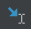
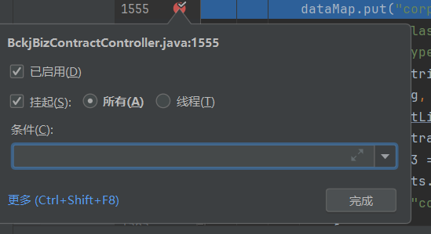
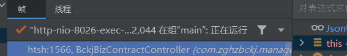
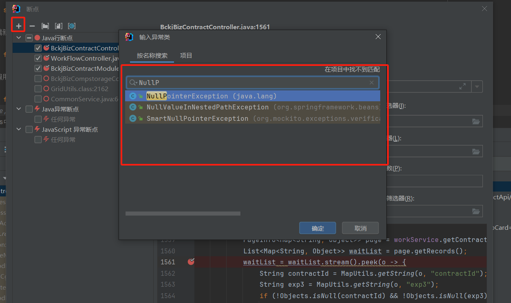

# idea中debug指南

让你的鼠标光标快速移动到正在debug运行的那一行代码

执行下一行代码

进入/退出方法体

直接运行到鼠标光标所在这一行

输入表达式获取debug期间的程序变量，类似于监视

执行到下个断点，没有则结束debug

查看程序中所有的断点，行/方法/异常上断点

debug期间取消全部断点，使所有断点本次不生效

右键某变量可以时刻观察

右键某个断点可以添加条件，让条件符合时才执行这个断点

对于lambda表达式可以通过这个按钮进行监视

让某个方法不执行直接返回某个想要的值

多线程环境下选择想要进入的线程

对于属性加断点可以监视这个属性修改时的代码

接口中方法的断点会直接跳转到实现这个接口的方法中去

在查看所有断点中执行以上操作，如果代码中出现了想要监视的异常则会直接跳转到出现异常的那行代码
