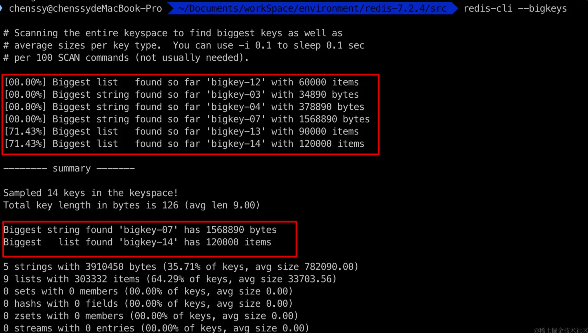
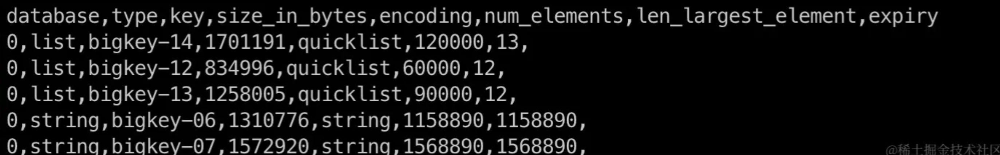
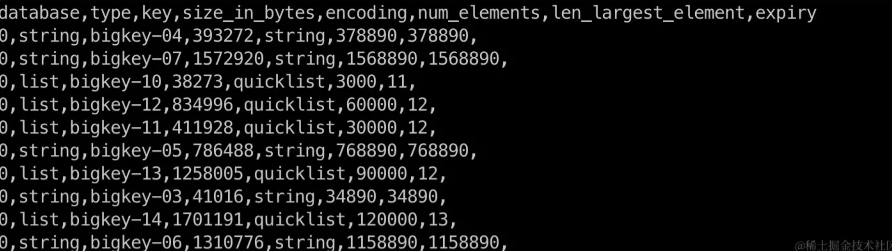

# 如何解决大key问题

摘自稀土掘金https://juejin.cn/post/7349360925185818635

Redis 大 key 问题是指某个 key 对应的 value 值很大（**注意，不是 key 很大**）。大 key 会导致 Redis 性能降低、数据倾斜以及主从同步等问题。一般来说我们应该杜绝大 key，如果遇到了我们就需要对其进行处理，处理过程分为这两个步骤：

1. 发现大 key。比如利用 `redis-cli --bigkeys` 或者 `Redis RDB Tools` 。
2. 大 key 的治理方案一般分为两种：
   1. 可删除：使用 UNLINK 命令可以安全地删除大 key。
   2. 不可删除：不可删除的话就将大 key 拆分为多个小 key，或者对 value 进行压缩处理


## 什么是大 key

- 对于列表、集合、有序集合、 哈希表，在超过 1 万个元素时被认为是大 key。
- 对于字符串，当它的大小达到几百 KB 时可能被认为是大 key。


## 大 key 有什么危害

- **数据倾斜**

大 key 所在的 Redis 服务器，会比其他 Redis 服务器占用更多的内存，这种数据倾斜的现象明显违背 Redis-Cluster 的设计思想。

- **占用内存过高**

大 key 会占用更多的内存，可能会导致内存不足，甚至导致内存耗尽，Redis 实例崩溃，影响系统的稳定性。

同时，频繁对大 key 进行修改可能会导致内存碎片化，进一步影响性能。

- **性能下降**

大 key 会占用大量的内存，导致内存碎片增加，进而影响 Redis 的性能。同时，对大 key 的读写操作消耗的时间都会比较长，这会导致**单个操作阻塞 Redis 服务器，影响整体性能**。

尤其是执行像 `HGETALL`、`SMEMBERS`、`ZRANGE`、`LRANGE` 等命令时，如果操作的是大 key，可能会导致明显的延迟。

- **主从同步延迟**

如果配置了主从同步，大 key 会导致主从同步延迟，由于大 key 占用的内存比较大，当主节点上的大 key 发生变化时，同步到从库时，会导致网络和处理上的延迟。


## 如何找到大 key

### **1、--bigkeys**

在使用 `redis-cli` 命令链接 Redis 服务的时候，加上 `--bigkeys` 参数，就可以找出每种数据类型的最大 key 及其大小。



缺点：`bigkeys` 使用的是 `SCAN` 来迭代 Redis 中所有的 key，对于每种数据类型（字符串、列表、集合、有序集合、哈希表），它都会记录下占用最多内存的 key。但是该**操作是资源密集型的，不建议直接在生产上面**执行，建议在从节点或者低流量时段执行。

这种方式对集合类型来说不是特别友好，因为它**只统计集合元素的多少，而不是实际占用内存，但是集合元素多，并不代表占用内存大**。


### **2、SCAN 命令**

用 `SCAN` 命令结合 `MEMORY USAGE`。`SCAN` 可以迭代数据库中的 key，然后结合 `MEMORY USAGE` 命令检查每个 key 的大小。

```shell
redis-cli --scan --pattern '*' | xargs -L 1 -I '{}' sh -c 'echo {} && redis-cli memory usage {}'
```

这个命令会显示每个 key 的内存使用量：

- `redis-cli --scan --pattern '*'`：遍历所有的 key。
- `xargs -L 1 -I '{}' sh -c 'echo {} && redis-cli memory usage {}'`：对于每个 key，首先打印 key 的名称（`echo {}`），然后打印其内存使用情况（`redis-cli memory usage {}`）


### **3、Redis RDB Tools 工具**

`RdbTools` 是一个用于分析 Redis 数据库文件（.rdb 文件）的工具。它可以帮助我们理解 Redis 内存使用情况，找出大 key，并以此优化 Redis 实例。

例如，我们要找出占用内存最多的 5 个 key：

```shell
rdb --command memory --largest 5 dump.rdb
```



再如，获取字节数大于 10000 的 key：

```shell
rdb --command memory --bytes 10000 dump.rdb
```




## 如何处理大 key

### **1、可删除**

如果这些大 key 可以删除，**则我们可以使用 `UNLINK` 删除这些大 key**。`UNLINK` 是异步的，不会像 `DEL` 命令一样会阻塞 Redis 服务，这种特性使得它比较适合大型的列表、集合、散列或有序集合的删除。

### **2、不可删除**

对于不可删除的大 key，我们一般有两种方式出路：

1. **分解**。将大 key 拆分为多个小 key，降低单 key 的大小，读取可以用 mget 批量读取。
2. **压缩**。如果是 String 类型，我们可以采用压缩算法对其进行压缩处理。

> 当 vaule 是 string 时，比较难拆分，则使用序列化、压缩算法将 key 的大小控制在合理范围内，但是序列化和反序列化都会带来更多时间上的消耗。
>
> 当 value 是 string，压缩之后仍然是大 key，则需要进行拆分，一个大 key 分为不同的部分，记录每个部分的 key，使用 multiget 等操作实现事务读取。
>
> 当 value 是 list/set 等集合类型时，根据预估的数据规模来进行分片，不同的元素计算后分到不同的片。