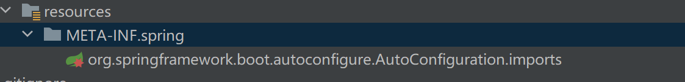
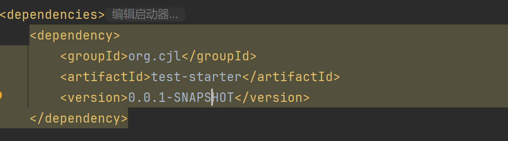

# 自定义starter傻瓜教程

## 前言

> 1、在 spring boot2.7 版本之前：
>
> 通过 META-INF/spring.factories 文件定义我们自动配置的类。
>
> 2、在 spring boot2.7~spring boot3.0 版本之间，是兼容了
>
> META-INF/spring/org.springframework.boot.autoconfigure.AutoConfiguration.imports 和
>
> META-INF/spring.factories 这两个文件的。
>
> 3、在 spring boot3.0 版本之后，只支持使用
>
> META-INF/spring/org.springframework.boot.autoconfigure.AutoConfiguration.imports
>
> 来自定义我们的自动配置的类。

在底层，自动配置是通过 `@AutoConfiguration` 注释实现的

这个注解本身是用 `@Configuration` 进行注解的，使得自动配置成为标准的 `@Configuration` 类

附加的 `@Conditional` 注解用于约束自动配置应用的时间，通常，自动配置类使用 `@ConditionalOnClass` 和 `@ConditionalOnMissingBean` 注解。这确保了自动配置仅在找到相关类且没有声明，自己创建的 `@Configuration` 时才适用

**自动配置定位**

Spring Boot 在发布的 jar 中检查 `META-INF/spring/org.springframework.boot.autoconfigure.AutoConfiguration.imports` 是否存在。该文件应该列出你的配置类，如下所示:

```xml
com.mycorp.libx.autoconfigure.LibXAutoConfiguration
com.mycorp.libx.autoconfigure.LibXWebAutoConfiguration
```

自动配置必须仅以这种方式加载。确保它们是在特定的包空间中定义的，并且它们永远不会成为组件扫描的目标。

此外，自动配置类不应该允许组件扫描来查找其他组件。应该使用特定的 `@Import` 注解。

如果你的配置需要以特定的顺序应用，你可以使用 `@AutoConfigureAfter` 或 `@AutoConfigureBefore` 注解。例如，如果你提供了特定于 `web` 的配置，你的类可能需要在 `WebMvcAutoConfiguration` 之后应用。

```java
@AutoConfigureAfter(value= WebMvcAutoConfiguration.class)
```

如果使用 `@AutoConfiguration` 注释，可以使用 `before`、`beforeName`、`after` 和 `afterName` 属性别名，而不是专用注解。

```yaml
@AutoConfiguration(after = WebMvcAutoConfiguration.class)
```

如果你想对任何相互之间没有直接联系的自动配置进行**排序**，可以使用
你也可以使用 `@AutoConfigureOrder`。该注解具有与常规 `@Order` 注释相同的语义，但为自动配置类提供了专用的顺序。与标准的 `@Configuration` 类一样，自动配置类的应用顺序只影响它们的 bean 的定义顺序。随后创建这些 bean 的顺序不受影响，由每个 bean 的依赖关系和任何 `@DependsOn` 关系决定。


## 创建自己的 Starter

### 新建项目 test-spring-boot-starter

添加依赖

```xml
<dependencies>
    <dependency>
        <groupId>org.springframework.boot</groupId>
        <artifactId>spring-boot-starter</artifactId>
    </dependency>
    <!-- 自动装配依赖-->
    <dependency>
        <groupId>org.springframework.boot</groupId>
        <artifactId>spring-boot-autoconfigure</artifactId>
    </dependency>

    <!--自动装配依赖非必需依赖,该依赖作用是在使用IDEA编写配置文件有代码提示-->
    <dependency>
        <groupId>org.springframework.boot</groupId>
        <artifactId>spring-boot-configuration-processor</artifactId>
    </dependency>
    <dependency>
        <groupId>org.springframework.boot</groupId>
        <artifactId>spring-boot-starter-test</artifactId>
    </dependency>
        <dependency>
    <groupId>org.projectlombok</groupId>
    <artifactId>lombok</artifactId>
        </dependency>
</dependencies>
```

2、**把 pom 文件中的`<build> `标签中的 < plugin > 的 spring boot maven 打包插件删除掉**，我们不需要将这个 starter 打成能自动启动的 jar 文件，甚至你的启动类也可以删除掉。（spring boot maven 打包插件一定要删除掉，不然打出来的 jar 包不能正常使用。）

3、在这个自定义的 starter 中写几个 bean，并输出一些信息，表明它们能够在其他 spring boot 项目中正常使用。

(1)定义一个属性类，用来读取配置文件中的属性：（如果想要设置默认值得话，可以直接在定义属性的时候设置一个初始值，这样你不在 yml 配置文件中明确指定值的话，默认就有初始值，在 yml 文件中指定值会覆盖掉我们写的默认值。）

```java
import lombok.Data;
import org.springframework.boot.context.properties.ConfigurationProperties;
import org.springframework.stereotype.Component;

@Component
@ConfigurationProperties(prefix = "student")
@Data
public class StudentProperties {
    /**
     * 姓名
     */
    private String name;
    //private String name="张乔";

    /**
     * 年龄
     */
    private Integer age;
    /**
     * 性别
     */
    private String sex;
}


```

（2）定义一个 service 类，用来输出一下配置类：

```java
package org.cjl.teststarter;

import org.springframework.beans.factory.annotation.Autowired;
import org.springframework.stereotype.Service;

@Service
public class StudentService {

    @Autowired
    private StudentProperties studentProperties;

    public void print() {
        System.out.println("姓名："+studentProperties.getName());
        System.out.println("年龄："+studentProperties.getAge());
        System.out.println("性别："+studentProperties.getSex());
    }
}
```

（3）定义一个配置类，将我们要用到的这两个类进行 @Import 注入：


（4）、在资源目录下，创建

`/*META-INF/spring/org.springframework.boot.autoconfigure.AutoConfiguration.imports/ `

注意名字一定不能写错，前两个是目录，最后一个是文件。如果写对了，idea 会有提示的：



在 org.springframework.boot.autoconfigure.AutoConfiguration.imports 文件中，指定你的配置类的路径。如:

```
io.qifan.ai.spark.SparkAiAutoConfiguration
```

(5)、运行 maven 命令，可以将这个自定义的 starter 上传到 maven 仓库中。

1、运行

> mvn clean install -DskipTests

2、直接使用 idea 上提供的生命周期：clean,install


（6）、现在就将这个 starter 上传到了本地的 maven 仓库中，接下来可以只要导入自定义 starter 的依赖，在任意的项目中使用。

我随意的打开一个项目，并导入 starter 的依赖:




## 总结：

spring boot 自定义 starter 在我们日常的工作和学习中，作用是非常巨大的。可以将一些共性的功能抽离出来供我们进行使用，我这次只是介绍了最基础的一个自定义 starter 的 demo，如果你想要进行更复杂的功能，尽管去做了，大名鼎鼎的 hutool 工具包不就是一个整合了非常多功能的 jar 包。

自定义 starter 的原理是基于 spring boot 的自动配置，简单来说就是 **@EnableAutoConfiguration**

注解会去扫描

META-INF/spring/org.springframework.boot.autoconfigure.AutoConfiguration.imports

（这个路径可不是我胡说的，在 springboot 的注解中详细声明了会自动扫描的文件名称和路径，那么基于 springboot 框架封装的一些组件。要想将 bean 注入到 IOC 容器中，也要遵循 springboot 的约定。这就是 springboot 框架的核心思想。**约定大于配置大于编码**）

中的配置类，并将**符合条件的 bean** 注册到 IOC 容器中。更详细的原理咱也说不上来。有兴趣的可以去看看 spring boot 自动装配的流程，深入了解一下 springboot 框架的源码。