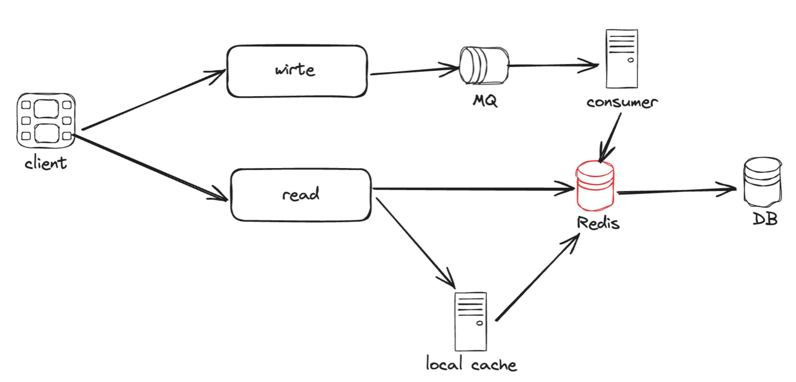
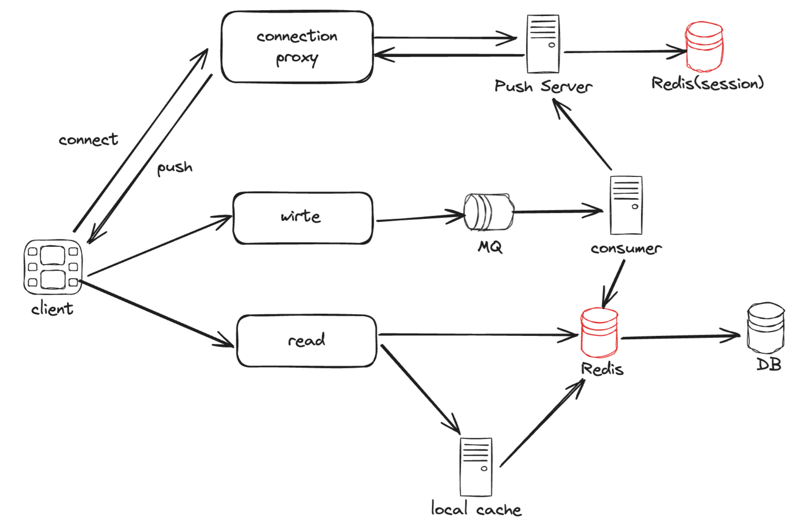

# 直播弹幕系统设计

## 特点

> 其实很类似 IM 即时通讯系统，是个变种，本质也是在一个空间内收发消息

- 消息**及时性**强，过期消息意义不大

- 用户松散，随时来随时走

- 可能有**瞬时大批量弹幕**（比如比赛精彩部分）

- 流量特点：**读多写少**


## 弹幕数据结构

```go
type Bullet struct {
	UserId    int // 用户ID
	Content   string // 内容
	Timestamp int // 弹幕发送时间
	Extra     *Extra // 效果、样式
}
```

视频弹幕才有偏移时间，直播应该不用（因果一致性）


## MVP 版本

### 整体设计

> 读写分离架构，短连接 + 拉模式

- 写：若不考虑历史弹幕可回放，可以直接使用 Redis 作为唯一存储

- 读：Redis 主要用于读缓存，缓存直播间最新的弹幕数据

### 存储

数据结构选择 **Redis 的 ZSet**

- 需要弹幕按时间排序，而 ZSet 可保证有序

- 此外，score 允许重复，那我们就用 timestamp 来做 score


### 使用

- 发弹幕：`ZADD 直播间ID, 弹幕val, timestamp`（优化：时间只存相对于某个时间点的 delta）

- 拉取弹幕：`ZRangeByScore` 定时轮询（秒级，准实时即可）

### 问题

1. 弹幕怎么持久化（Redis 扩容成本高）
2. 热门直播会有大量瞬时弹幕，挑战 Redis 并发瓶颈
3. Redis 重复请求多，相同直播间会存在很多重复的轮询请求

#### 问题 cover

1. 持久化

   若考虑支持弹幕的回放，数据还是需要持久化，可以考虑使用 MySQL

2. 1. 弹幕在直播结束后**迁移至 DB**（可以专门拿一台从 redis 做回放）

   2. **异步刷入**（开线程 / 监听 redis 日志刷 / 发 MQ 消费）

   3. - 如果有更高性能的写需求，可以考虑 NoSQL DB，如：HBase、OpenTSDB 等 

   4. - 新问题：Write-Behind 这种以 cache 为主的模式，是可能会丢数据的

   5. - - DB 挂了，少写数据，但是只要数据还在 redis 能追回来

      - - redis 挂了，服务感知到后降级，请求回源，“[缓存击穿](https://xiaolincoding.com/redis/cluster/cache_problem.html#缓存击穿)”

2.  使用 MQ 来消化瞬时弹幕，削峰；弹幕返回条数根据直播间的大小自动调整（热门直播间对时间跨度以及消息条数做更严格的限制）

3. 对弹幕读请求，使用 local cache 缓存最近 5s 的数据在应用服务的内存中（过期了才回源 redis）

1. - 新问题：如果直播间变多，本地内存使用量随直播间线性膨胀，本地 cache 的命中率下降，还可能频繁触发 GC

2. - 解决

3. 1. - 只针对热门直播间使用本地 cache

   2. - 使用 “一致性 hash”，控制同一直播间尽可能打到同一台服务器，降低本地 cache 使用量

#### 优化：热门直播间

- **需要对每个直播间进行指标采样**

- - 标准：粉丝数、在线粉丝数、是否有活动
  - 弹幕系统需要与直播间系统隔离
  - 请求时带上直播间的 “热门” 标识

- **根据服务器机器资源来分配所承载的热门直播间**


#### 长连接轮询

此前短连接的方式，每次轮询请求后都要重新建立连接。如果使用长连接轮询，客户端保持连接处于打开状态，就不会一直重新建立链接，减少重复的资源消耗，缩短响应时间。

不过，长连接轮询还是有一些缺点的：

- 发送者和接收者可能并没有连接到同一个服务器

- -  HTTP 协议的服务器通常是无状态的，如果使用 Round Robin 的方式来做负载均衡，接收到弹幕的服务器可能并没有与等待接收消息的客户端保持长轮询连接

- 服务器没有好的方法来判断客户端有没有断开连接

### 架构图



## 推模式

> 上面 MVP 版本是拉模式，适合前期；中后期规模和性能要求上来了，需要引入推模式。

### 架构图



### 长连接推送

为了保障客户端消息的推送性能和实时性，需要引入长连接

- Push Server：负责推送（不感知直播业务）

- - 存储：从 Redis 中获取用户和直播间的关系以及长连接信息
  - 推送：分批并发推

-  connection proxy：只负责与客户端保持长连接

### 使用技术

- WebSocket（HTTP 2.0 支持的全双工通信 + 长连接）

- Session（基于 redis，通过用户会话来推）

### 优化

- 有状态服务需要做好路由

- 两个批量推送：消费 MQ 后批量推；从 push server 到连接代理的每个连接上也批量

- 推拉结合，可以把短连接的拉作为长连接推的降级方案（服务端监控 + 客户端上报）

### 其他挑战

- 写扩散（m 条消息 * n 次扩散，平方级别）⇒ MQ 控制推送速率

- 丢弹幕 ⇒ push 失败引入重试；落 DB 引入 ACK

-  带宽压力

- 灰度拉切推


## 其他思路

- 使用 redis 的 [Stream](https://www.runoob.com/redis/redis-stream.html) 来做弹幕的发送（生产）和阅读（消费）

- 前端展示上的优化

- - 弹幕去重
  - 发送弹幕后，本地优先展示（即使它丢了 or delay）