# linux学习指南：配置虚拟机

## 配置网络

打开虚拟网络编辑器界面

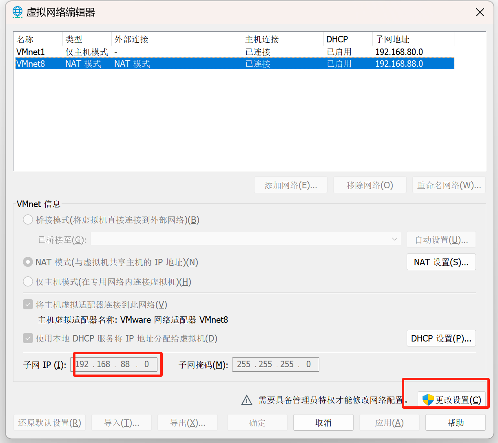

子网IP修改为192.168.188  `随意改`

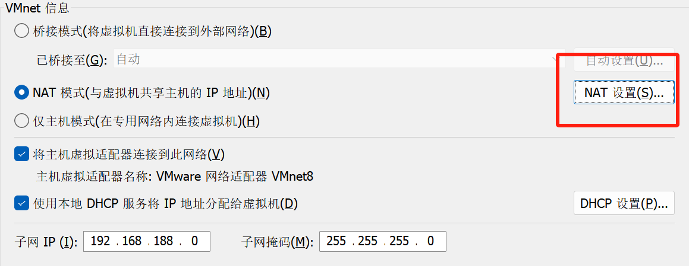

开始网卡配置

输入命令

```shell
vi /etc/sysconfig/network-scripts/ifcfg-ens33
```

进入

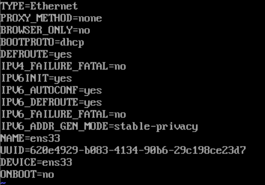

需要做三件事

1. UUID这一行删除  `dd 命令快捷删除当前行`

2. BootProto这一行进行修改，将dhcp`动态获取ip`改为static`静态ip`

3. 将OnBoot改为yes `启动时加载信息`，再添加以下几行：`改成和上界面一样`

   IPADDR=192.168.188.100

   NETMASK=255.255.255.0

   GATEWAY=192.168.188.2

   DNS1=114.114.114.114

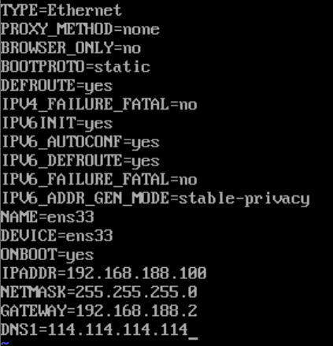

重启网卡重新加载配置文件

执行命令

systemctl restart network.service

之后输入ip addr查看ip地址，出现ens33,此时可以ping通任意域名

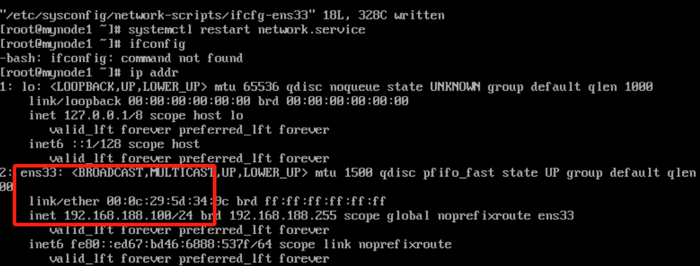


## 配置防火墙

保护本机的端口不被别人访问，如果需要被访问，需要将端口添加到防火墙例外

关闭命令

- 本次开机状态下防火墙关闭

  systemctl stop firewalld

- 下一次开机后禁用防火墙

  systemctl disable firewalld

因为学习需要，两个命令都执行


## 配置安装软件限制

执行命令

```shell
vi /etc/selinux/config
```

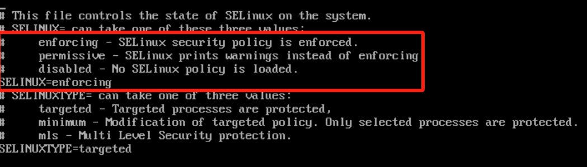

> **Enforcing：**强制模式。代表 SELinux 在运行中，且已经开始限制 domain/type 之间的验证关系
>
> **Permissive：**宽容模式。代表 SELinux 在运行中，不过不会限制 domain/type 之间的验证关系，即使验证不正确，进程仍可以对文件进行操作。不过如果验证不正确会发出警告
>
> **Disabled：**关闭模式。SELinux 并没有实际运行

更改为disabled


# 其他操作

## 命令行关闭计算机

```shell
poweroff

shutdown -h now
```

## 快照和克隆

**快照用于恢复虚拟机状态，版本管理**

**先关机**，右键虚拟机拍摄快照


**开始克隆**

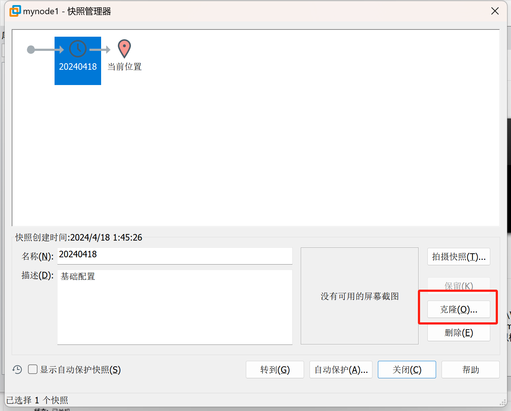

选择完整克隆

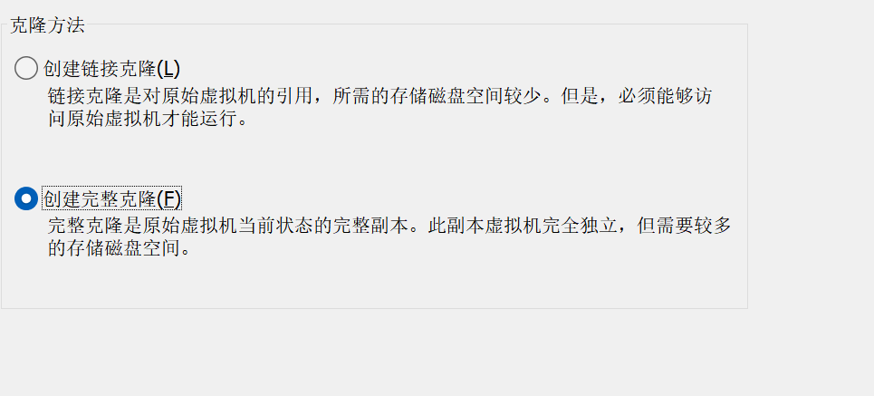

进入node2，更改ip地址

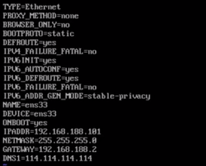

更改主机名为node2

```shell
vi /etc/hostname
hostname mynode2
```

重新进入后显示更换


可以将别人的虚拟机文件放到目录下然后打开虚拟机


# Xshell等工具的一些操作

关闭更新

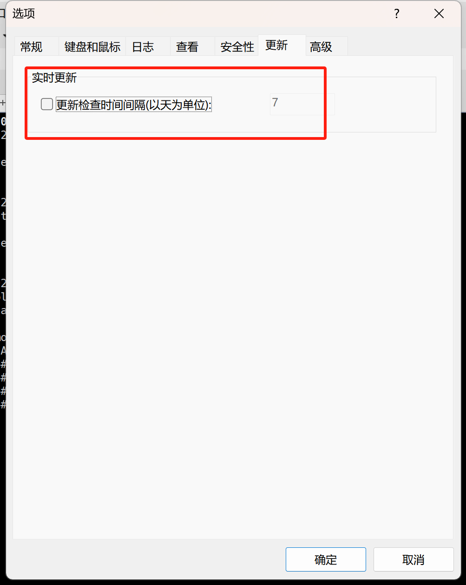

更改字体大小等外观

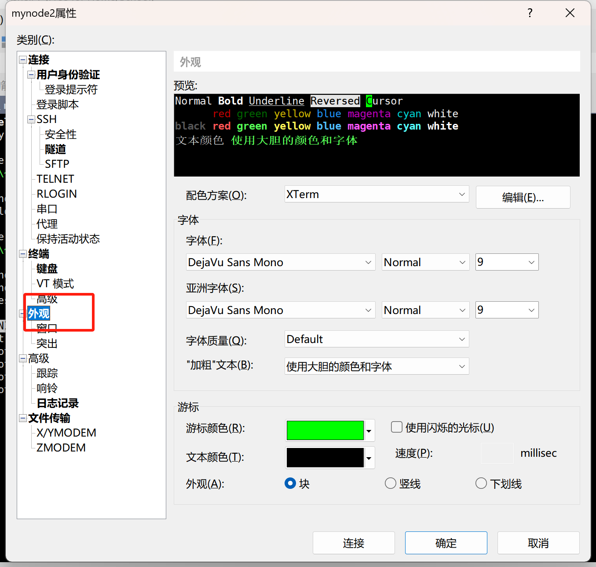


> 在 Linux 系统上 SSH 是非常常用的工具，通过 SSH Client 我们可以连接到运行了 SSH Server 的远程机器上。SSH Client 的基本使用方法是：

```shell
ssh user@remote -p port
```

