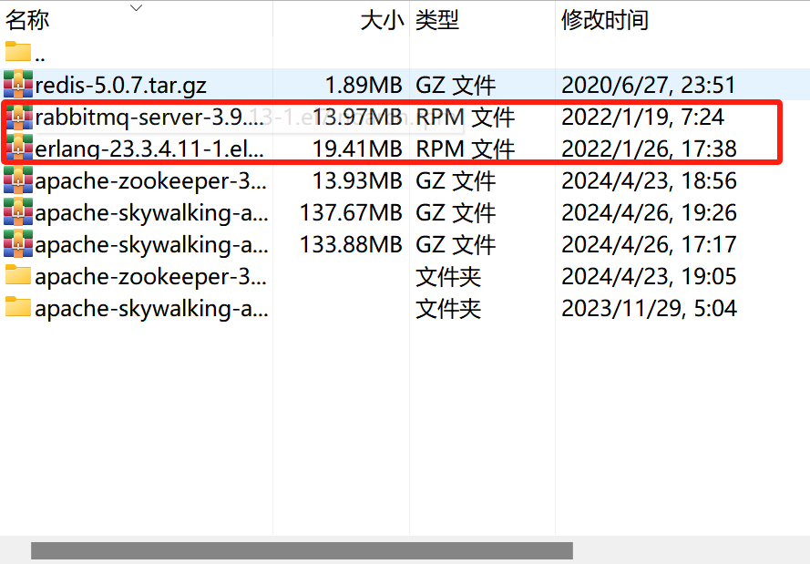

# 安装各种MQ 

## rabbitMQ

### 1.环境准备

[RabbitMQ](https://so.csdn.net/so/search?q=RabbitMQ&spm=1001.2101.3001.7020) 官方：https://www.rabbitmq.com/

**下载前先查看这个，避免兼容问题：**

[RabbitMQ](https://so.csdn.net/so/search?q=RabbitMQ&spm=1001.2101.3001.7020) 版本 和 Erlang 版本兼容性关系:https://www.rabbitmq.com/docs/which-erlang

在开始安装之前，先执行下面的命令安装一些必要的依赖：

```sh
yum -y install make gcc gcc-c++ kernel-devel m4 ncurses-devel openssl-devel glibc-devel xmlto perl wget socat
```

**RabbitMQ 和 Erlang rpm 安装源仓库**

https://packagecloud.io/rabbitmq


### 2.Erlang 安装源下载


两种方式：一种wget直接安装rpm，另一种下载rpm上传到服务器然后rpm -ivh安装


```sh
wget --content-disposition https://packagecloud.io/rabbitmq/erlang/packages/el/7/erlang-23.3.4.11-1.el7.x86_64.rpm/download.rpm
```


### 3.RabbitMQ rpm 安装源下载


和安装erlang一样，最终得到两个rpm



### 4.开始安装

**先安装 Erlang，别搞反了**

```sh
rpm -ivh erlang-23.3.4.11-1.el7.x86_64.rpm
```

> i 表示安装，v 表示显示安装过程，h 表示显示进度

**安装 RabbitMQ**

```powershell
rpm -ivh rabbitmq-server-3.9.13-1.el7.noarch.rpm
```

至此我们的基本安装就完毕了。


### 5.RabbitMQ 基本配置

1、启动服务

```powershell
service rabbitmq-server start
```

2、查看服务状态

```powershell
service rabbitmq-server status 
```

3、停止服务

```powershell
 service rabbitmq-server stop
```

4、重启服务

```powershell
service rabbitmq-server restart 
```

**5、开启图形化管理界面，一般都要开**

```powershell
rabbitmq-plugins enable rabbitmq_management
```

**注意：！！！**

这里需要配置防火墙开放端口，因为后面需要访问这个图形化界面

查看当前防火墙状态

```powershell
firewall-cmd --state
```

查看当前防火墙开启的端口

```powershell
firewall-cmd --zone=public --list-ports
```

将 RabbitMQ web 访问端口 15672 开放出来

```powershell
firewall-cmd --zone=public --add-port=15672/tcp --permanent
```

再次查看当前防火墙开启的端口，可以看到没有，因为没有生效

更新防火墙规则

```powershell
firewall-cmd --reload
```

### 6.访问管理界面

若一切成功，访问本机IP+15672,可以看到操作界面


登录前先去修改配置文件

**注意！！**

由于我这个是最新的版本，所以配置方式会有点不一样，如果是以往早一点的版本作如下配置

**有ebin的老版本：**

我们直接修改这个文件

```powershell
vim /usr/lib/rabbitmq/lib/rabbitmq_server-3.9.13/ebin/rabbitmq.app
```

这个目录下会有一个 ebin 的目录，里面有一个 rabbitmq.app 的配置文件，我们直接修改里面的内容就可以（但是由于我这个是目前最新版，就没有这个文件了)

```
vim /usr/lib/rabbitmq/lib/rabbitmq_server-3.9.13/ebin/rabbitmq.app
```


修改之后重启 RabbitMQ 服务即可

那么我们新版本的如何配置才能访问这个 web 页面呢？已知有这么两种方式


**新版本：**

**第一种**
我们进入到这个目录

```powershell
cd /etc/rabbitmq/
```

创建一个 rabbitmq.config 配置文件

```powershell
touch rabbitmq.config
```

保存退出后，重启我们 RabbitMQ 服务，然后再次登录


**第二种**
创建一个新用户进行访问
第一步：添加 admin 用户并设置密码

```powershell
rabbitmqctl add_user admin admin
```

第二步：添加 admin 用户为 administrator 角色

```powershell
rabbitmqctl set_user_tags admin administrator
```

第三步：设置 admin 用户的权限，指定允许访问的 vhost 以及 write/read

```powershell
rabbitmqctl set_permissions -p "/" admin ".*" ".*" ".*"
```

可以看到已经有对应权限的该用户


### 7.管理界面相关操作

**1、创建用户**


创建了一个 user1，鼠标悬停到 name ，可以点击对该用户进行操作
Can access virtual hosts 中显示 No access，即 user1 用户没有可以访问的虚拟主机

> #### 角色说明
>
> 1、 超级管理员 (administrator) 可登陆管理控制台，可查看所有的信息，并且可以对用户，策略 (policy) 进行操 作。
> 2、 监控者 (monitoring) 可登陆管理控制台，同时可以查看 rabbitmq 节点的相关信息 (进程数，内存使用 情况，磁盘使用情况等)
> 3、 策略制定者 (policymaker) 可登陆管理控制台，同时可以对 policy 进行管理。但无法查看节点的相关信息 (上 图红框标识的部分)。
> 4、 普通管理者 (management) 仅可登陆管理控制台，无法看到节点信息，也无法对策略进行管理。
> 5、 其他 无法登陆管理控制台，通常就是普通的生产者和消费者。


**2、创建 Virtual Hosts 虚拟服务器**

**Virtual Hosts 配置**

像 mysql 拥有数据库的概念并且可以指定用户对库和表等操作的权限。 RabbitMQ 也有类似的权限管理

在 RabbitMQ 中可以虚拟消息服务器 Virtual Host，每个 Virtual Hosts 相当于一个相对独立的 RabbitMQ 服务器，每个 VirtualHost 之间是相互隔离的：exchange、queue、message 不能互通。 

相当于 mysql 的 db ，Virtual Name 一般以 / 开头。


这里创建虽然设置了，但是默认只给 admin 访问

我们可以设置其他用户，鼠标悬停到 name 上，点击


可以发现，user1 用户也可以访问了