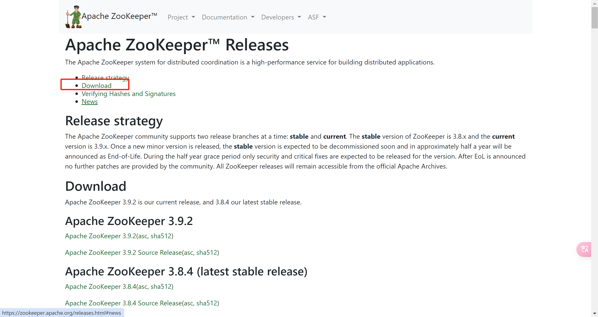
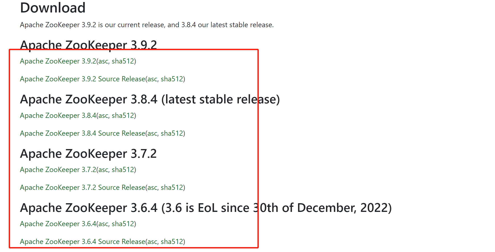
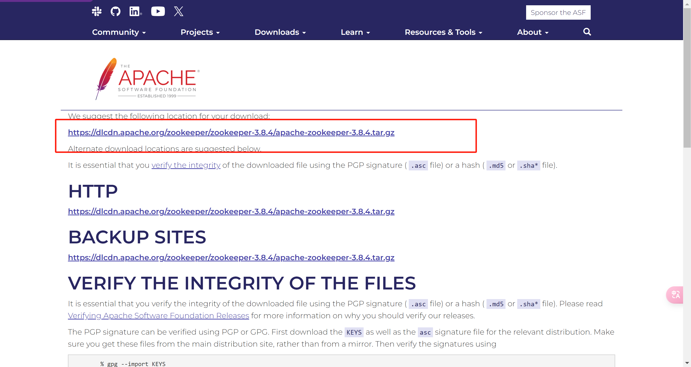
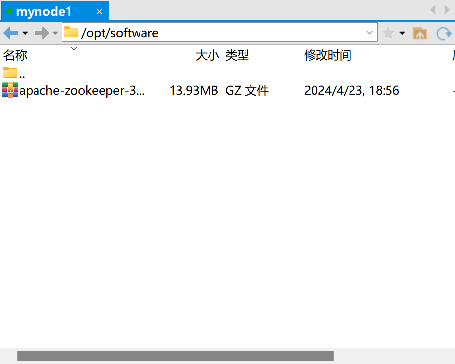
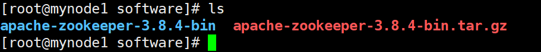
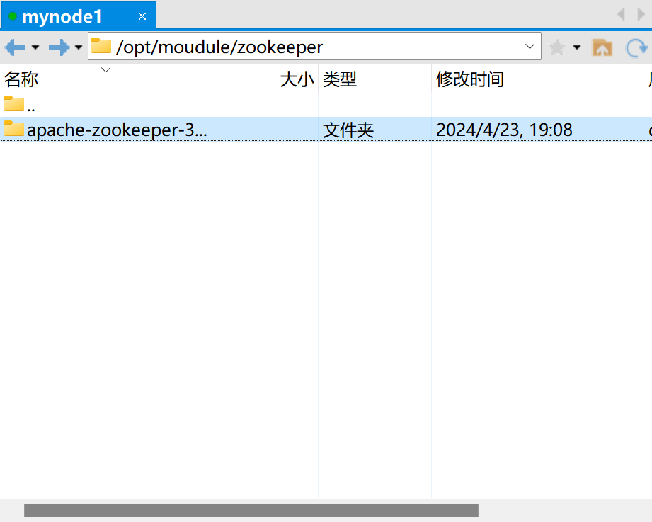
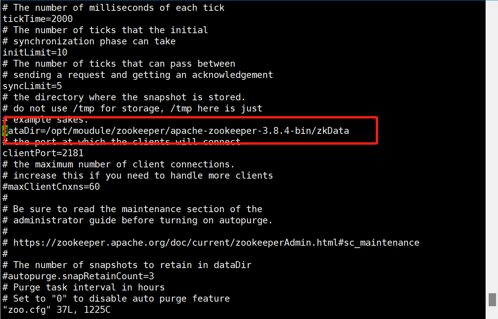
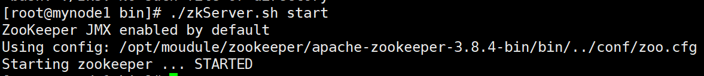
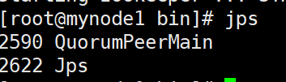
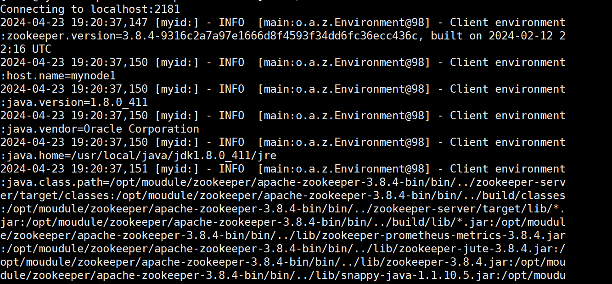

# Linux安装**Zookeeper** `胎教版`

安装准备

- jvm 环境
- JDK 必须是 7 或以上版本
- 使用 xshell 进行远程连接

### 1.下载安装

zookeeper 官网：[Apache ZooKeeper](https://zookeeper.apache.org/)

先对 jdk 环境进行检查，输入 java, 若跳出参数则证明 JDK 环境无误

进入官网，点击downLoad



选择release版本



下载



 下载完后，将压缩包上传到 linux 环境中，我这边上传到 /opt/software 路径



 对压缩包进行解压

`tar -zxvf apache-zookeeper-3.8.4-bin.tar.gz`

解压后可以看到 software 目录下已经存在 zookeeper 文件



复制解压后的文件到 opt/module 路径下的 zookeeper 文件夹

```shell
cp apache-zookeeper-3.8.4-bin /opt/module/zookeeper -r
```

此时便可以看到对应目录下存在了 zookeeper 的文件



### 2.配置

进入 zookeeper 目录下的 conf 目录，将目录中的 zoo_sample.cfg 改成 zoo.cfg

```shell
mv zoo_sample.cfg zoo.cfg
```

 在 zookeeper 目录下新建一个 zkData 文件夹

```shell
mkdir zkData
```

回到 zoo.cfg 中，对其进行修改，将 dataDir 的路径换成我们刚刚新建的 zkData 的路径



修改完后 esc,wq 保存退出 


### **3. 启动测试** 

进入 bin 目录下，启动服务端

```shell
./zkServer.sh start
```

如下图所示则启动成功 



 jps 查看进程

```undefined
jps
```



可以看到我们启动后的 2590即是 zookeeper 服务端 

回到 zookeeper 目录下，启动客户端

```shell
bin/zkCli.sh
```

出现如下页面则启动成功 




### 4.退出

```
quit
```

退出客户端

```shell
./zkServer.sh stop
```

停止服务

至此，我们 linux 环境下安装 zookeeper 的教程就结束啦

