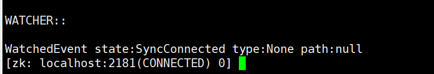

# Linux安装redis，zk

## Linux安装**Zookeeper** `胎教版`

安装准备

- jvm 环境
- JDK 必须是 7 或以上版本
- 使用 xshell 进行远程连接

### 1.下载安装

zookeeper 官网：[Apache ZooKeeper](https://zookeeper.apache.org/)

先对 jdk 环境进行检查，输入 java, 若跳出参数则证明 JDK 环境无误

进入官网，点击downLoad


选择release版本


下载


 下载完后，将压缩包上传到 linux 环境中，我这边上传到 /opt/software 路径


 对压缩包进行解压

`tar -zxvf apache-zookeeper-3.8.4-bin.tar.gz`

解压后可以看到 software 目录下已经存在 zookeeper 文件


复制解压后的文件到 opt/module 路径下的 zookeeper 文件夹

```shell
cp apache-zookeeper-3.8.4-bin /opt/module/zookeeper -r
```

此时便可以看到对应目录下存在了 zookeeper 的文件


### 2.配置

进入 zookeeper 目录下的 conf 目录，将目录中的 zoo_sample.cfg 改成 zoo.cfg

```shell
mv zoo_sample.cfg zoo.cfg
```

 在 zookeeper 目录下新建一个 zkData 文件夹

```shell
mkdir zkData
```

回到 zoo.cfg 中，对其进行修改，将 dataDir 的路径换成我们刚刚新建的 zkData 的路径


修改完后 esc,wq 保存退出 


### **3. 启动测试** 

进入 bin 目录下，启动服务端

```shell
./zkServer.sh start
```

如下图所示则启动成功 


 jps 查看进程

```undefined
jps
```


可以看到我们启动后的 2590即是 zookeeper 服务端 

回到 zookeeper 目录下，启动客户端

```shell
bin/zkCli.sh
```

出现如下页面则启动成功 




### 4.退出

```
quit
```

退出客户端

```shell
./zkServer.sh stop
```

停止服务

至此，我们 linux 环境下安装 zookeeper 的教程就结束啦


## Linux安装redis

### 下载 Redis

到安装目录下执行

```sh
wget http://download.redis.io/releases/redis-5.0.7.tar.gz
```


 **解压**

下载完成后需要将压缩文件解压，输入以下命令解压到当前目录

```sh
tar -zvxf redis-5.0.7.tar.gz
```

**移动 redis 目录**

一般都会将 redis 目录放置到 /usr/local/redis 目录，所以这里输入下面命令将目前在 /root 目录下的 redis-5.0.7 文件夹更改目录，同时更改文件夹名称为 redis。

```sh
mv /root/redis-5.0.7 /usr/local/redis
```


### **编译**

**要先安装gcc**

cd 到 /usr/local/redis 目录，输入命令 make 执行编译命令，接下来控制台会输出各种编译过程中输出的内容。

```
make
```

最终运行结果如下:


###  **安装**

输入以下命令

```sh
make PREFIX=/usr/local/redis install
```

这里多了一个关键字 **`PREFIX=`** 这个关键字的作用是编译的时候用于指定程序存放的路径。比如我们现在就是指定了 redis 必须存放在 /usr/local/redis 目录。假设不添加该关键字 Linux 会将可执行文件存放在 /usr/local/bin 目录，

库文件会存放在 /usr/local/lib 目录。配置文件会存放在 /usr/local/etc 目录。其他的资源文件会存放在 usr/local/share 目录。这里指定号目录也方便后续的卸载，后续直接 rm -rf /usr/local/redis 即可删除 redis

> 注意：这样配置之后执行redis命令需要全路径或者修改环境变量，否则不加这个前缀


### 启动 redis

根据上面的操作已经将 redis 安装完成了。在目录 /usr/local/redis 输入下面命令启动 redis

```sh
./bin/redis-server& ./redis.conf
```


 上面的启动方式是采取后台进程方式，下面是采取显示启动方式 (如在配置文件设置了 daemonize 属性为 yes 则跟后台进程方式启动其实一样)。

```sh
./bin/redis-server ./redis.conf
```

两种方式区别无非是有无带符号 & 的区别。 redis-server 后面是配置文件，目的是根据该配置文件的配置启动 redis 服务。redis.conf 配置文件允许自定义多个配置文件，通过启动时指定读取哪个即可。

这里列举下比较重要的配置项

| 配置项名称     | 配置项值范围                    | 说明                                                         |
| -------------- | ------------------------------- | ------------------------------------------------------------ |
| daemonize      | yes、no                         | yes 表示启用守护进程，默认是 no 即不以守护进程方式运行。其中 Windows 系统下不支持启用守护进程方式运行 |
| port           |                                 | 指定 Redis 监听端口，默认端口为 6379                         |
| bind           |                                 | 绑定的主机地址，如果需要设置远程访问则直接将这个属性备注下或者改为 bind * 即可，这个属性和下面的 protected-mode 控制了是否可以远程访问 。 |
| protected-mode | yes 、no                        | 保护模式，该模式控制外部网是否可以连接 redis 服务，默认是 yes, 所以默认我们外网是无法访问的，如需外网连接 rendis 服务则需要将此属性改为 no。 |
| timeout        | 300                             | 当客户端闲置多长时间后关闭连接，如果指定为 0，表示关闭该功能 |
| loglevel       | debug、verbose、notice、warning | 日志级别，默认为 notice                                      |
| databases      | 16                              | 设置数据库的数量，默认的数据库是 0。整个通过客户端工具可以看得到 |
| rdbcompression | yes、no                         | 指定存储至本地数据库时是否压缩数据，默认为 yes，Redis 采用 LZF 压缩，如果为了节省 CPU 时间，可以关闭该选项，但会导致数据库文件变的巨大。 |
| dbfilename     | dump.rdb                        | 指定本地数据库文件名，默认值为 dump.rdb                      |
| dir            |                                 | 指定本地数据库存放目录                                       |
| requirepass    |                                 | 设置 Redis 连接密码，如果配置了连接密码，客户端在连接 Redis 时需要通过 AUTH <password> 命令提供密码，默认关闭 |
| maxclients     | 0                               | 设置同一时间最大客户端连接数，默认无限制，Redis 可以同时打开的客户端连接数为 Redis 进程可以打开的最大文件描述符数，如果设置 maxclients 0，表示不作限制。当客户端连接数到达限制时，Redis 会关闭新的连接并向客户端返回 max number of clients reached 错误信息。 |
| maxmemory      | XXX <bytes>                     | 指定 Redis 最大内存限制，Redis 在启动时会把数据加载到内存中，达到最大内存后，Redis 会先尝试清除已到期或即将到期的 Key，当此方法处理 后，仍然到达最大内存设置，将无法再进行写入操作，但仍然可以进行读取操作。Redis 新的 vm 机制，会把 Key 存放内存，Value 会存放在 swap 区。配置项值范围列里 XXX 为数值。 |

使用redis-cli测试连接


### 设置 Redis 开机自启动

首先，新建一个系统服务文件：

```
vi /etc/systemd/system/redis.service
```

内容如下：

最重要的是：ExecStart=/usr/local/bin/redis-server/usr/local/bin/redisconfig/redis.conf 这个，这里指定了 redis-server 的配置文件

根据配置文件的不同这里的名字也是不同的

```
[Unit]
Description=redis-server
After=network.target

[Service]
Type=forking
ExecStart=/usr/local/bin/redis-server /usr/local/bin/redisconfig/redis.conf
PrivateTmp=true

[Install]
WantedBy=multi-user.target
```

然后重载系统服务：

```sh
systemctl daemon-reload
```

现在，我们可以用下面这组命令来操作 redis 了：

```sh
# 启动
systemctl start redis
# 停止
systemctl stop redis
# 重启
systemctl restart redis
# 查看状态
systemctl status redis
```

执行下面的命令，可以让 redis 开机自启：

```sh
systemctl enable redis
```