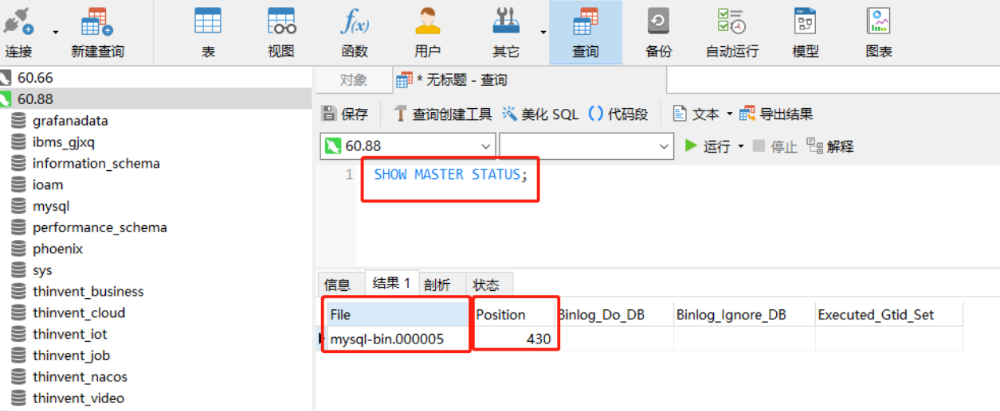
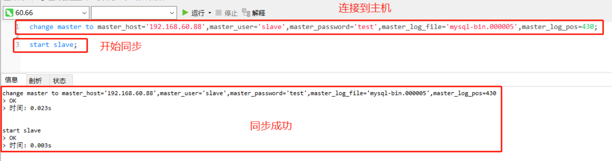
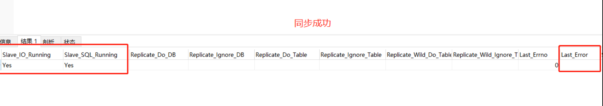

# MySQL的主从同步

摘自CSDN    **(Mysql 数据库主从同步详解)**https://blog.csdn.net/August_Leaf/article/details/135970512

MySQL 数据库的主从复制是一种常见的数据备份和高可用性解决方案。通过配置主从复制，可以实现将数据从一个 MySQL 服务器（主服务器）同步到另一个（从服务器）。


## 1. 主库（主服务器）配置

### 1.1 修改主库配置文件，启用二进制日志

进入到 /ect 目录下，修改 my.cnf 配置文件：

在配置文件 [mysqld] 最后一行，添加以下内容：

```
#mysql主库配置
server_id = 88               #集群唯一标识，主库从库不能重复(值为数据库IP)
log_bin = mysql-bin          #开启二进制日志
expire_logs_days = 7         #日志有效期（天）
```

> 内容说明：
> #集群唯一标识，主库从库不能重复，建议值取数据库 IP，避免重复（该项必须配置）:**server_id = 88**
> /#开启 mysql 二进制日志（该项必须配置）:**log_bin = mysql-bin**
> /#设置同步日志有效期（天），到期自动清理，避免磁盘占用空间过大（该项建议配置）:**expire_logs_days = 7**


### 1.2 重启数据库服务

### 1.3 创建远程连接账户

从库同步主库的数据，那么从库需要先连接到主库。初始的 root 账户只能在主库服务器中登录，在从库所在服务器中使用该账户是无法登录的，因此需要创建一个远程连接的账户：
登录数据库：`mysql -u root -p 数据库密码`
**在 Windows 中直接通过命令行登录到 mysql，需要将 mysql 添加到环境变量。**
本次创建一个远程连接账户’slave’，密码为’test’(可以根据自己需要创建不同的账户密码)，赋予账户只有复制权限：

**创建 mysql 账户：**

```sql
CREATE USER 'slave'@'%' IDENTIFIED BY 'test';
```

% 表示账户开通远程连接，允许所有 IP 通过该账户登录数据库。

**授权该账户只有复制的权限：**

```sql
GRANT REPLICATION SLAVE ON *.* TO 'slave'@'%';
```

REPLICATION SLAVE 表示仅给该账户复制的权限，`*.*` 表示可以该账户的权限对所有的数据库和数据表都有效，可以复制所有数据库和表，% 表示所有 IP 都可以通过该账户连接到数据库。

**刷新权限：**

```sql
flush privileges; 
```


### 1.4 查看 master 状态，记录二进制文件名 (File) 和位置 (Position)：

复制主机的数据库，需要先查询主机数据库二进制日志的文件名和文件所在位置的，命令如下：

```sql
SHOW MASTER STATUS;
```



### 1.5 停止主机数据库的写操作

注意：从机开始同步之前，主机不能再进行写操作，如果主机仍在进行写操作，会导致同步失败，导致同步无法继续执行。
**因此，建议在执行同步之前，先把所有连接到 mysql 数据库的 jar、tomcat、中间件、exe 程序全部停止，停止程序往主机继续写入数据，同步时确保数据的一致性。**


## 2. 从库（从机）配置

### 2.1 修改从库配置文件

修改 /etc/my.cnf 配置文件，添加以下内容

```
#mysql从机配置
#从机唯一标识，与主库不能重复(值取IP地址)
server-id=66
#设置日志保存时长
expire_logs_days=7
#数据库宕机后自动恢复日志，从库建议开启，有利于数据一致性
relay_log_recovery=1
```

### 2.2 重启从机 Mysql 服务

### 2.3 导入数据库

### 2.4 开始主从同步

重启 Mysql 后，可以设置从机的数据库同步到主机。设置同步到的主机信息（连接的 IP 和账户），执行从机执行同步命令。

登录从机数据库：`mysql -u root -p 数据库密码`

登录成功后，在从机数据库命令行执行以下指令，设置主机的连接参数。使从机可以连接到主机：

```sql
change master to master_host='主机IP',master_user='数据库账户',master_password='数据库密码',master_log_file='数据库二进制文件',master_log_pos=文件位置参数;
```

从机连接到主机后，开始同步，从机复制主机的二进制日志：

```sql
start slave;
```



### 2.5 查看从机状态

**注意：从机开始同步之前，主机不能再进行写操作，如果主机仍在进行写操作，会导致同步失败，Slave_SQL_Running 栏显示为 NO，Last_Error 会重复出现报错，导致同步无法继续执行。**

```sql
#查看从机状态
show slave status;
```

如果在数据库命令行中执行该命令，回显的信息是没有分行的，行显示的数据错乱，可以通过增加 “/G” 分行展示从机状态：

```sql
#分行查看从机状态
show slave status/G;
```



### 2.6 同步报错解决办法一

注意：从机开始同步之前，主机不能再进行写操作。如果主机仍在进行写操作，会导致同步失败，Slave_SQL_Running 栏显示为 NO，Last_Error 会重复出现报错代码 1032，导致同步无法继续执行。

主机中往数据库写的操作停止后，从机再重新执行同步操作：

```sql
start slave;
```

