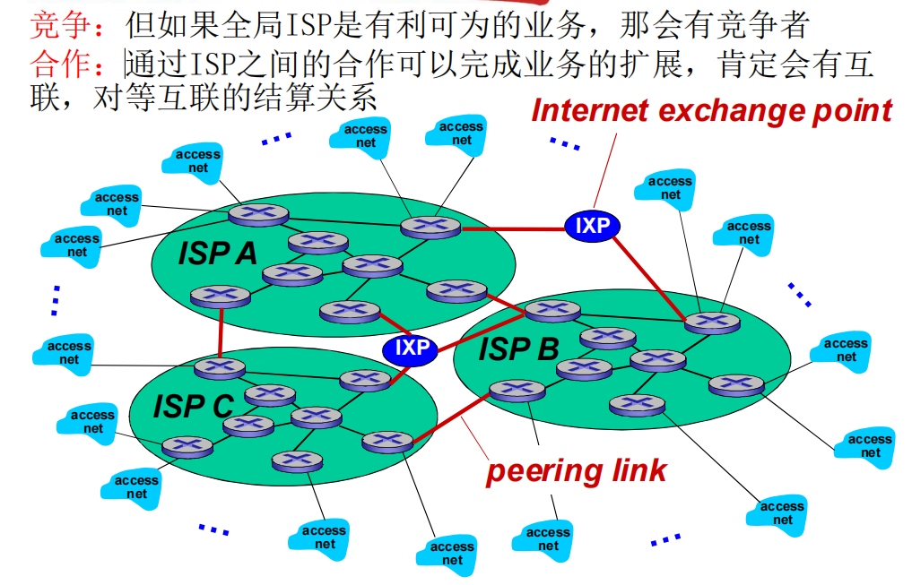

# 计算机网络

**中科大郑烇、杨坚全套《计算机网络（自顶向下方法 第7版，James F.Kurose，Keith W.Ross）》课程**

https://www.bilibili.com/video/BV1JV411t7ow?p=8&vd_source=cfdf732e413781c1866d0c497afc002f

**个人学习摘录**

## 什么是网络？

**网络：由节点和边构成的拓扑结构**

计算机网络：由联网的计算机构成的整个系统**(节点，边，协议)**

**节点：**我们自己的主机`电脑，手机，联网的冰箱等。。。`,可以是源也可以是目标；

>  主机：可以运行网络应用程序的端系统
>
> 而还有一些既非源也非目标的节点：数据交换节点

数据交换节点：路由器，交换机，高层的负载均衡设备等网络交换设备，它们是数据中转节点，相互配合将数据传送到正确的目标

**边：通信链路**

光纤，电缆，无线电，卫星等

接入网链路：主机到互联网的链路

主干链路：路由器间的链路

**协议：定义了网络中的规则和标准**

协议定义了在两个或多个通信实体之间交换的报文**格式和次序**，以及在报文传输和/或接收或其他事件方面所**采取的动作**

> 对等层的实体在通信中遵守的规则的集合
>
> 应用层的协议，网络层的协议等等....只有对等层间的实体才能互相交流

**互联网：**紧密的节点和边连在一起就是一个个网络，**互联网就是由一堆小的网络通过网络互联设备如路由器，连在一起**就是互联网`网络的网络`						从另外一个角度来说，互联网也是**分布式的应用**，以及为分布式应用提供通信服务的**基础设施**。

### **什么是Internet?**

- **internet (互联网或互连网) 是一个通用名词，它泛指多个计算机网络互连而成的网络**。在这些网络之间的通信协议可以是任意的。

- **Internet（因特网）则是一个专用名词**，它指**当前全球最大的、开放的、由众多网络互连而成的特定计算机网络**，它采用 TCP/IP 协议族作为通信的规则

普通用户是如何接入到因特网的呢？

**通过 ISP 接入因特网**

ISP 可以从因特网管理机构申请到成块的 IP 地址，同时拥有通信线路以及路由器等联网设备。任何机构和个人只需缴纳费用，就可从 **ISP 的得到所需要的 IP 地址**。

**因为因特网上的主机都必须有 IP 地址才能进行通信，这样就可以通过该 ISP 接入到因特网**

> 因特网服务提供者 `ISP`(`I`nternet `S`ervice `P`rovider)
>
> **中国的三大 `ISP`：中国电信，中国联通和中国移动**

## 网络结构

### 网络边缘：

主机，分布式的应用程序（客户端和服务器）`edge`

**边缘通过接入系统接入网络核心**，通过核心，源才能将数据发送到目标

> c/s模式： 客户端向服务器请求、接收服务 。如Web浏览器/服务器，email
>
> P2P模式：一台主机既可以作为服务器也可以作为客户端，如迅雷，只有很少的服务器甚至没有

- **面向连接服务TCP** `传输控制协议`

**可靠**地、按顺序地传送数据 ：**确认和重传**

**流量控制** ：发送方不会淹没接收方

 **拥塞控制** ：当网络拥塞时，发送方降低发送速率

应用：HTTP (Web), FTP (文件传送), Telnet (远程登录), SMTP (email)

- **无连接服务UDP** `用户数据报协议`

无连接；不可靠数据传输；无流量控制；无拥塞控制

应用：流媒体、远程会议、 DNS、 Internet电话

### **网络核心：**

互连着的路由器， 网络的网络   `core`

相当于源主机与目标主机的切换开关，能让数据正确的发送到目标

**两类网络核心：分组交换和电路交换**

- **电路交换**：为每个呼叫预留一条专有电路：如电话网

端到端的资源被分配给从源端到目标端的呼叫 “call”：

图中，每段链路有4条线路：该呼叫采用了上面链路的第2个线路，右边链路的第1个线路（piece）

这是**独享资源**，每个呼叫一旦建立起来就能够**保证性能**，如果呼叫没有数据发送，被分配的资源就会被浪费 

>  通常被传统电话网络采用

> **电路交换不适合计算机之间的通信**
>
> 1.**连接建立时间长**
>
> 2.计算机之间的通信有**突发性**，如果使用线路交换，则浪费的片较多
>
> 即使这个呼叫没有数据传递，其所占据的片也不能够被别的呼叫使用
>
> 3.如果核心节点被损毁，影响的通信范围就会很广

- **分组交换**`多路复用`：以分组为单位存储-转发方式  

资源共享，按需使用

网络带宽资源不再分分为一个个片，传输时**使用全部带宽**

主机之间传输的数据被分为一个个**分组**，每个节点将分组进行**存储后然后转发**

 **存储-转发：**分组每次移动 `一跳`（ hop ）, 在转发之前，节点必须收到整个分组 

>  但是**延迟比线路交换要大** 且会产生链路的**排队时间**

- **分组交换 vs 电路交换**

  分组的优点

  - 同样的网络资源，分组交换允许更多用户使用网络
  - 分组交换适合于对突发式数据传输：资源共享；简单，不必建立呼叫

  分组的缺点：

  - 分组交换过度使用会造成网络拥塞：分组延时和丢失。此时需要协议来进行约束

 

**网络核心的关键功能**

- **路由**: 决定分组采用的源到目标的路径

- **转发:** 将分组从路由器的输入链路转移到输出链路

### **接入网和物理媒体：**

有线或无线的通信链路，在核心中也有这一结构

**怎样将端系统和边缘路由器连接？**

- 住宅接入：

  - modem

    将上网数据调制加载音频信号上，在电话线上传输，在局端将其中的

    数据解调出来；反之亦然

    > 最早的上网方式，现以及淘汰
    >
    > 56Kbps 的速率直接接入路由器(通常更低)，而且不能同时上网和打电话：不能总是在线

  -  digital subscriber line (DSL)

    采用现存的到交换局DSLAM的电话线 ，DSL线路上的数据被传到互联网  DSL线路上的语音被传到电话网，也就是可以实现电话上网一起

  - 线缆网络 `有线电视`

    上下行：划分的不同的带宽区域

    在不同频段传输不同信道的数据，数字电视和上网数据

  - 家庭网络

    常见的设备连接WIFI模式 , 无线路由器接入互联网

    > 无线接入网络：LANs 用于建筑物内部
    >
    > ​						广域无线接入：运营商提供，4G等

**物理媒体有哪些？**

- 同轴电缆：两根同轴的铜导线：基带电缆；宽带电缆：

  ​		光纤和光缆`另一种材质的线，更加安全`

- 无线链路：地面微波；LAN `wifi`；wide-area `蜂窝网络`；卫星

##  Internet结构和ISP

端系统通过接入**ISP**s (Internet Service Providers)连接到互联网：**住宅，公司和大学的ISPs**

接入ISPs相应的必须是互联的，因此任何2个端系统可相互发送分组到对方

### ***给定数百万接入ISPs，如何将它们互联到一起***

1.全连接

2.接入全球ISP

3.竞争下的全局ISP

4.竞争下的合作ISP`对等连接和互联网交换点`

5.出现区域接入

6.出现内容提供商`ICP`给全球用户提供服务

- 网络结构中的几种接入模式

  **POP**：高层ISP面向客户网络的接入点，涉及费用结算；

  **对等接入**：2个ISP对等互接，不涉及费用结算

  **IXP**：多个对等ISP互联互通之处，通常不涉及费用结算

  **ICP**：自己部署专用网络，同时和各级ISP连接

## 分组延时，丢失和吞吐量

### 分组丢失和延时是怎样发生的？

1. 分组到达链路的速率超过了链路输出的能力，此时进入缓冲区进行排队产生排队**延时**；
2. 节点处理**延时**：检查 bit级差错；检查分组首部和决定将分组导向何处

3. 将分组发送到链路上的时间产生的传输**延时**`存储转发延时，类似于加油站中给一辆车加完油送走的整个流程时间`
4. 传播**延时**：指数据从发送端到接收端的传播所需的时间`类似于汽车从一个加油站到另一个加油站的时间`

5. 分组到达时没有缓冲区则被丢失，造成**分组丢失**。丢失的分组可能会被前一个节点或源端系统重传，或根本不重传

### 吞吐量：`重要指标`

在源端和目标端之间**传输的速率**    

***瞬间吞吐量：***在一个时间点的速率；***平均吞吐量：***在一个长时间内平均值

> 吞吐量高通常表示系统在单位时间内能够处理的请求或数据量较大，但吞吐量高并不一定意味着用户体验一定好
>
> 还要看**响应时间**，**并发处理能力**，**可靠性**，**是否负载均衡**等方面
>
> 单纯的快是没有用的！

## *协议层次及服务模型 `重要`

网络是一个复杂的系统，使用层次化方式实现复杂网络功能

### 计算机网络中实现层级化的模式：

- 将网络功能**分层**为明确的功能层次，每一层实现了其中一个或一组功能。功能中**有其上层可以使用的功能：服务**

- 本层协议实体相互交互（同层级），执行本层的协议动作，目的是：实现本层功能，通过**接口**为上层提供更好的**服务**

- 在**实现本层协议的时候，直接利用了下层所提供的服务**，也就是说：

  **A层级的服务**：借助**B层服务**实现的同层协议实体之间交互带来的A层可以利用的新功能 + **CDE层等更下层**所提供的服务

> 同层级之间协议的实现是为了给上层提供服务

### 服务和服务访问点

- 服务：低层实体向上层实体提供它们之间的**通信的能力**

- 原语：上层使用下层服务的形式，高层使用低层提供的服务，以及低层向高层提供服务都是通过**服务访问原语来进行交互**的

- 服务访问点 SAP：上层使用下层提供的服务通过层间的接口。下层的一个实体支撑着上层的多个实体，**SAP有标志不同上层实体的作用**

  > 类似于寄信，由邮寄员根据信上的内容将信送到指定的位置

​	

### 服务的类型

- **面向连接的服务** 

  **连接**：两个通信实体为进行通信而建立的一种结合

  **面向连接的服务通信的过程**：**建立连接`握手`，通信，拆除连接**

  **面向连接的服务的例子**：网络层的连接被成为虚电路

  **适用范围**：对于大的数据块要传输; 不适合小的零星报文

  **特点：保序**

  > 应用场景：传输大量数据或需要确保数据完整性和顺序性的场合，如文件传输等

- **无连接的服务**

  **无连接服务**：两个对等层实体在通信前**不需要建立一个连接，不预留资源，不需要通信双方都是活跃**

  **特点**：不可靠、可能重复、可能失序

  **适用范围**：**适合传送零星数据**

  > 应用场景：适用于实时性要求较高、数据量较小、对传输速度要求较高的场景，如实时音视频传输、在线游戏等

### 服务和协议的联系

**服务与协议的区别**

- 服务`垂直`：低层实体向上层实体**提供它们之间的通信的能力**，是通过原语来操作的

- 协议`水平` ：对等层实体之间在相互通信的过程中，需要**遵循的规则的集合**

**服务与协议的联系**

- 本层**协议的实现要靠下层提供的服务来实现**

- 本层**实体通过协议为上层提供更高级的服务**

### 分层处理和实现复杂系统的好处？

- 概念化：结构清晰，便于标示网络组件，以及描述其相互关系

- 结构化：模块化更易于维护和系统升级

  > 改变某一层服务的实现不影响系统中的其他层次

### *Internet 协议栈

- **应用层: 网络应用** 

  为人类用户或者其他应用进程**提供网络应用服务** 

  > 协议：FTP, SMTP, HTTP,DNS

- **传输层: 主机之间的数据传输** 

  在网络层提供的端到端通信基础上，细分为**进程到进程**，**将不可靠的通信变成可靠地通信** 

  > 协议：TCP, UDP

- **网络层: 为数据报从源到目的选择路由** 

   **主机主机**之间的通信，**端到端**通信，不可靠 

  >  协议：IP, 路由协议

- **链路层: 相邻网络节点间的数据传输** 

  2个相邻2点的通信，点到点通信，可靠或不可靠 

  > 协议：点对对协议PPP, 802.11(wifi), Ethernet

- **物理层: 在线路上传送bit** 

> 物理层:把信号据转化为01 bit
>
> 链路层在**相邻两点**之前传送帧为单位的数据 `P2P`
>
> 网络层在链路层基础上解决**端到端**的以分组为单位数据传输
>
> 传输层在网络的端到端基础上实现**进程到进程**以报文段为单位的数据传输
>
> 应用层在传输层的基础上完成应用报文的交互

**各层次的协议数据单元**

应用层：报文(message)

传输层：报文段(segment)：TCP段，UDP数据报

网络层：分组packet（如果无连接方式：数据报datagram）

数据链路层：帧(frame)

物理层：位(bit)

### *ISO/OSI 参考模型、

OSI（Open Systems Interconnection，开放式系统互联）参考模型是国际标准化组织（ISO）制定的一个通信协议的参考模型

新增了两层，这些功能原本由应用层完成

- **表示层**: 负责数据的格式转换、编码和加密。提供了**数据的表示、转换和加密解密功能**，保证了**数据的安全性和可读性**

- **会话层**: 负责建立、管理和终止会话session，提供了**会话的控制和同步功能**，确保了**数据的安全传输和顺序交付**

源端将数据进行大的封装后交由交换机两层解封装，交由路由器三层解封装，到达目标主机后再进行一个最终的大解封装

## 小结

需要了解的概念部分汇总

- 组成角度看， 什么是互联网 ？

- 从服务角度看互联网 

- 应用之间的交互

- 数据交换 

- 比较 线路交换和分组交换

- 分组交换的2种方式 

- 接入网和物理媒介 

- ISP层次结构

- 分组交换网络中延迟和丢失是如何发生的

-  网络的分层体系结构