# 应用层

## 应用层协议原理

### 网络应用的体系结构

- 客户-服务器模式（C/S:client/server）

  服务器：一直运行， 有固定的IP地址和周知的端口号

  ​	特点：数据中心扩展；但**扩展性差**

  客户端： 由客户端主动与服务器通信，与服务器不同，它与互联网是**间歇性的连接**。客户端可能是**动态IP 地址**，且不直接与其它客户端通信

  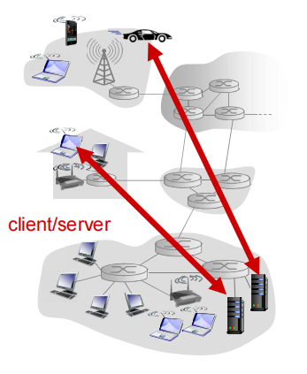

- 对等模式(P2P:Peer To Peer)

  这一模式下（几乎）**没有一直运行的服务器**。

  **任意端系统之间可以进行通信： 每一个节点既是客户端又是服务器**

  自扩展性 - 新peer节点带来新的服务能力，当然也带来新的服务请求

  参与的主机间歇性连接且可以改变IP 地址

  缺点：难以管理  `不能知道每一节点的上下限`

  例子: 文件分发`迅雷` ,流媒体`直播`

- 混合体：客户-服务器和对等体系结构

  **即时通信**

  在线检测：`c/s`

  - 当用户上线时，向中心服务器注册其IP地址

  - 用户与中心服务器联系，以找到其在线好友的位置

  两个用户之间聊天：`P2P`

  **Napster**

  文件搜索：`c/s`

  - 主机在中心服务器上注册其资源

  - 主机向中心服务器查询资源位置

  文件传输：`P2P`

### 进程通信

**进程**：在主机上运行的应用程序

**客户端进程**：发起通信的进程

**服务器进程**：等待连接的进程

**分布式进程通信需要解决的三个问题**

- 问题1：进程标示和寻址问题  `目标`

  进程为了接收报文，必须有一个即：SAP （32位IP地址+端口号+协议）

​		一个进程：用IP+port端口号标示 端节点

- 问题2：传输层-应用层是如何提供服务  `方法`

  >  socket概念和TCPsocket，请全局搜索  **什么是socket**  

  如果Socket API 每次传输报文，都携带如此多的信息，太繁琐易错，不便于管理 ,于是用一个代号标示通信的双方或者单方：socket   

  **UDP socket：**

  UDP服务，两个进程之间的通信需要之前无需建立连接，因此，只能用一个整数`本地ip，udp端口二元组`表示本应用实体的标示，但是在发送报文时，必须要指定对方的ip和udp port

  >  因为udp面向无连接，不像tcp需要会话所以不保存对方ip和端口，发出去就完事儿了 

  **套接字（Socket）**

  进程向套接字发送报文或从套接字接收报文    套接字<->门户

  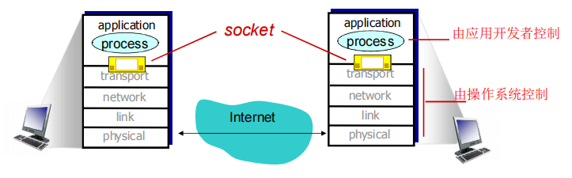

  

- 问题3：如何使用传输层提供的服务（协议），实现应用进程的报文交换  `行为`

  **定义应用层协议**：报文格式，解释，时序等

  **应用层协议**

  定义了：运行在不同端系统上的应用进程如何相互交换报文

  > 报文类型，语法，语义，响应的规则

  **传输层向应用层提供服务的指标：**

  数据丢失率；延迟，吞吐，安全性

  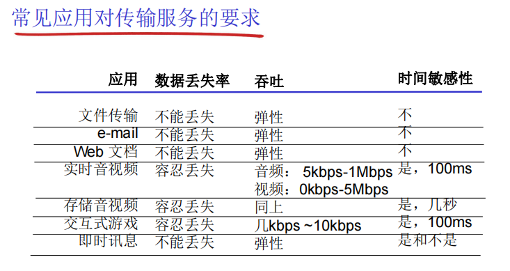

  - Internet 传输层提供的服务

    **TCP 服务：**可靠的传输服务，流量控制，拥塞控制

    **UDP服务：**不可靠数据传输

  > UDP存在的必要性
  >
  > **1.能够区分不同的进程**，而IP服务不能
  >
  > **2.无需建立连接**，省去了建立连接时间
  >
  > **3.不做可靠性的工作**，例如检错重发，适合那些对实时性要求比较高而对正确性要求不高的应用
  >
  > 4.应用能够按照设定的速度发送数据

  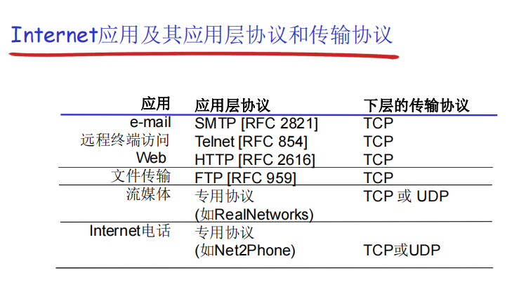

  

  **如何实现安全TCP?**

  TCP/UDP都没有加密，甚至密码通过明文互联网传输

  **SSL:**安全套接字层

  在TCP上面实现，提供加密的TCP连接

  SSL在应用层，应用采用SSL库，SSL库使用TCP通信

  `后面会详细介绍`

​	

## Web 与 HTTP

Web页：由一些对象组成（HTML文件、JPEG图像、Java小程序、声音剪辑文件等）

Web页含有一个基本的HTML文件，该基本HTML文件又包含若干对象的引用（链接），通过URL对每个对象进行引用

### HTTP概况

**HTTP: 超文本传输协议**    `Web的应用层协议`

**HTTP使用TCP:**

1. 客户发起一个与服务器的TCP连接 (建立套接字) ，端口号为 80
2. 服务器接受客户的TCP连接
3. 在浏览器`HTTP客户端`与 Web服务器`HTTP服务器 server`交换HTTP报文 `应用层协议报文`
4. TCP连接关闭

> HTTP是**无状态**的，服务器并不维护关于客户的任何信息

### HTTP连接

- 非持久HTTP

  最多只有一个对象在TCP连接上发送，下载多个对象需要多个TCP连接`HTTP/1.0使用`

- 持久HTTP

  多个对象可以在一个（在客户端和服务器之间的）TCP连接上传输`HTTP/1.1 `默认使用  

  > 在A客户端与服务器完成传输后不关闭连接，可以与其他客户端请求继续交互

**响应时间模型**

**往返时间RTT**（round-trip time）：一个小的分组从客户端到服务器，在回到客户端的时间（传输时间忽略）

响应时间： 一个RTT用来发起TCP连接和 一个 RTT用来HTTP请求并等待HTTP响应  ——>  **文件传输时间共：2RTT+传输时间**

### HTTP请求报文

两种类型的HTTP报文：**请求、响应**

#### 请求

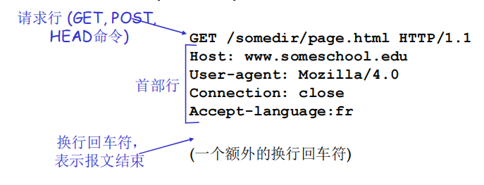

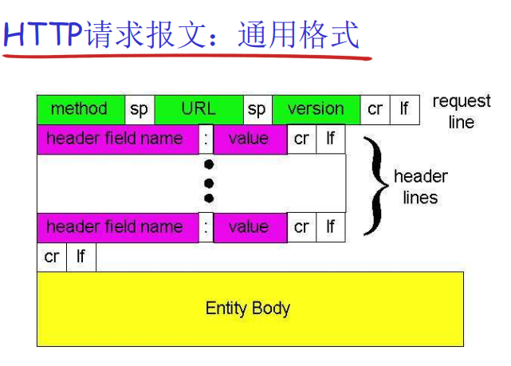

> 请求行；首部行；请求体
>
> 报文是没有明确界限的，依靠换行回车符标识

**提交表单输入**

- Post方式： 网页通常包括表单输入， 包含在请求体中的输入被提交到服务器

- URL方式：方法：GET输入通过请求行的URL字段上载

**方法类型**

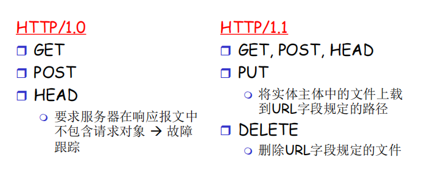

#### 响应

**HTTP响应报文**

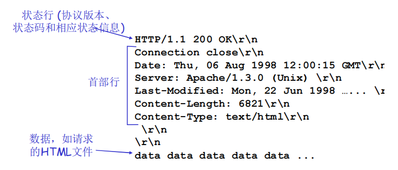

> 状态行；首部行；响应数据

**HTTP响应状态码**

一些状态码的例子：

200 OK：请求成功，请求对象包含在响应报文的后续部分

301 Moved Permanently：请求的对象已经被永久转移了；新的URL在响应报文的Location:首部行中指定；客户端软件自动用新的URL去获取对象

400 Bad Request：一个通用的差错代码，表示该请求不能被服务器解读

404 Not Found：请求的文档在该服务上没有找到

505 HTTP Version Not Supported

### 用户-服务器状态：cookies

大多数主要的门户网站使用 cookies，帮助http做状态的维护

**4个组成部分：**

1. 在**HTTP响应报文**中有一个cookie的首部行

2. 在**HTTP请求报文**含有一个cookie的首部行

3. 在用户端系统中保留有一个**cookie文件**，由用户的浏览器管理

4. 在Web站点有一个**后端数据库**

**Cookies能带来什么：**维护客户端的状态、

**Cookies的隐私危害**：

1. Cookies允许站点知道许多关于用户的信息，它可能将知道的东西卖给第三方。

2. 使用重定向和cookie的搜索引擎还能知道用户更多的信息如通过某个用户在大量站点上的行为，了解其个人浏览方式的大致模式

3. 广告公司从站点获得信息

### Web缓存 `字面意义的缓存`

**目标：不访问原始服务器，就满足客户的请求**

缓存既是客户端又是服务器，通常是由ISP安装 (大学、公司、居民区ISP)

**浏览器先将所有的HTTP 请求发给缓存**

- 在缓存中的对象——>缓存直接返回对象

- 如对象不在缓存，缓存请求原始服务器，然后再将对象返回给客户端

**为什么要使用Web缓存？**

- 降低客户端的请求响应时间 

- 可以大大减少一个机构内部网络与Internent接入链路上的流量

- 互联网大量采用了缓存：可以使较弱的ICP也能够有效提供内容

## FTP: 文件传输协议

**向远程主机上传输文件或从远程主机接收文件**

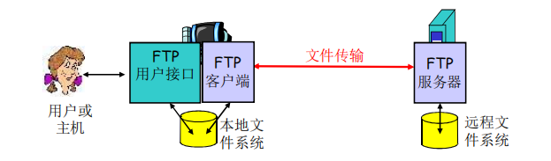

1. FTP客户端与FTP服务器通过端21联系，并使用TCP为传输协议

2. 客户端通过控制连接获得身份确认

3. 客户端通过控制连接发送命令，浏览远程目录

4. 收到一个文件传输命令时，服务器打开一个到客户端的数据连接

5.  一个文件传输完成后，服务器关闭连接

## 电子邮件（EMail）

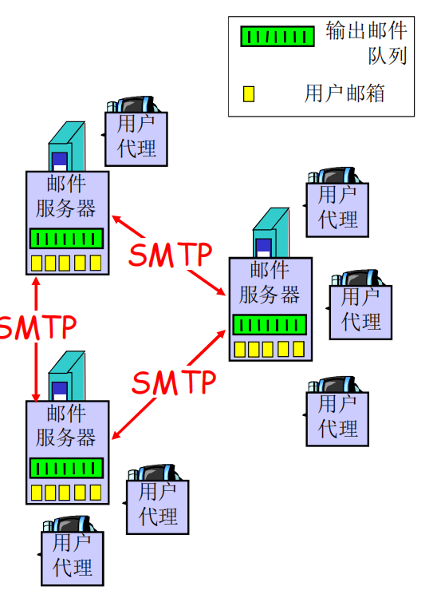

3个主要组成部分：

- 用户代理

  又名 “邮件阅读器”，负责撰写、编辑和阅读邮件

  如Outlook、QQmail等

  它们输出和输入邮件都保存在服务器上

- 邮件服务器

  管理邮箱和维护发送给用户的邮件

  邮件服务器之间的SMTP协议：发送email报文

- 简单邮件传输协议：SMTP

  使用TCP在客户端和服务器之间传送报文，端口号为25

  它是直接传输的，数据从发送方服务器到接收方服务器

  传输的3个阶段

  - 握手

  - 传输报文

  - 关闭

## DNS（域名解析）

它是一个给应用使用的应用`web，ftp`，而不是给用户用的

运行在UDP之上端口号为53的**应用服务**，它是**核心的Internet功能**之一，但以网络边缘的应用层协议实现

### **DNS的必要性**

​	IP地址标识了主机、路由器，但IP地址不好记忆，不便人类使用，我们倾向于使用一些有意义的**字符串**来标识Internet上的设备，如`www.xxx.com`

​	用户提供要访问机器的“字符串”名称，交由DNS负责转换成为真正的网络地址

### **系统需要解决的问题**

- 问题1：如何命名设备

  **DNS的主要思路**

  - **分层**的、基于域的命名机制

  - 若干**分布式的数据库**完成名字到IP地址的转换

  **DNS主要目的**

  - 实现主机名-IP地址的转换

  - 别名到规范名字的转换 

    比如：我的QQ邮箱是别名，但邮箱实际用的是服务器的域名

  - 负载均衡

    在提供很多服务器的的应用上实现负载均衡

  

  **DNS域名结构**

  **域名**：从本域往上，直到树根，中间使用“.”间隔不同的级别

  例如：ustc.edu.cn，auto.ustc.edu.cn

  域的域名：可以用于表示一个域；主机的域名：一个域上的一个主机

  

  **Internet 根被划为几百个顶级域**

  - 通用的(generic)：.com; .edu ; .gov ; .int ; .mil ; .net ; .org.firm ; .hsop ; .web ; .arts ; .rec ; 

  - 国家的(countries)：.cn ; .us ; .nl ; .jp

  每个(子)域下面可划分为若干子域，比如某个大学的域名在edu域名之下

  **域名的管理**

  一个域管理其下的子域 `.jp 被划分为 ac.jp co.jp ，.cn 被划分为 edu.cn com.cn`

  > **创建一个新的域，必须征得它所属域的同意！**
  >
  > **域与物理网络无关**：域遵从组织界限，而不是物理网络；域的划分是**逻辑**的，而不是物理的

  

- 问题2：如何完成名字到IP地址的转换

  在真实的网络世界中，全世界所有的域名不是由一个或几个名字服务器维护的，那样故障了一台影响很大，并且扩展性差维护也很困难

  **区域**

  将DNS名字空间划分为互不相交的区域，每个区域都是树的一部分，也就是说每个区域有各自的名字服务器

  **1.权威DNS服务器**： **提供组织机构服务器（如Web和mail）可访问的主机和IP之间的映射**

  >  组织机构可以选择实现自己维护或由某个服务提供商来维护

  **2.顶级域(TLD)服务器**：负责顶级域名（如com, org, net, edu和gov）和所有国家级的顶级域名（如cn, uk, fr, ca, jp ）

  > - **共同点**：权威 DNS 服务器和 TLD 服务器都是 DNS 系统中的重要组成部分，负责管理和提供 DNS 信息，以进行域名解析。
  > - **不同点**：
  >   - **范围不同**：权威 DNS 服务器管理特定域名区域的 DNS 记录，而 TLD 服务器管理特定顶级域名的 DNS 信息。
  >   - **职责不同**：权威 DNS 服务器负责直接提供与特定域名相关的 DNS 记录信息，而 TLD 服务器负责管理对应顶级域名下的所有子域名的 DNS 信息。
  >   - **关联性不同**：权威 DNS 服务器与具体域名相关联，而 TLD 服务器与特定顶级域名相关联

  **3.本地名字服务器**：并不严格属于层次结构，每个ISP都有一个本地DNS服务器。当一个主机发起一个DNS查询时，查询被送到其本地DNS服务器，如果服务器缓存中有就不用再往上发了直接找到ip

  

  **区域名字服务器维护资源记录**

  资源记录：

  **作用：**维护 域名-IP地址(其它)的映射关系

  **位置：**Name Server的分布式数据库中

  

  **名字解析过程**：

  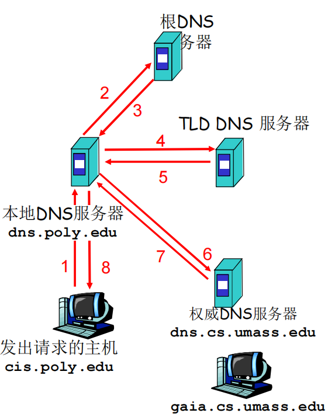

  迭代查询：

  根（及各级域名）服务器返回的不是查询结果，而

  是下一个NS的地址， 最后由权威名字服务器给出解析结果

  当前联络的服务器给出可以联系的服务器的名字：

  ` “我不知道这个名字，但可以向这个服务器请求”`

- 问题3：如何维护：增加或者删除一个域，需要在域名系统中做哪些工作

  1. 在**上级域的名字服务器中增加两条记录**，指向这个新增的子域的域名 和 域名服务器的地址

  2. 在**新增子域的名字服务器上运行名字服务器**，负责本域的名字解析： 名字->IP地址

​	

### 攻击DNS `DNS比较健壮`

1. DDoS 攻击：对根服务器或TLD服务器进行流量轰炸攻击：发送大量ping
   - 根目录服务器配置流量过滤器，防火墙
   - Local DNS 服务器缓存了TLD服务器的IP地址, 因此无需查询根服务器或TLD服务器

2. 重定向攻击：`截取伪造`

   中间人攻击： 截获查询，伪造回答，从而攻击某个（DNS回答指定的IP）站点

   DNS中毒：发送伪造的应答给DNS服务器，希望它能够缓存这个虚假的结果

   

## P2P 应用

概念见上方   [跳转](#网络应用的体系结构)

讲解内容复杂，仅了解概念

## CDN（内容分发网络）

 服务器如何通过网络向上百万用户同时流化视频内容 (上百万视频内容)?

- *选择1:* 单个的、大的超级服务中心“mega server”

  虽然实现简单，但是由于是单个机器，总有带宽瓶颈，单点故障和不可扩展等限制

- 选项2：通过CDN，全网部署缓存节点，存储服务内容，**就近**为用户提供服务，提高用户体验

  用户从CDN中请求内容，重定向到**最近的拷贝，请求内容** 。如果网络路径拥塞，可能选择不同的拷贝

## TCP 套接字编程

**Socket编程：**

应用进程使用传输层提供的服务才能够交换报文，实现应用协议，实现应用

> TCP/IP：应用进程使用**Socket API**访问传输服务

socket: 分布式应用进程之间的门，**传输层协议提供的端到端服务 接口**

TCP协议下的socket类型：可靠的、字节流的服务

**套接字：`一套用于连接的数字`**

应用进程与端到端传输协议（TCP或UDP）之间的门户

### TCP套接字编程过程

0. **服务器首先运行，等待连接建立**

1. 服务器进程必须先处于运行状态

   - 创建  负责接收连接请求的socket `'欢迎socket'`

   - 和本地端口捆绑

   - 在欢迎socket上阻塞式等待接收用户的连接

     

   **客户端主动和服务器建立连接：**

2. 创建客户端本地套接字，捆绑到本地port

3. 指定服务器进程的IP地址和端口号，与服务器进程连接

   

   **当与客户端连接请求到来时**

4. 服务器接受来自用户端的请求，解除阻塞式等待，返回一个新的socket（与欢迎socket不一样），然后与客户端通信

> 连接API调用有效时，客户端P与服务器就是建立了TCP连接

## UDP Socket编程

UDP: 在客户端和服务器之间没有连接

- 没有握手 

- 发送端需要在**每一个报文中**明确地**指定目标的IP地址和端口号**

- 服务器必须从收到的分组`报文/数据包`中从提取出发送端的IP地址和端口号

> UDP: 传送的数据可能乱序，也可能丢失

**TCP/UDP主要差异**

- TCP在客户端和服务器进程之间提供了**可靠**的、字节流（管道）服务

- UDP 为客户端和服务器提供**不可靠**的字节组的传送服务

## 小结 （需要了解的知识点）

- 应用程序体系结构

- Internet传输层服务模式

- 流行的应用层协议

- Socket编程

- 应用层协议报文类型：请求/响应报文

- **学习协议的知识**

  ........

