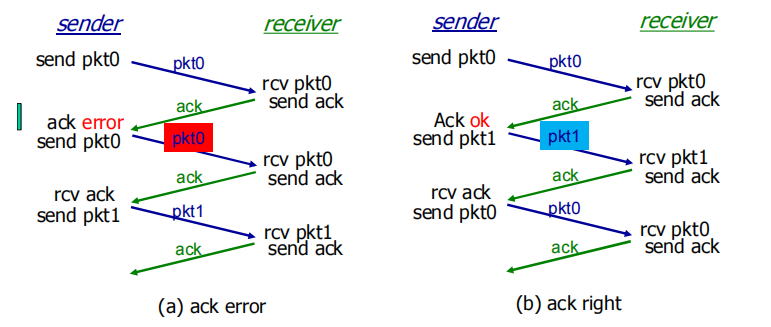
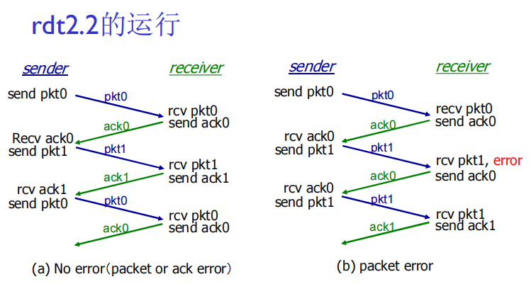
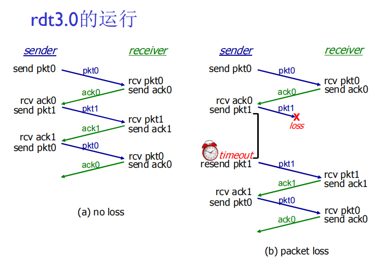
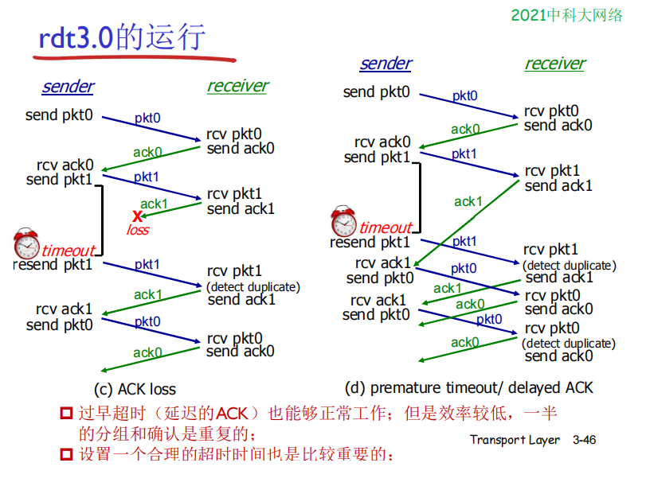
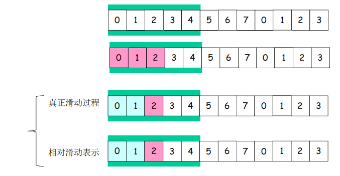
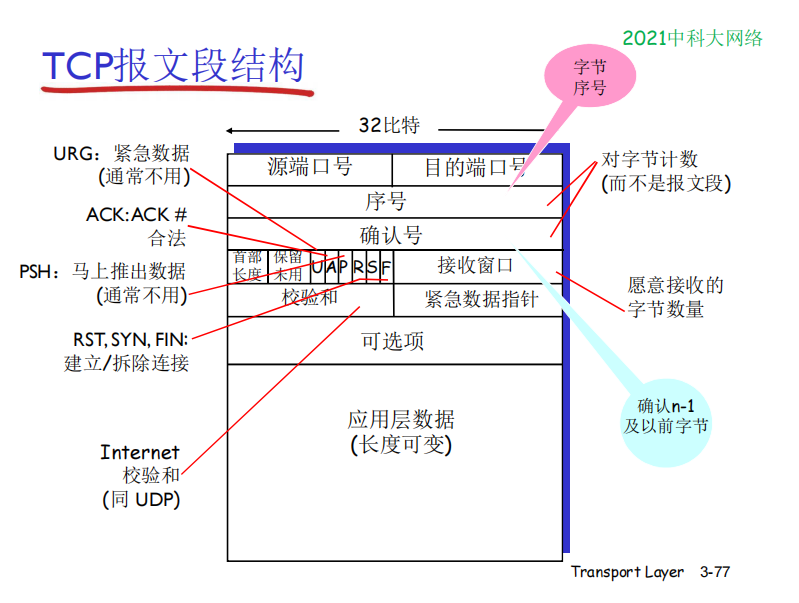
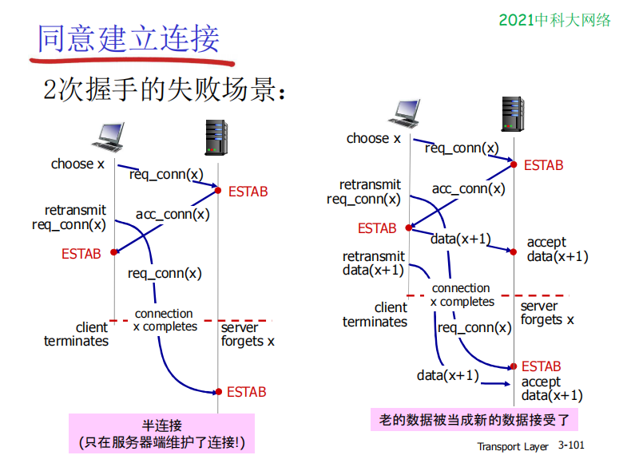
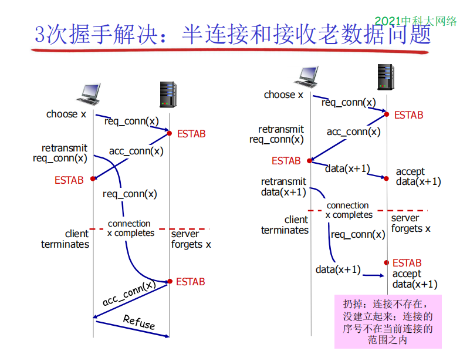
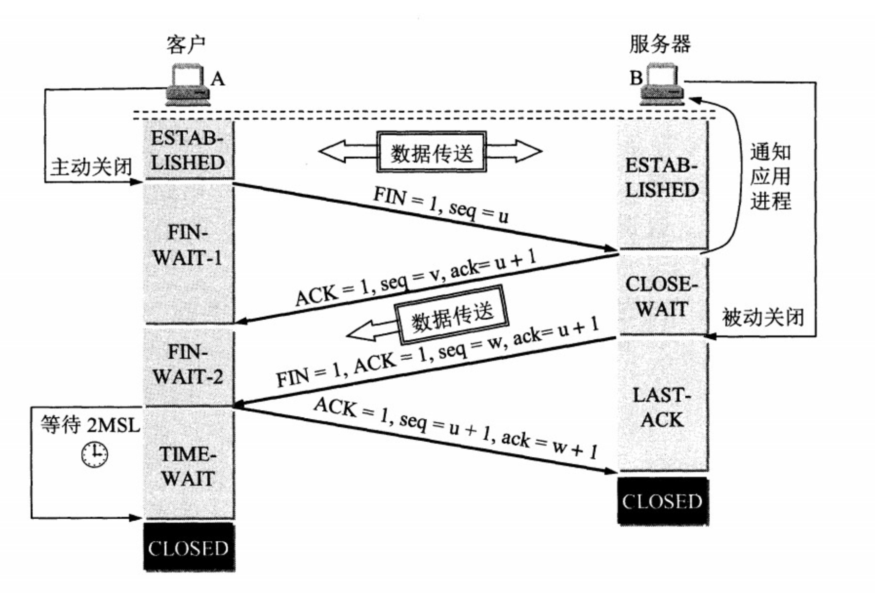

# 传输层 `重要`

- 理解传输层的工作原理
- 学习Internet的传输层协议

## 概述和传输层服务

传输层服务：为运行在不同主机上的**应用进程**提供**逻辑通信**，类似于两端上的**进程之间**的逻辑通信而非主机

- 发送方：将应用层的报文分成报文段，然后传递给网络层 

- 接收方：将报文段重组成报文，然后传递给应用层

**两大传输层协议：TCP和UDP**

### 传输层 vs. 网络层

- 网络层：**主机之间**的**逻辑通信**，由于网络层向上层提供的服务可能重拍出错丢失，也就是不可靠的，需要依赖传输层进行弥补
- 传输层：**进程间**的**逻辑通信**，对网络层的服务出现的数据丢失、顺序混乱等不足进行增强

> 有些服务是可以加强的：不可靠 -> 可靠；安全但有些服务是不可以被加强的：带宽，延迟

### Internet传输层协议

- **TCP**：是可靠的、保序的传输
  - **多路复用、解复用**
  - **拥塞控制**
  - **流量控制**
  - 建立连接

- **UDP**：是不可靠、不保序的传输

  - **多路复用、解复用**

  -  没有为尽力而为的IP服务添加更多的其它额外服务

> 都不提供的服务：延时保证，带宽保证

## 多路复用与解复用

概念：在同一通信信道上同时传输多个信号或数据流的能力，以及将多个信号或数据流分开并送达各自的接收方的过程

`说白了就是计算机能从发送出去和接受来的数据中分得清，各是发给哪些目标和数据是从哪些目标来的`

**解复用作用**：TCP或UDP实体采用哪些信息，将段的数据部分交给正确的socket，从而交给正确的进程

### 无连接(UDP)多路解复用

1. 在接收端，UDP套接字用二元组标识 (目标IP地址、目标端口号)

2. 当主机收到UDP报文段：检查报文段的目标端口号用该端口号将报文段定位给套接字

3. 如果两个不同源IP地址/源端口号的数据报，但是有相同的目标IP地址和端口号，则被定位到相同的套接字

### 面向连接(TCP)的多路复用

TCP套接字:四元组本地标识：**源IP地址， 源端口号， 目的IP地址，目的端口号**

**解复用**：接收主机用这四个值来将数据报定位到合适的套接字

## 无连接传输：UDP 

用户数据包协议 ：**U**ser **D**atagram **P**rotocol

UDP 是 **尽力而为** 的服务，报文段可能丢失，或乱序

### 无连接

- UDP发送端和接收端之间没有握手

- 每个UDP报文段都被独立地处理

**UDP 被用于:** 

- 流媒体（丢失不敏感，速率敏感、应用可控制传输速率） 

- DNS

> UDP也可以提供可靠的服务，但需要在**应用层增加可靠性**

### 为什么要有UDP?

- 不建立连接 `建立连接会增加延时`

- 简单：在发送端和接收端没有连接状态

-  报文段的头部很小 `开销小`

- 无拥塞控制和流量控制：这样UDP可以尽可能快的发送报文段

## *可靠数据传输的原理（rdt）

rdt在应用层、传输层和数据链路层都很重要，是网络Top 10问题之一

> 信道的不可靠特点决定了可靠数据传输协议（ rdt ）的复杂性
>
> 需要向上层提供可靠服务，但我依赖的服务却不可靠

我们将按以下方式简化问题：

- 渐增式地开发可靠数据传输协议（ rdt ）的**发送方和接收方**

- 只考虑**单向数据传输** `但控制信息是双向流动的`，双向的数据传输问题实际上是2个单向数据传输问题的综合

- 使用**有限状态机 (FSM)** 来描述发送方和接收方

### Rdt1.0： 在可靠信道上的可靠数据传输

下层的信道需要没有比特出错， 没有分组丢失

发送方和接收方的FSM

- 发送方将数据发送到下层信道

- 接收方从下层信道接收数据

> 相当于可靠信道上啥也不干，一个传一个收

### Rdt2.0：具有比特差错的信道

下层信道可能会出错：将分组中的比特翻转   `0 <-> 1`

**新机制：采用差错控制编码进行差错检测**

- 发送方差错控制编码、缓存

- 接收方使用编码检错

- 接收方的反馈：控制报文（ACK，NAK）：接收方 - > 发送方

- 发送方收到反馈相应的动作

**问题：怎样从差错中恢复?**

**使用FSM进行状态控制**

- **确认(ACK)**：接收方显式地告诉发送方分组**已被正确接收**

- **否定确认( NAK)**: 接收方显式地告诉发送方分组发生了差错 ,发送方收到NAK后，发送方**重传分组**

> 接收方发ACK发送方就发下一组数据，如果没有确认ACK就重发数据

### rdt2.0的致命缺陷 -> rdt2.1

**如果ACK/NAK出错？**

- 发送方不知道接收方发生了什么事情！
  - 发送方如何做？
  -  重传？可能重复
  - 不重传？可能死锁(或出错)

-  需要引入新的机制

> 实际使用的时候如果ACK/NAK出错，发送方会再发一遍重传
>
> 因为发送方在每个分组中加入**序号**，接收方对于重复分组**直接丢弃**，然后再发ACK/NAK给发送方，使双方回到同步状态
>
> `序号工作流程：接收方接收序号0，传出ACK/NAK后将自己的状态置为1。若之后又接收到了序号0则说明自己发送的内容或者发送方出现了问题，自己再次发送ACK/NAK；如果接收到了序号1则说明正常`
>
> 这就是rdt2.1对rdt缺陷的弥补

### rdt2.1

**发送方需要做的：**

- 在分组中加入序列号

- 两个序列号（0，1）就足够了，一次只发送一个未经确认的分组
- 必须检测ACK/NAK是否出错
- 必须记住当前分组的序列号为0还是1

**接收方需要做的：**

- 必须检测接收到的分组是否是重复的：状态会指示希望接收到的分组的序号为0还是1

> 接收方并不知道发送方是否正确收到了其ACK/NAK，**没有所谓的确认的确认**

### **rdt2.2：无NAK的协议**

特点：

- 功能同rdt2.1，但只使用ACK**(ack 要编号）**`相当于用ack编号代替了NAK`

- 接收方对最后正确接收的分组发ACK，以替代NAK `接收方必须显式地包含被正确接收分组的序号`

- 发送方收到重复的ACK（如：再次收到ack0）时，与收到NAK采取相同的动作：重传当前分组

- 为后面的一次发送多个数据单位做一个准备
  - 一次能够发送多个
  -  每一个的应答都有：ACK，NACK，比较麻烦
  - 使用对前一个数据单位的ACK，代替本数据单位的nak
  -  确认信息减少一半，协议处理简单

### rdt3.0：具有比特差错和分组丢失的信道 `超时重传`

**新的假设**：下层信道可能会丢失分组（数据或ACK）

**影响：**有可能产生死锁，且rdt2.2当前的机制还无法处理这个问题

**方法：**发送方等待ACK一段合理的时间

- 发送端超时重传：如果到时没有收到ACK，发送端重传

- 问题：如果分组（或ACK ）只是被延迟了：那么重传将会导致数据重复，

  但**利用序列号已经可以处理这个问题**

- 接收方必须指明被正确接收的序列号 ` 需要一个倒计数定时器`

**rdt3.0的性能**

rdt3.0可以工作，但链路容量比较大的情况下，性能很差

`链路容量比较大，一次发一个PDU 的不能够充分利用链路的传输能力`

### 流水线协议

流水线：允许发送方在未得到对方确认的情况下一次发送多个分组

- 必须增加序号的范围:用多个bit表示分组的序号

- 在发送方/接收方要有缓冲区 
  -  发送方缓冲：未得到确认，可能需要重传； 
  - 接收方缓存：上层用户取用数据的速率≠接收到的数据速率；接收到的数据可能乱序，排序交付（可靠）

### 通用：滑动窗口协议

停-等操作  ：sw =1 rw = 1

GBN `Go-back-N:` ：sw > 1 rw = 1  不可以乱序接收

SR  `Selective Repeat:`：sw > 1 rw > 1  可以乱序接收

- 发送缓冲区
  - 形式：内存中的一个区域，落入缓冲区的分组可以发送
  - 功能：**用于存放已发送，但是没有得到确认的分组**
  - 必要性：**需要重发时可用**

-  发送缓冲区的大小：一次最多可以发送多少个未经确认的分组
  - 停止等待协议=1
  - 流水线协议>1，合理的值，不能很大，链路利用率不能够超100%

-  发送缓冲区中的分组
  - 未发送的：**落入发送缓冲区的分组，可以连续发送出去**；
  - 已经发送出去的、等待对方确认的分组：**发送缓冲区的分组只有得到确认才能删除**

**发送窗口滑动过程-相对表示方法**

- 采用相对移动方式表示，分组不动

- 可缓冲范围移动，代表一段数据可以发送的权力

**滑动窗口(slide window)协议-接收窗口**

- 接收窗口 (receiving window)：接收缓冲区，接收窗口用于控制哪些分组可以接收； 
  - 只有收到的分组序号落入接收窗口内才允许接收 
  - 若序号在接收窗口之外，则丢弃

- 接收窗口尺寸Wr=1，则只能顺序接收

- 接收窗口尺寸Wr>1 ，则可以乱序接收 `但提交给上层的分组，要按序`

## *TCP（极其重要）

### **概述**

- TCP是**点对点**形式传输： 一个发送方，一个接收方

- 数据是可靠的、按顺序的字节流，但**没有报文边界**，靠应用进程自己维护

- **管道化（流水线）**：TCP靠此进行拥塞控制和流量控制

- TCP有**发送和接收缓存**，以此实现超时重发，和同步传输接收速率

- 全双工数据`同时双向`： 在同一连接中数据流双向流动

  > MSS：最大报文段大小

- **面向连接**：在数据交换之前，**通过握手（交换控制报文） 初始化发送方、接收方的状态变量**

- 有流量控制：发送方不会淹没接收方

### **TCP报文段结构**

**TCP 序号, 确认号**

- 序号：报文段首字节的在字节流的编号

  > 标识我所在这个报文段在整个字节流中的offset偏移量

- 确认号: 期望从另一方收到的下一个字节的序号 `累积确认`   

  > 若接收方发送的ack序号为555，则说明对方已经收到了555及之前所有的数据

**TCP往返延时（RTT）和超时**

- 怎样设置TCP超时？

- 比RTT要长，但RTT是变化的  

  > 比如不同地理位置的rtt肯定有差别，所以需要自适应超时的策略

  - 太短：太早超时，会造成不必要的重传

  -  太长：对报文段丢失，或者反应太慢，消极

### TCP的可靠数据传输

- TCP在IP不可靠服务的基础上建立了rdt
  - 管道化的报文段   `GBN or SR`

- 累积确认（GBN）

- 单个重传定时器（像GBN）

- 是否可以接受乱序的 （GBN不可以乱序接收，SR可以）

**TCP发送方事件：**

- 从应用层接收数据：

  1. 用nextseq创建报文段

  2. 序号nextseq为报文段首字节的字节流编号

  3. 如果还没有运行，启动定时器   `定时器与最早未确认的报文段关联`

- 超时：
  1. 重传后沿最老的报文段
  2. 重新启动定时器

- 收到确认：如果是对尚未确认的报文段确认
  1. 更新已被确认的报文序号
  2. 如果当前还有未被确认的报文段，重新启动定时器

**产生TCP 的ACK建议**

| 接收方的事件                                                 | 接收方动作                                                   |
| ------------------------------------------------------------ | ------------------------------------------------------------ |
| 所期望序号的报文段按序到达，所有在期望序号之前的数据都已经被确认 | 延迟的ACK。对另一个按序报文段的到达最多**等待500ms**。如果下一个报文段在这个时间间隔内**没有到达，则发送一个ACK**。 |
| 有期望序号的报文段到达，另一个按序报文段等待发送ACK          | 立即发送单个**累积ACK，以确认两个按序报文段**。              |
| 比期望序号大的报文段乱序到达，检测出数据流中的间隔           | 立即发送重复的ACK，指明**下一个期待字节的序号**              |
| 能**部分或完全填充接收数据间隔**的报文段到达。               | 若该报文段起始于间隔（gap）的低端，则立即发送ACK。           |

**快速重传：在定时器过时之前重发报文段**

发送方通过重复的ACK来检测报文段丢失：

发送方通常连续发送大量报文段，**如果报文段丢失，通常会引起多个重复的ACK**

- 如果发送方收到同一数据的3个冗余ACK `也就是同一个ack序号`，**重传最小序号的段**：

- 它假设跟在被确认的数据的后面数据丢失了

  > 第一个ACK是正常的，`假设ack49之前正常，需要ack50`
  >
  > 发送方收到第二个该段的ACK   `比如ack50`，表示接收方收到一个该段后的乱序段 `可能接收方接受的是ack60,70,80`
  >
  > 收到第3，4个该段的ack，则表示接收方收到该段之后的2个，3个乱序段丢失的可能性很大
  >
  > 则在定时器超时之前重发期望的报文段
  >
  > **注：TCP对于冗余报文段可能丢失，也可能缓存**

### 流量控制

接收方在其向发送方的TCP段头部的rwnd字段**“通告”**其空闲buffer大小

- RcvBuffer大小通过socket选项设置 (典型默认大小为4096 字节)

- 很多操作系统会自动调整

**发送方来限制未确认字节的个数 ≤ 接收方发送过来的 rwnd值**，以此保证接收方不会被淹没

> 是发送方来控制的，发送方根据rwnd来控制自己要发送的数据大小

### **`极其重要` 连接管理**

在正式交换数据之前，发送方和接收方**握手建立通信关系**:

- 同意建立连接（每一方都知道对方愿意建立连接）

- 同意连接参数

  

#### **同意建立连接**

在网络中，2次握手建立连接总是可行吗？**不行，为什么**？

- **变化的延迟**（连接请求的段没有丢，但可能超时）

- 由于**丢失**造成的重传 

- 报文**乱序**

- **相互看不到对方**

> 图1，由于延迟重发导致只维护了接收方一端的连接，而发送方认为连接是没有建立完成的
>
> 图2，在发送方超时发送了两次连接请求。在连接建立完成后传输数据X，而数据又超时了导致重传。
>
> 而在第二次虽然超时，但服务端已经又收到建立连接请求。并且服务端在之前已经收到了X数据。此时又建立起第二次连接后，再次收到的X数据会被当成新数据而导致出错

**3次握手解决：半连接和接收老数据问题**

> 图1 ，接收方在接受到超时重发的请求后返回了确认连接请求，但由于是三次握手，此时发送方对于第二次确认连接请求会直接拒绝连接
>
> 图2，则是在服务器接收到重传的老数据时直接拒绝。因为三次握手的关系，即使有重复建立的连接的请求进来也会因为服务器未收到第三次握手的请求，认为连接不存在从而直接丢弃数据

#### 关闭连接

- 客户端，服务器分别关闭它自己这一侧的连接 
  - 发送FIN bit = 1的TCP段

- 一旦接收到FIN，用ACK回应 
  - 接到FIN段，ACK可以和它自己发出的FIN段一起发送

- 可以处理同时的FIN交换

> TCP的关闭连接并不完美，因为最后一次发送确认总是不可靠的

**TCP 挥手为什么需要四次呢？**

Server 端可能还有数据没有发送完毕。Client 发出连接释放通知，Server 确认收到后，Client 就进入半关闭状态（只收消息不发消息），Server 把未发完的数据发送完毕后，发送连接释放通知，Client 确认后就关闭连接。

**TCP 四次挥手过程中，为什么需要等待 2MSL, 才进入 CLOSED 关闭状态**

1. 为了保证客户端发送的**最后一个 ACK 报文段能够到达服务端**。 这个 **ACK 报文段有可能丢失**，因而使处在 LAST-ACK 状态的服务端就收不到对已发送的 FIN + ACK 报文段的确认。`也就是最后一次挥手不可靠`

   服务端会超时重传这个 FIN+ACK 报文段，而客户端就能在 2MSL 时间内（超时 + 1MSL 传输）收到这个重传的 FIN+ACK 报文段。接着客户端重传一次确认，重新启动 2MSL 计时器。最后，客户端和服务器都正常进入到 CLOSED 状态。

   > （简述：防止 ack 报文丢失，Server 再次发送 Fin 报文，一来一回最长时间就是 2MSL）

2. **防止已失效的连接请求报文段出现在本连接中**。客户端在发送完最后一个 ACK 报文段后，再经过时间 2MSL，就可以使**本连接持续的时间内所产生的所有报文段都从网络中消失，这样就可以使下一个连接中不会出现这种旧的连接请求报文段**

### 拥塞控制原理

**拥塞:**

- 非正式的定义: “太多的数据需要网络传输，超过了网络的处理能力” 

- 拥塞控制与流量控制不同

- 拥塞的表现:
  - 分组丢失 (路由器缓冲区溢出)
  - 分组经历比较长的延迟(在路由器的队列中排队)

- 网络中前10位的问题!

  

**2种常用的拥塞控制方法:**

- 端到端拥塞控制：`这是TCP采用的方法`
  - 没有来自网络的显式反馈
  - **端系统**根据延迟和丢失事件推断是否有拥塞

- **网络**辅助的拥塞控制
  - 路由器提供给端系统以反馈信息
    - 单个bit置位，显示有拥塞 
    - 显式提供发送端可以采用的速率

### TCP 拥塞控制

**TCP 拥塞控制是端到端的拥塞控制机制**

- 首先路由器不向主机有关拥塞的反馈信息，这样**路由器的负担较轻** 且**符合网络核心简单的TCP/IP架构原则**

- **端系统根据自身**得到的信息，判断是否发生拥塞，从而采取动作   `靠自己`

**拥塞控制的几个问题**

- **如何检测拥塞**

  **1. 某个段超时了（丢失事件 ）**：`拥塞`

  超时时间到，某个段的确认没有来

  - **原因1：网络拥塞（某个路由器缓冲区没空间了，被丢弃）概率大**
  - 原因2：出错被丢弃了（各级错误，没有通过校验，被丢弃）概率小

  一旦超时，就认为拥塞了，有一定误判，但是总体控制方向是对的

​		**2. 有关某个段的3次重复ACK：轻微拥塞**

​		网络这时还能够进行一定程度的传输，拥塞但情况要比第一种好

- **控制策略**

  1. **维持一个拥塞窗口的值：CongWin**

     发送端限制已发送但是未确认的数据量（的上限）:LastByteSent-LastByteAcked CongWin，从而粗略地控制发送方的往网络中注入的速率

  2. **TCP拥塞控制和流量控制的联合动作**

     