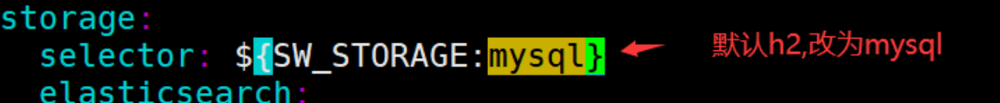

# skywalking

https://github.com/SkyAPM/document-cn-translation-of-skywalking 中文文档

https://skywalking.apache.org/zh/2020-04-19-skywalking-quick-start/ 极简入门

## **1. skywalking 是什么**

对于一个大型的几十个、几百个微服务构成的微服务架构系统，通常会遇到下面一些问题，比如：

1. 如何串联整个调用链路，快速定位问题？`定位问题`
2. 如何理清各个微服务之间的依赖关系？ `分析依赖`
3. 如何进行各个微服务接口的性能分折？ `性能分析`
4. 如何跟踪整个业务流程的调用处理顺序 ? `调用顺序`


**skywalking** 是**分布式系统的应用程序性能监视工具**，专为微服务、云原生架构和基于容器（Docker、K8s、Mesos）架构而设计

官网：http://skywalking.apache.org/

下载：http://skywalking.apache.org/downloads/

Github：https://github.com/apache/skywalking

文档： [https://skywalking.apache.org/docs/main/v8.4.0/readme/](https://skywalking.apache.org/docs/main/v8.3.0/readme/)

中文文档： https://skyapm.github.io/document-cn-translation-of-skywalking/

**调用链选型**

1. Zipkin 是 Twitter 开源的调用链分析工具，目前基于 springcloud sleuth 得到了广泛的使用，特点是轻量，使用部署简单。

2. Pinpoint 是韩国人开源的基于字节码注入的调用链分析，以及应用监控分析工具。特点是支持多种插件，UI 功能强大，接入端无代码侵入。

3. SkyWalking 是本土开源的基于字节码注入的调用链分析，以及应用监控分析工具。特点是支持多种插件，UI 功能较强，接入端无代码侵入。目前已加入 Apache 孵化器。

4. CAT 是大众点评开源的基于编码和配置的调用链分析，应用监控分析，日志采集，监控报警等一系列的监控平台工具。

   

> 调用链工具有多种，其中SkyWalking 是本土开源的基于字节码注入的调用链分析，以及应用监控分析工具。特点是支持多种插件，UI 功能较强，接入端无代码侵入。目前已加入 Apache 孵化器。
>
> 其他还有Zipkin ，Pinpoint， CAT **不过skywalking 的探针对吞吐量的影响最小**


### **1.1 Skywalking 主要功能特性**

1. **多种监控手段**，可以通过语言探针和 service mesh 获得监控的数据；
2. **支持多种语言**自动探针，包括 Java，.NET Core 和 Node.JS；
3. **轻量高效**，无需大数据平台和大量的服务器资源；
4. 模块化，UI、存储、集群管理都有多种机制可选；
5. **支持告警**； `钩子函数`
6. 优秀的**可视化**解决方案  `skywalking操作台`


### **1.2 Skywalking 整体架构**

**整个架构分成四部分：**

1、上部分 Agent ：负责从应用中，**收集链路信息，发送给 SkyWalking OAP 服务器**；

2、下部分 SkyWalking OAP ：负责**接收** Agent 发送的 Tracing 数据信息，然后进行**分析** (Analysis Core)，**存储**到外部存储器 (Storage)，最终提供查询 (Query) 功能；

3、右部分 Storage：**Tracing 数据存储**，目前支持 ES、MySQL、Sharding Sphere、TiDB、H2 多种存储器，目前采用较多的是 ES，主要考虑是 SkyWalking 开发团队自己的生产环境采用 ES 为主；

4、左部分 SkyWalking UI：负责提供控制台，查看链路等等；


**SkyWalking 支持三种探针：**

- Agent – 基于 ByteBuddy 字节码增强技术实现，通过 jvm 的 agent 参数加载，并在程序启动时拦截指定的方法来收集数据。
- SDK – 程序中显式调用 SkyWalking 提供的 SDK 来收集数据，对应用有侵入。
- Service Mesh – 通过 Service mesh 的网络代理来收集数据。

**后端（Backend）**

接受探针发送过来的数据，进行度量分析，调用链分析和存储。后端主要分为两部分：

- OAP（Observability Analysis Platform）- 进行度量分析和调用链分析的后端平台，并支持将数据存储到各种数据库中，如：ElasticSearch，MySQL，InfluxDB 等。
- OAL（Observability Analysis Language）- 用来进行度量分析的 DSL，类似于 SQL，用于查询度量分析结果和警报。

**界面 (UI)两种**

- RocketBot UI – SkyWalking 7.0.0 的默认 web UI
- CLI – 命令行界面


### **1.3 SkyWalking 环境搭建部署**


- skywalking agent **和业务系统绑定在一起，负责收集各种监控数据**

- Skywalking oapservice 是负责处理监控数据的，比如接受 skywalking agent 的监控数据，并存储在数据库中；接受 skywalking webapp 的前端请求，从数据库查询数据，并返回数据给前端。Skywalking oapservice **通常以集群的形式存在**。

- skywalking webapp，前端界面，用于展示数据。

- 用于**存储监控数据**的数据库，比如 mysql、elasticsearch 等。


### **1.4 SkyWalking 中三个概念**

**服务 (Service) ：**表示对请求提供相同行为的一系列或一组工作负载，在使用 Agent 时，可以定义服务的名字；

**服务实例 (Service Instance) ：**上述的一组工作负载中的每一个工作负载称为一个实例， 一个服务实例实际就是操作系统上的一个真实进程；

**端点 (Endpoint) ：**对于特定服务所接收的请求路径，如 HTTP 的 URI 路径和 gRPC 服务的类名 + 方法签名；


## **2.skyWalking** 下载安装

> SkyWalking 9.x 版本引入了一些重大变化，其中之一是将 Agent 从主要的分发包中移除。这是因为在 SkyWalking 9.x 中，Agent 不再作为一个单独的组件，而是作为一个可选的插件。这意味着用户可以选择是否要使用 Agent，以及在需要时进行单独的安装和配置。
>
> 因此，在 SkyWalking 9.x 及以上版本中，您不会在主要的分发包中找到 Agent。相反，您需要根据您的具体需求，单独下载并安装 Agent。通常，您可以在 SkyWalking 的官方网站或 GitHub 页面中找到适用于各种编程语言和框架的 Agent 包，并根据需要进行安装和配置

下载：http://skywalking.apache.org/downloads/

> 1. Source：源代码版本，即 SkyWalking APM 的完整源代码包。这个版本通常适用于需要对 SkyWalking 进行定制化开发或者调试的用户。通过源代码版本，用户可以查看和修改 SkyWalking 的源代码，并根据自己的需求进行编译和部署。
> 2. Distribution：发行版本，通常包含了已经编译打包好的可执行文件、配置文件和文档等，用户可以直接下载并部署在自己的环境中使用。这个版本适用于大多数用户，特别是那些只是希望快速部署和使用 SkyWalking APM，而不需要对其进行深度定制或修改的用户


目录结构


- webapp: **Ul 前端**(web 监控页面)的 jar 包和配置文件
- oap-libs:**后台应用**的 jar 包，以及它的依赖 jar 包，里边有一个 server-starter-*.jar 就是启动程序
- config: 启动后台应用程序的**配置文件**，是使用中的各种配置
- bin: 各种启动脚本，一般使用脚本 startup.* 来启动 web 页面 和对应的 后台应用
  - `oapService.*`: 默认使用的**后台程序的启动脚本** (使用的是默认模式启动，还文持其他模式，各模式区别见 启动模式
  - `oapServicelnit.*`: 使用 init 模式启动；在此模式下，**OAP服务器启动以执行初始化工作**，然后退出
  - `oapServiceNolnit.*`:使用 no init模式启动;在此模式下，**OAP服务器不进行初始化**。
  - `webappService.*`: **Ul前端的启动脚本**
  - `startup.*`: **组合脚本**，同时启动 `oapService.*`、`webappService.*`脚本;
- agent:
  - skywalking-agent.jar：**代理服务 jar 包**
  - config: 代理服务启动时使用的**配置文件**
  - plugins: 包含**多个插**件，代理服务启动时会加载改目录下的所有插件(实际是各种 jar 包)
  - optional-plugins: **可选插件**，当需要文持某种功能时，比如 SpringCloud Gateway，则需要把对应的jar 包拷贝到 plugins目录下;

### **2.1 搭建 SkyWalking OAP 服务**

先使用默认的 H2 数据库存储 

`vim config/application.yml`

先修改elasticSearch为h2n  `内存存储`


启动脚本 bin/startup.sh


启动成功后会启动两个服务，一个是 skywalking-oap-server，一个是 skywalking-web-ui

skywalking-oap-server 服务启动后会暴露 11800 和 12800 两个端口，分别为**收集监控数据的端口 11800** 和**接受前端请求的端口 12800**

**修改端口可以修改 config/applicaiton.yml**


skywalking-web-ui 服务会占用 8080 端口， 修改端口可以修改 webapp/webapp.yml


> **server.port**：SkyWalking UI 服务端口，默认是 8080；
>
> collector.ribbon.**listOfServers**：SkyWalking OAP 服务地址数组，SkyWalking UI 界面的数据是通过请求 SkyWalking OAP 服务来获得

访问：http://192.168.188.100:8080/   出现如下界面


​	**页面的右下角可以中英文切换，可以切换选择要展示的时间区间的跟踪数据。**


## 3.SkyWalking 快速开始

### **3.1 SkyWalking Agent 跟踪微服务**

- **通过 jar 包方式接入**

  准备一个 springboot 程序，打成可执行 jar 包，**写一个 shell 脚本，在启动项目的 Shell 脚本上，通过 -javaagent 参数进行配置 SkyWalking Agent 来跟踪微服务**；

  startup.sh 脚本：

  ```shell
  #!/bin/sh
  # SkyWalking Agent配置
  export SW_AGENT_NAME=springboot-skywalking-demo #Agent名字,一般使用`spring.application.name`
  export SW_AGENT_COLLECTOR_BACKEND_SERVICES=127.0.0.1:11800 #配置 Collector 地址。
  export SW_AGENT_SPAN_LIMIT=2000 #配置链路的最大Span数量，默认为 300。
  # 指定探针所在的位置
  export JAVA_AGENT=-javaagent:/opt/software/apache-skywalking-apm-bin-es7/agent/skywalking-agent.jar
  java $JAVA_AGENT -jar springboot-skywalking-demo-0.0.1-SNAPSHOT.jar #jar启动
  ```

  启动日志

  

  等同于

  ```shell
  java -javaagent:/usr/local/soft/apache-skywalking-apm-bin-es7/agent/skywalking-agent.jar 
  -DSW_AGENT_COLLECTOR_BACKEND_SERVICES=127.0.0.1:11800 
  -DSW_AGENT_NAME=springboot-skywalking-demo -jar springboot-skywalking-demo-0.0.1-SNAPSHOT.jar
  ```

  参数名对应 **agent/config/agent.config** 配置文件中的属性。

  属性对应的源码：org.apache.skywalking.apm.agent.core.conf.Config.java

  ```sh
  # The service name in UI
  agent.service_name=${SW_AGENT_NAME:Your_ApplicationName}
  # Backend service addresses.
  collector.backend_service=${SW_AGENT_COLLECTOR_BACKEND_SERVICES:127.0.0.1:11800}
  ```

  我们也可以使用 skywalking.+ 配置文件中的配置名作为系统配置项来进行覆盖。 javaagent 参数配置方式优先级更高

  ```shell
  -javaagent:D:/apache/apache-skywalking-apm-es7-8.4.0/apache-skywalking-apm-bin-es7/agent/skywalking-agent.jar
  -Dskywalking.agent.service_name=springboot-skywalking-demo
  -Dskywalking.collector.backend_service=192.168.3.100:11800
  ```

  在启动程序前加一个 - javaagent 参数即可完成对程序的跟踪

  

  

  

###  **3.2在 IDEA 中使用 Skywalking**

在运行的程序配置 jvm 参数，如下图所示


```shell
# skywalking-agent.jar的本地磁盘的路径
-javaagent:D:/apache/apache-skywalking-apm-es7-8.4.0/apache-skywalking-apm-bin-es7/agent/skywalking-agent.jar
# 在skywalking上显示的服务名
-DSW_AGENT_NAME=springboot-skywalking-demo
# skywalking的collector服务的IP及端口
-DSW_AGENT_COLLECTOR_BACKEND_SERVICES=192.168.3.100:11800 
```


### **3.3 Skywalking 跨多个微服务跟踪**

Skywalking 跨多个微服务跟踪，只需要每个微服务启动时添加 javaagent 参数即可。

测试：

启动微服务 mall-gateway，mall-order，mall-user ，配置 skywalking 的 jvm 参数

**链路追踪和时间消耗**


> **注意：此处存在 bug，跟踪链路不显示 gateway**
>
> 需要拷贝 agent/optional-plugins 目录下的 gateway 插件到 agent/plugins 目录


## **4.Skywalking 告警通知**

skywalking 告警的核心由一组规则驱动，这些规则定义在 config/alarm-settings.yml 文件中，告警规则的定义分为三部分:

1、告警规则：它们定义了应该如何触发度量警报，应该考虑什么条件

2、网络钩子 (Webhook}：当警告触发时，哪些服务终端需要被通知

3、gRPC 钩子：远程 gRPC 方法的主机和端口，告警触发后调用

为了方便，skywalking 发行版中提供了默认的 alarm-setting.yml 文件，包括一些规则，每个规则有英文注释，可以根据注释得知每个规则的作用：

- 在最近 10 分钟的 3 分钟内服务平均响应时间超过 1000ms

- 最近 10 分钟内，服务成功率在 2 分钟内低于 80%

- 服务实例的响应时间在过去 10 分钟的 2 分钟内超过 1000ms

- 数据库访问 {name} 的响应时间在过去 10 分钟的 2 分钟内超过 1000ms

只要我们的服务请求符合 alarm-setting.yml 文件中的某一条规则就会触发告警。

比如 **service_resp_time_rule** 规则：该规则表示服务 {name} 的响应时间在最近 10 分钟的 3 分钟内超过 1000ms


**测试：**

编写接口，模拟慢查询

```java
@RequestMapping("/info/{id}")
public User info(@PathVariable("id") Integer id){
 
    try {
        Thread.sleep(2000);
    } catch (InterruptedException e) {
        e.printStackTrace();
    }
 
    return userService.getById(id);
}
```

回调接口

```java
@RequestMapping("/notify")
public String notify(@RequestBody Object obj){
    //TODO 告警信息，给技术负责人发短信，钉钉消息，邮件，微信通知等
    System.err.println(obj.toString());
    return "notify successfully";
}
```

在 config/alarm-settings.yml 中配置回调接口，并重启 skywalking 服务


测试访问：http://localhost:8000/user/info/1，满足告警规则后，控制台输出告警信息


SkyWalking UI 显示告警信息


参考： https://github.com/apache/skywalking/blob/master/docs/en/setup/backend/backend-alarm.md

### **Webhook 回调通知**

SkyWalking 告警 Webhook 回调要求接收方是一个 Web 容器（比如 tomcat 服务），告警的消息会通过 HTTP 请求进行发送，请求方法为 POST, Content-Type 为 application/json, JSON 格式基于 List<org.apache.skywalking.oap.server.core.alarm.AlarmMessage> 的集合对象数据，集合中的每个 AlarmMessage 包含以下信息：

1、scopeId. 所有可用的 Scope，参考：org.apache.skywalking.oap.server.core.source.DefaultScopeDefine；

2、name. 目标 Scope 的实体名称；

3、id0. Scope 实体的 ID；

4、id1. 未使用；

5、ruleName. 在 alarm-settings.yml 中配置的规则名；

6、alarmMessage. 报警消息内容；

7、startTime. 告警时间，位于当前时间与 UTC 1970/1/1 之间；

```json
[{
	scopeId = 2,
	scope = SERVICE_INSTANCE,
	name = 98e1839 a6fdf48b0aedb0ecabb8ea5f7 @192 .168 .233 .1 of springboot - skywalking - demo,
	id0 = c3ByaW5nYm9vdC1za3l3YWxraW5nLWRlbW8 = .1 _OThlMTgzOWE2ZmRmNDhiMGFlZGIwZWNhYmI4ZWE1ZjdAMTkyLjE2OC4yMzMuMQ == ,
	id1 = ,
	ruleName = service_instance_resp_time_rule,
	alarmMessage = Response time of service instance 98e1839 a6fdf48b0aedb0ecabb8ea5f7 @192 .168 .233 .1 of springboot - skywalking - demo is more than 1000 ms in 2 minutes of last 10 minutes,
	startTime = 1613913565462
}, {
	scopeId = 6,
	scope = ENDPOINT_RELATION,
	name = User in User to / user / info / {
		id
	} in springboot - skywalking - demo,
	id0 = VXNlcg == .0 _VXNlcg == ,
	id1 = c3ByaW5nYm9vdC1za3l3YWxraW5nLWRlbW8 = .1 _L3VzZXIvaW5mby97aWR9,
	ruleName = endpoint_relation_resp_time_rule,
	alarmMessage = Response time of endpoint relation User in User to / user / info / {
		id
	} in springboot - skywalking - demo is more than 1000 ms in 2 minutes of last 10 minutes,
	startTime = 1613913565462
}]
```


## 5 Skywalking 持久化跟踪数据

### 5.1**基于 mysql 持久化:**

1. 修改 config 目录下的 application.yml，使用 mysql 作为持久化存储的仓库

   

2. 修改 mysql 连接配置

   

   ```yaml
   storage:
     #选择使用mysql   默认使用h2，不会持久化，重启skyWalking之前的数据会丢失
     selector: ${SW_STORAGE:mysql}
     #使用mysql作为持久化存储的仓库
     mysql:
       properties:
         #数据库连接地址
         jdbcUrl: ${SW_JDBC_URL:"jdbc:mysql://1ocalhost:3306/swtest"}
         #用户名
         dataSource.user: ${SW_DATA_SOURCE_USER:root}
         #密码
         dataSource.password: ${SW_DATA_SOURCE_PASSWORD:root}
   ```

   > 注意：需要添加 mysql 数据驱动包，因为在 lib 目录下是没有 mysql 数据驱动包的，所以修改完配置启动是会报错，启动失败的。

3. 添加 mysql 数据驱动包到 oap-libs 目录下

   

4. 启动 Skywalking

   

5. 查看 swtest 数据库，可以看到生成了很多表。

   说明启动成功了，打开配置对应的地址 [http://192.168.3.100:8080/](http://192.168.3.14:8080/)，可以看到 skywalking 的 web 界面。

6. 测试：重启 skywalking，验证跟踪数据会不会丢失

### 5.2 **基于 elasticsearch 持久化**

​	省略

## 6.自定义 SkyWalking 链路追踪

如果我们希望对项目中的业务方法，实现链路追踪，方便我们排查问题，可以使用如下的代码

引入依赖

```xml
<!-- SkyWalking 工具类 -->
<dependency>
    <groupId>org.apache.skywalking</groupId>
    <artifactId>apm-toolkit-trace</artifactId>
    <version>8.4.0</version>
</dependency>
```

在业务方法中可以 TraceContext 获取到 traceId

```java
@RequestMapping("/list")
public List<User> list(){
    //TraceContext可以绑定key-value
    TraceContext.putCorrelation("name", "fox");
    Optional<String> op = TraceContext.getCorrelation("name");
    log.info("name = {} ", op.get());
    //获取跟踪的traceId
    String traceId = TraceContext.traceId();
    log.info("traceId = {} ", traceId);
    return userService.list();
}
```


### **6.1 @Trace 将方法加入追踪链路**

如果一个业务方法想在 ui 界面的跟踪链路上显示出来，只需要在业务方法上加上 @Trace 注解即可


### **6.2 加入 @Tags 或 @Tag**

我们还可以为追踪链路增加其他额外的信息，比如记录参数和返回信息。实现方式：在方法上增加 @Tag 或者 @Tags。

```java
@Trace
@Tag(key = "list", value = "returnedObj")
public List<User> list(){
    return userMapper.list();
}
 
@Trace
@Tags({@Tag(key = "param", value = "arg[0]"),@Tag(key = "user", value = "returnedObj")})
public User getById(Integer id){
    return userMapper.getById(id);
}
```


## **7 Skywalking 集成日志框架**

[logback 官方配置](https://github.com/apache/skywalking/blob/master/docs/en/setup/service-agent/java-agent/Application-toolkit-logback-1.x.md)

[log4j 官方配置](https://skywalking.apache.org/docs/main/v8.4.0/en/setup/service-agent/java-agent/application-toolkit-log4j-1.x/)

[log4j2j 官方配置](https://skywalking.apache.org/docs/main/v8.4.0/en/setup/service-agent/java-agent/application-toolkit-log4j-2.x)

引入依赖

```xml
<!-- apm-toolkit-logback-1.x -->
<dependency>
    <groupId>org.apache.skywalking</groupId>
    <artifactId>apm-toolkit-logback-1.x</artifactId>
    <version>8.4.0</version>
</dependency>
```

添加 logback-spring.xml 文件，并配置 % tid 占位符


http://note.youdao.com/noteshare?id=07ea8709108735fd281b4ab34e7710ef&sub=D8EC0D1300F54FDE903D012BBC7F9A74