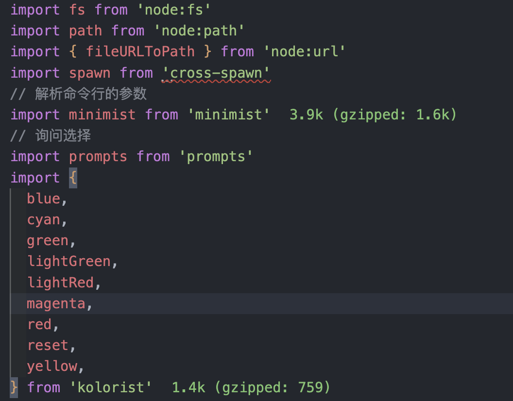
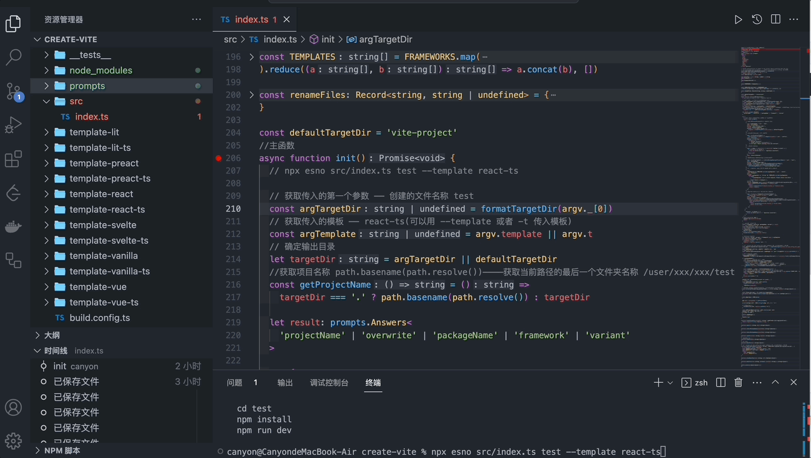
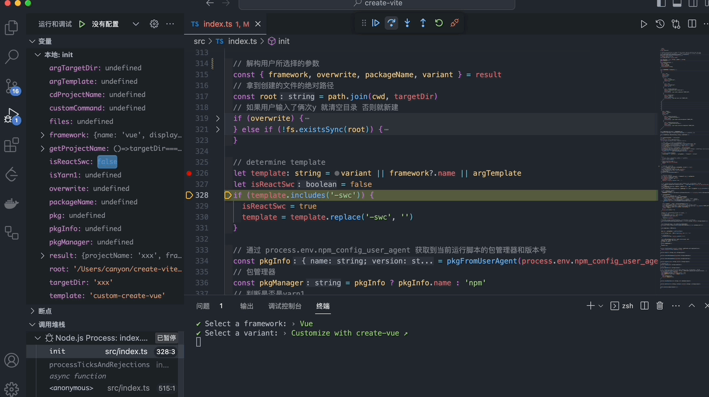

# Create-vite

前段时间一直在学习 webpack，发现需要了解的配置项极其多，平时公司里的项目其实并不需要这样高自由度的配置工具。且苦于 react 基于 webpack 并没有一个比较好的脚手架，唯一比较常用的 create-react-app 已经好几个月没有更新了，issues 的累积量也来到了 1.6k。所以打算使用一下 vite。

`create-vite`能快速搭建 react+ts+vite 的项目，但是其实还不够。在基于`create-vite`上，还需要添加 eslint+prettier+husky 来规范代码格式，以及 react-router、redux-toodlist/zustand、react-query、antd 等可选工具链。

## Create-vite 源码分析

[源码地址](https://github.com/vitejs/vite/blob/HEAD/packages/create-vite/index.js)

我们需要对其删减一下。

[调整后的代码](https://github.com/Canyonmnmn/create-vite)

### npm init

如何利用`create-vite`创建项目

这里以 pnpm 为例子

```bash
# init = create
pnpm create vite
pnpm init vite
```

init 又会转换成 npm exec

安装好 create-vite 包，接着会执行 package.json 中的 bin 里的命令：

> 在 `package.json` 文件中的 `bin` 字段用于定义项目的可执行命令。

通过 create-vite 的 package.json 文件，得知执行的文件是`./src/index.ts`

转头来看下这个文件

## 执行文件



先看执行文件的引用，fs、path 以及 url 都是 nodejs 的模块。

其他的都是对于包的引入：cross-spawn、minimist、prompts、kolorist

- cross-spawn

> 自动根据运行平台生成 shell 命令，并执行。

- minimist

> 解析命令行带入的参数

- [prompts](https://github.com/terkelg/prompts)

> 命令行交互提示

create-vite 中用到的类型有 text、select、confrim

    - message：提示的文本信息

    - type：提示的类型

    - name：变量的名字

    - validate：判断是否有效，无效返回无效提示信息

    - initial：默认值

    - onState：回调函数

    - choices(type 为 select 可选)：选项数组

- kolorist

> 给输入输出上颜色

## 主函数 init( )

在 init 处打上断点，进行调试，能看到这段代码执行了什么。

### 获取命令行参数

执行命令

```bash
npx esno src/index.ts test --template react-ts
```



可以看到左侧变量的变化：

- argTargetDir：test
- argTemplate：react-ts
- targetDir：test

根据我们输入的执行命令，也可以分析出这几行代码的作用。

```js
const defaultTargetDir = 'vite-project';
async function init() {
  // 获取传入的第一个参数 —— 创建的文件名称 test
  const argTargetDir = formatTargetDir(argv._[0]);
  // 获取传入的模板 —— react-ts(可以用 --template 或者 -t 传入模板)
  const argTemplate = argv.template || argv.t;
  // 确定输出目录
  let targetDir = argTargetDir || defaultTargetDir;
  //获取项目名称
  const getProjectName = () =>
    targetDir === '.' ? path.basename(path.resolve()) : targetDir;
}
```

> path.basename(path.resolve())：获取当前路径的最后一个文件夹名称 例如：/user/xxx/xxx/test => tes

可以从执行动图看出这里并没有进入问询，是因为命令行输入的命令已经选择了要输出的文件夹(test)，要选择的模板(react-ts)，所以每个问询条件里的 type 都判断为 null。

```js
try {
    result = await prompts(
      [
        // 获取用户输入的项目名称并且作为最终输出目录
        {
          type: argTargetDir ? null : 'text',
          name: 'projectName',
          message: reset('Project name:'),
          initial: defaultTargetDir,
          onState: (state) => {
            targetDir = formatTargetDir(state.value) || defaultTargetDir
          },
        },
      ],
   		.......
    )
  } catch (cancelled: any) {
    console.log(cancelled.message)
    return
  }
```

当我们输入未指定文件夹和模板指令时，进入问询步骤：

- 输入项目名称
- 判断项目名称是不是有了，有了的话是否覆盖/清空
- 判断项目名称是不是符合 package.json 的命名规则，不符合的话重新输入

自此，我们将用户所选择/输入的参数都存到了 result 中。

### 覆盖/新建文件夹

解构出来分别是：framework( 模板名称 ), overwrite( 是否覆盖/清空原有项目 ), packageName( 项目名称 ), variant( 模板的子类型 )

```js
  // 解构用户所选择的参数
  const { framework, overwrite, packageName, variant } = result
  // 拿到创建的文件的绝对路径
  const root = path.join(cwd, targetDir)
  // 清空目录/新建目录
  if (overwrite) {
    emptyDir(root)
  } else if (!fs.existsSync(root)) {
    fs.mkdirSync(root, { recursive: true })
  }
 	......
  // 判断文件是否为空
function isEmpty(path: string) {
  const files = fs.readdirSync(path)
  return files.length === 0 || (files.length === 1 && files[0] === '.git')
}
// 清空目录
function emptyDir(dir: string) {
  // 如果不存在这个目录就直接返回
  if (!fs.existsSync(dir)) {
    return
  }
  // 删除除了.git的所有文件
  for (const file of fs.readdirSync(dir)) {
    if (file === '.git') {
      continue
    }
    fs.rmSync(path.resolve(dir, file), { recursive: true, force: true })
  }
}
```

> path.resolve(dir, file)：绝对路径
>
> recursive：递归删除子目录下的文件
>
> force：强制删除

脚本进行到这，可以在目录下看到你生成的项目空文件夹了。

### 确认模板

```js
let template: string = variant || framework?.name || argTemplate;
let isReactSwc = false;
if (template.includes('-swc')) {
  isReactSwc = true;
  template = template.replace('-swc', '');
}
```

这一段代码确定了我们最终选择模板。

### 确认包管理器( pnpm/yarn/npm )

```js
 // 通过 process.env.npm_config_user_agent 获取到当前运行脚本的包管理器和版本号
  const pkgInfo = pkgFromUserAgent(process.env.npm_config_user_agent)
  // 包管理器
  const pkgManager = pkgInfo ? pkgInfo.name : 'npm'
  // 判断是否是yarn1
  const isYarn1 = pkgManager === 'yarn' &&   	pkgInfo?.version.startsWith('1.')
  ......
function pkgFromUserAgent(userAgent: string | undefined) {
  if (!userAgent) return undefined
  const pkgSpec = userAgent.split(' ')[0]
  const pkgSpecArr = pkgSpec.split('/')
  return {
    name: pkgSpecArr[0],
    version: pkgSpecArr[1],
  }
}
```

### 执行创建命令

```
npx esno src/index.ts
```



选择 custom vue 后，可以看到，此时拿到对应的 customCommand 自定义命令`npm create vue@latest TARGET_DIR`，然后通过`spawn.sync`启动一个子进程来执行这个命令，完成后退出进程。

代码分析如下：

```js
const FRAMEWORKS = [
....
{
    name: 'vue',
    display: 'Vue',
    color: green,
    variants: [
				....
      {
        name: 'custom-create-vue',
        display: 'Customize with create-vue ↗',
        color: green,
        customCommand: 'npm create vue@latest TARGET_DIR',
      },
			....
    ],
  },
]
const { customCommand } =
    FRAMEWORKS.flatMap((f) => f.variants).find((v) => v.name === template) ?? {}
// 拿到自定义命令 如：create-vue npm create vue@latest TARGET_DIR
if (customCommand) {
  const fullCustomCommand = customCommand
  ..........

  const [command, ...args] = fullCustomCommand.split(' ')
  // 替换TARGET_DIR为真实路径
  const replacedArgs = args.map((arg) => arg.replace('TARGET_DIR', targetDir))
  // 通过spawn.sync执行此命令
  const { status } = spawn.sync(command, replacedArgs, {
    // stdio: 'inherit'意思是继承：子进程继承当前进程的输入输出 并将输出信息同步输出在当前进程上
    stdio: 'inherit',
  })
  // 退出
  process.exit(status ?? 0)
}
```

### 复制模板到项目

```js
// 确认模版文件的路径
const templateDir = path.resolve(
  fileURLToPath(import.meta.url),
  '../..',
  `template-${template}`,
);
// 写入文件 package.json要修改name字段使用writeFileSync 其他直接copy
const write = (file: string, content?: string) => {
  const targetPath = path.join(root, renameFiles[file] ?? file);
  if (content) {
    fs.writeFileSync(targetPath, content);
  } else {
    copy(path.join(templateDir, file), targetPath);
  }
};

const files = fs.readdirSync(templateDir);
// 将除了package.json之外的文件全部复制
for (const file of files.filter((f) => f !== 'package.json')) {
  write(file);
}
//获取到package.json的内容
const pkg = JSON.parse(
  fs.readFileSync(path.join(templateDir, `package.json`), 'utf-8'),
);
//修改package.json的名字
pkg.name = packageName || getProjectName();
//写入package.json
write('package.json', JSON.stringify(pkg, null, 2) + '\n');

if (isReactSwc) {
  setupReactSwc(root, template.endsWith('-ts'));
}
```

分析一下步骤：

- 获取模板文件路径

  fileURLToPath(import.meta.url)：这里获取到的路径是指 index.ts 的地址。它完整的路径为*....///create-vite/src/index.ts*。`../..`的意思是将返回俩级路径。

- 根据路径找到模板文件，将除了 package.json 外的文件夹复制到项目文件中

- 将 package.json 文件的`name`字段替换为项目名`packageName || getProjectName()`，并写入输出目录中；

- 此外判断是不是为 react swc 模板
