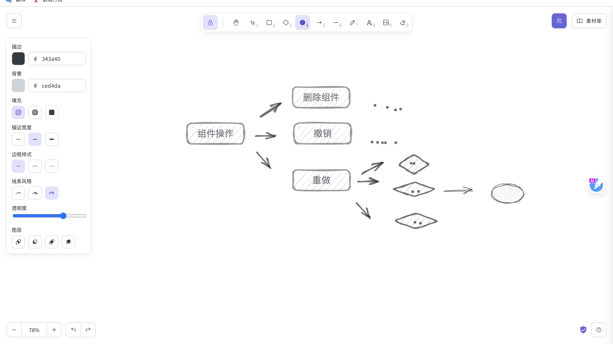

# 虚拟白板

## [excalidraw](https://github.com/excalidraw/excalidraw)

> 虚拟白板，用于绘制手绘图表等草图

作为一个程序猿，你肯定需要一款**绘制流程图**,**思维导图**的工具。这类工具很多:

- 谷歌的画布
- 语雀画板
- ...

如果我们要在项目中实现白板，可以试试**excalidraw**！

**支持**：

- 💯 免费和开源
- 🎨 无限的，基于画布的白板
- ✍️ 手绘风格。
- 🌓 黑暗模式
- 🏗️ 可定制
- 📷 图像支持
- 😀 形状库支持
- 👅 本地化（i18n）支持
- 🖼️ 导出到 PNG、SVG 和剪贴板
- 💾 开放格式-将图纸导出为.excalidraw json 文件
- ⚒️ 各种工具-矩形、圆形、钻石、箭头、线条、自由绘制、橡皮擦...
- ➡️ 箭头绑定和标记箭头。
- 🔙 撤销/重做
- 🔍 缩放和平移支持

不过目前只有**react**版本，使用 vue 的小伙伴暂时只能观望了
